# 附加动画
- 概念：将一个附加动画附加到基础动画上
- 举例：
[附加动画](attachments/3be39fdffc4c3b77c5018dfe4ba1fef6_MD5.jpeg)
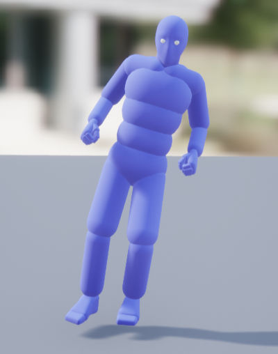
[基础动画](attachments/3fbeaa46fa3b5b581100f2cd41f56776_MD5.jpeg)
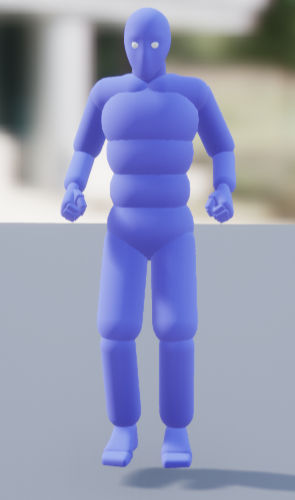
将图1动画附加到图2动画
[附加设置](attachments/e6fd24fa00766338ac1f26e0bdb55a1d_MD5.jpeg)
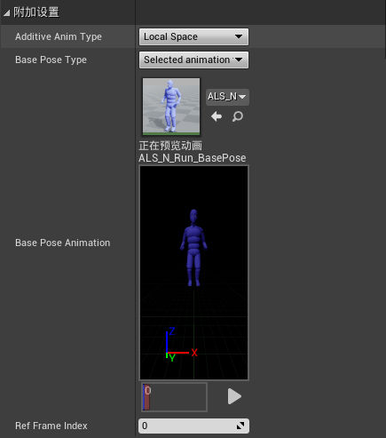
- 原理：附加动画的骨骼变换减去基础动画的骨骼变换得到两者之间的增值，用于附加。
# 混合空间
- 概念： 混合空间是一种动画资产，绘制到一维或二维图表中，允许混合多个动画或姿势，通过Gameplay输入或其他变量进行控制。
- 范例：

- 原理：通过插值计算来播放混合动画
### 资产细节

"资产细节（Asset Details）"面板包含此混合空间资产的属性和其他设置。

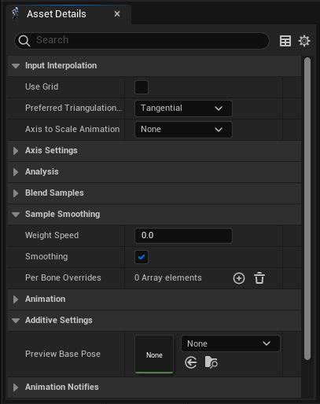

| 名称                                              | 说明                                                                                                                                                                                                                                                                                                                                                                                                                                                                                                                                                                                                                                                                                                                                                            |
| ----------------------------------------------- | ------------------------------------------------------------------------------------------------------------------------------------------------------------------------------------------------------------------------------------------------------------------------------------------------------------------------------------------------------------------------------------------------------------------------------------------------------------------------------------------------------------------------------------------------------------------------------------------------------------------------------------------------------------------------------------------------------------------------------------------------------------- |
| **使用网格（Use Grid）**                              | 启用此项将使用旧版网格模式进行混合，而不是默认三角剖分方法。通常，你只会在执行特定混合布局（例如，使用封装输入）时才会使用网格。否则，在大部分情况下，你应该将此项保持禁用状态，而改为使用三角剖分，以获得更准确的混合结果。                                                                                                                                                                                                                                                                                                                                                                                                                                                                                                                                                                                                                                                |
| **首选三角剖分方向（Preferred Triangulation Direction）** | 控制示例之间的三角剖分混合角度。这仅会影响以均匀方式放置的示例，并且仅在禁用 **使用网格（Use Grid）** 时才会影响。  - **无（None）** 将使三角形在整个图表中都有相同的角度。通常，如果你要创建对称混合空间，则不应该选择此选项，因为混合结果在每一边都不同。          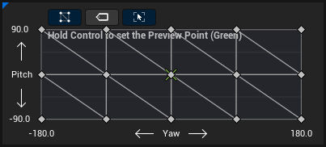      - **切线（Tangential）** 将使三角形从图表原点朝外。          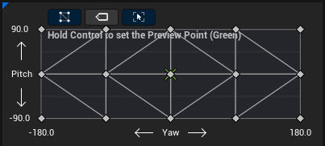      - **径向（Radial）** 将使三角形朝内指向图表原点。          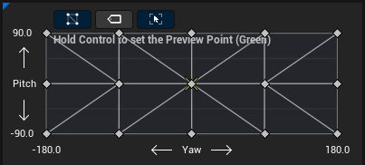                                                                                                                                                                                                                                                                  |
| **要缩放动画的轴（Axis to Scale Animation）**            | 如果使用了 **平滑时间（Smoothing Time）**，则此项指定要在其上缩放动画播放速度的轴。在大部分情况下，这将用于你会在其中指定速度的轴的移动动画。                                                                                                                                                                                                                                                                                                                                                                                                                                                                                                                                                                                                                                                                              |
| **名称（Name）**                                    | 要在混合图表中以及混合空间动画蓝图节点上显示的轴的名称。                                                                                                                                                                                                                                                                                                                                                                                                                                                                                                                                                                                                                                                                                                                                  |
| **最小轴值（Minimum Axis Value）**                    | 此轴的最小显示值。                                                                                                                                                                                                                                                                                                                                                                                                                                                                                                                                                                                                                                                                                                                                                     |
| **最大轴值（Maximum Axis Value）**                    | 此轴的最大显示值。                                                                                                                                                                                                                                                                                                                                                                                                                                                                                                                                                                                                                                                                                                                                                     |
| **网格划分（Grid Divisions）**                        | 此轴上的划分数。此处的值越高，生成的混合结果就越精确。奇数带来的混合结果也会不同于偶数的结果。如果禁用 **使用网格（Use Grid）**，则此项将仅导致网格的外观更改。                                                                                                                                                                                                                                                                                                                                                                                                                                                                                                                                                                                                                                                                        |
| **对齐到网格（Snap to Grid）**                         | 在沿此轴移动动画点时启用到 **网格划分（Grid Divisions）** 的对齐。按住 **Shift** 键还会临时启用所有轴的对齐。                                                                                                                                                                                                                                                                                                                                                                                                                                                                                                                                                                                                                                                                                        |
| **封装输入（Wrap Input）**                            | 启用此项时，此轴的输入值可以超出 **最小（Minimum）** 和 **最大轴值（Maximum Axis Values）** 。发生此情况时，混合空间会将该轴视为循环，并将输入转换为另一端的逆值。如果启用此属性，请确保该轴任一端的动画都类似，以防止停顿。                                                                                                                                                                                                                                                                                                                                                                                                                                                                                                                                                                                                                             |
| **平滑时间（Smoothing Time）**                        | 此轴在不同输入之间混合的时间，以秒为单位。值为 **0** 将导致发生无时间混合。你可以观察辅助十字准星独立于预览点的移动过程来预览图表中的混合。  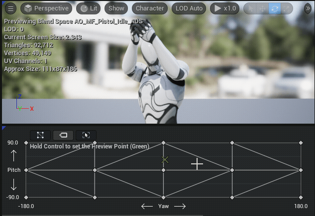                                                                                                                                                                                                                                                                                                                                                                                                                                                                                                                                                                                                                |
| **平滑类型（Smoothing Type）**                        | 确定在使用平滑时间时会使用哪个缓动函数。你可以从以下选项中进行选择：  - 平均（Averaged） - 线性（Linear） - 立方体（Cubic） - 慢入/慢出（Ease In/Out） - 指数波 - 弹簧阻尼系统（Spring Damper）                                                                                                                                                                                                                                                                                                                                                                                                                                                                                                                                                                                                          |
| **阻尼比（Damping Ratio）**                          | 使用 **弹簧阻尼系统（Spring Damper）** 作为 **平滑类型（Smoothing Type）** 时，这将确定有多少阻尼。值小于 **1** 会导致过冲，这可能会使一些动作看起来更自然。  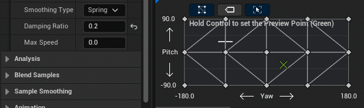                                                                                                                                                                                                                                                                                                                                                                                                                                                                                                                                                                                 |
| **最大速度（Max Speed）**                             | 平滑时此轴值的最大变化速度。仅在 **平滑类型（Smoothing Type）** 设置为 **弹簧阻尼系统（Spring Damper）** 或 **指数波（Exponential）** 时使用。如果设置为 **0** ，则混合速度可以是无限的。                                                                                                                                                                                                                                                                                                                                                                                                                                                                                                                                                                                                                                  |
| **分析（Analysis）**                                | 你可以指定要针对每个轴用于分析示例并自动将其放置在混合空间中的函数。请参阅[混合空间分析](https://dev.epicgames.com/documentation/zh-cn/unreal-engine/automatic-blend-space-creation-in-unreal-engine)页面，了解更多信息。      [混合空间分析](https://dev.epicgames.com/documentation/zh-cn/unreal-engine/automatic-blend-space-creation-in-unreal-engine)  [使用混合空间分析准确计算并放置你的混合空间示例。](https://dev.epicgames.com/documentation/zh-cn/unreal-engine/automatic-blend-space-creation-in-unreal-engine) |
| **混合示例（Blend Samples）**                         | 此分段列示混合空间中涉及的所有示例，允许修改或删除其细节。你还可以右键点击混合图表中的示例来预览这些相同属性。                                                                                                                                                                                                                                                                                                                                                                                                                                                                                                                                                                                                                                                                                                       |
| **权重速度（Weight Speed）**                          | 这将控制单独的示例权重可以变化的速度。值为 **2.0** 表示示例的权重可以在半秒内从0变化到1。值为 **0.0** 会禁用该功能，除非你使用 **每个骨骼覆盖（Per Bone Overrides）** 。一般来说，不要将此项与 **平滑时间（Smoothing Time）** 或 **平滑类型（Smoothing Type）** 一起使用。                                                                                                                                                                                                                                                                                                                                                                                                                                                                                                                                                                               |
| **平滑（Smoothing）**                               | 启用权重速度的慢入和慢出。一般来说，不要将此项与 **平滑时间（Smoothing Time）** 或 **平滑类型（Smoothing Type）** 一起使用。                                                                                                                                                                                                                                                                                                                                                                                                                                                                                                                                                                                                                                                                            |
| **每个骨骼覆盖（Per Bone Overrides）**                  | 这是一个数组，你可以在其中指定骨骼按不同速度混合的不同权重速度。此处指定的骨骼还将包括所有后代。                                                                                                                                                                                                                                                                                                                                                                                                                                                                                                                                                                                                                                                                                                              |
| **预览基本姿势（Preview Base Pose）**                   | 如果你要在混合空间或瞄准偏移中使用叠加动画，则可以在此处指定基本动画以从中预览叠加动画。                                                                                                                                                                                                                                                                                                                                                                                                                                                                                                                                                                                                                                                                                                                  |
| **通知触发器模式（Notify Trigger Mode）**                | 此混合空间用于控制[动画通知](https://dev.epicgames.com/documentation/zh-cn/unreal-engine/animation-notifies-in-unreal-engine)如何在多个示例之间混合时触发的当前模式。你可以从以下选项中进行选择：  - **所有动画（All Animations）** ，这将触发所有通知。 - **最高权重动画（Highest Weighted Animation）** ，这将仅触发来自权重最高的示例的通知。 - **无（None）** ，这将导致不触发通知。                                                                                                                                                                                                                                                                                                                                                                                                                                                                  |
# 瞄准偏移
- 概念：瞄准偏移是一种使用叠加姿势的混合空间，通常用于创建瞄准空间。
- 范例：
	- 使用叠加姿势
		-  **叠加瞄准类型（Additive Anim Type）** 设置为 **网格体空间（Mesh Space）** 。
		- 将 **基础姿势类型（Base Pose Type）** 设置为 **选定动画帧（Selected animation frame）** 。
		- 将 **基础姿势动画（Base Pose Animation）** 设为使用与[基础姿势设置](https://docs.unrealengine.com/5.3/zh-CN/aim-offset-in-unreal-engine#%E5%9F%BA%E7%A1%80%E5%A7%BF%E5%8A%BF%E8%AE%BE%E7%BD%AE)相同的基础动画。
		- 将 **参考帧索引（Ref Frame Index）** 设置为 **0** 。
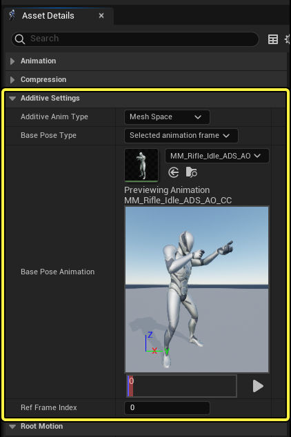
> [!NOTE] NOTE
> 选择 **网格体空间（Mesh Space）** ，而非 **局部空间（Local Space）** 的原因在于，选择网格体空间后，可以在 **骨骼网格体组件（Skeletal Mesh Component）** 的空间中应用其叠加效果。这能确保无论骨骼网格体中前一个骨骼的朝向如何，旋转都朝同一方向移动。这对于瞄准偏移很重要，因为在某些情况下，无论角色的当前基础姿势如何，你可能希望来自混合空间的旋转得到一致的应用。

例如，如果你的角色能够在瞄准时侧身倾斜，这可能导致骨骼的整体局部空间向倾斜方向移动。如果叠加类型设置为 **局部空间（Local Space）** ，则可能导致向上瞄准姿势倾斜，并且不能正确朝上。将 **网格体空间（Mesh Space）** 作为你的叠加类型可纠正此问题，因为你可以按照自己的预期应用来自混合空间的旋转偏移。
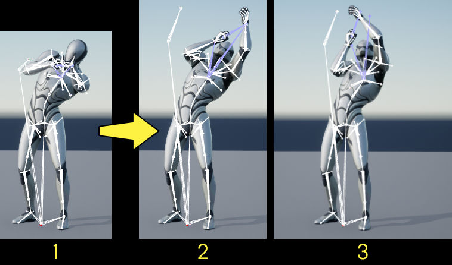
[基础姿势设置](attachments/5491a7597f0967a9bdee8d3fa51aef1b_MD5.jpeg)
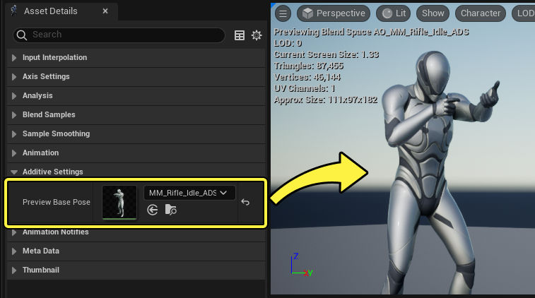
[引用瞄准姿势](attachments/49fe72601eeffc8eabd456e7cda887d8_MD5.jpeg)
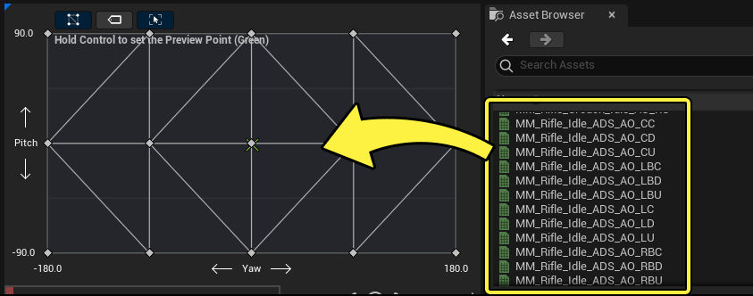
- 原理：
	- 瞄准偏移是混合空间的子类，也就是说瞄准偏移是一种混合空间，它是一种使用叠加姿势的混合空间。
	- 在应用中一个瞄准偏移节点相当于一个混合空间节点加一个apply Mesh Space Additive节点
	- [Open: 1709520162194.png](attachments/e35755a6e9a3a499d8e60b5cc255bed0_MD5.jpeg)
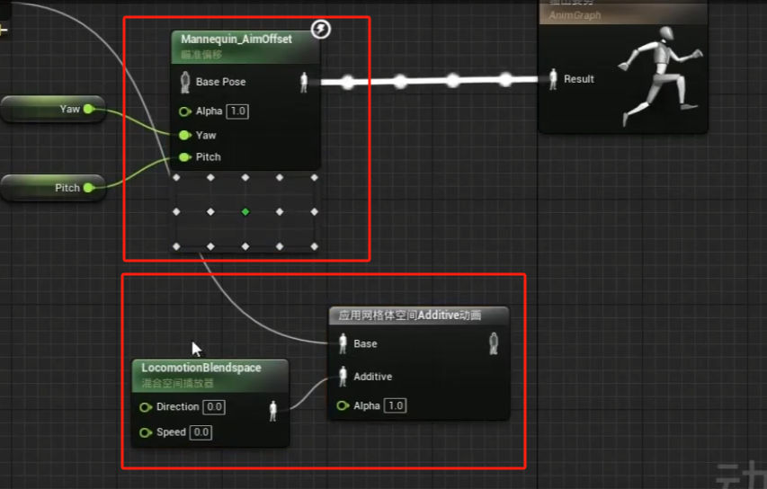## 概述
## 制作
瞄准偏移的主要设计理念是，让动画叠加在现有的某个"基础动画"上。以瞄准武器为例，这种"基础动画"通常就是"向前瞄准"动画。

然后在此基础上，你可以在瞄准偏移（Aim Offset）图表中实现各种叠加姿势。所需姿势的数量取决于角色需要的动作。通常，瞄准空间示例系统如下所示：

||||||
|---|---|---|---|---|
|上右后|上右|上|上左|上左后|

|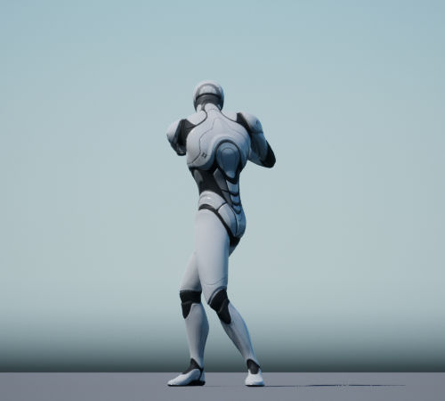|||||
|---|---|---|---|---|
|右后|右|基础|左|左后|

||||||
|---|---|---|---|---|
|下右后|下右|下|下左|下左后|

