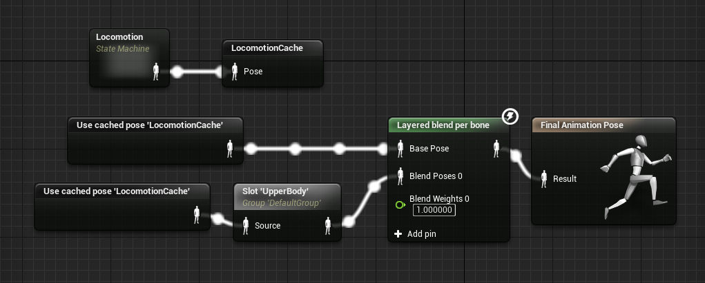
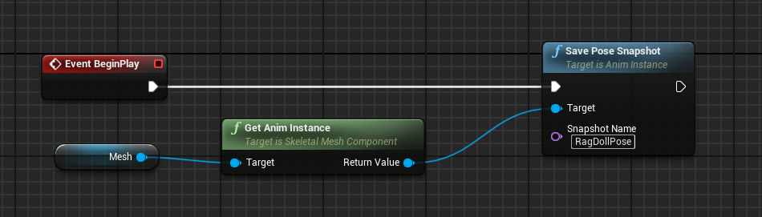
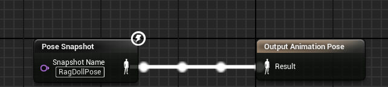
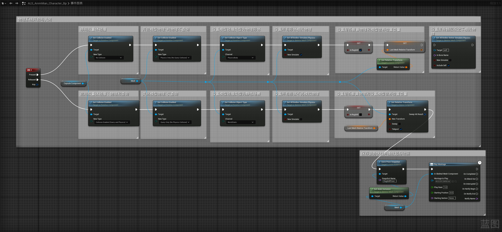
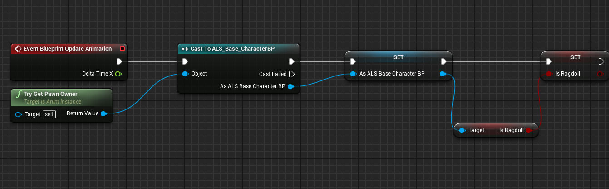
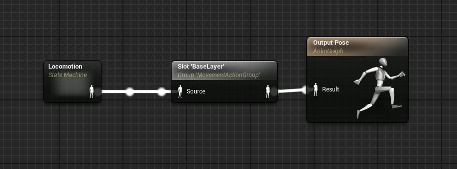
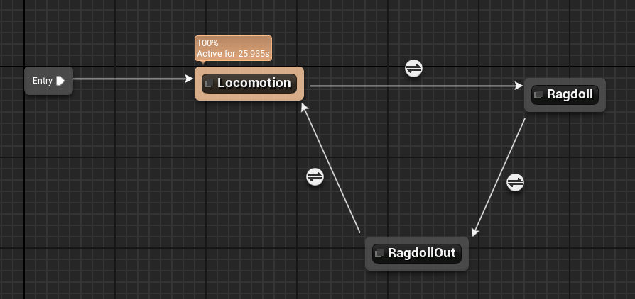

# 缓存姿势
- Save Cache Pose， Use Cache Pose
- 示例：

# 姿势快照
## 概念：
- 动画姿势快照可以在角色蓝图中捕获运行时骨架网格体姿势，还可以在动画蓝图中混入或混出其他姿势。
## 原理
- 在角色蓝图中通过mesh获取AnimInstance然后Save Pose Snapshop
- 在动画蓝图中Pose Snapshot应用姿势快照
- 一般用于布娃娃结算死亡动画时，保存死亡姿势快照。当角色起身时使用姿势快照过渡到起身动画。
## 示例
- 角色蓝图获取姿势快照

- 动画蓝图应用姿势快照

# 布娃娃结算技术
- 角色蓝图事件图表
- 
- 动画蓝图事件图表
- 
- 动画蓝图动画图表
	- AnimGraph
	- 
	- StateMacine:Locomotion
	- 
		- 其中Locomotion状态为待机动画，Ragdoll状态为空，RagdollOut状态为动画快照RagDollPose。
		- 其中条件分别是L2R = "IsRagdoll为真"，R2RO="IsRagdoll为假",R2L="勾选Can Enter Transition"。