# 动画层与动画层接口
## 动画层
- 就是一个动画函数，接收动画作为参数，进行处理，输出处理后的动画。
### 创建动画层
- 创建一个名为AimingLayer的动画层
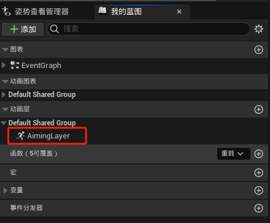
- 在动画层中添加一个输入姿势参数
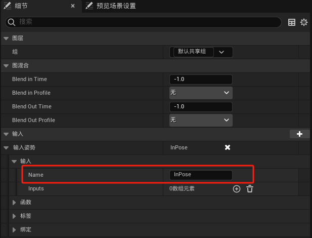
- 动画层中写入动画逻辑：给输入姿势叠加混合空间
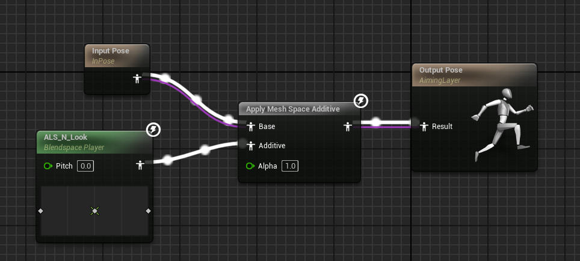
### 应用动画层
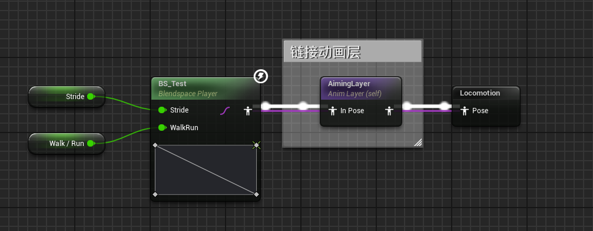
## 动画层接口
### 初步使用
- 要创建链接的动画层系统，必须创建动画层接口资产，你将在其中定义要在动画蓝图中使用的动画层。
- 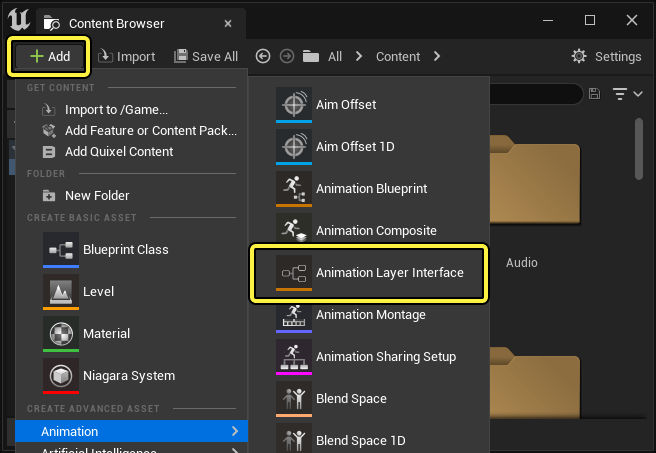
- 打开资产以查看动画层接口编辑器。你与此资产交互的主要方式是添加 **动画层（Animation Layers）**和输入pose参数
- 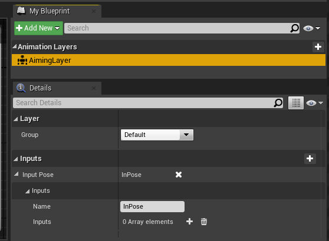
- 在主动画蓝图的类设置中添加继承动画层接口，并编辑动画层
- 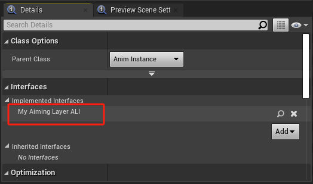
- 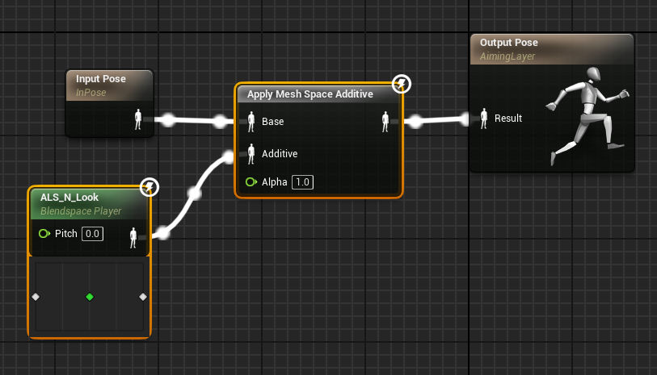
- 应用动画层
- 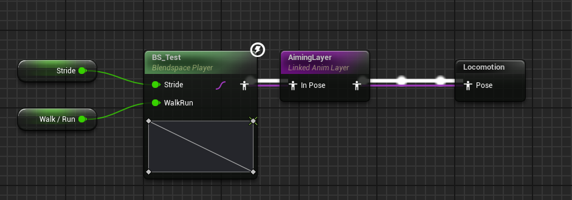
### 进阶使用
多创建几个动画蓝图，共同继承同一个动画接口，动画层里写不同的动画逻辑，使用关联节点改变主角的动画层逻辑，从而改变动画。
- 创建一个新动画蓝图My_AimingLayer_ABP，同样继承动画层接口，但是该动画蓝图不实现动画逻辑，只重写动画层AimingLayer的逻辑。将混合空间的Pitch值改为90.
- 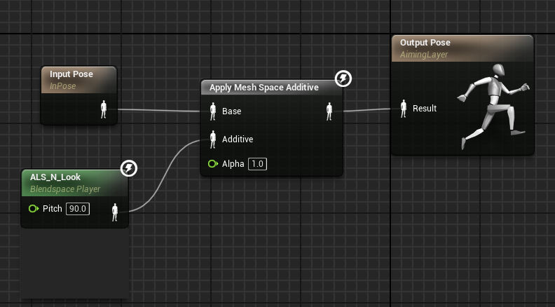
- 在角色蓝图中，主动画蓝图ALS_Test_ABP被Mesh调用
- 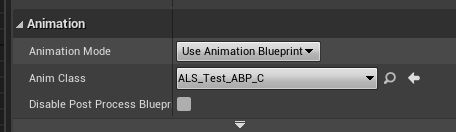
- 次动画蓝图My_AimingLayer_ABP在角色蓝图事件图表中调用。
- 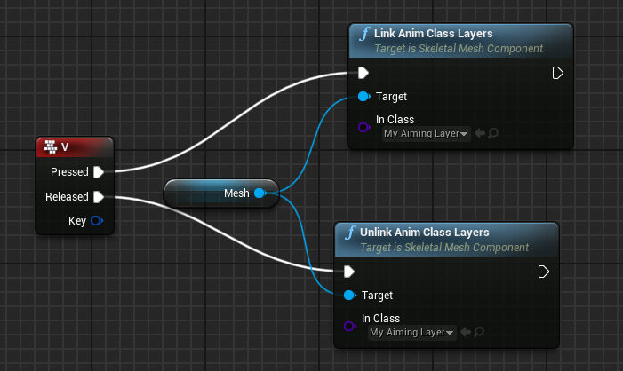
- 这样，按下V键时调用次动画蓝图My_AimingLayer_ABP的动画层修饰效果，松开V键时调用主动画蓝图ALS_Test_ABP的动画层修饰效果。