动画修改器可以让用户为特定动画序列或骨架定义一个动作序列。

**动画修改器（Anim Modifier）** 是一种原生或[蓝图类](https://dev.epicgames.com/documentation/zh-cn/unreal-engine/blueprint-class-assets-in-unreal-engine)，让用户可以对[动画序列](https://dev.epicgames.com/documentation/zh-cn/unreal-engine/animation-sequences-in-unreal-engine)或[骨架](https://dev.epicgames.com/documentation/zh-cn/unreal-engine/skeletons-in-unreal-engine)资源应用一系列动作。 例如，精确定位左脚或右脚踩到地面时的帧来创建自动脚部同步标记（等诸如此类的各种应用）。通过使用该信息，可以将 **动画同步标记** 添加到脚部骨骼处于最低点（或接触地面）时的帧。

在以上视频中，使用动画修改器生成自动脚部同步标记。

要访问和应用动画修改器，可以前往 **动画编辑器** 或 **骨架编辑器** 下的 **动画数据** 选项卡。 将动画修改器应用于骨架时，它会应用于基于该骨架的所有动画序列。 将修改器应用于动画序列时，它仅应用于序列本身，而不会应用于其他序列。

## 创建动画修改器

首先，您需要创建动画修改器蓝图类：

1. 在项目的 **内容浏览器** 中，单击 **新增（Add New）** 按钮并选择 **蓝图类（Blueprint Class）**。
    
    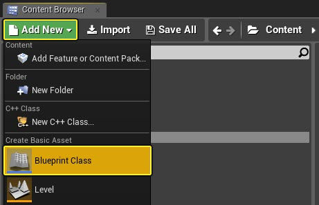
2. 在 **选择父类（Pick Parent Class）** 窗口中，展开 **所有类（All Classes）**，搜索并选择 **动画修改器（Animation Modifier）**，然后单击 **选择（Select）**，为其指定名称。
    
    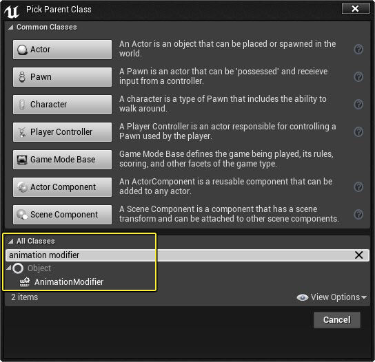
3. 双击这个新的动画修改器蓝图，以在蓝图编辑器中将其打开。
    
    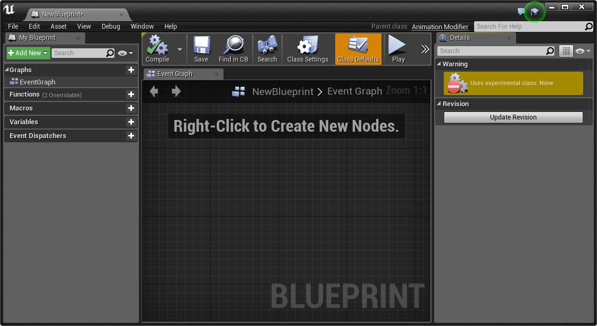

创建动画修改器后，您现在可以使用蓝图脚本和 **动画蓝图库** 包含的功能来访问和处理动画数据。

### 动画蓝图库

在动画修改器蓝图的图形中单击右键，可以看到上下文菜单和可用功能列表，这些功能主要来自于动画蓝图库。

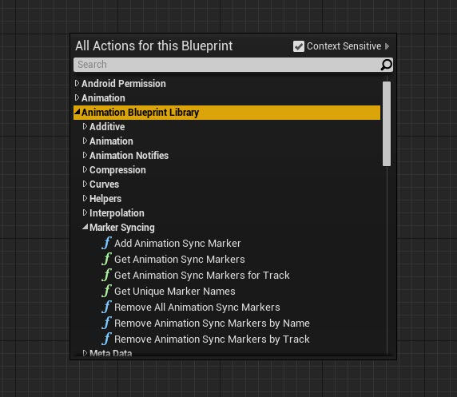

在上图中，展开了与 标记同步（Marker Syncing） 有关的功能，使您可以使用标记数据同步动画。

在使用可用来访问数据的各项功能之前，您需要先实现 **OnApply** 和 **OnRevert** 事件。 OnApply事件让用户可以在动画中更改、添加或删除数据，而OnRevert让用户可以删除之前应用的用户更改（或将序列恢复为原始状态）。 每个事件都会返回相应的动画序列来为动画蓝图库操作提供输入信息。

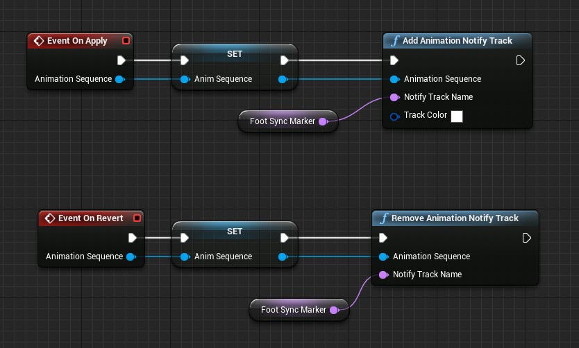

在上图中，应用动画修改器时，将以定义的名称创建新通知（Notify）轨道，而还原动画修改器时，会删除该轨道。

## 实现动画修改器

实现动画修改器可以在 **骨架** 资源内执行（目的是将动画修改器添加到与该骨架关联的所有动画），也可以在单个动画序列中执行。

1. 在 **骨架编辑器** 或 **动画编辑器** 中，转至 **窗口（Window）** 菜单选项，并选择 **动画数据修改器（Animation Data Modifiers）**。
    
    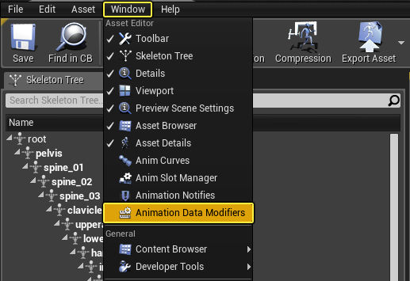
2. 在 **动画数据修改器（Animation Data Modifiers）** 选项卡中，选择 **添加修改器（Add Modifier）** 并选择所需 **动画修改器蓝图（Anim Modifier Blueprint）**。
    
    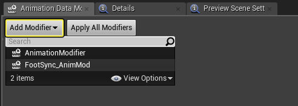
3. 右键单击动画修改器蓝图，然后单击 **应用修改器（Apply Modifier）** 以应用动画修改器以及任何更改（或单击 **还原修改器（Revert Modifier）** 以删除更改）。
    
    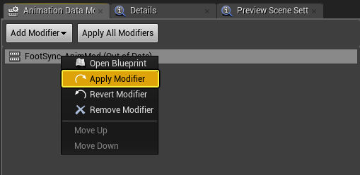
    
    在应用动画修改器之前，它将列示为 **过时（Out of Date）**。
    
    以下是应用于以骨架图标指示的骨架资源的动画修改器示例。
    
    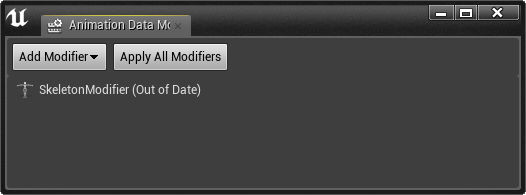

您设置为 **实例可编辑（Instance Editable）** 的任何属性都可以在 **动画数据修改器（Animation Data Modifiers）** 选项卡中编辑。

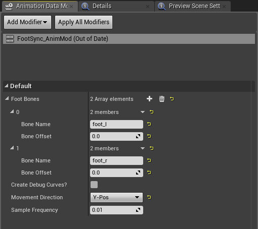

在上图中，我们定义了可以用来驱动自动脚部同步的属性。

### 公开属性

在您的动画修改器蓝图内部，您想要使用 **实例可编辑（Instance Editable）** 来公开可以在动画工具的 **动画（Animation）** 选项卡中操作的参数

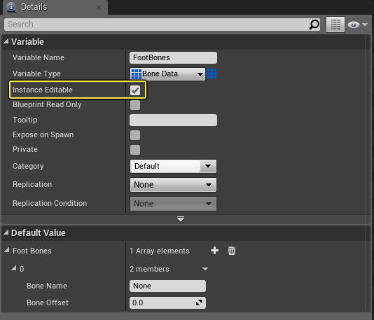

在上图中，我们使用一个结构变量，其中包含我们可以为骨骼名称设置并提供偏移值的信息。

在动画序列内部，当我们实现并应用动画修改器时，会看到公开的参数。

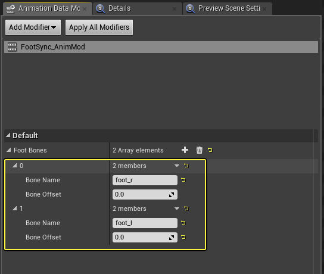

在上图中，我们输入了想要包含在动画修改器中的骨骼名称，这个动画修改器将提供动画数据（如骨骼转换）。

## 动画蓝图库参考

虽然动画蓝图库中有若干不同的节点，但本节仅列出动画修改器中较为常用的部分类型。

### 添加/删除通知（Notify）和曲线（Curve）轨迹

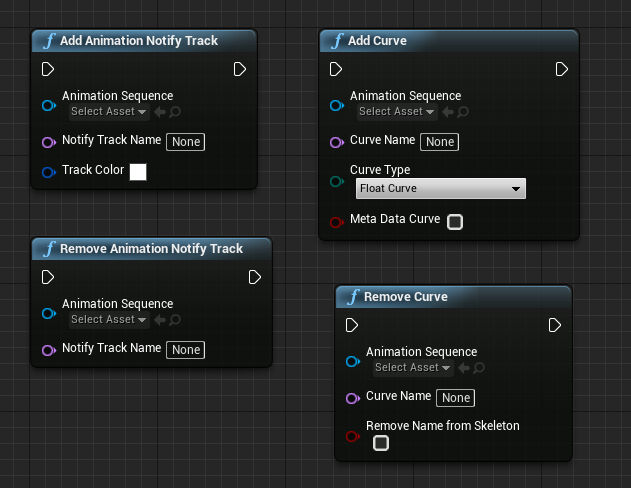

这些节点让您可以动态地向指定动画序列添加通知（Notify）或曲线（Curve）轨迹。 添加通知（Notify）或曲线（Curve）轨迹后，您可以将多种类型的键或事件添加到这些轨迹。 例如，您可能想要向曲线（Curve）轨迹 **添加浮动曲线键（Add Float Curve Keys）**，向通知（Notify）轨迹 **添加动画通知事件（Add Animation Notify Events）** 或 **添加动画同步标记（Add Animation Sync Markers）**。

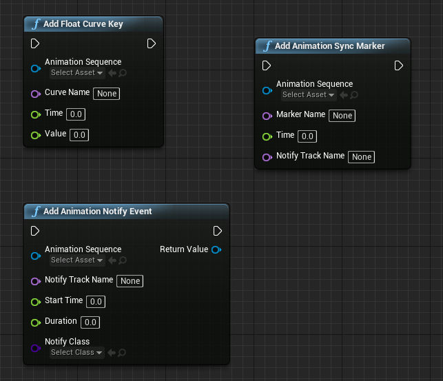

### 获取骨骼姿势

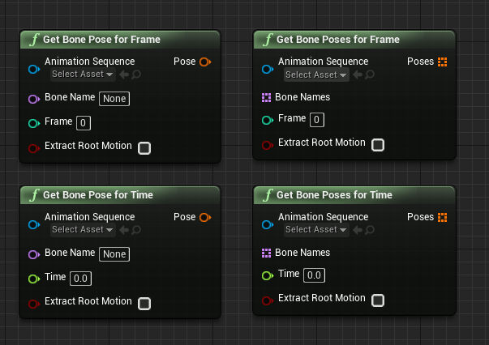

要获取骨骼转换数据，您可以使用 **获取适用于帧的骨骼姿势（Get Bone Pose for Frame）** 或 **获取适用于时间的骨骼姿势（Get Bone Pose for Time）** 节点，这两类节点将针对所提供动画序列和指定的骨骼名称返回骨骼转换。 或者，您可以使用 **获取适用于帧的骨骼姿势（Get Bone Pose for Frame）** 或 **获取适用于时间的骨骼姿势（Get Bone Pose for Time）** 来收集指定骨骼名称数组的骨骼转换。

在获取骨骼转换时，转换数据将保存在本地空间。如果您需要存放在组件空间，将需要手动对转换数据进行变换。

### 辅助（Helper）节点

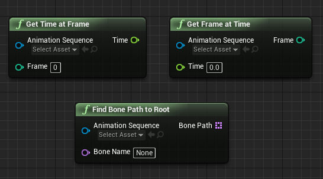

动画蓝图库节点包含若干辅助节点，其中包括用于转换帧和时间信息的节点（**获取帧的时间（Get Time at Frame）** 或 **获取时间的帧（Get Frame at Time）**）。 另一个用于获取信息的节点是 **查找通向根的骨骼路径（Find Bone Path to Root）**，该节点将接受动画序列和骨骼名称（通常是根骨骼）为输入信息，然后以链的形式输出一列骨骼名称。