# 摄像机管理器
在 **Unreal Engine** 中，`PlayerCameraManager` 是一个非常重要的类，负责管理与玩家控制的角色（通常是玩家控制器）相关的相机行为。它不仅控制相机的位置、旋转、视角等，还负责各种视图的调整、动态相机的过渡，以及处理玩家的输入。

### 1. **基本概念**

`PlayerCameraManager` 主要是作为一个附加在玩家控制器上的组件，它处理相机的平滑跟随、碰撞检测、自由视角控制等功能。在 Unreal Engine 中，一个角色通常由 `Pawn`（或者其派生类，例如 `Character`）控制，而相机则会由 `PlayerCameraManager` 来管理。

### 2. **核心功能**

- **相机的控制**：管理玩家的主相机，控制其位置、旋转、视野等。它允许你创建第一人称视角、第三人称视角等。
- **相机的过渡与平滑**：如果需要在多个不同的视角之间切换（例如从第一人称视角到第三人称视角），`PlayerCameraManager` 会平滑地过渡这些相机视角。
- **相机的碰撞检测**：防止相机穿过墙壁或其他障碍物。通过摄像头碰撞功能，确保相机视图始终保持在一个可视的范围内。
- **视角调整**：可以对相机进行自定义的缩放、旋转等调整，甚至可以应用视角的扭曲效果（如模糊、景深等）。
- **特殊效果**：用于处理诸如相机抖动（如爆炸效果时的相机震动）或者相机的虚拟现实相关功能。

### 3. **PlayerCameraManager的常用方法和属性**

在 Unreal Engine 中，`PlayerCameraManager` 提供了多种方法和属性来控制相机的行为。

#### 核心属性：

- **`ViewPitchMax` / `ViewPitchMin`**：控制相机在垂直方向的最大和最小视角限制。
- **`DefaultFOV`**：默认的视野角度（Field of View, FOV），即相机的视野大小。
- **`CameraCache`**：一个结构体，包含有关当前相机的详细信息，如位置、旋转、FOV等。
- **`CurrentFOV`**：当前的视野角度，可能与 `DefaultFOV` 不同。
- **`PlayerCameraManager`**: 用于设置和获取当前相机的所有相关数据。

#### 核心方法：

- **`SetCameraRotation(FRotator NewRotation)`**：设置相机的旋转。
- **`SetCameraLocation(FVector NewLocation)`**：设置相机的位置。
- **`GetCameraLocation()`**：获取当前相机的位置。
- **`GetCameraRotation()`**：获取当前相机的旋转。
- **`UpdateCamera(float DeltaTime)`**：用于更新相机位置的一个方法，通常会在 `Tick` 函数中调用，用来进行平滑跟随等操作。

#### 自定义相机行为：

你可以通过继承 `PlayerCameraManager` 来创建自定义的相机管理器，并重写一些方法以实现你想要的行为。例如，如果你想要在某些特定情况下让相机做出独特的反应（比如在玩家受伤时产生震动效果），你可以通过这种方式实现。
### 4. 创建摄像机管理器类
- 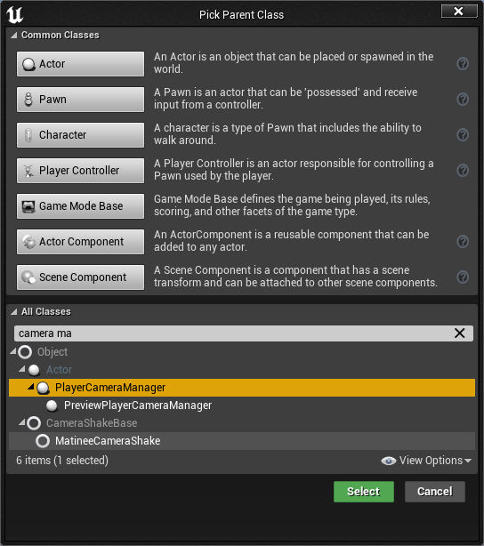
- 重载Blueprint Update Camera 函数
- 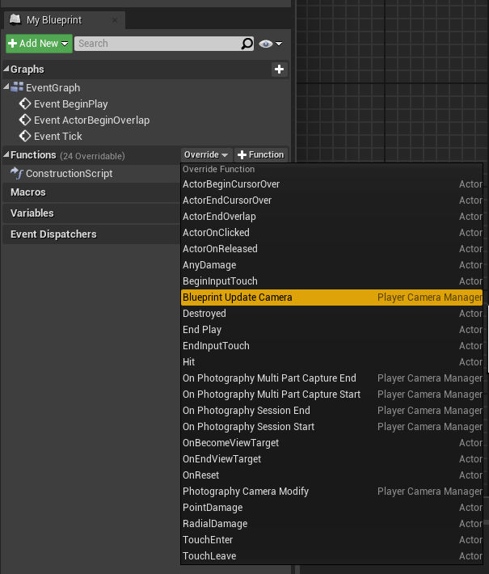
- 编写该函数
	- 创建变量ControlledPawn,类型为Pawn
	- 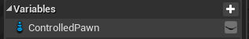
	- 编写函数
	- 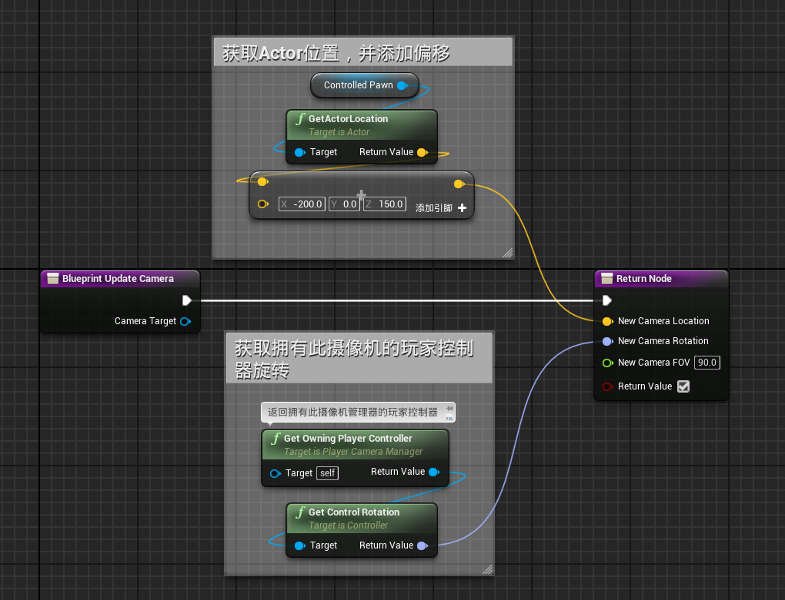
- 在本蓝图事件图表中创建自定义事件OnPossess,用于传递Pawn参数
- 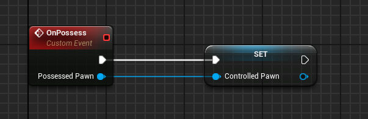
- 在player Controller蓝图文件中指定摄像机管理器类
- 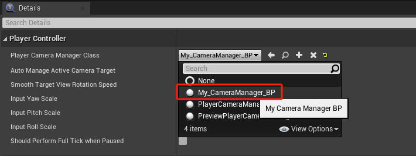
- 在player Controller蓝图，事件图表中编写OnPossess事件
- 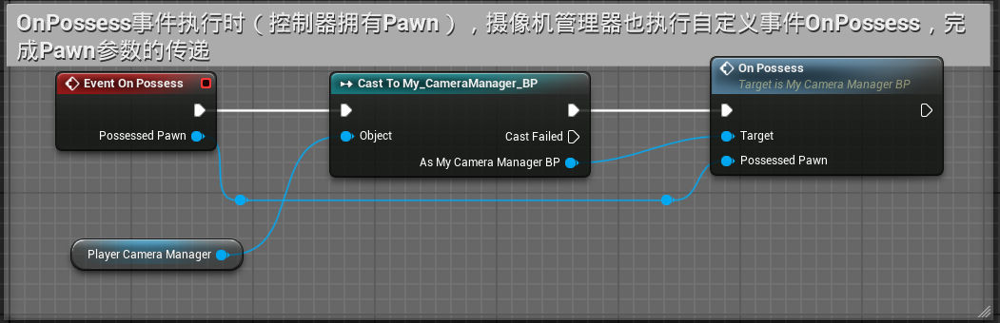

# 摄像机震动
## 基础
- 创建摄像机震动蓝图
- 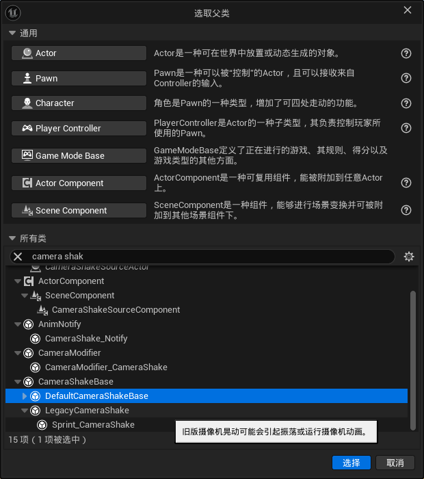
- 调整参数
- 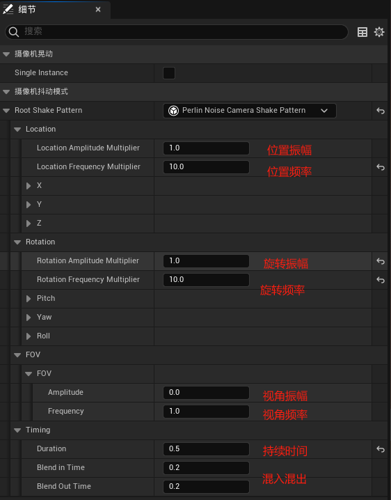
- 角色蓝图调用
- 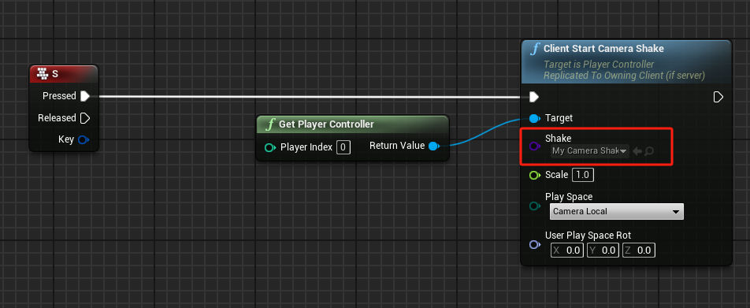
- 也可以制作一个摄像机震动的动画通知类，在动画序列中添加动画通知，实现屏震。
# 弹簧臂的作用
- 弹簧臂的作用主要有两个
	- 摄像机设置
	- 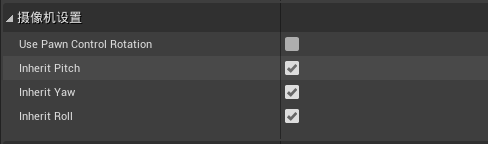
	- 滞后
	- 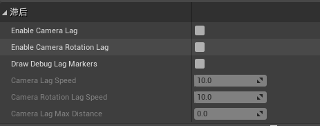

## 进阶
- 可创建CameraShake的动画通知，并将动画通知添加到动画资产中
- 播放动画资产时调用屏振
# 基于状态机的摄像机
## 在角色蓝图中继承接口
- 在角色蓝图中继承接口ALS_Character_BPI,并在事件蓝图中实现BPI_Get_Current_States，用于连接角色和摄像机管理器
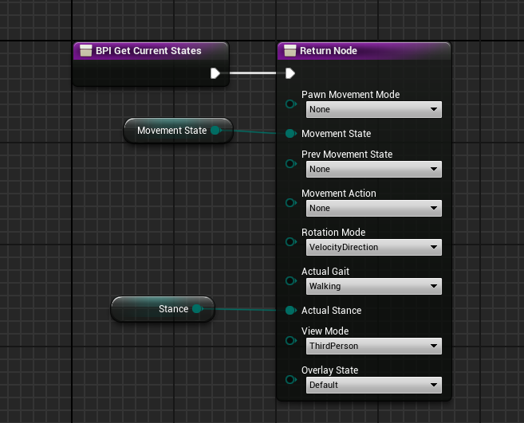

## 摄像机管理器增加骨骼网格体组件

- 在摄像机管理器蓝图中增加一个SkeletalMesh组件CameraBehavior，并增加摄像机骨骼网格体模型Camera,它的骨骼资产是CameraSkeleton
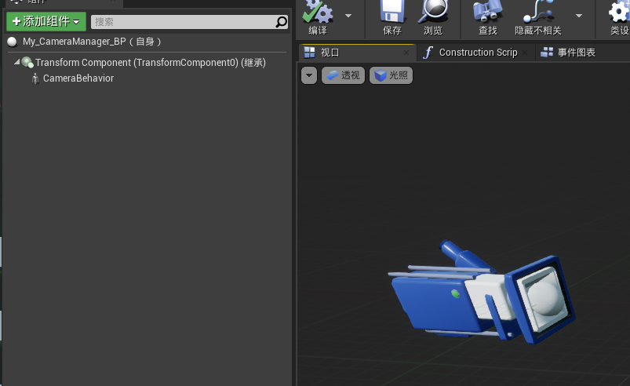
## 新增动画蓝图
新增摄像机动画蓝图，使用CameraSkeleton作为骨骼，并在摄像机管理器蓝图中调用动画蓝图
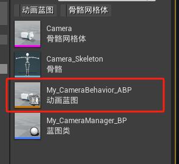
- 在动画蓝图中添加变量PlayerController（PlayerController），ControlledPawn（Pawn）和Stance（ALS_Stance）
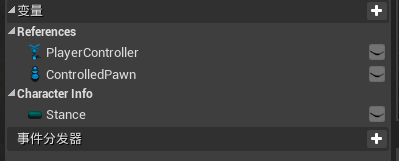
- 在动画蓝图中添加函数UpdateCharacterInfo，用于更新角色信息，该函数调用角色蓝图继承的蓝图接口，获取Stance信息，将Stance信息从角色同步到摄像机动画蓝图
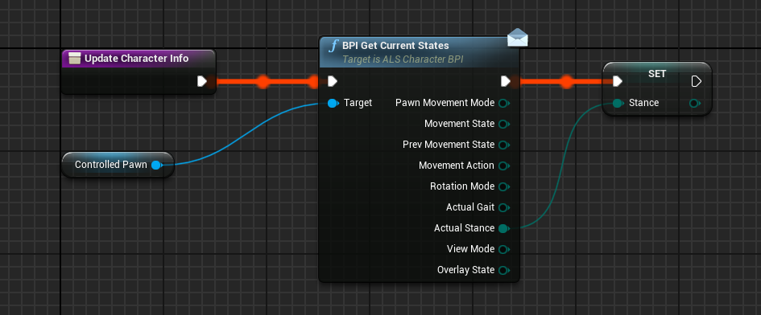
- 在事件蓝图中事件蓝图更新动画时更新角色信息

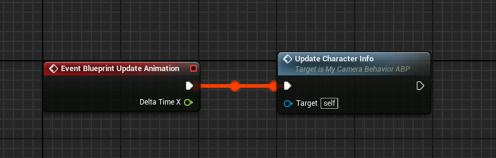
- 在动画蓝图
- 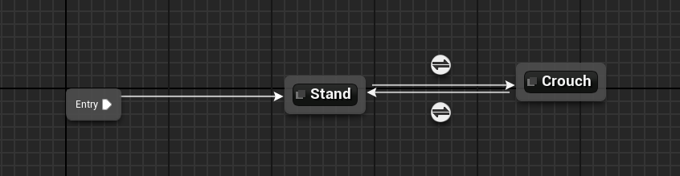
- Stand状态
- 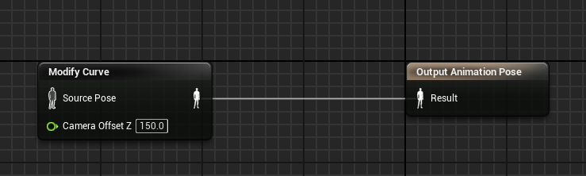
- Crouch状态
- 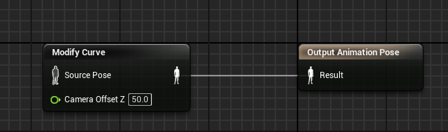
- 转换条件为Stance是站立还是蹲伏
## 配置摄像机管理器蓝图
- 在摄像机管理器蓝图中获取摄像机动画蓝图，并设置其属性PlayerController和ControlledPawn
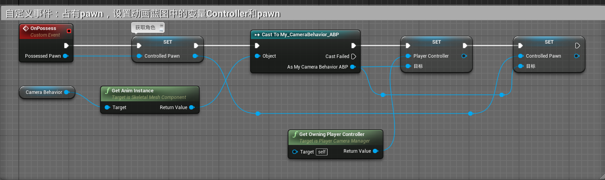
- 调整Blueprint Update Camera 函数，使用曲线调整摄像机Z轴位移
- 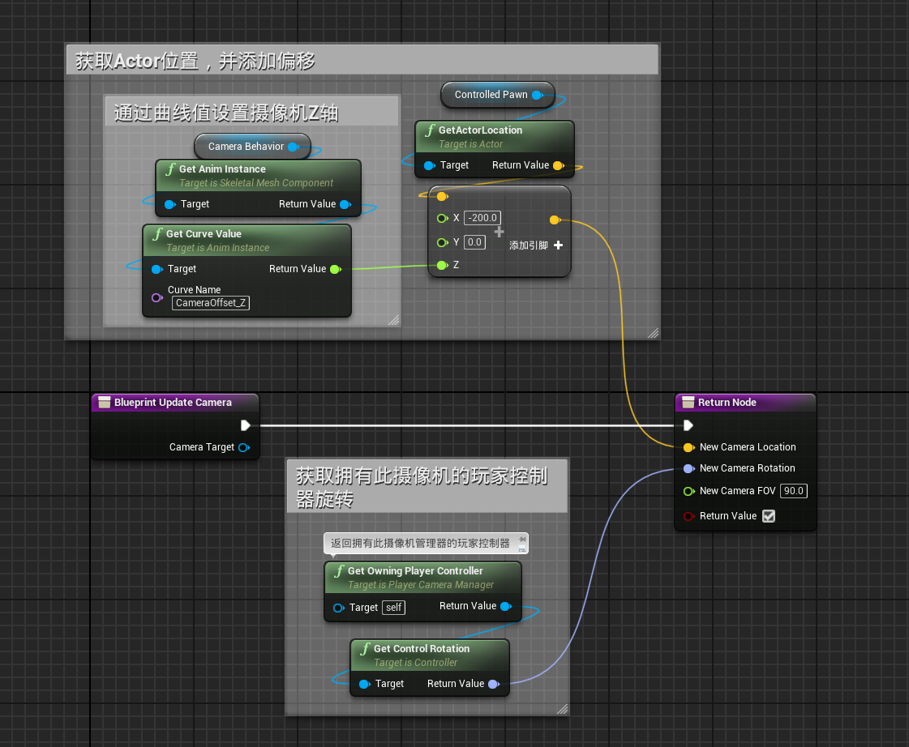
