# 双骨骼IK解决方案
## 计算脚和地面的偏移量
- 该方案的关键是计算出**地面接触点**和**脚**的Z轴上下位置偏移以及地面接触点法线方向和脚的XY轴的旋转偏移
-  使用通道射线进行检测检测
	- 射线起点是以脚的XY轴位置和根骨骼的Z轴位置加上向上偏移量（大约为50）为起点。
	- 射线终点是以脚的XY轴位置和根骨骼的Z轴位置加上向下偏移量（大约为75）为终点。
- 射线检测结果利用OutHitLocation和OutHitNormal进行计算
	- OutHitLocation的Z轴减去根骨骼世界位置的Z轴，得出脚的Z轴偏移量
	- OutHitNormal的Y轴和Z轴进行**反正切**（Atan2）计算得到脚的Roll（X）旋转偏移量
	- OutHitNormal的X轴和Z轴进行**反正切**（Atan2）计算得到脚的Pitch（Y）旋转偏移量
	- 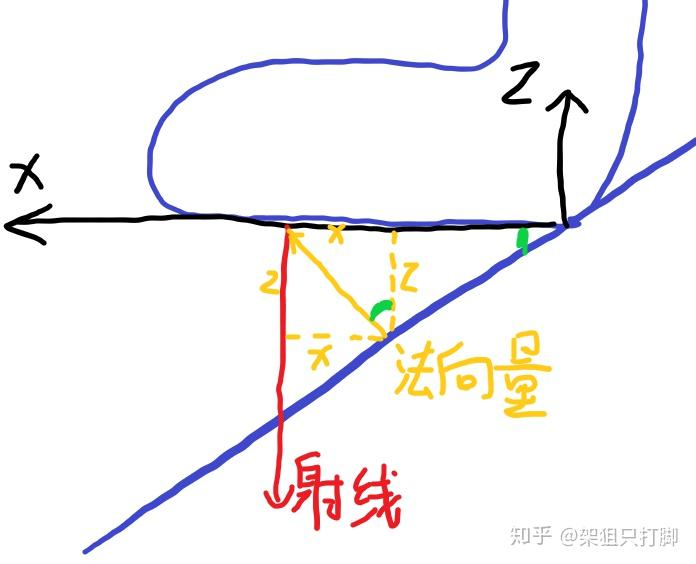
	- 黑色为世界坐标系，红色为检测的射线，**黄色为法向量，绿色为所求角度M。**  
	- 不难看出，tan M= 法向量的x/法向量的z。所以**M=arc tan（法向量x/法向量z）**。  
	- Y轴垂直屏幕向内，这个绿色角则为绕Y轴旋转，也就是我们需要的RotationY值。  
	- 所以，**RotationX=arctan（法向量y/法向量z）RotationY=arc tan（法向量x/法向量z）**
- 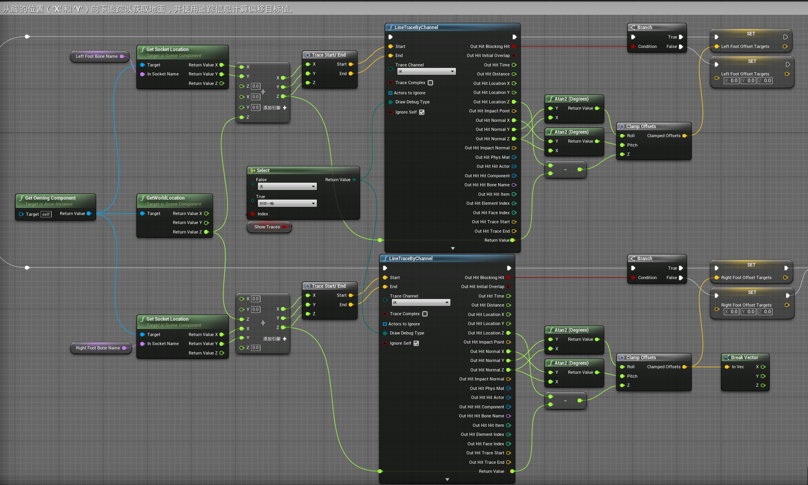
- 利用左右脚的Z轴偏移值计算胯部（pelvis）的偏移
	- 左右脚的Z轴偏移值较小的值作为胯部（pelvis）的偏移，移值较小意味着脚的位置最低。将 Pelvis offset （骨盆偏移） 设置为最低的 Foot Offset （脚偏移），以防止腿部过度伸展。
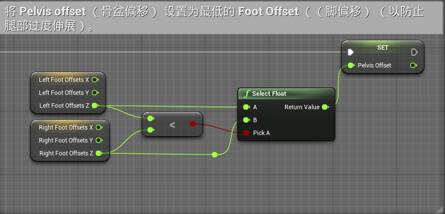
## 修改骨骼位置和旋转
- 直接修改Pelvis的偏移
- 双脚IK通过修改IK骨骼和膝盖虚拟骨骼作为骨骼空间修改
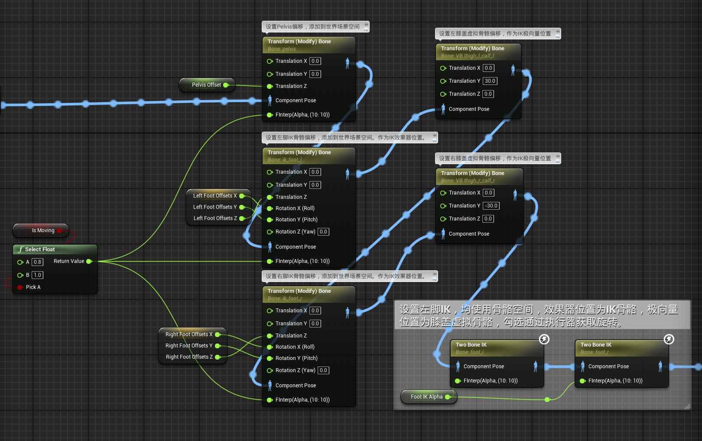
# ControlRIg解决方案
## 通过检测获取偏移量函数FootTrace
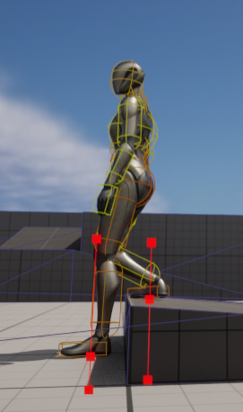
- 通过球体追踪获取碰撞点位置
	- 以脚IK骨骼的X轴平移、Y轴平移+5，和根骨骼root的Z轴平移+30，作为球形碰撞的开始位置
	- 以脚IK骨骼的X轴平移、Y轴平移+5，和根骨骼root的Z轴平移-50，作为球形碰撞的结束位置
	- 球体追踪的球体半径为3.0。Trace Channel为Visibility
	- 碰撞点位置作为变量返回
- 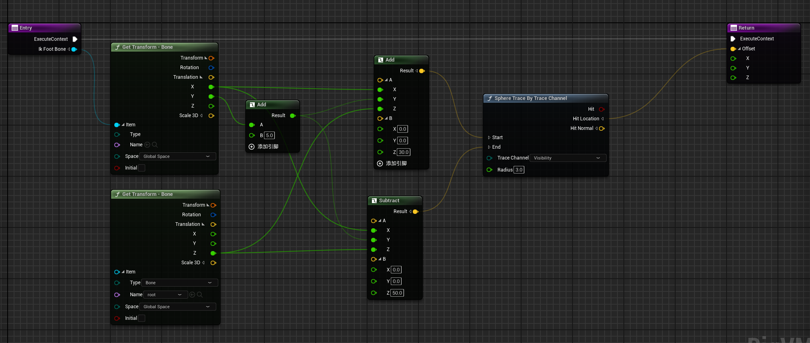
## ControllRig逻辑
- 第1步：如果 Should Do IK Trace 为真，则在两只脚上进行追踪（使用自定义追踪函数FootTrace），并根据追踪结果设置 Z 偏移目标。如果 Should Do IK Trace 为假，则将目标重置为 0。
- 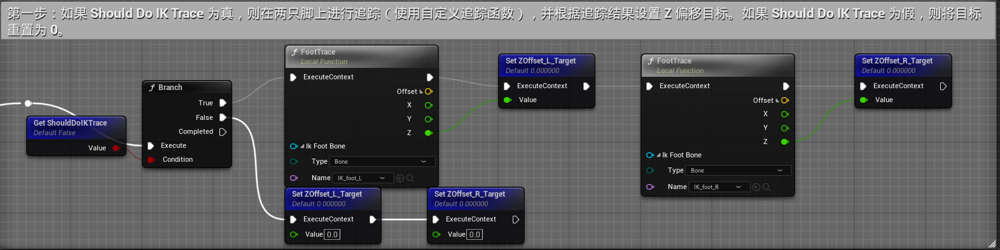
- 第2步：将Z偏移量插值到其目标值。
	- 主要用到一个Alpha Interpolate节点，该节点使用自定义范围和限制接收一个浮点值并输出一个累加值，使脚的位置以自定义的速度切换到目标位置，而不是瞬间切换。
- 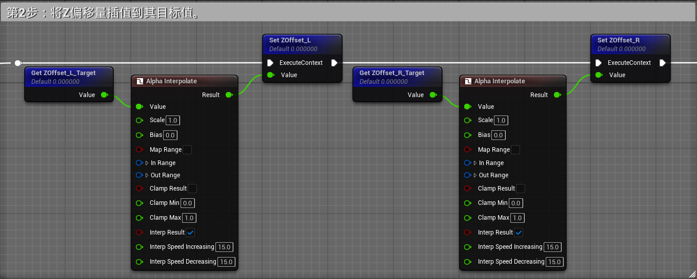
* 第3步：使用最低的骨盆脚偏移量以防止过度伸展。
* 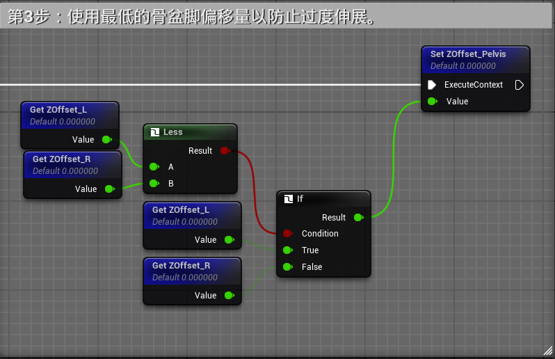
- 第4步：将插值的Z偏移量添加到IK脚骨和骨盆。这将使它们向上或向下移动。
- 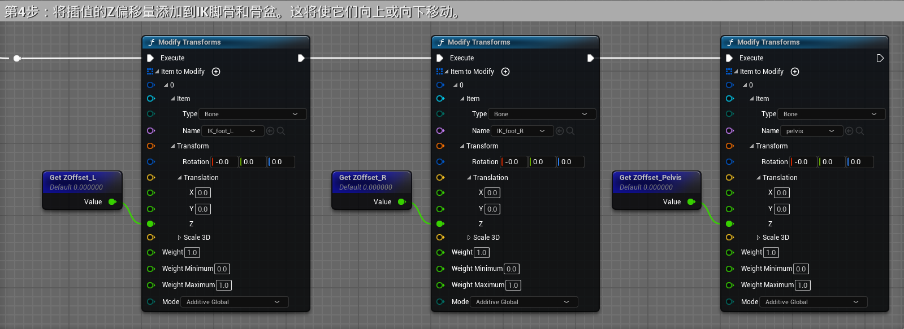
* 第5步：使用全身逆向运动学节点来解决逆向运动学，并将IK脚骨骼用作每只脚的效应器目标。
* 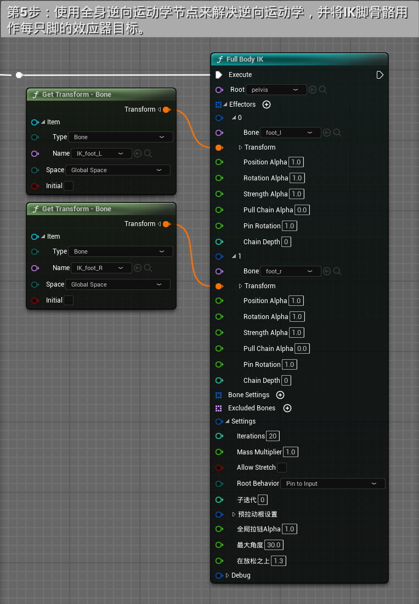
## ControllRig逻辑总览
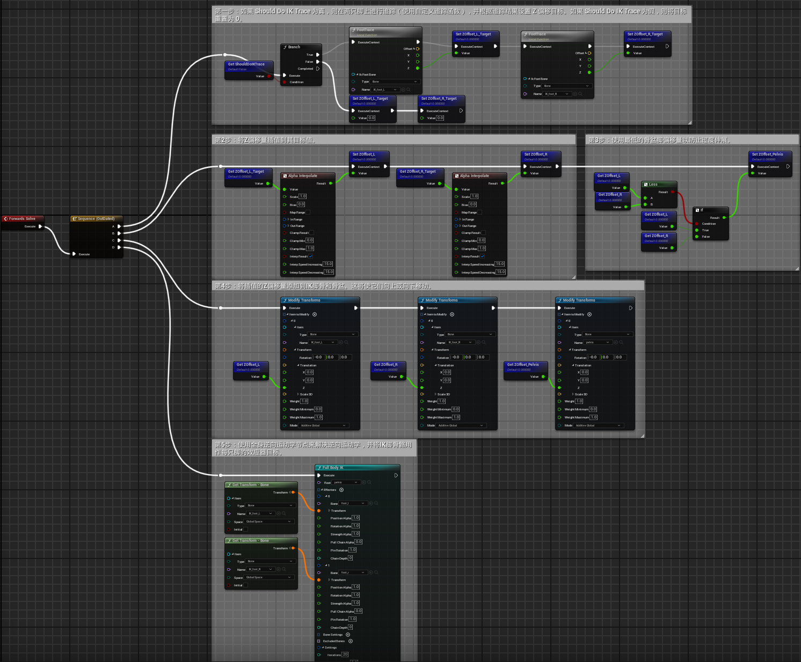
# 使用IK rig来实现
## 创建IKrig
- 设置骨盆和全形体IK（FullBodyIK)，并将全形体IK初始骨骼设置为骨盆
- 在手脚和骨盆处创建IK目标
- [Open: 1.15-IK解决脚穿插问题-1762409556741.png](attachments/9ed6835ecf86ef78ba2af5c41f998252_MD5.jpg)
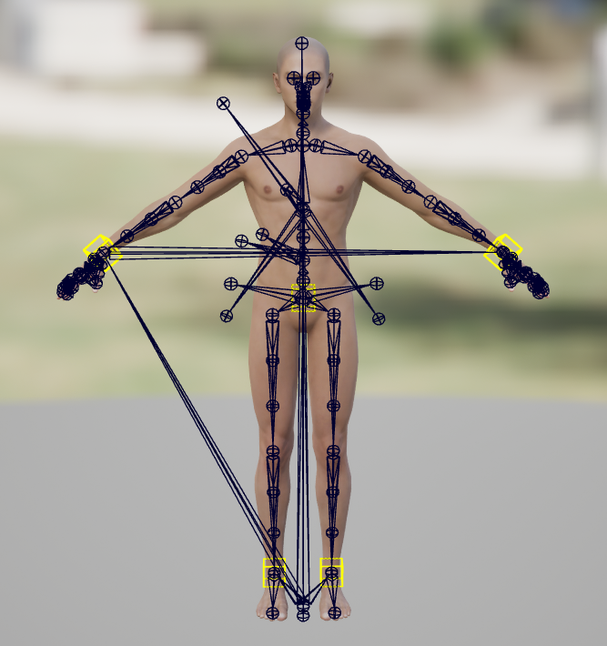
- 在骨盆处添加全形体IK骨骼设置。设置其旋转刚度和位置刚度为0.95
- [Open: 1.15-IK解决脚穿插问题-1762409608694.png](attachments/9c52cfb8e24d0095c455f43ef7d1b8bc_MD5.jpg)
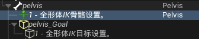[Open: 1.15-IK解决脚穿插问题-1762409622225.png](attachments/25d8bba80c12fbe2f426c1b7be9b1e86_MD5.jpg)
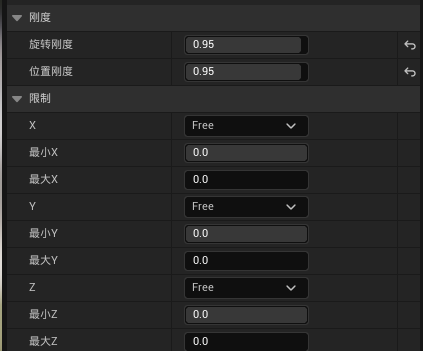
- 肩膀设置
- [Open: 1.15-IK解决脚穿插问题-1762409696575.png](attachments/2b9eee0875cad791f74acb770a0486fd_MD5.jpg)

- 前臂和小腿设置，锁定其XY轴
- [Open: 1.15-IK解决脚穿插问题-1762409718769.png](attachments/5d9522b75f71f667f58f8f57d2da730d_MD5.jpg)
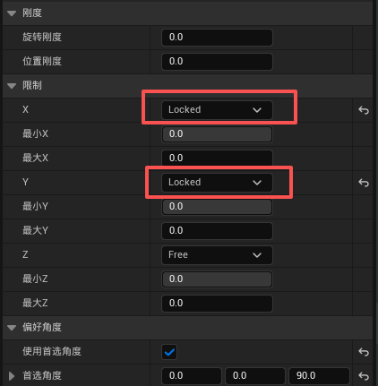
- 脚设置
- [Open: 1.15-IK解决脚穿插问题-1762409785625.png](attachments/465754484c27e7baaa449deb237c4c61_MD5.jpg)

- 最后将5个IK目标的位置暴露给蓝图
- [Open: 1.15-IK解决脚穿插问题-1762411021274.png](attachments/e1fe73d2eb79ab68f12c6020acb72fff_MD5.jpg)
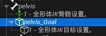[Open: 1.15-IK解决脚穿插问题-1762411007546.png](attachments/032beadd36458a3b0fc158b75350c39e_MD5.jpg)
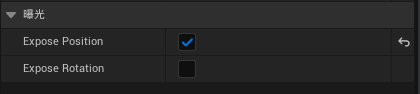
## 动画蓝图
### FootTrace函数（未经验证）
[Open: 1.15-IK解决脚穿插问题-1762416337343.png](attachments/0abf6a209820a14adab3f6b70dd52a9b_MD5.jpg)
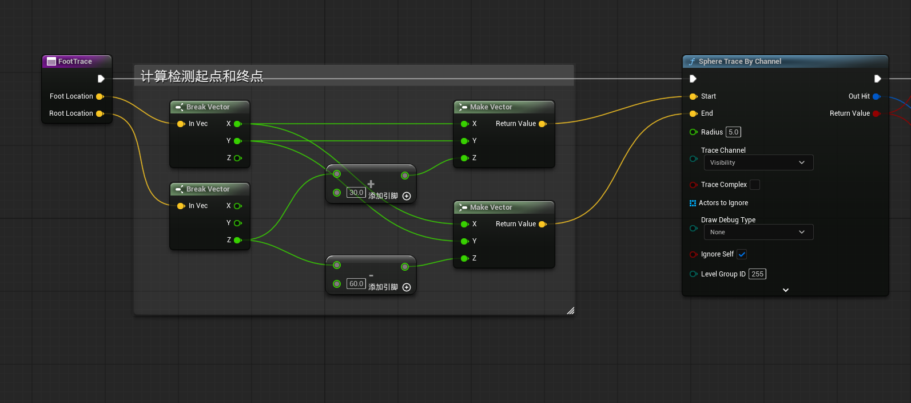
[Open: 1.15-IK解决脚穿插问题-1762416354633.png](attachments/93192e9cd3cb51bb77ab7d7c5b22c08f_MD5.jpg)
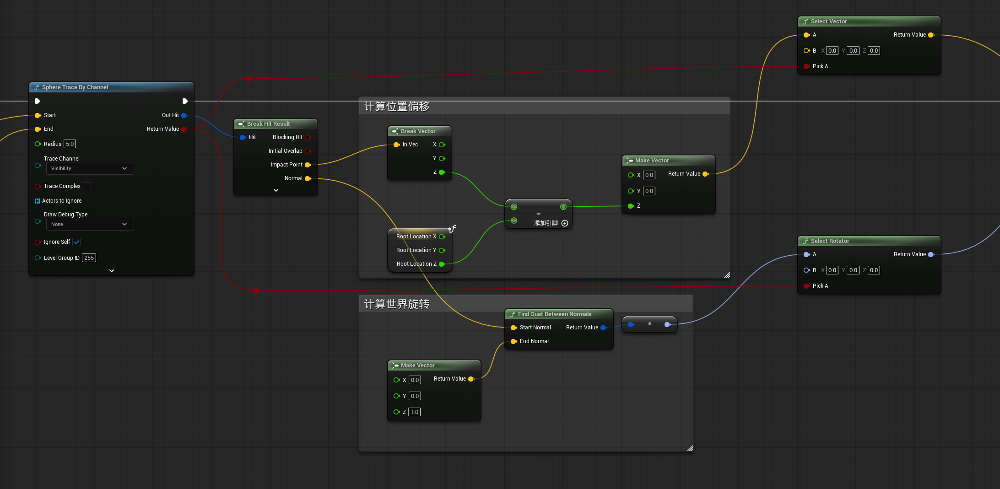
[Open: 1.15-IK解决脚穿插问题-1762416363583.png](attachments/1b4e3b99f7b03f1342e91229c4095392_MD5.jpg)
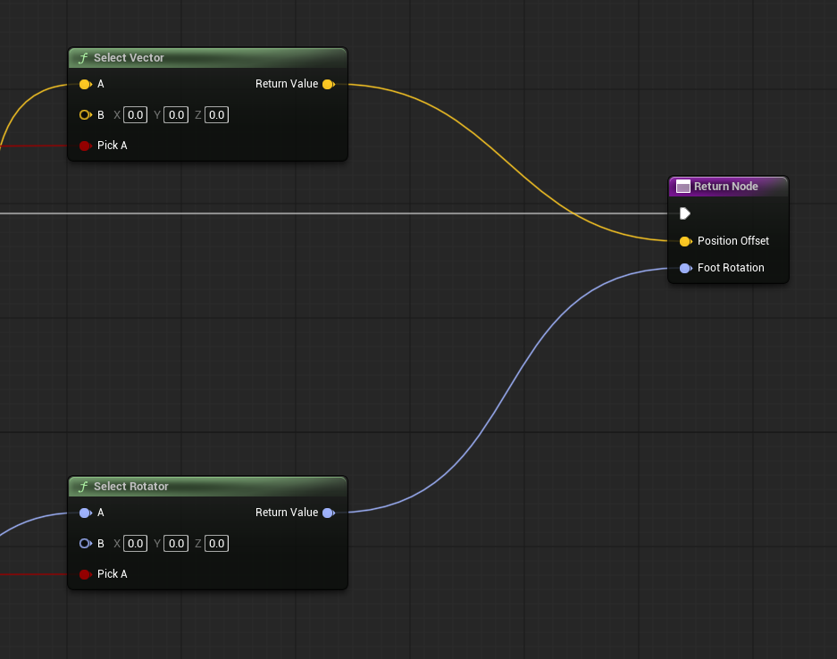