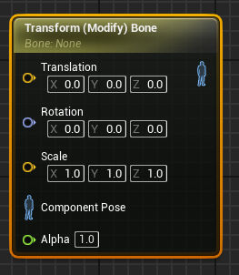
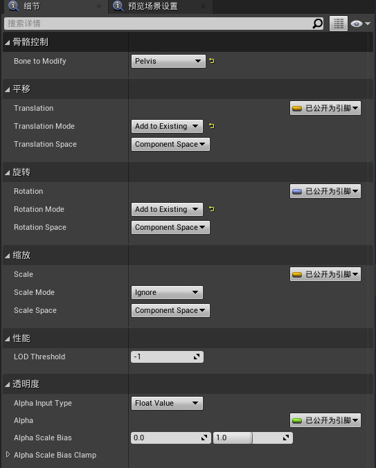
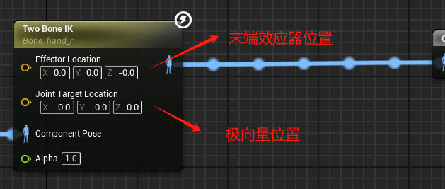
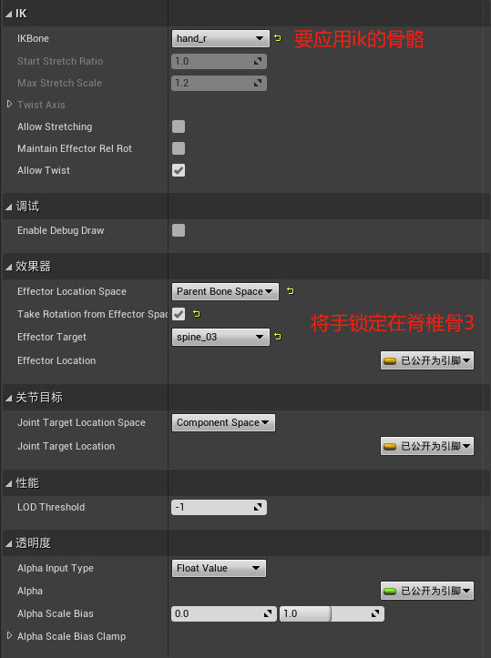
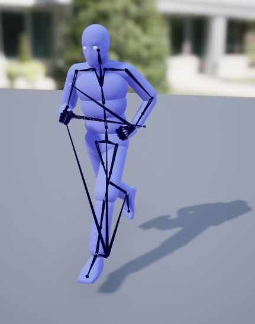
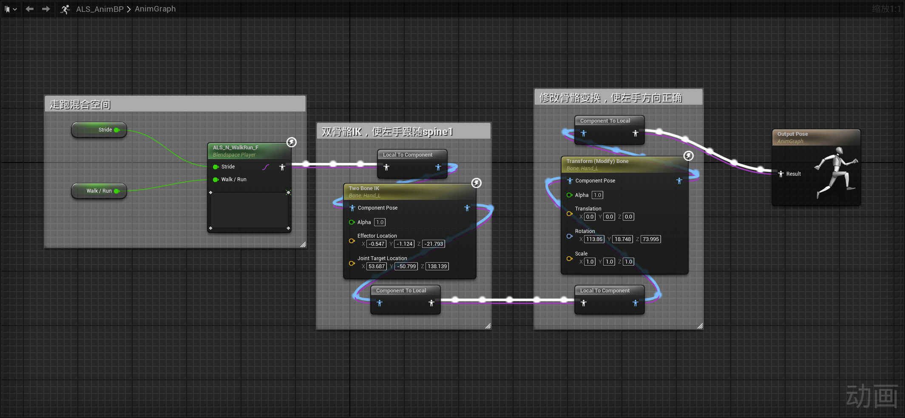
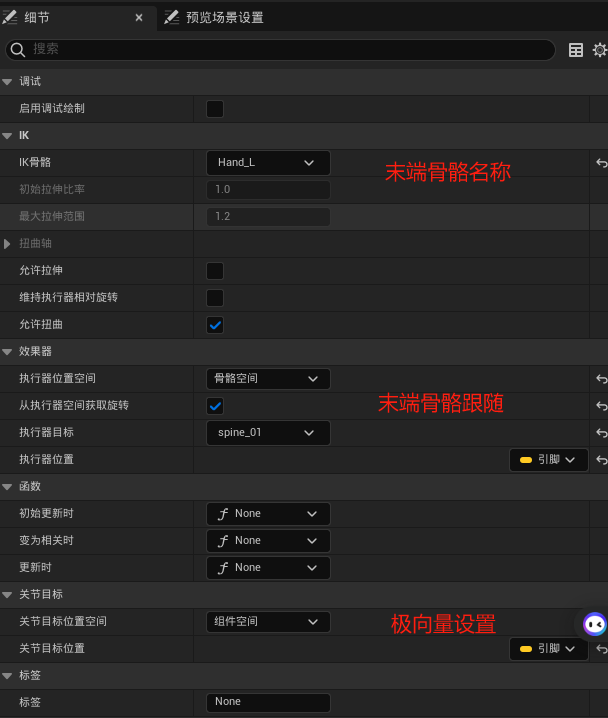
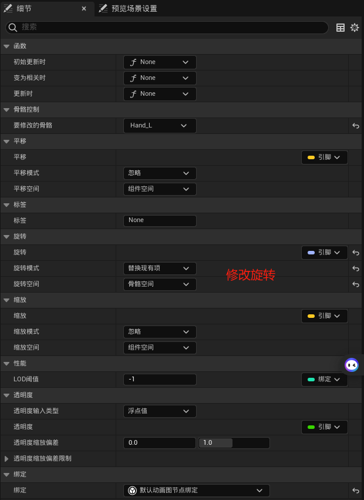

# 骨骼修改节点
## Transform (Modify) Bone
- 概念：用于处理骨骼变换
- 示例：
[Open: Pasted image 20240304135826.png](attachments/9251dd26e8dff0a28a4cb7ead0256f49_MD5.jpeg)

[Open: Pasted image 20240304135901.png](attachments/d45f8aba349942ee55877e12b5d53f42_MD5.jpeg)

- 原理：pass
# Two Bone IK
- 概念：把逆向运动学解算器应用到一个三节关节链上，主要用于四肢动画处理。
- 示例：
[Open: 1709532193120.png](attachments/da28c689806c17ab9aec417db0875ebf_MD5.jpeg)
[Open: 1709532326484.png](attachments/f6911337ee14204a68caaa060a8258a3_MD5.jpeg)

- 原理：pass
# 实例
奔跑中使左手骨骼掐腰

- 其中双骨骼IK设置
- 
- Transform (Modify) Bone设置
- 
# Two Bone IK 算法分析
