### 应用叠加型姿势

**应用叠加型姿势（Apply Additive）** 和 **应用网格体空间叠加型姿势（Apply Mesh Space Additive）** 会根据Alpha值，在基本动画姿势上叠加姿势。

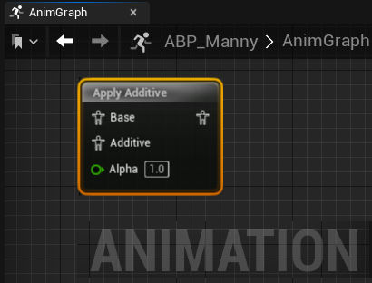 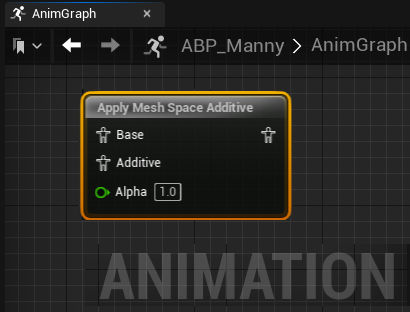

通过节点输入引脚，可以连接一个 **基础** 和一个要应用的 **叠加** 姿势。

**应用叠加型姿势（Apply Additive）** 节点也受到[LOD](https://dev.epicgames.com/documentation/zh-cn/unreal-engine/skeletal-mesh-lods-in-unreal-engine)阈值系统的影响。可以在 **应用叠加型姿势（Apply Additive）** 和 **应用网格体空间叠加型姿势（Apply Mesh Space Additive）** 节点的 **细节（Details）** 面板中找到该设置。

除此以外，你还可以使用 **创建动态叠加型姿势（Make Dynamic Additive）** 节点来反向混合叠加动画姿势。用这个节点可以从基础姿势减去叠加姿势来创建输出姿势。

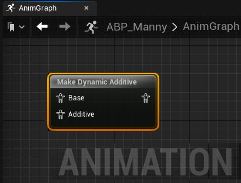

在制作动态叠加型姿势节点的细节面板中也可以选用让节点在 **网格体空间（Mesh Space）** 中运行。
### Blend动画混合节点
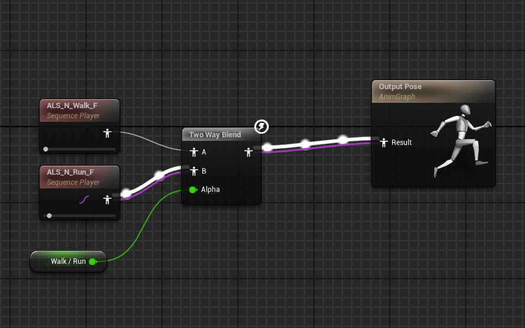
[节点设置](attachments/7da3c4df156fcb86b17a203bbcb25701_MD5.jpeg)
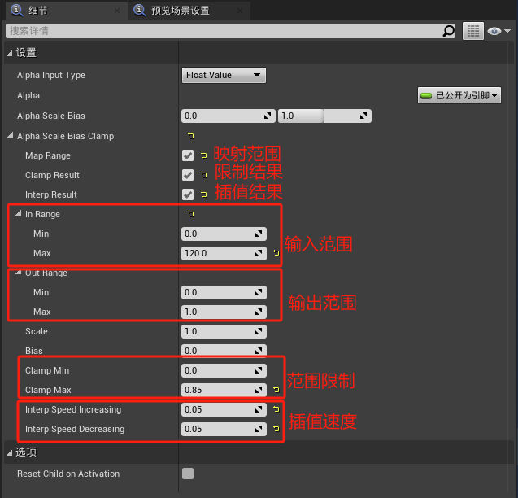
- 用法：混合AB动画，Alpha值为0时播放A动画，为1时播放B动画。
- 如果勾选插值结果，则可以通过控制插值速度来控制动画混合的速度。
	- Interp Speed Increasing是动画A到动画B的速度
	- Interp Speed Decreasing是动画B到动画A的速度
	- 可以通过提高动画A到动画B的速度，降低动画B到动画A的速度，来实现惯性效果。冲刺后速度慢慢降低。
### 根据通道混合骨骼

**根据通道混合骨骼（Blend Bone by Channel）** 混合节点可以用于指定骨骼来进行特定的混合转换。

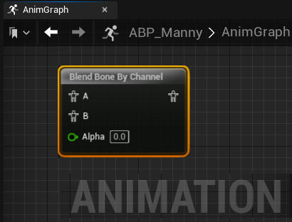

在根据通道混合骨骼的 **细节（Details）** 面板中可以点击 **(+) 添加** 来添加 **骨骼定义（Bone Definitions）** 分区。创建好后，可以定义要提取转换数据的源骨骼，以及要应用混合目标骨骼。还可以通过切换属性来定义要在混合中加入转换的哪些部分，比如 **位移（Translation）** 、 **旋转（Rotation）** 和 **缩放（Scale）** 。除此以外，还可以定义在哪个 **转换空间（Transform Space）** 中计算转换数据，比如 **世界空间（World Space）** 、 **组件空间（Component Space）** 、 **父级骨骼空间（Parent Bone Space）** 以及 **骨骼空间（Bone Space）** 。

已有的Alpha值会参与控制混合的权重。

### Blend Multi

Blend Multi节点可用用于混合两个以上混合姿势，并使用一个范围的Alpha值。

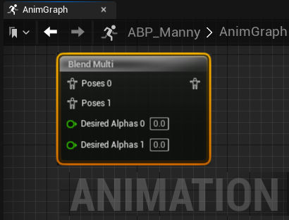

在Blend Multi的 **细节（Details）** 面板中，你可以用 **Additive节点** 属性将节点在是否叠加之间切换。

## 函数混合节点

函数混合节点分类为绿色标题颜色，可以对动画姿势根据每个节点特定的参数进行基于计算的混合。以下是一系列的基于函数的混合节点的参考，可以在项目的 **动画图表（AnimGraph）** 里混合动画。

### 按布尔值混合姿势

**按布尔值混合姿势（Blend Poses by bool）** 节点使用 **布尔值** 作为键，基于时间混合两个姿势。当布尔值为 **true** 时，使用与 **真姿势（True Pose）** 输入引脚相连的姿势；当布尔值为 **false** 时，使用 **False姿势（False Pose）** 。每个姿势都有一个浮点值 **混合时间（Blend Time）** ，用来控制混入这个姿势所需的时间。

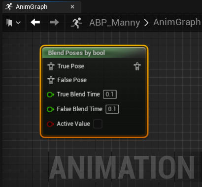

在 **细节（Details）** 面板中，你可以切换 **混合时间（Blend Time）** 引脚在动画图表中否可视，还可以设置[转移类型（Transition Type）](https://dev.epicgames.com/documentation/zh-cn/unreal-engine/transition-rules-in-unreal-engine)。

### 按整型值混合姿势

**按整型值混合姿势（Blend Poses by int）** 节点使用整数值作为键，基于时间混合任意数量的姿势。对于每个输入整数值，将使用与该值输入引脚关联的姿势。例如，当整数设为0时，将使用与 **混合姿势0（Blend Pose 0）** 相连的姿势。每个姿势都有一个浮点值 **混合时间（Blend Time）** ，用来控制混入这个姿势所需的时间。

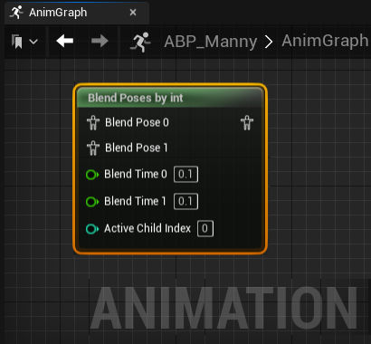

在 **细节（Details）** 面板中，你可以切换 **混合时间（Blend Time）** 引脚在动画图表中否可视，还可以设置[转移类型（Transition Type）](https://dev.epicgames.com/documentation/zh-cn/unreal-engine/transition-rules-in-unreal-engine)。

### 按枚举混合姿势

**按枚举混合姿势（Blend Poses by Enum）** 节点将枚举值用作键，并基于时间在姿势间进行混合。可使用默认姿势，也可通过 **活跃枚举值（Active Enum Value）** 引脚在连接枚举中添加已辨识值的额外姿势。此外，各姿势均具有用于控制混合到姿势所需时长的浮点值 **混合时间（Blend Time）** 。

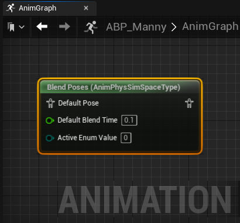

在 **细节（Details）** 面板中，你可以切换 **混合时间（Blend Time）** 引脚在动画图表中否可视，还可以将[转移类型（Transition Type）](https://dev.epicgames.com/documentation/zh-cn/unreal-engine/transition-rules-in-unreal-engine)。

### 按骨骼分层混合

**按骨骼分层混合（Layered blend per bone）** 节点可以用于基于指定的一组骨骼在任意数量的动态混合姿势之间进行混合。

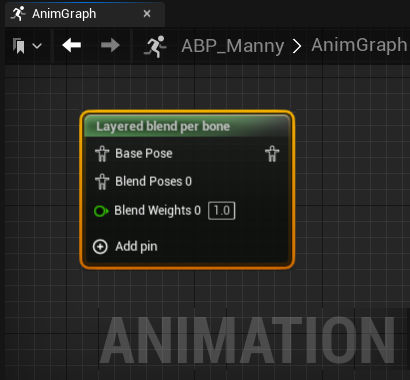

在"按骨骼分层混合节点"的 **细节面板** 中，你可以将混合模式定义为 **分支筛选器** 或者 **混合遮罩** 。

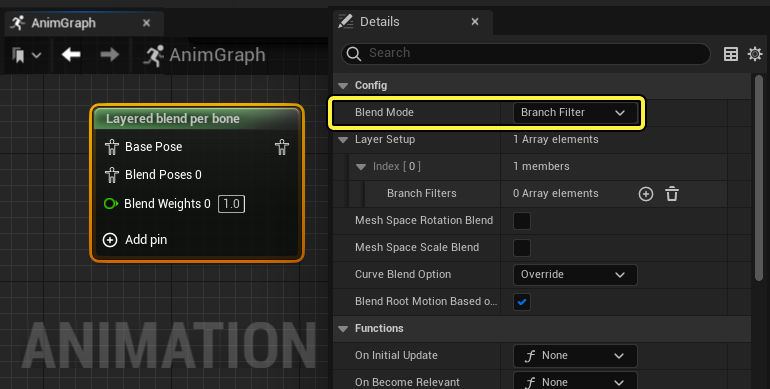

你可以启用 **网格体空间旋转混合（Mesh Space Rotation Blend）** 和 **网格体空间缩放混合（Mesh Space Scale Blend）** 属性，控制 **网格体空间（Mesh Space）** 或 **局部空间（Local Space）** 中是否出现 **旋转（Rotation）** 和 **缩放（Scale）** 混合。

借助 **曲线混合选项（Curve Blend Options）** 属性，你可以在设置列表设置曲线混合行为，控制动画层的混合方式。下面是供你参考的一系列可用 **曲线混合选项（Curve Blend Options）** 。

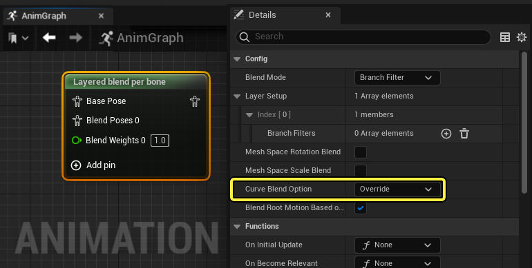

|混合选项|说明|
|---|---|
|**覆盖（Override）**|将此姿势覆盖到包含有效曲线值的上一个姿势。|
|**不覆盖（Do Not Override）**|不覆盖该姿势。最适合在所需的前一姿势没有曲线值时使用。|
|**按权重规格化（Normalize by Weight）**|按所有混合权重的 **总和** 将姿势混合规格化。|
|**按权重混合（Blend by Weight）**|在 **没有** 规格化的情况下按混合权重混合姿势。|
|**使用基础姿势（Use Base Pose）**|将 **基础姿势（Base Pose）** 用于所有曲线值。|
|**使用最小值（Use Min Value）**|从所有连接姿势选择 **最高** 曲线值，并将其用于混合。|
|**使用最大值（Use Max Value）**|从所有连接姿势选择 **最低** 曲线值，并将其用于混合。|

你还可以启用 **基于根骨骼混合根骨骼运动（Blend Root Motion Based on Root Bone）** 属性，以在混合[根骨骼运动](https://dev.epicgames.com/documentation/zh-cn/unreal-engine/root-motion-in-unreal-engine)时合并 **根骨骼** 的按骨骼混合权重。

#### 分支筛选器

借助 **分支筛选器（Branch Filter）** 选项，你可以定义该混合将影响的骨骼 **索引（Index）** 。

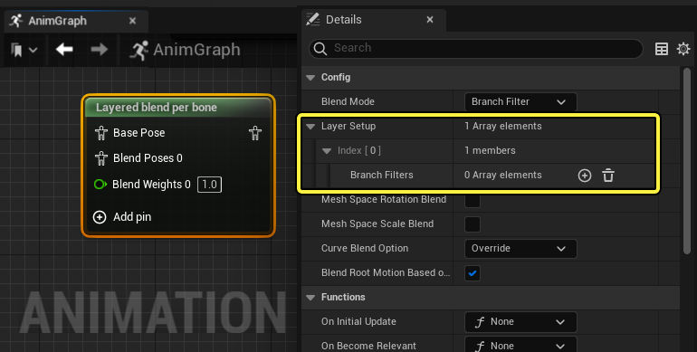

将元素添加至 **分支筛选器（Branch Filters）** 属性后，你可以输入骨骼的 **骨骼名称（Bone Name）** ，用作控制本地化动画混合的参考点。使用 **混合深度（Blend Depth）** 属性，你可以控制混合对于 **骨骼名称（Bone Name）** 子骨骼的权重。

|值|示例|说明|
|---|---|---|
|**正（Positive）**|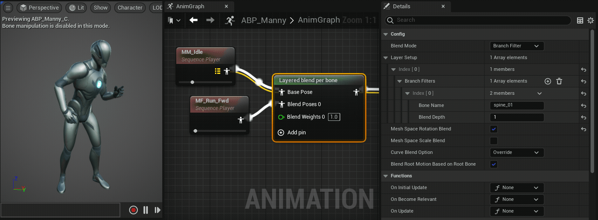|正 **混合深度（Blend Depth）** 值将按相同数量的骨骼抵消权重，并通过 **骨骼名称（Bone Name）** 链逐渐减少权重。例如，**混合深度（Blend Depth）** 为2，会将混合权重1应用到下一子骨骼，混合权重0.5应用到 **骨骼名称（Bone Name）** 。|
|**零（Zero）**|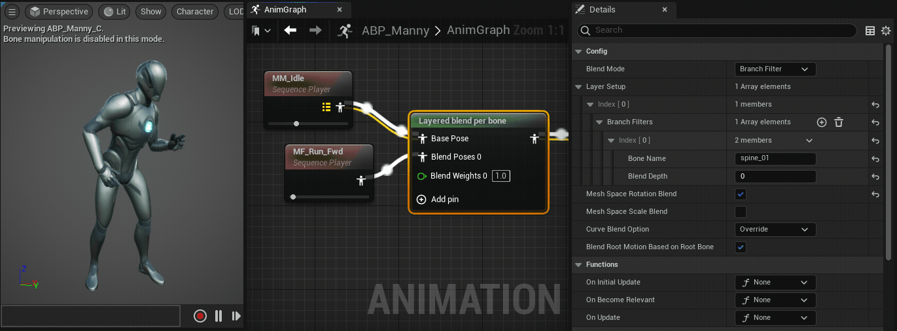|**混合深度（Blend Depth）** 值为0会将混合权重1应用于 **骨骼名称（Bone Name）** 和所有连接的子骨骼。|
|**负（Negative）**|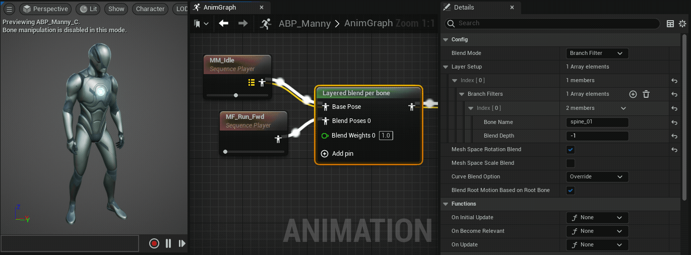|负 **混合深度（Blend Depth）** 值将禁用所有 **混合姿势（Blend Poses）** ，并支持 **基础姿势（Base Pose）** 。小于-1的值将按相同骨骼数量抵消权重，并通过 **骨骼名称（Bone Name）** 链逐步减少禁用混合权重。例如，**混合深度（Blend Depth）** 为-2，会将混合权重-1应用到下一子骨骼，混合权重-0.5应用到 **骨骼名称（Bone Name）** 。|

#### 混合遮罩

借助 **混合遮罩（Blend Mask）** 选项，你可以将角色的[混合遮罩](https://dev.epicgames.com/documentation/zh-cn/unreal-engine/blend-masks-and-blend-profiles-in-unreal-engine)定义为控制 **基础姿势（Base Pose）** 和 **混合姿势（Blend Poses）** 之间混合的参考点。

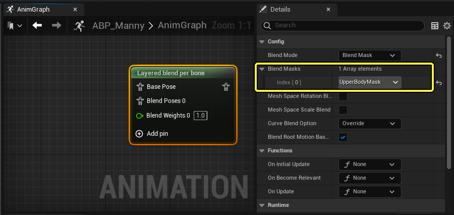
