使用混合遮罩和混合描述来屏蔽骨骼或者改变单个骨骼的混合速度。

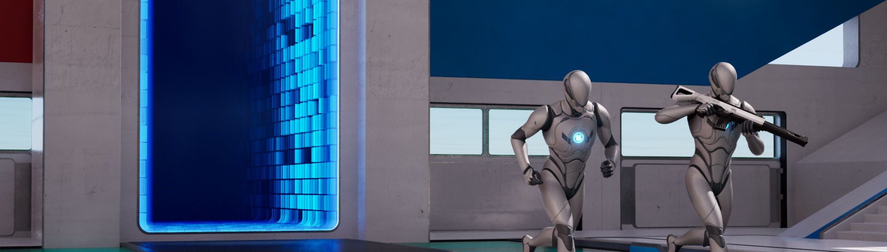

在创建复杂的动画逻辑时，有时会需要对动画混合施加更为细致的控制，而不是同时混合所有骨骼。**混合遮罩（Blend Masks）** 可以用于将骨骼排除在混合之外，而 **混合描述（Blend Profiles）** 用于控制不同骨骼的混合速度。这些额外的混合控制可以改进游戏动画的真实性和兼容性。

该页面介绍如何创建并使用混合遮罩和混合描述。

#### 先决条件

- 你的项目需要包含一个[骨骼网格体Actor](https://dev.epicgames.com/documentation/zh-cn/unreal-engine/skeletal-mesh-assets-in-unreal-engine)和[动画序列](https://dev.epicgames.com/documentation/zh-cn/unreal-engine/animation-sequences-in-unreal-engine).
    
- 你对于如何创建并使用[动画蓝图](https://dev.epicgames.com/documentation/zh-cn/unreal-engine/animation-blueprints-in-unreal-engine)有基本的了解。
    

## 混合遮罩

**混合遮罩（Blend Masks）** 可以添加至骨骼，用于定义权重的影响，从而部分或者完全阻止动画在特定的骨骼上播放。你可以在[每个骨骼的分层混合](https://dev.epicgames.com/documentation/zh-cn/unreal-engine/animation-blueprint-blend-nodes-in-unreal-engine#layeredblendperbone)上使用这个预设的定义来在特定骨骼上播放动画。

一个常见的混合遮罩的用例为排除下半身的骨骼，只让上半身的骨骼播放动画，忽视全身的状态。这对于武器相关的动画非常有用，可以让上半身在不考虑整个身体的状态下完成重装填、装备和射击等动作。

|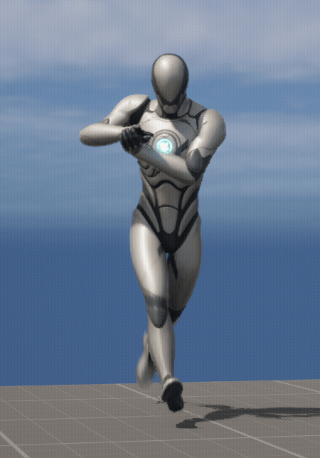|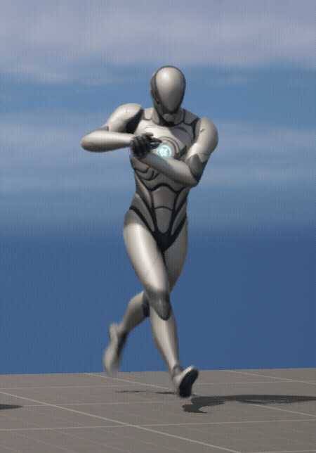|
|---|---|
|使用混合遮罩|不使用混合遮罩|

### 创建混合遮罩

你可以在骨骼网格体的[骨骼树](https://dev.epicgames.com/documentation/zh-cn/unreal-engine/blend-masks-and-blend-profiles-in-unreal-engine#headername)中创建混合遮罩。在骨骼树中点击 **选项（Options）** 下拉菜单然后选择 **添加混合遮罩（Add Blend Mask）**。将其命名然后按下 **回车（Enter）**。

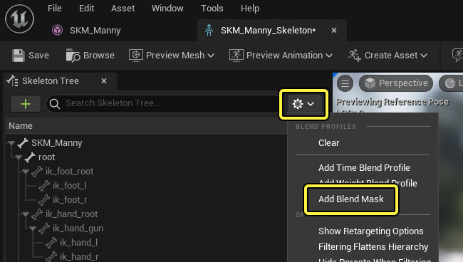

创建好后，一个 **混合列（Blend column）** 会出现在骨骼树中，显示所有的混合遮罩。如果有多个混合遮罩，你可以在**选项（Options）** 菜单中选择切换。

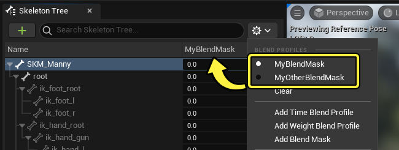

要删除当前查看的混合遮罩，点击骨骼树中的 **选项（Options）** 下拉菜单并选择清除。

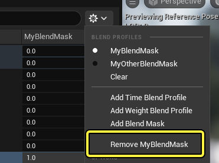

混合遮罩和混合描述都保存在[骨骼](https://dev.epicgames.com/documentation/zh-cn/unreal-engine/skeletons-in-unreal-engine)资产中。因此，创建或编辑混合遮罩便是对骨骼资产进行编辑。

### 编辑混合遮罩数值

混合列显示混合遮罩中每块骨骼的当前数值。每块骨骼都可以分配一个 **0 - 1** 之间的数值。**0** 意味着动画不会在该骨骼上播放，而 **1** 代表动画完全播放。

你可以通过在数值上拖动来启用滑块控制，也可以选中并直接输入数值。

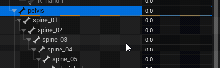

你可以将所有子级骨骼设为同样的数值，右键点击母级骨骼然后选择 **归递地将混合范围设为（Recursively Set Blend Scales）**，这样就可以将该混合数值应用到多个骨骼。

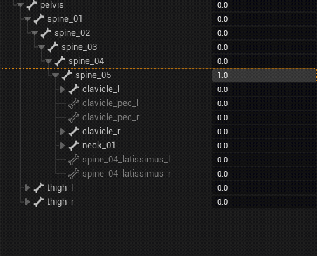

如果你找不到编辑混合遮罩数值的列，你可能需要右键点击顶部标签然后启用 **混合描述（Blend Profile）**。

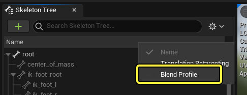

### 使用混合遮罩

创建并设置好混合遮罩后，就可以在[动画蓝图](https://dev.epicgames.com/documentation/zh-cn/unreal-engine/animation-blueprints-in-unreal-engine)中使用了。请将你的混合遮罩设置在动画图表的[每个骨骼的分层混合](https://dev.epicgames.com/documentation/zh-cn/unreal-engine/animation-blueprint-blend-nodes-in-unreal-engine#layeredblendperbone) 节点上。

在你的动画蓝图动画图表中，右键点击并创建一个 **每个骨骼的分层混合（Layered blend per bone）** 节点，然后在 **细节（Details）** 面板中设置以下属性：

- **混合模式（Blend Mode）** 设为 **混合遮罩（Blend Mask）**.
- **混合遮罩（Blend Masks）** 设为你的混合遮罩。

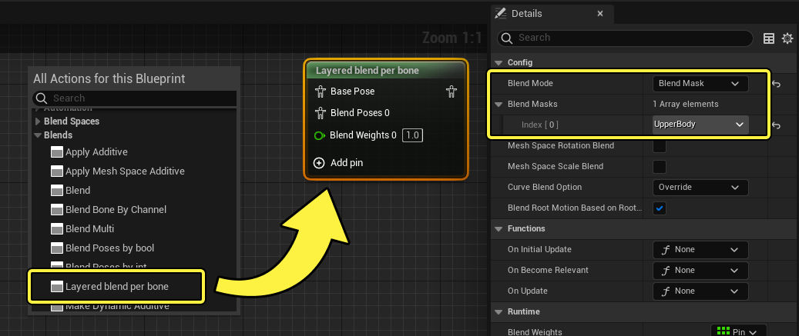

连接你的输入源基础和混合姿势，就可以看到混合遮罩正在运作。在这个示例中，我们使用了上半身混合遮罩。

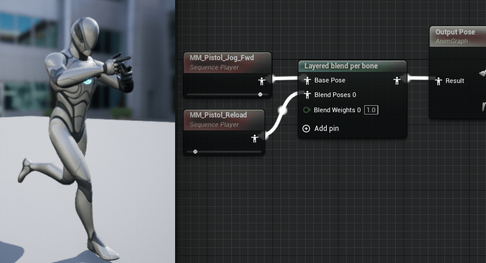

虽然同样的结果也可以通过在每个骨骼的分层混合节点上用默认的 **分支过滤（Branch Filter）** 混合模式来实现，混合遮罩可以让你更容易地在骨骼上重新使用这些遮罩值。

## 混合描述

**混合描述（Blend Profiles）** 可以添加至骨骼，用于定义每个骨骼的混合速度，从而让一些骨骼比其它的骨骼更快混合。混合描述可以在混合时使用以下方法：

- [按布尔混合姿势](https://dev.epicgames.com/documentation/zh-cn/unreal-engine/animation-blueprint-blend-nodes-in-unreal-engine#blendposesbybool).
- [按整型混合姿势](https://dev.epicgames.com/documentation/zh-cn/unreal-engine/animation-blueprint-blend-nodes-in-unreal-engine#blendposesbyint).
- [按枚举混合姿势](https://dev.epicgames.com/documentation/zh-cn/unreal-engine/animation-blueprint-blend-nodes-in-unreal-engine#blendposesbyenum).
- [状态机过渡](https://dev.epicgames.com/documentation/zh-cn/unreal-engine/transition-rules-in-unreal-engine).
- [动画蒙太奇](https://dev.epicgames.com/documentation/zh-cn/unreal-engine/animation-montage-in-unreal-engine).

混合描述的一个用例为让下半身比上半身更快混合，在静止和运动状态间过渡时非常有用。这样可以让角色在停止运动时，脚部看起来更加稳健地立在地面上，而从静止开始运动时，下半身的动作比上半身更早，看起来更加自然。

||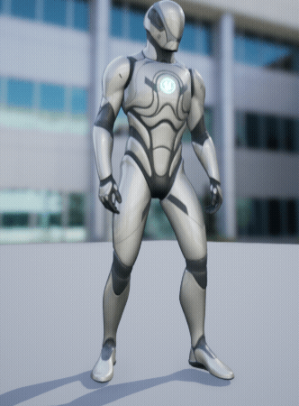|
|---|---|
|使用混合描述（腿部更快混合)|不使用混合描述|

与混合遮罩一样，混合描述也在骨骼树中[创建](https://dev.epicgames.com/documentation/zh-cn/unreal-engine/blend-masks-and-blend-profiles-in-unreal-engine#creatingblendmasks)、管理和[编辑](https://dev.epicgames.com/documentation/zh-cn/unreal-engine/blend-masks-and-blend-profiles-in-unreal-engine#editingblendmaskvalues)。点击骨骼树的 **选项（Options）** 下拉菜单然后选择 **添加时间混合描述（Add Time Blend Profile）** 或者 **添加权重混合描述（Add Weight Blend Profile）**。

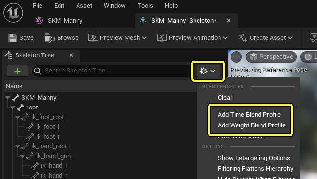

由于混合遮罩和混合描述的数值占据骨骼树中的同一列并且位于选项菜单的同一区域中，你应该确保它们命名明确以避免混淆。

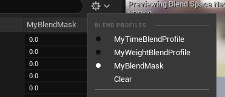

### 时间混合描述

**时间混合描述（Time Blend Profiles）** 在混合时使用归一化的 (0 - 1) 因数乘以基本的混合值。数值 **1.0** 意味着以正常速度混合，数值越小混合越快。数值 **0.0** 代表瞬间混合。

举个例子，如果如下进行设置：

- 骨盆和所有上半身骨骼设为 **1.0**。
- 腿和所有下半身骨骼设为 **0.5**。

这会导致腿部根据该混合描述的基本混合时间，以两倍的速度进行混合。如果将其在 **以布尔混合姿势（Blend Poses by bool）** 节点上使用，基本混合时间设为 **2.0** 秒，那么腿部只需要 **1.0** 秒来完成混合。其余所有设为 **1.0** 的骨骼仍然需要基础的 **2.0** 秒。

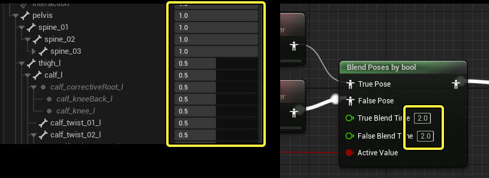

### 权重混合描述

**权重混合描述（Weight Blend Profiles）** 在混合时相对基本混合值使用权重因子。数值 **1.0** 将会以正常速度混合，数值越大，混合速度越快。

举个例子，如果如下进行设置：

- 骨盆和所有上半身骨骼设为 **1.0**。
- 腿和所有下半身骨骼设为 **2.0**。

这会导致腿部根据该混合描述的基本混合时间，以两倍的速度进行混合。数值 **2.0** 意味着 **两倍** 速度，**3.0** 则为 **三倍** 速度。

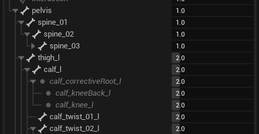

### 使用混合描述

创建并设置好混合描述后，可以用以下方式将其应用：

1. 使用 **动画蓝图动画图表（Animation Blueprint Anim Graph）** 的[混合姿势](https://dev.epicgames.com/documentation/zh-cn/unreal-engine/animation-blueprint-blend-nodes-in-unreal-engine#blendposesbyint)节点，选择节点并在 **细节（Details）** 面板找到 **混合配置（Blend Profile）** 属性。
    
    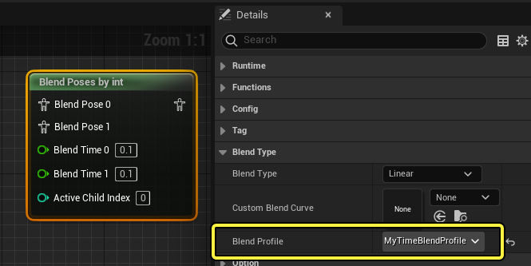
    
2. 使用[状态机过渡规则](https://dev.epicgames.com/documentation/zh-cn/unreal-engine/transition-rules-in-unreal-engine)，选择 **过渡规则（transition rule）** 并在 **细节（Details）** 面板中找到 **混合配置（Blend Profile）** 属性。
    
    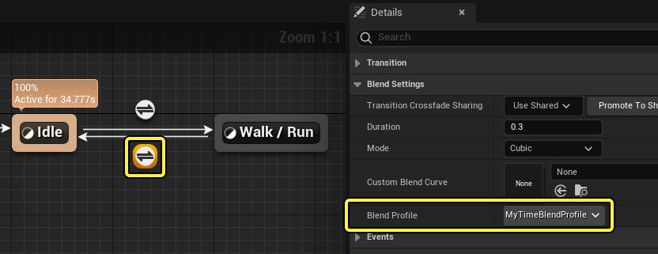
    
3. 在[动画蒙太奇](https://dev.epicgames.com/documentation/zh-cn/unreal-engine/animation-montage-in-unreal-engine)编辑器中，可以使用 **资产详情（Asset Details）** 面板中的 **混入描述（Blend Profile In）** 和 **混出描述（Blend Profile Out）** 属性来为蒙太奇的混合设置不同的混合描述。
    
    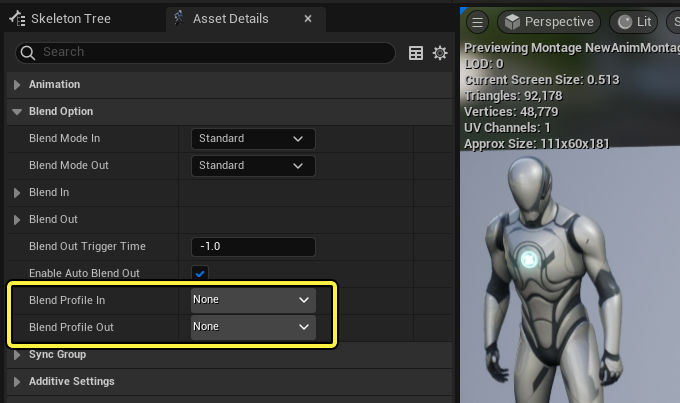
    

- [animation](https://dev.epicgames.com/community/search?query=animation)
- [sequencer](https://dev.epicgames.com/community/search?query=sequencer)