使用同步组同步不同长度的动画周期。

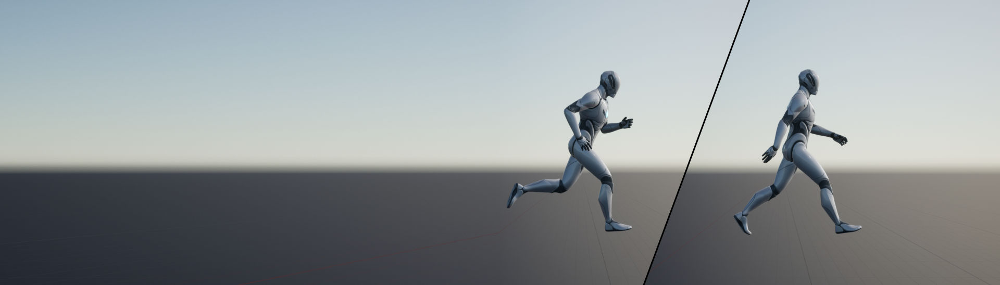

**同步组（Sync Groups）** 可用于在混合过程中自动同步相关动画的长度和播放，从而改善 **动画蓝图（Animation Blueprints）** 中的混合行为。在混合拥有不同长度周期的步行和跑步动画时，这很有用。如果没有同步组，直接从一个周期混合到另一个周期可能会导致效果不自然，因为脚的落点可能不同步。

本文档概述了动画蓝图中的同步组系统。

#### 先决条件

- 在[动画蓝图](https://dev.epicgames.com/documentation/zh-cn/unreal-engine/animation-blueprints-in-unreal-engine)中创建和管理同步组，因此你应该具备使用此编辑器的基本知识。

## 概述

同步组使用角色概念，其中一个动画是 **领导者**，而所有其他动画都是 **跟随者**。领导者提供所有跟随者使用的主动画长度，并优先触发[动画通知](https://dev.epicgames.com/documentation/zh-cn/unreal-engine/animation-notifies-in-unreal-engine)。跟随者将他们的动画长度与领导者匹配，并抑制他们的通知。

默认情况下，在混合期间，领导者和跟随者的分配可以根据权重分布变更。具有最高混合影响的动画被视为领导者。

|图像|说明|
|---|---|
|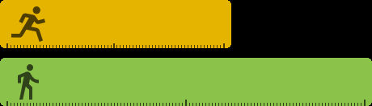|例如，你可以比较步行和跑步周期动画。通常，这些动画的长度可能不匹配。如果没有同步组，这些动画的一般身体运动周期将不会对齐。|
||使用同步组并且 **跑步周期作为领导者** 时，这将使得步行周期调整其播放速度以便匹配领导者。在这种情况下，步行周期会缩短，以加快播放速度匹配跑步周期。|
|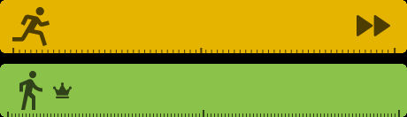|使用同步组并且 **步行周期作为领导者** 时，这将使得跑步周期调整其播放速度以便匹配领导者。在这种情况下，跑步周期会缩短，以放慢播放速度匹配步行周期。|

鉴于将动画与同步组同步的性质，以这种方式使用动画时应考虑某些动画限制：

- 确保所有正在同步的动画从开始到结束都具有相同的常规身体运动。对于步行和跑步动画，这可能意味着确保在开始帧和结束帧放相同的脚。
    
    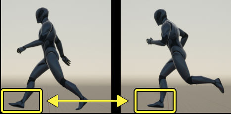
- 你还要确保正在混合的动画之间没有明显的长度差异。这可能会导致某些动画的播放速度明显快于其他动画，并在领导者和跟随者动画切换时，导致明显的播放率"爆发"。
    

### 同步设置

以多种方式同步动画时，你可以使用 **细节（Details）** 面板中的以下设置编辑行为。

|名称|说明|
|---|---|
|**组名称（Group Name）**|定义同步组的名称。通常，你希望所有旨在混在一起的相关动画（例如潜行、步行、跑步、冲刺的身体动作）具有相同的名称，从而使它们位于同一个同步组中。|
|**组角色**|为此动画指定某些领导者和跟随者规则。你可以从以下选项中进行选择：  - **可以是领导者（Can be Leader）** ，这是默认行为，选中时，只要这个动画有最高的混合权重，它就会成为领导者。 - **始终是跟随者（Always Follower）** ，这会使得此动画始终跟随同步组领导者。如果所有动画都设置为此，则评估的第一个动画将设置为领导者。 - **始终是领导者（Always Leader）** ，这会使得此动画始终是领导者。如果组中的多个动画设置为此选项，则最后评估的动画将设置为领导者。 - **过渡领导者（Transition Leader）** ，这会使得此动画在混入时排除在同步之外。混入后，它将在混出时成为同步组领导者。 - **过渡跟随者（Transition Follower）** ，这会使得此动画在混入时排除在同步之外。混入后，它将在混出时成为跟随者。|
|**方法**|定义如何确定同步。你可以从以下选项中进行选择：  - **不同步（Do Not Sync）** ，这是默认设置，不会发生动画同步。 - **同步组（Sync Group）** ，将启用[基于组的同步](https://dev.epicgames.com/documentation/zh-cn/unreal-engine/animation-sync-groups-in-unreal-engine#%E5%9F%BA%E4%BA%8E%E7%BB%84%E7%9A%84%E5%90%8C%E6%AD%A5)。 - **图表（Graph）** ，将启用[基于图表的同步](https://dev.epicgames.com/documentation/zh-cn/unreal-engine/animation-sync-groups-in-unreal-engine#%E5%9F%BA%E4%BA%8E%E5%9B%BE%E8%A1%A8%E7%9A%84%E5%90%8C%E6%AD%A5)。|

## 同步组类型

有多种设置同步组的方法，你可以从以下类型中进行选择。

### 基于组的同步

**基于组的同步（Group-Based Syncing）** 按名称将动画分组。要创建基于组的同步组，请在 **AnimGraph** 中选择要同步的动画节点，然后在 **细节（Details）** 面板中找到 **同步（Sync）** 类别。设置以下属性：

- 将 **方法（Method）** 设置为 **同步组（Sync Group）** 。
    
- 在 **组名称（Group Name）** 中输入名称。**组名称（Group Name）** 必须与你要同步的所有动画相匹配。
    

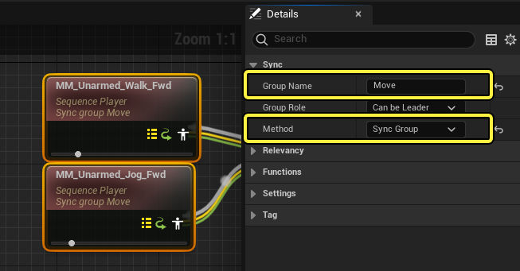

现在你的动画会在混合时同步。通过将动画连接到 **Blend** 节点，并将 **Alpha** 设置为0.5，你可以预览此行为。

|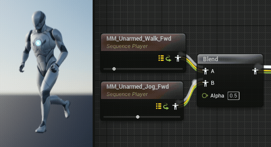|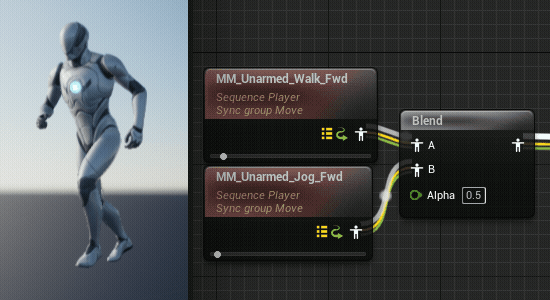|
|---|---|
|同步组关闭|同步组打开|

将同步组与动画节点一起使用时，节点将显示同步方法的文本水印和组名称。

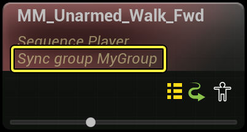

### 基于标识的同步

除了同步组之外，你还可以使用动画序列中的 **同步标识（Sync Markers）** 同步动画。这样动画的播放将基于沿动画时间轴放置的标识之间的播放相对位置同步。

这对于各种混合条件很有用：

- 当常规身体运动的步数不匹配时。例如，混合跑步周期时，右脚接触地面四次，而步行周期脚只接触地面两次。
- 当步幅不同时。例如，将时间严格的行军步行动画混合到时间松散的争夺跑步动画时。
- 当与非循环动画混合时，例如跑步和步行开始和停止。此外，在这种情况下，开始和停止动画应设置为 **始终为领导者（Always Leader）** 。

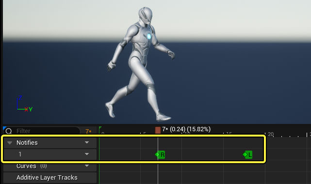

要添加同步标识，请在[动画通知](https://dev.epicgames.com/documentation/zh-cn/unreal-engine/animation-notifies-in-unreal-engine)时间轴内点击鼠标右键，并选择 **添加同步标识...（Add Sync Marker...）**> **新同步标识…（New Sync Marker…）**。然后，输入同步标识的名称，然后按 **Enter**。

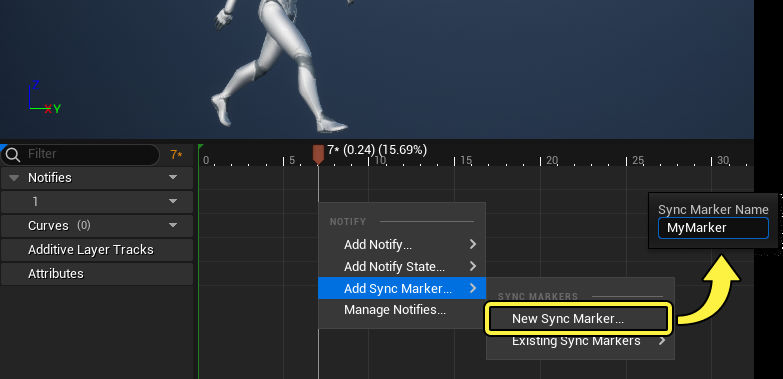

添加同步标识后，它将保存到骨架中。添加后，你可以轻松地在不同动画上重复使用同步标识名称，确保使用并标准化相同名称。若要添加保存的同步标识（Saved Sync Markers），右键点击通知时间轴并选择 **添加同步标识...（Add Sync Marker...）**> **现有同步标识（Existing Sync Markers）**，然后从列表中选择同步标识（Sync Marker）。

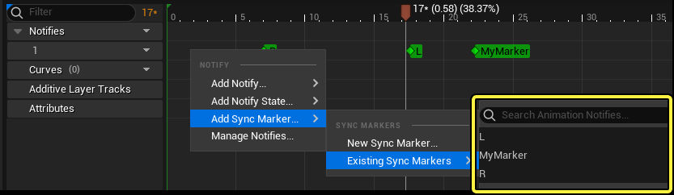

如果动画在同一个[同步组](https://dev.epicgames.com/documentation/zh-cn/unreal-engine/animation-sync-groups-in-unreal-engine#%E5%9F%BA%E4%BA%8E%E7%BB%84%E7%9A%84%E5%90%8C%E6%AD%A5)中，同步标识只会与其他标识同步。这意味着，你必须确保同步标识和同步组名称匹配。

[动画蒙太奇](https://dev.epicgames.com/documentation/zh-cn/unreal-engine/animation-montage-in-unreal-engine)还支持混出时基于标识同步，因此你可以无缝过渡回其他动画。在动画蒙太奇编辑器中，找到 **资产细节面板（Asset Details Panel）** 中的 **同步组（Sync Group）** 属性，编辑相关的同步属性。

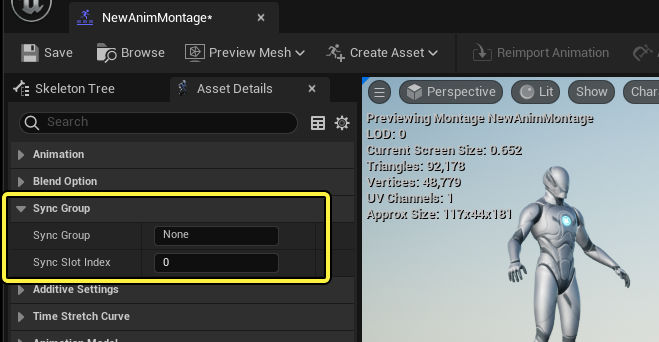

使用同步标识时要考虑的其他元素是：

- 仅同步组内所有动画共有的标识。例如，如果一个动画缺少"右脚向下"标识，那么在确定该帧的位置时，所有动画都会忽略这些标识。
- 同步组中的动画具有匹配标识时，会自动使用基于标识的同步。否则，系统将回退到正常的长度同步行为。

### 基于图表的同步

在构建复杂的动画蓝图时，管理基于名称的同步组可能会变得乏味。你可以改为使用 **基于图表的同步（Graph-Based Syncing）** 将单个同步组传播到各种子图表和子节点。基于图表的同步需要将子节点和图表的 **方法（Method）** 属性设置为 **图表（Graph）** 。

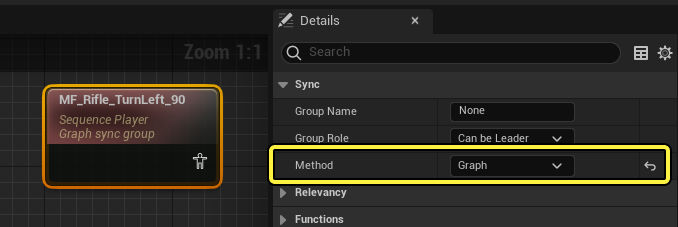

使用基于图表的同步的第一种方法是创建 **同步（Sync）** 节点。此节点将同步行为传播到其 **方法（Method）** 属性设置为 **图表（Graph）** 的所有传入姿势节点。要将同步节点添加到图表中，请右键点击并从 **杂项（Misc.）** 类别中选择 **同步（Sync）** 。

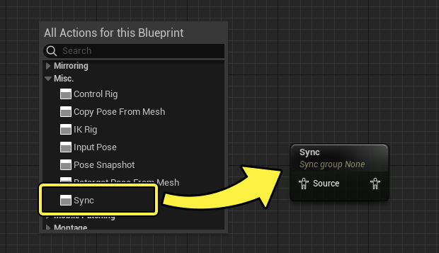

通常，你可能希望将此节点放置在姿势逻辑之后，以便它可以同步所有传入的动画数据。

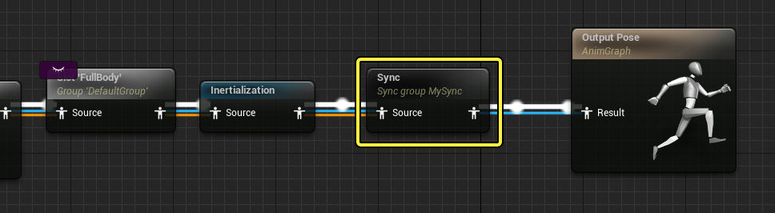

#### 混合空间图表

除了同步节点外，[混合空间图表](https://dev.epicgames.com/documentation/zh-cn/unreal-engine/blend-spaces-in-animation-blueprints-in-unreal-engine#%E6%B7%B7%E5%90%88%E7%A9%BA%E9%97%B4%E5%9B%BE%E8%A1%A8)还提供了图表同步功能。这将使得同步行为传播到图表中的所有子样本。

与同步节点类似，混合空间图表需要 **组名称（Group Name）** 才能传播同步行为。

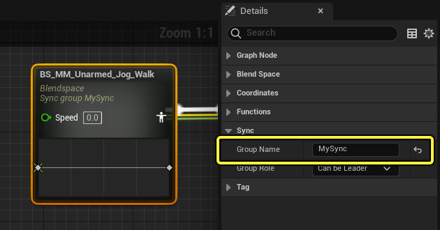

默认情况下，在混合空间图表（Blend Space Graph）示例中生成的 **序列玩家（Sequence Players）** 将默认使用 **图表（Graph）** 同步方法，以便接受来自混合空间图表（Blend Space Graph）节点的同步。

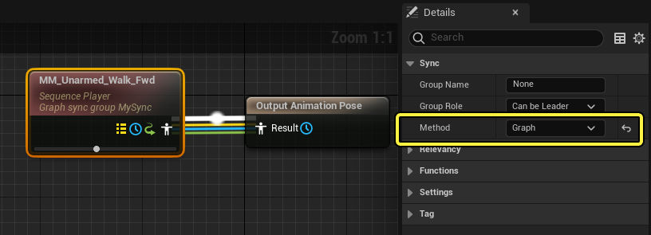