# 动画插槽

在动画图表中添加插入点来使用插槽播放动画。

为角色创建复杂的动画时，可能需要在动画蓝图中创建代理区域用来插入一次性的动画。为此可以使用 **插槽（Slots）**，这是一种可以添加至动画蓝图各处的节点，用于叠加并播放动画。插槽通常和[动画蒙太奇](https://dev.epicgames.com/documentation/zh-cn/unreal-engine/animation-montage-in-unreal-engine)一起使用，但也可以与[Sequencer](https://dev.epicgames.com/documentation/zh-cn/unreal-engine/cinematics-and-movie-making-in-unreal-engine)一起使用。

该文档介绍如何在动画蓝图、蒙太奇以及Sequencer中创建并使用动画插槽。

#### 先决条件

- 你应该熟悉如何[在动画蓝图中绘制动画图表](https://dev.epicgames.com/documentation/zh-cn/unreal-engine/graphing-in-animation-blueprints-in-unreal-engine)。

## 概览

动画插槽主要用于在动画蓝图中插入动画，可以在使用[动画蒙太奇]时(animating-characters-and-objects/SkeletalMeshAnimation/AssetsFeatures/AnimMontage)插入单次动画，比如射击和与物体互动等。插槽也可以和混合节点一起使用来只让角色中特定的骨骼播放动画，比如上半身或者手臂。

在这个示例中，插槽有两种用法：

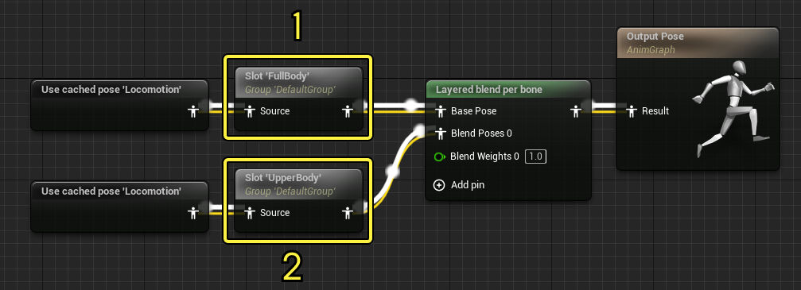

1. **全身插槽（Full Body Slot）** 置于主要运动的[状态机](https://dev.epicgames.com/documentation/zh-cn/unreal-engine/state-machines-in-unreal-engine)之后，可以以覆盖的形式插入动画。该插槽可以用于全身的互动动作或者表情动作。
    
2. **上半身插槽（Upper Body Slot）** 与[每个骨骼的分层混合](https://dev.epicgames.com/documentation/zh-cn/unreal-engine/animation-blueprint-blend-nodes-in-unreal-engine#layeredblendperbone)节点搭配使用，来移除下半身的动画，只让上半身运动。该插槽可以用于武器重装填、射击或者其它不受角色运动状态影响的动画。
    

## 创建和管理插槽

插槽通过 **动画插槽管理器（Anim Slot Manager）** 来创建并管理，该面板可以在 **动画蓝图（Animation Blueprint）**，**骨骼（Skeleton）** 或者 **动画序列（Animation Sequence）** 编辑器中打开。在任何一个编辑器中，打开主菜单中的 **窗口（Window） > 动画插槽管理器（Anim Slot Manager）**，

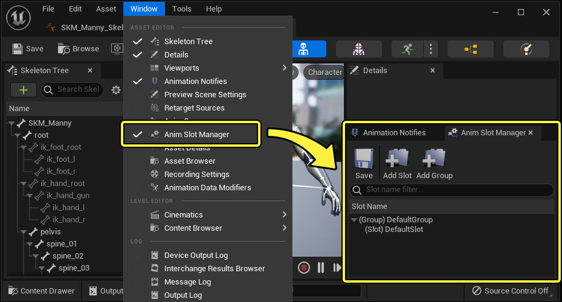

默认情况下，所有的骨骼都有一个初始的插槽 **DefaultSlot**。要添加新的插槽，点击 **添加插槽（+）（Add Slot (+)）**，为插槽命名，然后按下 **回车**。

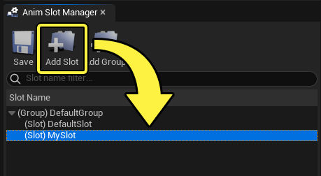

不管你使用哪一个动画编辑器，插槽都会保存在[骨骼](https://dev.epicgames.com/documentation/zh-cn/unreal-engine/skeletons-in-unreal-engine)资产中，所以在创建和修改插槽时，便是对骨骼进行更改。更改插槽后，点击动画插槽管理器中的 **保存（Save）** 会保存整个骨骼。

右键点击动画插槽管理器的空白区域或者其列表中的插槽会显示以下菜单选项：

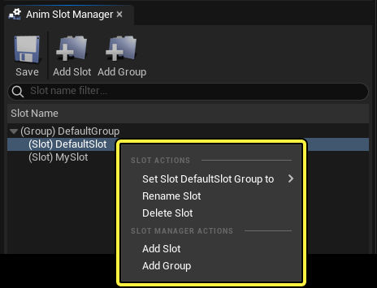

|名称|描述|
|---|---|
|**设置插槽组至（Set Slot Group to）**|如果有插槽组，将选中的插槽移至不同的[插槽组](https://dev.epicgames.com/documentation/zh-cn/unreal-engine/animation-slots-in-unreal-engine#slotgroups)。|
|**重命名插槽（Rename Slot）**|重命名选中的插槽。|
|**删除插槽（Delete Slot）**|删除选中的插槽。|
|**添加插槽（Add Slot）**|创建新的插槽。|
|**添加组（Add Group）**|创建新的[插槽组](https://dev.epicgames.com/documentation/zh-cn/unreal-engine/animation-slots-in-unreal-engine#slotgroups).|

## 使用插槽

在开始使用插槽之前，必须先确保它们添加到了你的[动画蓝图](https://dev.epicgames.com/documentation/zh-cn/unreal-engine/animation-blueprints-in-unreal-engine)当中。

在动画图表中，右键点击然后添加 **插槽'DefaultSlot'（Slot 'DefaultSlot'）** 节点。

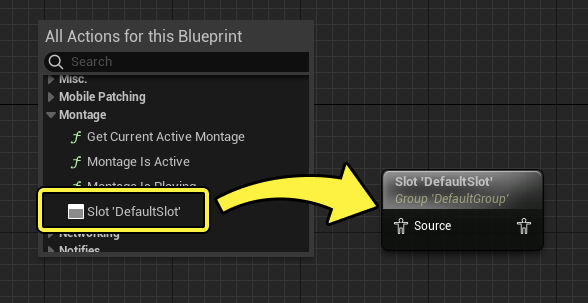

默认情况下，新创建的插槽节点会命名为 **DefaultSlot**。要更改名称，选中节点然后在 **细节（Details）** 面板中将 **插槽名称（Slot Name）** 属性改为你想要的插槽。

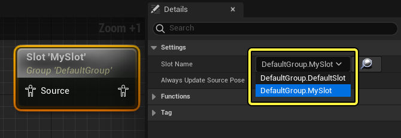

插槽支持输入源姿势链接，并且在没有插入动画的时候让输入动画直接通过。只有当插槽中播放自己的动画时才会覆盖输入的动画。

输入动画被覆盖时，它将不再更新。你可以在插槽的 **细节（Details）** 面板中启用 **固定更新源姿势（Always Update Source Pose）** 来保证源姿势持续更新。

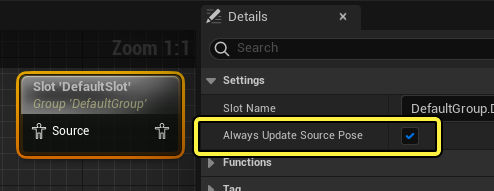

### 在动画蒙太奇中使用

[动画蒙太奇](https://dev.epicgames.com/documentation/zh-cn/unreal-engine/animation-montage-in-unreal-engine) 需要动画图表中有插槽才能运行，因为它们只使用插槽播放动画。在这个示例中，动画蒙太奇将会把该动画应用到 **上半身插槽（Upper Body Slot）**。

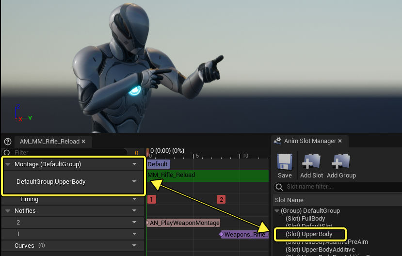

要在蒙太奇中更改或添加插槽，点击插槽轨道上的插槽下拉菜单来查看以下选项：

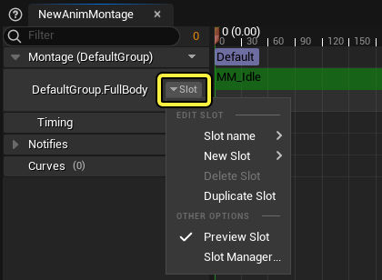

|名称|描述|
|---|---|
|**槽位名称（Slot name）**|打开一个菜单用于选择当前插槽。如果使用的是最顶端的插槽轨道，那么选择其它[插槽组](https://dev.epicgames.com/documentation/zh-cn/unreal-engine/animation-slots-in-unreal-engine#slotgroups)的插槽将会更改蒙太奇的插槽组。|
|**新建插槽（New Slot）**|使用已有的插槽创建一个新的插槽轨道。|
|**删除插槽（Delete Slot）**|删除插槽。|
|**复制插槽（Duplicate Slot）**|将插槽轨道及其内容复制到一个新的插槽轨道。|
|**预览插槽（Preview Slot）**|如果有多个插槽轨道，启用该项后会让该插槽中的内容在视口中预览。|
|**插槽管理器（Slot Manager）**|打开[插槽管理器](https://dev.epicgames.com/documentation/zh-cn/unreal-engine/animation-slots-in-unreal-engine#creatingandmanagingslots)面板。|

一个蒙太奇可以同时播放多个插槽上的动画，但是它们必须在同一个[插槽组](https://dev.epicgames.com/documentation/zh-cn/unreal-engine/animation-slots-in-unreal-engine#slotgroups)中。

参考[动画蒙太奇](https://dev.epicgames.com/documentation/zh-cn/unreal-engine/animation-montage-in-unreal-engine)页面来了解更多关于如何使用动画蒙太奇的信息。

[动画蒙太奇](https://dev.epicgames.com/documentation/zh-cn/unreal-engine/animation-montage-in-unreal-engine)

[动画蒙太奇动画资产可以用于将动画合并至一个资产并通过蓝图控制播放。](https://dev.epicgames.com/documentation/zh-cn/unreal-engine/animation-montage-in-unreal-engine)

### 在Sequencer中使用

插槽也可以在[Sequencer](https://dev.epicgames.com/documentation/zh-cn/unreal-engine/cinematics-and-movie-making-in-unreal-engine)中使用，Sequencer是虚幻引擎的过场动画和影视制作工具。可以在Sequencer中使用插槽将过场动画插入动画蓝图，从而在角色动画中添加更多逻辑。

插槽用于[动画轨道](https://dev.epicgames.com/documentation/zh-cn/unreal-engine/cinematic-animation-track-in-unreal-engine)中的动画。要使插槽中的动画播放，右键点击一个动画分段并找到 **属性（Properties） > 槽位名称（Slot Name）**。输入要插入的插槽的名称。

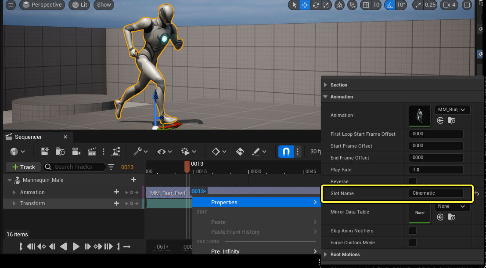

一个常见的在Sequencer中使用插槽的用例为将过场动画和游戏动画混合在一起。更多信息可以参考[混合Gameplay和Sequencer动画](https://dev.epicgames.com/documentation/zh-cn/unreal-engine/blend-gameplay-animation-to-cinematic-animation-in-unreal-engine)页面。

[混合Gameplay和Sequencer动画](https://dev.epicgames.com/documentation/zh-cn/unreal-engine/blend-gameplay-animation-to-cinematic-animation-in-unreal-engine)

[使用动画蓝图和插槽将角色和摄像机动画从Sequencer无缝混合到Gameplay。](https://dev.epicgames.com/documentation/zh-cn/unreal-engine/blend-gameplay-animation-to-cinematic-animation-in-unreal-engine)

## 插槽组

除了插槽以外，你还可以创建插槽组来组织和控制[动画蒙太奇](https://dev.epicgames.com/documentation/zh-cn/unreal-engine/animation-montage-in-unreal-engine)中插槽动画的播放。

你的骨骼会默认包含一个 **DefaultGroup** 插槽组。要创建其它的插槽组，点击 **动画插槽管理器（Anim Slot Manager）** 中的 **添加组（+）（Add Group (+)）**，输入插槽组的名称，然后按下 **回车**。

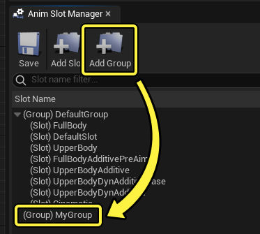

右键点击已有的插槽，选择 **设置插槽组至（Set Slot Group to）** 可以将其移动到其它的插槽组中。

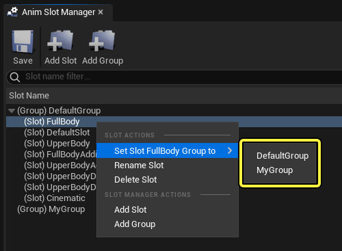

插槽组不仅仅用于分类。当一个插槽正在运行时，再播放使用同组插槽的蒙太奇，正在运行的那个插槽便会被中断。这种自动的模式可以用于打断蒙太奇。例如，武器重装填动画蒙太奇可以被使用技能或者进战攻击的动画蒙太奇所打断。如果多个蒙太奇播放同插槽组中插槽上的动画，最近的蒙太奇则会打断前一个。

了解更多如何在动画蒙太奇中使用插槽，参考[动画蒙太奇](https://dev.epicgames.com/documentation/zh-cn/unreal-engine/animation-montage-in-unreal-engine#slotsandslotgroups)页面。

