# 动画曲线

使用动画曲线为材质参数、变形目标和同步到动画的其他属性制作动画。

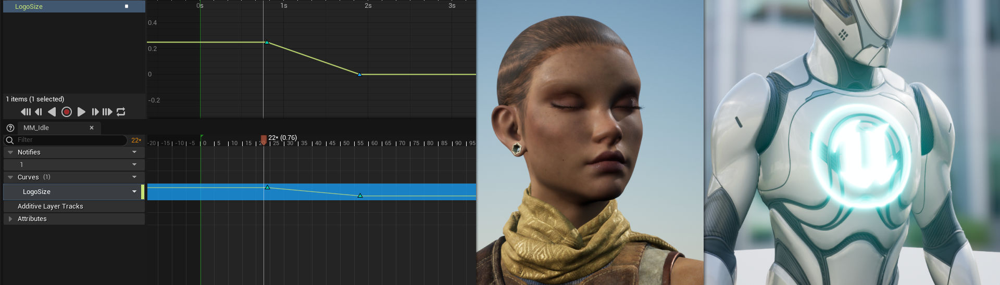

你在 **骨骼网格体** 上播放[动画序列](https://dev.epicgames.com/documentation/zh-cn/unreal-engine/animation-sequences-in-unreal-engine)时，需要对同步到该动画的额外属性和值制作动画。你可以使用 **动画曲线** （也称为 **anim曲线** 或 **曲线** ）完成此操作，这些曲线是你可以在动画序列中添加和设为关键帧的浮点类型值。曲线很适合通过具有动画动作的额外属性增强你的动画，例如对[材质参数](https://dev.epicgames.com/documentation/zh-cn/unreal-engine/instanced-materials-in-unreal-engine)、[变形目标](https://dev.epicgames.com/documentation/zh-cn/unreal-engine/fbx-morph-target-pipeline-in-unreal-engine)和其他属性制作动画。

本文档提供了关于动画曲线及其各种用法的概述。

#### 先决条件

- 你的项目包含[骨骼网格体](https://dev.epicgames.com/documentation/zh-cn/unreal-engine/skeletal-mesh-assets-in-unreal-engine)和[动画序列](https://dev.epicgames.com/documentation/zh-cn/unreal-engine/animation-sequences-in-unreal-engine)。
- 如果你使用动画曲线来影响 **材质参数** ，你需要对[材质实例化](https://dev.epicgames.com/documentation/zh-cn/unreal-engine/instanced-materials-in-unreal-engine)有基本的了解。
- 如果你使用动画曲线来影响 **变形目标** ，你需要对如何在骨骼网格体上设置[变形目标](https://dev.epicgames.com/documentation/zh-cn/unreal-engine/fbx-morph-target-pipeline-in-unreal-engine)有基本的了解。

## 创建动画曲线

动画曲线可以按以下方式创建：

1. 在[动画序列编辑器](https://dev.epicgames.com/documentation/zh-cn/unreal-engine/animation-sequence-editor-in-unreal-engine)中查看 **动画序列** 时，点击 **曲线（Curves）** 轨道下拉菜单并选择 **添加曲线…（Add Curve…）> 创建曲线（Create Curve）** 。输入新曲线的名称并按 **Enter** 键来创建曲线。
    
    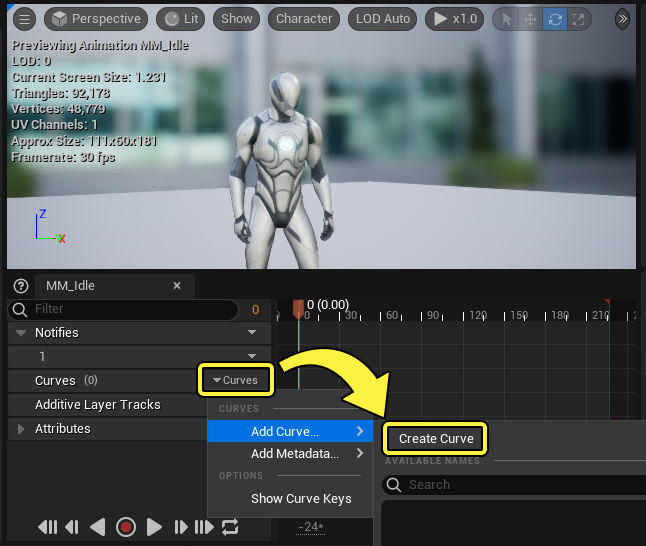
    
2. 在[动画曲线面板](https://dev.epicgames.com/documentation/zh-cn/unreal-engine/animation-curves-in-unreal-engine#%E5%8A%A8%E7%94%BB%E6%9B%B2%E7%BA%BF%E9%9D%A2%E6%9D%BF)，右键点击 **曲线列表区域** 并选择 **添加曲线（Add Curve）** 。输入新曲线的名称并按 **Enter** 键来创建曲线。
    
    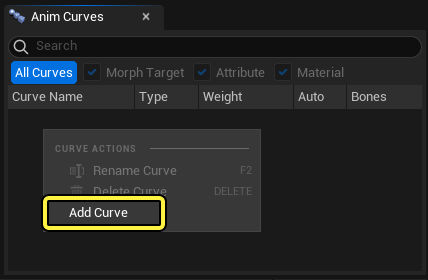
    
3. 如果你的骨架已有曲线，你可以从 **曲线（Curves）> 添加曲线…（Add Curve…）** 下拉菜单选择曲线。
    
    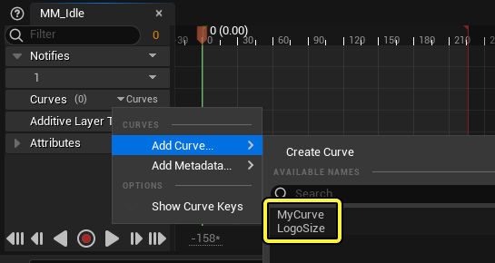
    

动画曲线存储在 **骨架资产（Skeleton Asset）** 上。因此，当你创建曲线时，你还会编辑[骨架](https://dev.epicgames.com/documentation/zh-cn/unreal-engine/skeletons-in-unreal-engine)，这需要你进行保存。

## 创建曲线动画

创建动画曲线并将其添加到动画序列后，可以对其值制作动画。选择动画曲线轨道上的 **曲线（Curve）** 下拉菜单并点击 **编辑曲线（Edit Curve）** 。这将打开[曲线编辑器](https://dev.epicgames.com/documentation/zh-cn/unreal-engine/animation-curve-editor-in-unreal-engine)。

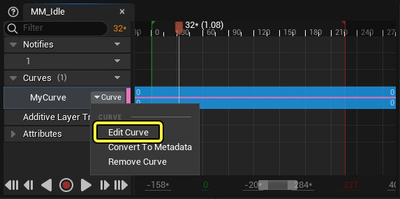

你还可以双击特定曲线轨道的 **时间轴区域** 来打开曲线编辑器。

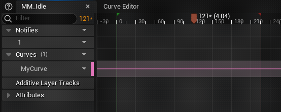

曲线编辑器打开后，你可以按 **Enter** 键创建关键帧。这将在 **播放头** 位置创建关键帧，拖动该位置可移动，将关键帧设置在序列上的其他时间。你可以点击并拖动关键帧来更改其时间和值。

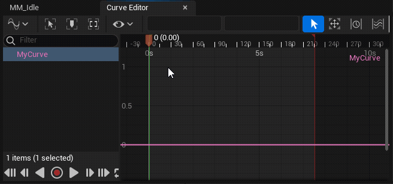

请参阅[曲线编辑器](https://dev.epicgames.com/documentation/zh-cn/unreal-engine/animation-curve-editor-in-unreal-engine)页面，详细了解导航、关键帧以及使用曲线编辑器进行切线编辑。

[曲线编辑器](https://dev.epicgames.com/documentation/zh-cn/unreal-engine/animation-curve-editor-in-unreal-engine)

[使用曲线编辑器及其中的工具调整关键帧和曲线。](https://dev.epicgames.com/documentation/zh-cn/unreal-engine/animation-curve-editor-in-unreal-engine)

## 动画曲线面板

你创建和存储的曲线可以在 **动画曲线（Anim Curves）** 面板中查看和管理。要查看此面板，请找到编辑器主菜单并启用 **窗口（Window）> 动画曲线（Anim Curves）** 。动画曲线（Anim Curve）面板只能从[骨架编辑器](https://dev.epicgames.com/documentation/zh-cn/unreal-engine/skeleton-editor-in-unreal-engine)、[动画序列编辑器](https://dev.epicgames.com/documentation/zh-cn/unreal-engine/animation-sequence-editor-in-unreal-engine)或[动画蓝图编辑器](https://dev.epicgames.com/documentation/zh-cn/unreal-engine/animation-blueprint-editor-in-unreal-engine)查看。

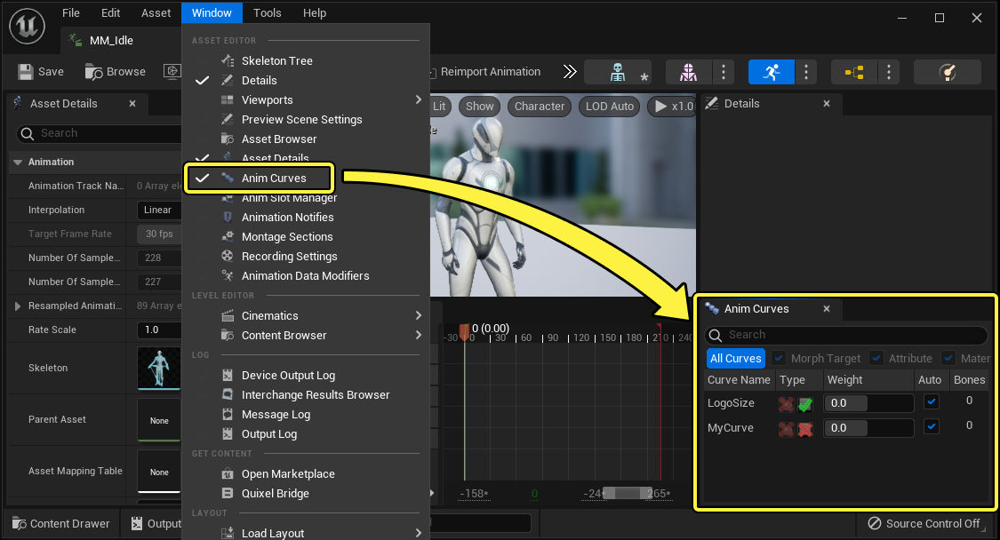

### 曲线管理

你可以在动画曲线（Anim Curve）面板中的曲线条目上调整多个设置和功能。

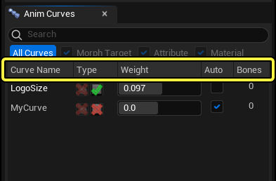

|名称|说明|
|---|---|
|**曲线名称（Curve Name）**|曲线的名称。你可以右键点击动画曲线（Anim Curve）面板并选择 **重命名曲线（Rename Curve）** 来重命名曲线。  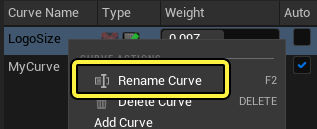|
|**类型（Type）**|允许将此曲线用于[变形目标](https://dev.epicgames.com/documentation/zh-cn/unreal-engine/animation-curves-in-unreal-engine#%E5%8F%98%E5%BD%A2%E7%9B%AE%E6%A0%87)或[材质](https://dev.epicgames.com/documentation/zh-cn/unreal-engine/animation-curves-in-unreal-engine#%E6%9D%90%E8%B4%A8)。|
|**权重（Weight）**|曲线的当前值。|
|**自动（Auto）**|启用此项将在此序列中制作曲线动画时导致 **权重（Weight）** 值根据其设为关键帧的值自动更改。如果禁用此项，将忽略其动画值。禁用此项很适合测试曲线值如何影响角色，而不用将其设为关键帧。  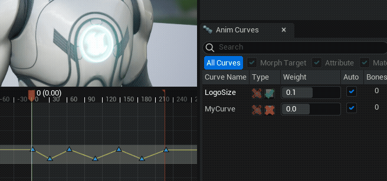|
|**骨骼（Bones）**|[连接](https://dev.epicgames.com/documentation/zh-cn/unreal-engine/animation-curves-in-unreal-engine#%E6%9B%B2%E7%BA%BF%E7%BB%86%E8%8A%82)到此曲线的骨骼数量。|

### 曲线筛选

你可以在动画曲线（Anim Curves）面板中筛选曲线列表，以仅显示常用的曲线，或者仅显示特定类型的曲线。

- 禁用 **所有曲线（All Curves）** 将导致仅显示此动画序列当前使用的曲线。
- 禁用 **变形目标（Morph Target）** 、 **属性（Attribute）** 和 **材质（Material）** 曲线将禁止显示这些曲线类型。

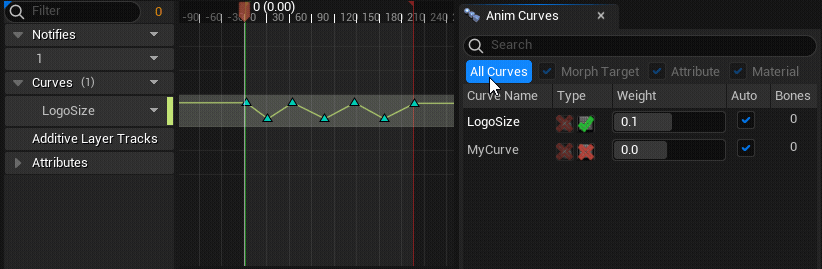

### 曲线细节

选择曲线将在 **细节（Details）** 面板中显示以下属性。

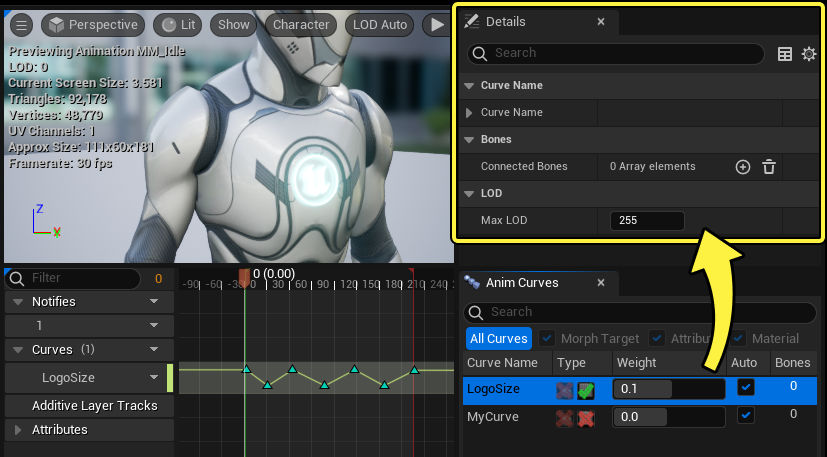

|名称|说明|
|---|---|
|**曲线名称（Curve Name）**|曲线的名称。|
|**连接的骨骼（Connected Bones）**|你可以连接到此曲线一组骨骼。如果你希望根据骨骼是否被使用而激活特定曲线，这会很有用。你可以根据是否[合并不同的骨架](https://dev.epicgames.com/documentation/zh-cn/unreal-engine/skeletons-in-unreal-engine#%E5%AF%BC%E5%85%A5%E6%9C%9F%E9%97%B4%E5%90%88%E5%B9%B6)或者是否针对不同的LOD[减少](https://dev.epicgames.com/documentation/zh-cn/unreal-engine/skeletal-mesh-lods-in-unreal-engine#%E5%87%8F%E5%B0%91%E9%AA%A8%E9%AA%BC)骨骼来激活或不激活骨骼。|
|**最大LOD（Max LOD）**|此曲线可使用的最大[LOD](https://dev.epicgames.com/documentation/zh-cn/unreal-engine/skeletal-mesh-lods-in-unreal-engine)，超过此限后将不再求值。例如，将此值设置为 **1** 会导致此曲线针对LOD 0和1求值，但针对2及更高的值不求值。|

## 使用动画曲线

创建曲线并对其制作动画后，你可以通过各种方式使用该曲线来影响角色。

### 材质

你可以使用动画曲线自动影响[标量材质参数](https://dev.epicgames.com/documentation/zh-cn/unreal-engine/instanced-materials-in-unreal-engine#%E6%A0%87%E9%87%8F%E5%8F%82%E6%95%B0)。这需要你执行以下操作：

1. 将曲线名称与材质中材质参数的名称相匹配。
    
    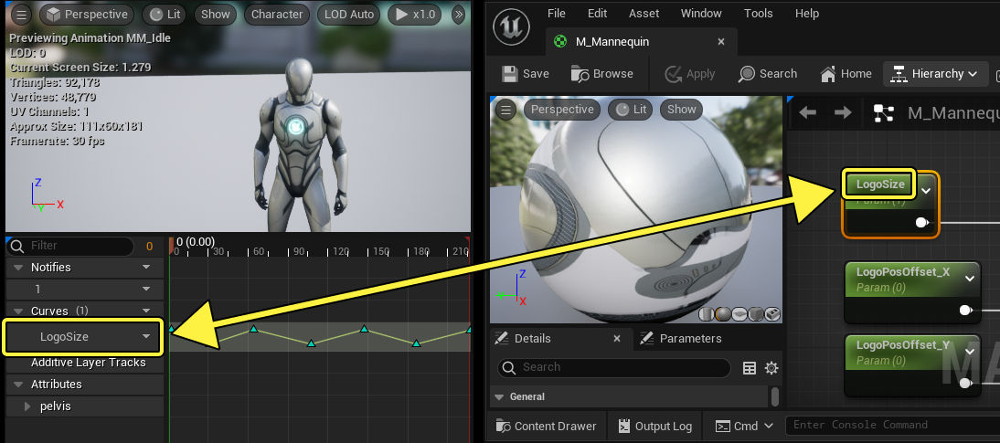
    
2. 在 **动画曲线（Anim Curves）** 面板中启用材质（Material）曲线类型。
    
    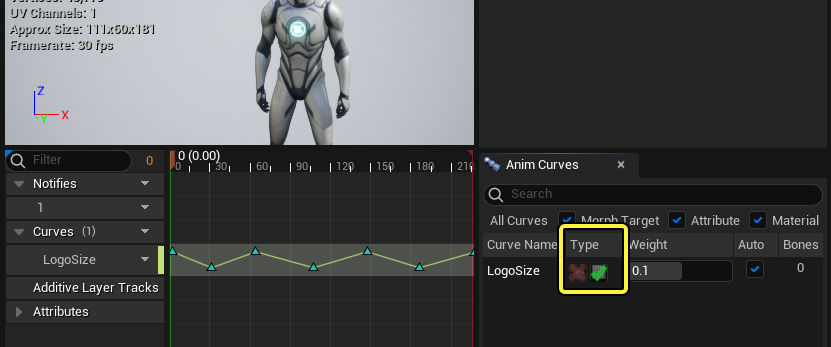
    

完成此操作后，曲线值开始影响材质参数。

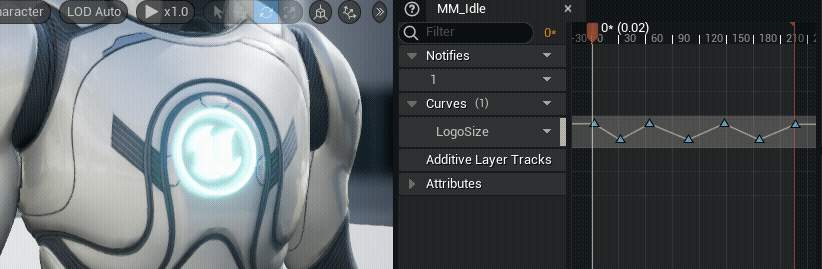

材质动画曲线会影响分配给骨骼网格体的所有材质（及其参数）。因此，如果你希望动画曲线仅影响单个材质中的参数，你可能需要相应调整内容。如果骨骼网格体有多个分配的材质派生自单个父材质，这将导致所有分配的材质采用相同的参数名称，从而发生这种情况。

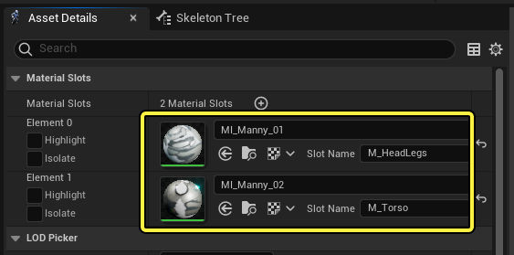

### 变形目标

你可以像使用材质一样使用动画曲线自动影响骨骼网格体上的[变形目标](https://dev.epicgames.com/documentation/zh-cn/unreal-engine/fbx-morph-target-pipeline-in-unreal-engine)。这需要你执行以下操作：

1. 将曲线名称与[变形目标预览器](https://dev.epicgames.com/documentation/zh-cn/unreal-engine/morph-target-previewer)中变形目标的名称相匹配
    
    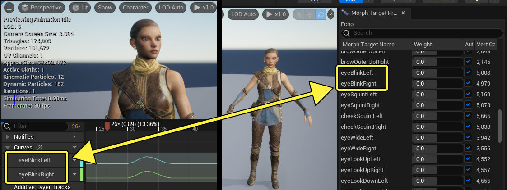
    
2. 在 **动画曲线（Anim Curves）** 面板中启用变形目标（Morph Target）曲线类型。
    
    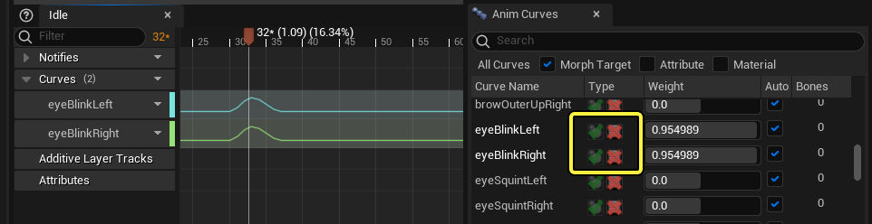
    

完成此操作后，曲线值开始影响变形目标。

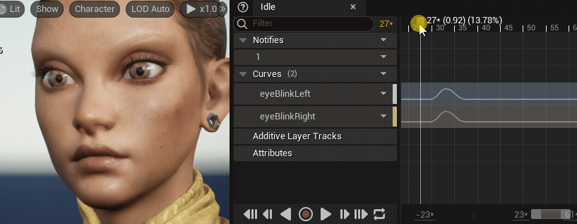

### 动画蓝图

你可以使用动画曲线影响[动画蓝图](https://dev.epicgames.com/documentation/zh-cn/unreal-engine/animation-blueprints-in-unreal-engine)中的任意值。在大部分情况下，你可以使用它们来影响特定动画图表节点的alpha值，例如例如IK，以便在播放动画期间更改IK状态。

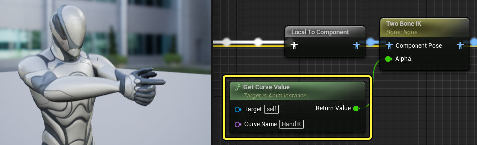

以下与曲线相关的函数在动画蓝图动画图表和事件图表中均可用：

|名称|图像|说明|
|---|---|---|
|**Get Active Curve Names**|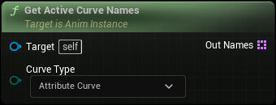|这会以动画实例为目标，并返回指定曲线类型的激活曲线名称的上次更新列表。|
|**Get All Curve Names**||这会以动画实例为目标，并将所有曲线名称返回到字符串数组中。|
|**Get Curve Value**||这会以动画实例为目标，并返回指定曲线名称的值。|

## 元数据曲线

元数据曲线是在添加到动画序列时输出静态曲线值 **1.0** 的动画曲线。它们可以按照与普通动画曲线相反的方式运作，后者在默认情况下（没有关键帧）输出静态曲线值 **0.0** 。如果没有将曲线添加到序列，动画曲线值也将回退为值 **0.0** 。

此行为在包含许多动画序列的较大项目中很有用。在这些项目中，许多动画可能自始至终需要常量 **1.0** 曲线值。因此，你可以使用 **元数据曲线（Metadata Curves）** 加快此过程，而不是手动添加普通曲线并采用 **1.0** 将其设为关键帧。换句话说，大项目在使用动画曲线时，可以按以下方式组织其在动画序列中的用法：

- 少数动画序列可能需要有显式曲线动画。因此，将 **动画曲线** 添加到这些动画，并相应将其 **设为关键帧** 。
- 更多的动画序列可能需要恒定设为 **1.0** 的曲线值，以便维持属性值。因此，将 **元数据曲线** 添加到这些动画。
- 其余所有动画序列可能不需要考虑曲线值，或者需要恒定设为 **0.0** 的曲线值。不需要执行操作。

要创建元数据曲线，请点击 **曲线（Curves）** 轨道下拉菜单并选择 **添加曲线…（Add Curve…）> 创建曲线（Create Curve）** 。你可以选择现有曲线，或点击 **新建（Create New）** 来创建新曲线。

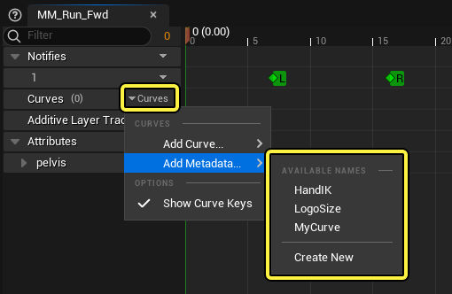

你也可以将现有动画曲线转换为元数据曲线，方法是点击曲线轨道上的 **曲线（Curve）** 下拉菜单并选择 **转换为元数据（Convert To Metadata）** 。

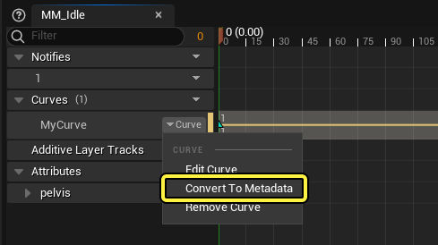

元数据曲线在创建之后是只读的，并输出常量曲线值 **1.0** 。

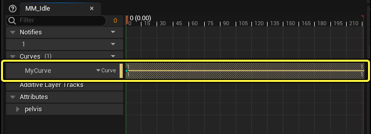

- [animation](https://dev.epicgames.com/community/search?query=animation)