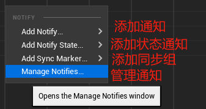
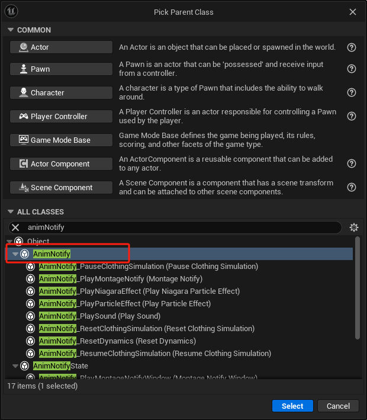
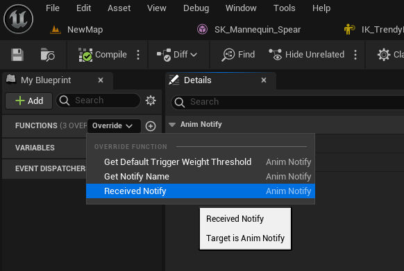
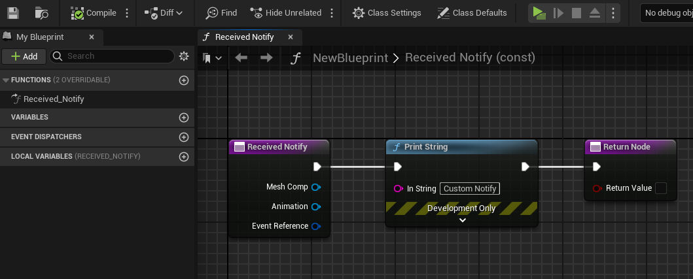

# 动画通知
## 概念：
- **动画通知（Animation Notifications）**（简称通知）可用于创建同步到 **动画序列（Animation Sequences）** 的可重复事件。这些事件可以是声音（例如，行走或奔跑动画的脚步声）、生成粒子和其他类型。动画通知有许多不同的用途，并且可以使用自定义类型进行扩展。
## 范例：
- 添加动画通知：添加通知为一瞬间通知，状态通知为一段时间的通知，同步组用于双脚动画同步。

## 自定义通知类
	[创建动画通知类](attachments/90a579783f2cd36e24e177ca52da8388_MD5.jpeg)

	- [重载received Notify函数](attachments/eaddbcc5d2562070d2406ff26c1ef34a_MD5.jpeg)

[重写自己的逻辑](attachments/b36f6137fa3efbb0dd552ba635f8a1c8_MD5.jpeg)

- 动画通知父类函数

| 函数                                       | 说明                                                                                                                                                                                                                                |
| ---------------------------------------- | --------------------------------------------------------------------------------------------------------------------------------------------------------------------------------------------------------------------------------- |
| **Get Default Trigger Weight Threshold** | 该函数为此通知设置 **触发权重阈值（Trigger Weight Threshold）** 的默认值，但是，可以在[通知关键帧细节](https://dev.epicgames.com/documentation/zh-cn/unreal-engine/animation-notifies-in-unreal-engine#%E9%80%9A%E7%94%A8%E9%80%9A%E7%9F%A5%E5%B1%9E%E6%80%A7)中覆盖该值。 |
| **Get Notify Name**                      | 该函数设置时间轴中通知或状态关键帧的名称。                                                                                                                                                                                                             |
| **Received Notify**                      | 该函数用于标准通知，在到达通知关键帧时执行一次。                                                                                                                                                                                                          |
| **Received Notify Begin**                | 该函数用于通知状态，在通知区域开始时执行一次。                                                                                                                                                                                                           |
| **Received Notify End**                  | 该函数用于通知状态，在通知区域结束时执行一次。                                                                                                                                                                                                           |
| **Received Notify Tick**                 | 该函数用于通知状态，在通知状态的整个时长内持续执行。                                                                                                                                                                                                        |

## 原理：
- 在动画序列或蒙太奇中创建动画通知，在动画蓝图的事件图表中调用动画通知创建引发事件。