# 动画蓝图
图表面板用于创建游戏中控制角色的逻辑。一共有三种图表，各自使用不同的界面：

- **事件图表（Event Graph）** 可以构建基于蓝图的逻辑，用于定义节点的属性和包含其他图表区域信息的变量。
    
    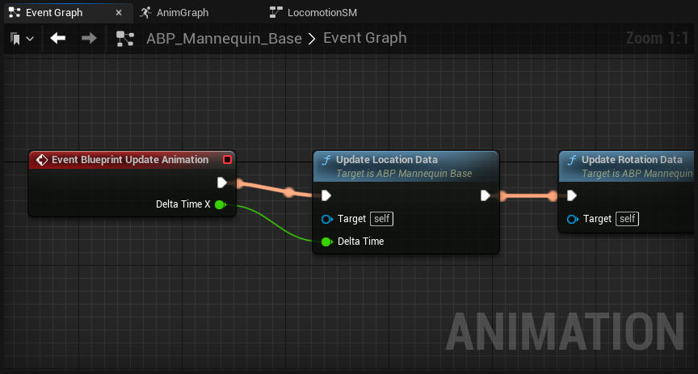
    
- **动画图表（Anim Graph）** 用于构建基于姿势的逻辑，可以为当前帧评估骨架网格体的最终姿势。
    
    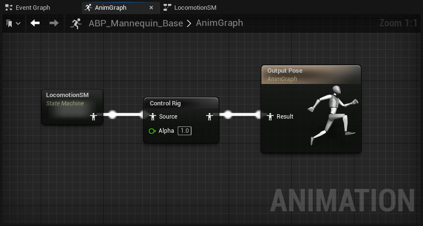
    
- **状态机（State Machines）**, 用于构建基于状态的逻辑，通常用于移动。
    
    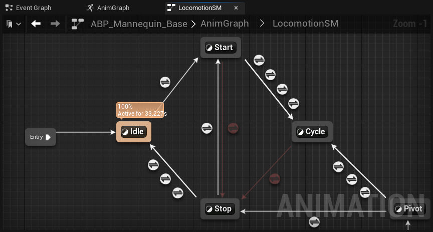
    

更多动画蓝图中图表的相关信息，访问 [在动画蓝图中使用图表功能](https://dev.epicgames.com/documentation/zh-cn/unreal-engine/graphing-in-animation-blueprints-in-unreal-engine) 和 [状态机](https://dev.epicgames.com/documentation/zh-cn/unreal-engine/state-machines-in-unreal-engine)页面。
# 状态机
使用状态机创建基于逻辑的分支动画。

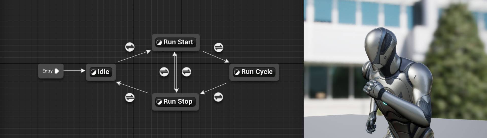

**状态机（State Machines）** 是一种可以在 **动画蓝图（Animation Blueprints）** 中构建的模块化系统，用来定义动画的播放状态和播放时机。这类系统主要用于将动画与角色的动作状态相关联，例如空闲、行走、奔跑和跳跃等状态。借助状态机，你可以创建各种 **状态（State）** ，定义要在这些状态中播放的动画，并创建各类 **转换（Transition）** 来控制何时切换到其他状态。这样，你就能更轻松地创建出复杂的动画混合效果，而不必使用过于复杂的动画图表。

本文介绍了如何在动画蓝图中使用状态机、状态和转换。

#### 先决条件

- 状态机需要在[动画蓝图](https://dev.epicgames.com/documentation/zh-cn/unreal-engine/animation-blueprints-in-unreal-engine)中创建，因此你应该懂得如何使用动画蓝图及其[操作界面](https://dev.epicgames.com/documentation/zh-cn/unreal-engine/animation-blueprint-editor-in-unreal-engine)。
- 你的项目包含带有运动组件的角色，以便构建状态来对输入做出反应。若没有这种角色，你可以使用[第三人称模板](https://dev.epicgames.com/documentation/zh-cn/unreal-engine/third-person-template-in-unreal-engine)中的角色。

## 创建和设置

状态机在[动画图表](https://dev.epicgames.com/documentation/zh-cn/unreal-engine/graphing-in-animation-blueprints-in-unreal-engine#%E5%8A%A8%E7%94%BB%E5%9B%BE%E8%A1%A8)中创建。要创建一个状态机，请右键点击 **动画图表（Anim Graph）**，然后选择 **状态机（State Machines）> 添加新状态机（Add New State Machine）** 。将其连接到 **Output Pose**。

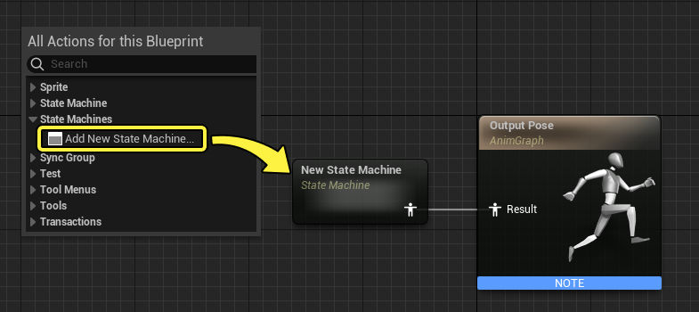

状态机是动画图表中的子图表，因此你可以在 **我的蓝图（My Blueprint）** 面板中看到状态机图表。双击它打开状态机。

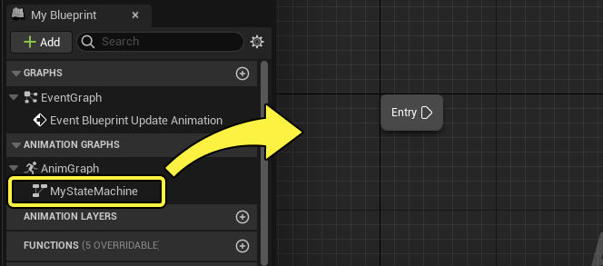

你还可以双击动画图表中的State Machine节点将其打开。

### 进入点

所有状态机都始于 **进入** 点，这通常用于定义 **默认状态**。在最常见的移动设置中，这将是角色空闲状态。

要创建默认状态，请点击并拖动 **进入** 输出引脚，松开鼠标，这将公开上下文菜单。选择 **添加状态（Add State）** 。这将创建新状态并将其连接到进入输出，使该状态默认为活动状态。

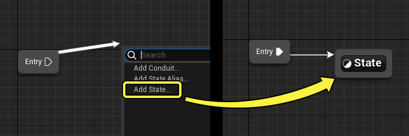

## 状态

状态是状态机中的一种按特定结构组织的子模块，它们之间通常可以相互转换。一个状态（State）自身包含动画图表，并可以包含任意类型的动画逻辑。例如，空闲状态可以只包含角色的空闲动画，而武器状态则可以包含射击和瞄准等额外动画逻辑。但无论包含哪些逻辑，状态最终只会生成一种最终动画或姿势，以对应该状态。

### 创建状态

状态可以按以下方式创建：

- 右键点击状态机图表，然后选择 **添加状态（Add State）** 。
    
    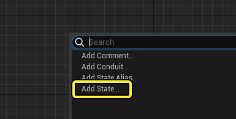
    
- 点击状态（或进入输出）的边框并拖出，然后松开鼠标，并选择 **添加状态（Add State）** 。这还会将其连接到带有[转换](https://dev.epicgames.com/documentation/zh-cn/unreal-engine/state-machines-in-unreal-engine#%E8%BD%AC%E6%8D%A2)的之前状态。
    
    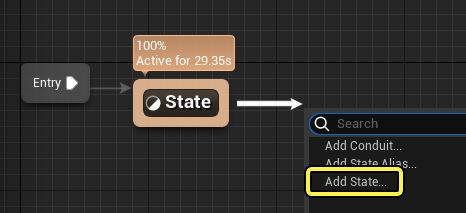
    
- 将 **动画资产（Animation Asset）** 从 **内容浏览器（Content Browser）** 或 **资产浏览器（Asset Browser）** 拖入状态机图表中。这还会将动画添加到状态，并将其连接到其 **Output Pose**。
    
    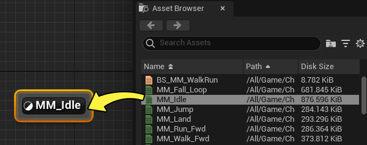
    

状态机可以根据需要包含任意数量的状态。它们会显示为状态机下的子图表。

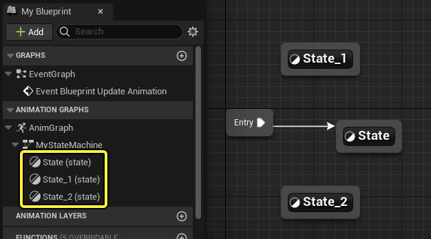

### 编辑状态

要查看状态的内部操作，可以在 **我的蓝图（My Blueprint）** 面板中双击它，或在 **状态机（State Machine）** 图表中双击该节点本身。这将打开该状态。

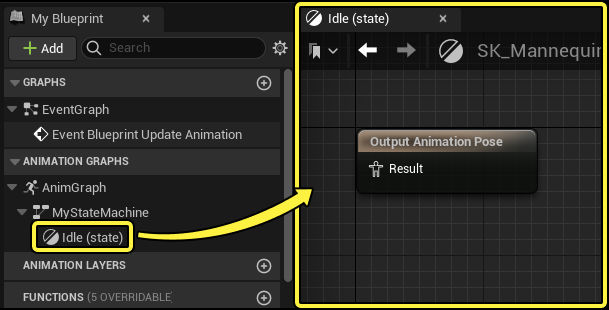

与动画图表一样，状态包含一个最终 **Output Pose** 节点，用于连接你的动画逻辑。该状态活动时，将执行此逻辑。不同状态活动时，将不再执行此逻辑。在此空闲状态示例中，空闲动画连接到Output Pose。此状态活动时，将播放生成的动画。

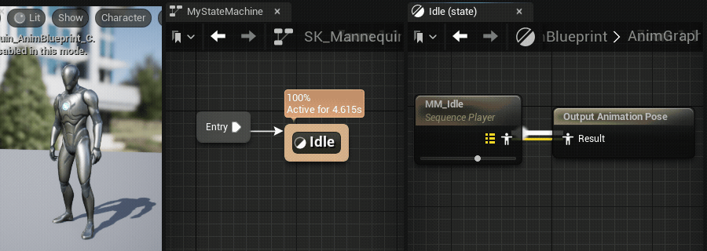

### 状态属性

选择状态时，你可以在 **细节（Details）** 面板中查看和编辑以下属性。

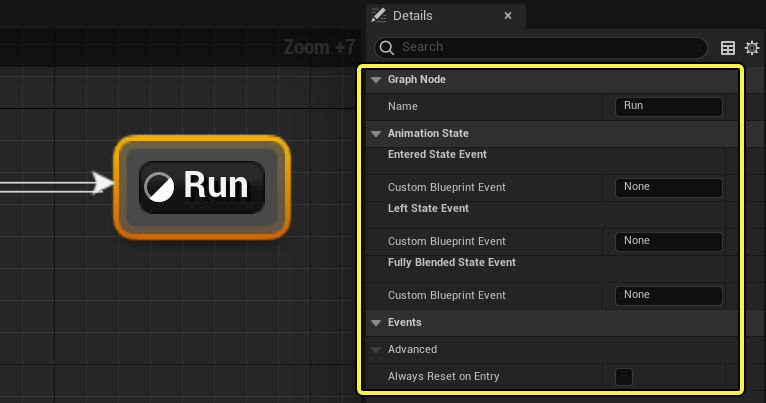

| 名称                                                                        | 说明                                                                                                                                                                                                                                                                                                                                                   |
| ------------------------------------------------------------------------- | ---------------------------------------------------------------------------------------------------------------------------------------------------------------------------------------------------------------------------------------------------------------------------------------------------------------------------------------------------- |
| **名称（Name）**                                                              | 所选状态的名称。                                                                                                                                                                                                                                                                                                                                             |
| **进入状态事件（自定义蓝图事件）（Entered State Event (Custom Blueprint Event)）**         | 通过 **自定义蓝图事件（Custom Blueprint Event）** 字段中使用的名称创建[骨架通知](https://dev.epicgames.com/documentation/zh-cn/unreal-engine/animation-notifies-in-unreal-engine#%E9%AA%A8%E6%9E%B6%E9%80%9A%E7%9F%A5)。此通知将在状态变为活动并开始转换时执行。与普通骨架通知一样，你可以在动画蓝图的 **事件图表（Event Graph）** 中创建事件来访问该事件。  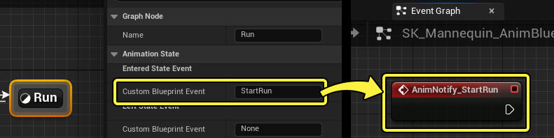 |
| **离开状态事件（自定义蓝图事件）（Left State Event (Custom Blueprint Event)）**            | 通过 **自定义蓝图事件（Custom Blueprint Event）字段** 中使用的名称创建骨架通知。此通知将在开始混合到另一个状态时执行。                                                                                                                                                                                                                                                                            |
| **完全混合状态事件（自定义蓝图事件）（Fully Blended State Event (Custom Blueprint Event)）** | 通过 **自定义蓝图事件（Custom Blueprint Event）字段** 中使用的名称创建骨架通知。此通知将在此状态完全混合时执行。                                                                                                                                                                                                                                                                               |
| **进入时总是重置（Always Reset on Entry）**                                        | **启用** 此项将导致此状态中的所有动画重新初始化为其默认值。大部分情况下，这意味着以下情况：  - 序列播放器将在动画开始时间重启。 - 属性将按其默认值初始化。  如果 **禁用** ，则所有动画及其属性在离开后返回此状态时，将维持之前的播放状态和其他属性。换句话说，动画将"在上次离开的地方继续"。                                                                                                                                                                             |

## 转换

如果要控制状态如何过渡到另一状态，你需要创建 **转换** ，它表面了状态之间的连接关系，帮助定义了状态机的结构。

要创建转换，请选中一个状态边框并拖动到另一个状态。在本示例中， **空闲（Idle）状态** 与 **奔跑（Run）状态** 双向连接，在状态机中这很常见。单个转换只是单向的，所以，如果两个状态要来回转换，你需要从另一个方向再创建一个转换。

选择一个转换节点并将其拖放到不同的状态，即可重新绑定现有转换逻辑。将转换箭头拖放到新绑定，即可重新绑定多个转换节点。

如需详细了解 **转换** 和 **转换规则**，请参阅[转换](https://dev.epicgames.com/documentation/zh-cn/unreal-engine/transition-rules-in-unreal-engine)页面。

[转换规则](https://dev.epicgames.com/documentation/zh-cn/unreal-engine/transition-rules-in-unreal-engine)

[使用转换在状态机中的状态之间混合。](https://dev.epicgames.com/documentation/zh-cn/unreal-engine/transition-rules-in-unreal-engine)

## 导管

==导管是一个条件状态。只有满足管道条件的情况下才能进入管道继续执行。==
普通转换可用于状态之间的一对一转换，而 **导管** 则可用于创建一对多、多对一或多对多转换。因此，导管充当更高级、更易于共享的转换资源。

要创建导管，请右键点击状态机图表，然后选择 **添加导管（Add Conduit）** 。

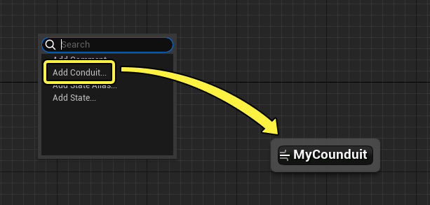

有多种方法可以使用导管。其中一个例子是，使用导管来分散状态机的进入点。然后，你可以使用导管中的转换，选择哪个状态应该作为默认状态开始。重新初始化状态机时，如果你要使用另一个动画来覆盖它，例如[动画蒙太奇](https://dev.epicgames.com/documentation/zh-cn/unreal-engine/animation-montage-in-unreal-engine)，此示例可能很有用。

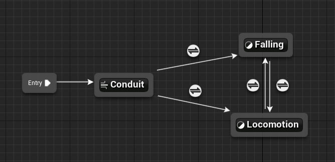

以上示例需要在[状态机细节面板](https://dev.epicgames.com/documentation/zh-cn/unreal-engine/state-machines-in-unreal-engine#%E7%8A%B6%E6%80%81%E6%9C%BA%E5%B1%9E%E6%80%A7)中启用 **允许导管进入状态（Allow Conduit Entry States）** 。

导管包含自身的[转换规则](https://dev.epicgames.com/documentation/zh-cn/unreal-engine/transition-rules-in-unreal-engine#%E8%BD%AC%E6%8D%A2%E8%A7%84%E5%88%99)，若要找到这些规则，可以双击导管节点，或从"我的蓝图（My Blueprint）"面板打开导管图表。默认情况下，导管转换规则将返回false。大部分情况下，你可能只想启用 **可以进入转换（Can Enter Transition）** ，并在进出导管的各个转换上创建转换规则逻辑。

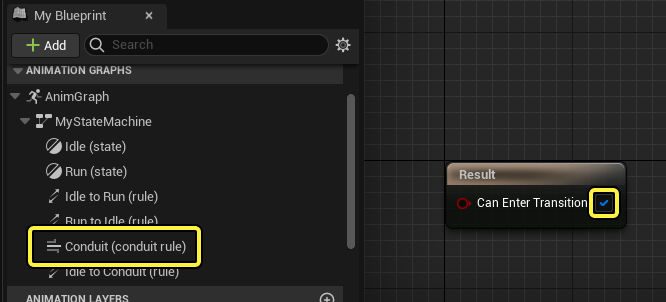

请参阅[转换规则](https://dev.epicgames.com/documentation/zh-cn/unreal-engine/transition-rules-in-unreal-engine)页面，了解有关转换和转换规则的更多信息。

## 状态别名

随着你构建更复杂的状态机，状态机内涉及到许多状态以及状态之间的转换，你可能想使用 **状态别名** 改进你的图表。状态别名是快捷方式类型的节点，你可以添加到状态机，避免线条凌乱，同时整合转换并提高图表的可读性。

|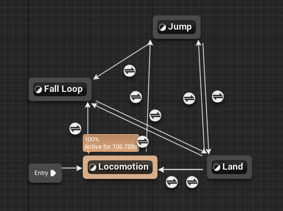|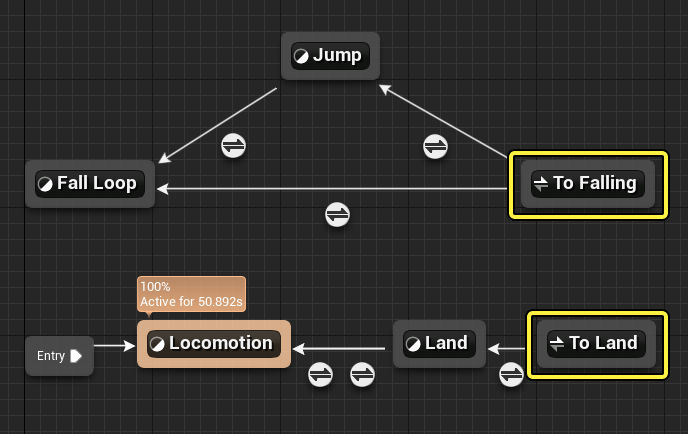|
|---|---|
|未使用别名的状态机|使用别名的状态机|

要创建状态别名，请右键点击 **状态机（State Machine）** 图表，然后选择 **添加状态别名（Add State Alias）** 。

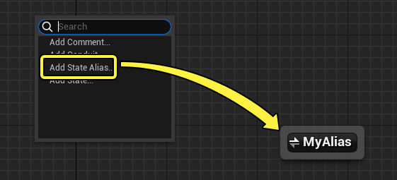

状态别名的工作方式是，定义哪些状态可以转换到其中，然后使用普通转换方法将别名连接到其他状态。点击状态别名节点，在 **细节（Details）** 面板中，你可以观察到以下情况：

- 状态机中的每个状态列为一个属性。如果启用该状态，该状态将采用你从别名到其他状态进行的转换和规则。换句话说，你在这里定义哪些状态会"进入"别名。
- 启用 **全局别名（Global Alias）** 将使所有状态进入别名。虽然你可以启用所有列出的状态，从而导致相同行为，但启用全局别名还会包含以后创建的所有新状态。
    
    对于单帧输入和有限时长的状态，例如交互、攻击或其他类似动画，在使用全局别名时最好加以限制。将全局别名用于无限时长的状态时，可能需要在所有其他状态转换之间额外建立复杂的逻辑，以确保你的其他状态并不总是转换到它。
    

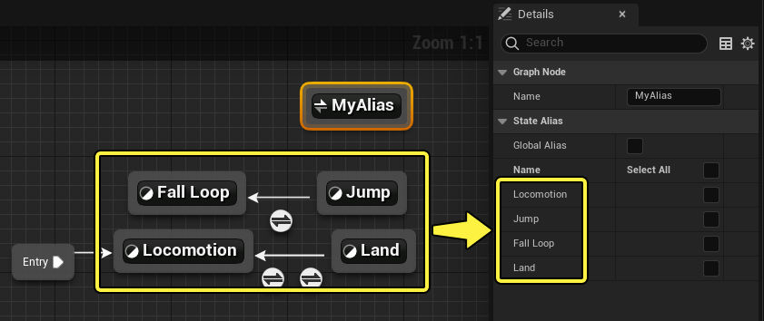

### 别名示例

在此示例中，有点简单的状态机需要 **着地（land）** 和 **移动（locomotion）** 状态同时转换到 **跳跃（jump）** 和 **降落循环（fall loop）** 状态。总计使用了四个转换，每个都有自己的转换规则。

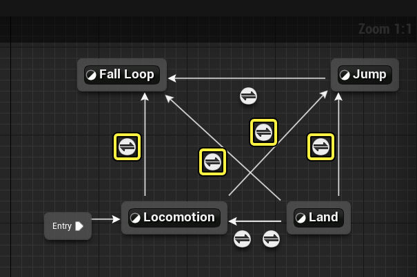

状态别名可用于清理此图表。要实现相同效果，你可以执行以下操作：

- 创建状态别名，并将其同时转换到 **降落循环（fall loop）** 和 **跳跃（jump）** 状态。
- 选择状态别名，并启用 **移动（locomotion）** 和 **着地（land）** 。

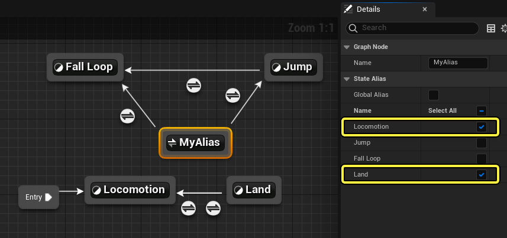

由于状态别名整合了来自所有启用的状态的转换，使用状态别名意味着这些状态将采用相同的转换规则和属性。如果你想让特定转换采用不同的规则、混合时长或其他属性，则应该转而为这些状态创建唯一的转换。

## 状态机属性

状态机包含 **细节（Details）** 面板中的以下属性。

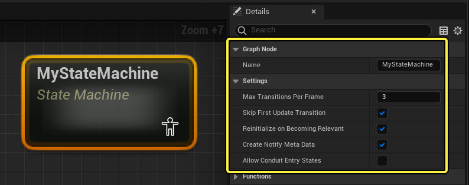

| 名称                                                | 说明                                                                                                                                                                                                                                                                                                                                                                                                                                                                                                          |
| ------------------------------------------------- | ----------------------------------------------------------------------------------------------------------------------------------------------------------------------------------------------------------------------------------------------------------------------------------------------------------------------------------------------------------------------------------------------------------------------------------------------------------------------------------------------------------- |
| **名称（Name）**                                      | 所选状态机的名称。                                                                                                                                                                                                                                                                                                                                                                                                                                                                                                   |
| **每帧最大转换数（Max Transitions Per Frame）**            | 该数字定义了单个帧或更新中可以发生的转换或 **决策** 数量。如果你的状态机有许多状态和转换，其中多个转换可以在给定时间均成立，可能需要将该数字设置为 **1** 。这样一来，一次只能做出一个决策，防止多个决策和转换彼此竞争。                                                                                                                                                                                                                                                                                                                                                                                          |
| **跳过首次更新转换（Skip First Update Transition）**        | 状态机变得[相关](https://dev.epicgames.com/documentation/zh-cn/unreal-engine/graphing-in-animation-blueprints-in-unreal-engine#%E8%8A%82%E7%82%B9%E5%87%BD%E6%95%B0)时，它会初始化为连接到 **进入（Entry）** 点的默认状态。在该点处，普通状态机流程开始，并会执行所有有效的转换。  - 如果启用该属性，则在初始化时将立即转换到作为有效转换目标的所有非默认状态。 - 如果禁用该属性，则所有有效转换目标将正常混合。  这是为了允许非默认状态可以表现得像默认状态一样（如果这是期望的行为）。例如，如果你有简单的空闲和奔跑状态机，其中 **空闲（idle）** 是默认状态，可以转换到 **奔跑（run）** 。如果启用 **跳过首次更新转换（Skip First Update Transition）** ，并且奔跑转换规则在状态机初始化时为 **true** ，则奔跑将立即初始化并混合到100%。 |
| **变得相关时重新初始化（Reinitialize on Becoming Relevant）** | 启用该属性将在状态机变得相关时重新初始化第一个进入的状态。该设置的运作方式类似于每个状态的属性 **进入时总是重置（Always Reset on Entry）** ，但仅会重置进入的第一个初始化状态。                                                                                                                                                                                                                                                                                                                                                                                                       |
| **创建通知元数据（Create Notify Meta Data）**              | 在转换规则中使用[动画通知函数](https://dev.epicgames.com/documentation/zh-cn/unreal-engine/animation-notifies-in-unreal-engine#%E5%8A%A8%E7%94%BB%E9%80%9A%E7%9F%A5%E5%87%BD%E6%95%B0)时，启用该属性就可以将所有相关数据发送到这些通知函数。如果禁用该属性，则所有通知函数都无法运行。                                                                                                                                                                                                                                                                                    |
| **允许导管进入状态（Allow Conduit Entry States）**          | 启用该属性将允许[导管](https://dev.epicgames.com/documentation/zh-cn/unreal-engine/state-machines-in-unreal-engine#%E5%AF%BC%E7%AE%A1)用作进入状态，从而允许不同的默认状态，具体取决于导管的转换规则。                                                                                                                                                                                                                                                                                                                                                |
