使用转换在状态机中的状态之间混合。

## 转换设置

如果要控制状态如何过渡到另一状态，你需要创建 **转换** ，它表面了状态之间的连接关系，帮助定义了状态机的结构。

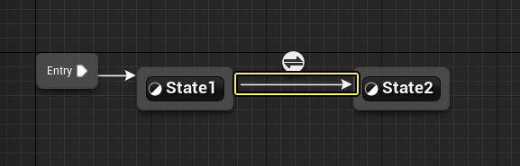

要创建转换，请选中一个状态边框并拖动到另一个状态。在本示例中， **空闲（Idle）状态** 与 **奔跑（Run）状态** 双向连接，在状态机中这很常见。单个转换只是单向的，所以，如果两个状态要来回转换，你需要从另一个方向再创建一个转换。

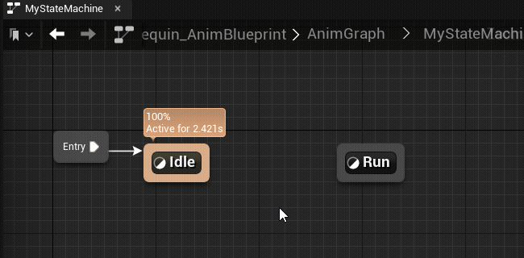

选择一个转换节点并将其拖放到不同的状态，即可重新绑定现有转换逻辑。将转换箭头拖放到新绑定，即可重新绑定多个转换节点。

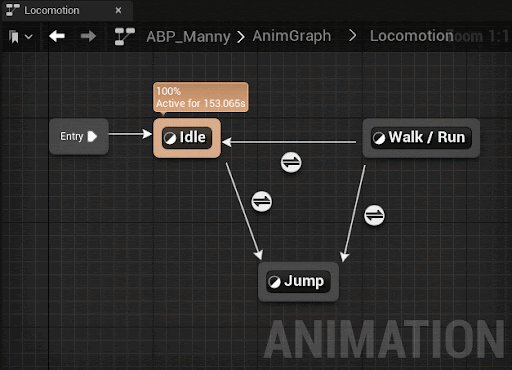

## 转换规则

转换控制状态间混合的结构，而 **转换规则** 控制状态何时可以转换。换句话说，仅仅定义转换是不够的，你还必须定义转换的方式和时间。

当你创建转换时，转换规则会自动创建。就像状态一样，你可以从"我的蓝图（My Blueprint）"面板或者双击状态机图表中的 **转换图标** 来查看和访问转换。

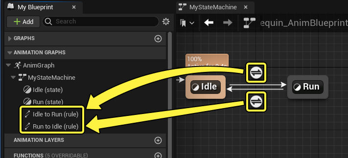

在转换规则中，你可以创建任意种类的蓝图逻辑来检查和比较，最终都是为了输出布尔值（true或false）。 **True** 值用于确定状态是否可以转换到下一个状态。

例如，从空闲转换到奔跑，然后恢复空闲时，逻辑可能如下所示。在此示例中，布尔变量用于提供转换规则。返回默认状态时，将使用该布尔的相反值。

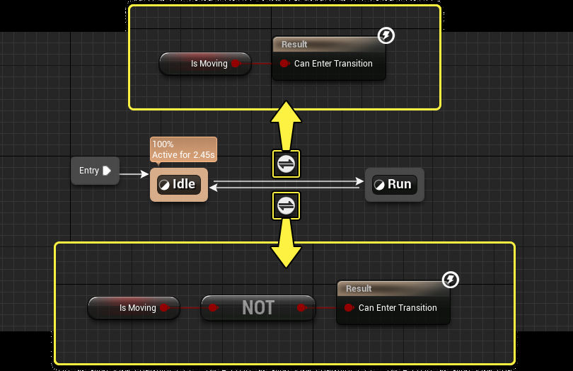

转换规则通常由运动组件和其他角色变量通知。如需详细了解如何获取可控制角色的通用属性，请参阅[如何获取动画变量](https://dev.epicgames.com/documentation/zh-cn/unreal-engine/how-to-get-animation-variables-in-animation-blueprints-in-unreal-engine)页面。

使用所需逻辑正确设置变量之后，在Gameplay期间满足这些变量的条件会导致转换发生。

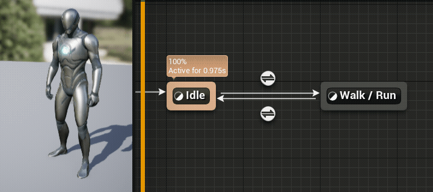

### 转换函数

在转换规则图表中，你可以使用以下仅限转换的专用函数来增强你的逻辑：

|名称|图像|说明|
|---|---|---|
|**Current State Time**||获取此状态机中任意当前活动状态的当前耗时（以秒为单位）。此输出提供的信息类似于状态机中的 **活动指标** 。  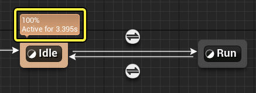|
|**Get Current State Name**||获取此状态机中当前活动状态的名称。|
|**Get Relevant Anim Time**||获取此转换将进入的状态中最相关动画的当前耗时（以秒为单位）。  由于状态可能包含相关性相等的多个动画，你可以禁止在相关性相关的函数中检查和使用这些动画。为此，请打开状态图表，选择你想排除的动画节点（序列播放器、混合空间、瞄准偏移或类似内容），并从 **细节（Details）** 面板启用 **忽略相关性测试（Ignore for Relevancy Test）** 。  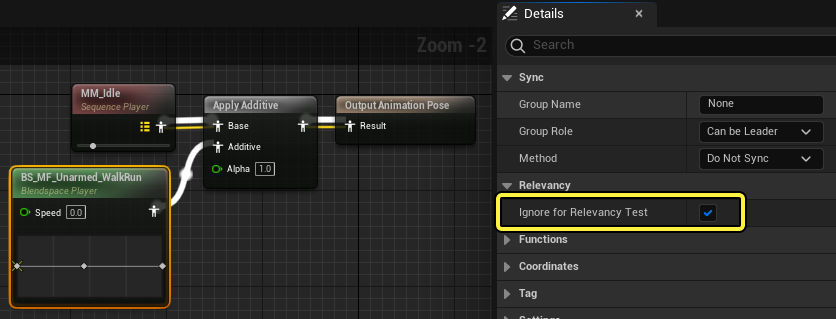|
|**Current Time**||获取动画自上一个状态以来的当前耗时（以秒为单位）。如果你想直接引用特定动画，而不是通过相关性来引用，此函数很有用。|
|**Get Relevant Anim Time Remaining**||获取此转换将进入的状态中最相关动画的当前剩余时间（以秒为单位）。|
|**Time Remaining**||获取此转换将进入的状态中动画的当前剩余时间（以秒为单位）。如果你想直接引用特定动画，而不是通过相关性来引用，此函数很有用。|

### 动画通知函数

还有几个[动画通知](https://dev.epicgames.com/documentation/zh-cn/unreal-engine/animation-notifies-in-unreal-engine)函数可以在转换图表中使用。你可以右键点击转换图表并找到 **Was Anim Notify…** 函数来添加这些函数。

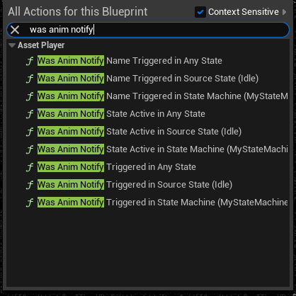

|名称|说明|
|---|---|
|**Was Anim Notify Name Triggered…**|如果之前更新中触发了按名称指定的[骨架通知](https://dev.epicgames.com/documentation/zh-cn/unreal-engine/animation-notifies-in-unreal-engine#%E9%AA%A8%E6%9E%B6%E9%80%9A%E7%9F%A5)，则返回 **true** 。|
|**Was Anim Notify State Active…**|如果按类指定的[通知状态](https://dev.epicgames.com/documentation/zh-cn/unreal-engine/animation-notifies-in-unreal-engine#%E9%80%9A%E7%9F%A5%E7%8A%B6%E6%80%81)在之前更新中处于活动状态，则返回 **true** 。|
|**Was Anim Notify Triggered…**|如果按类指定的[通知](https://dev.epicgames.com/documentation/zh-cn/unreal-engine/animation-notifies-in-unreal-engine#%E9%80%9A%E7%9F%A5)在之前更新中处于活动状态，则返回 **true** 。|

通知函数检查之间的主要差异在于它们的搜索位置：

- **在任意状态中（In any state）** ，即在所有活动状态机中搜索通知。
- **在源状态中（In the source state）** ，即在之前活动的状态（从中转换的状态）中搜索通知。
- **在状态机中（In the State Machine）** ，即在特定状态机中搜索通知。

### 转换中断

转换时，如果另一个状态变得活动，则转换将"中断"，而改为转换到这一新状态。发生此中断时，你可以将特定[动画通知](https://dev.epicgames.com/documentation/zh-cn/unreal-engine/animation-notifies-in-unreal-engine)链接到中断。这样就会在发生中断时执行这些通知。

要设置转换中断通知行为，请选择转换并在 **细节（Details）** 面板中找到 **转换中断（Transition Interrupt）** 属性。

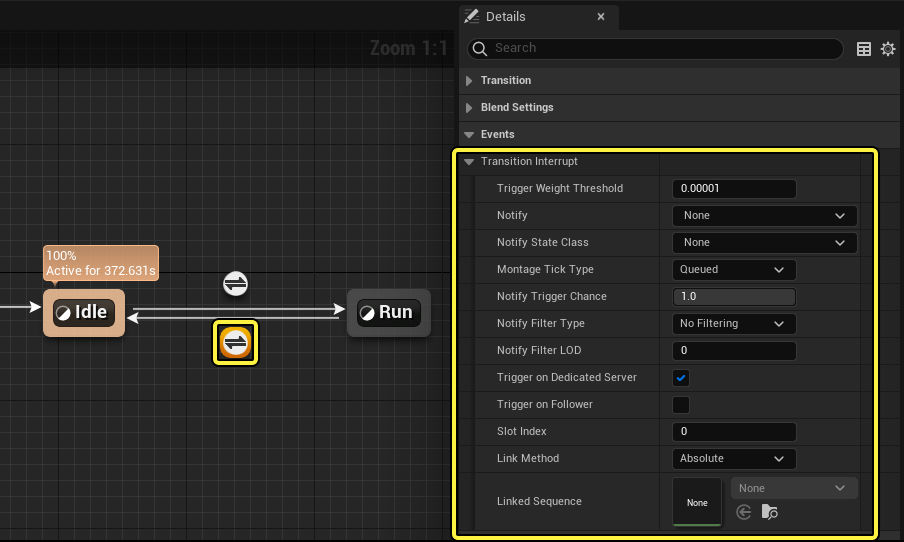

你可以指定 **通知（Notify）** 或 **通知状态类（Notify State Class）** 以链接到中断。如果使用 **通知状态（Notify State）** ，则中断会对后续帧按顺序执行 **开始** 和 **结束** 通知事件。

其他属性可以在[蒙太奇通知](https://dev.epicgames.com/documentation/zh-cn/unreal-engine/animation-notifies-in-unreal-engine#%E8%92%99%E5%A4%AA%E5%A5%87%E9%80%9A%E7%9F%A5)页面中参考。

## 转换混合类型

你在决定想要状态如何转换时，有三种主要类型的状态转换混合可以使用：**标准混合（Standard Blend）** 、 **惯性化（Inertialization）** 或 **自定义（Custom）** 。你可以选择转换并在 **细节（Details）** 面板中找到 **混合逻辑（Blend Logic）** 属性来选择其中任意类型。

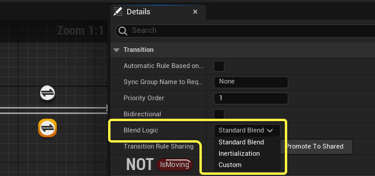

### 标准混合

标准混合是默认转换选项，包含时长、曲线和其他基本功能按钮的设置。你可以选择转换并在 **细节（Details）** 面板中找到 **混合设置（Blend Settings）** 类别来找到并调整这些设置。

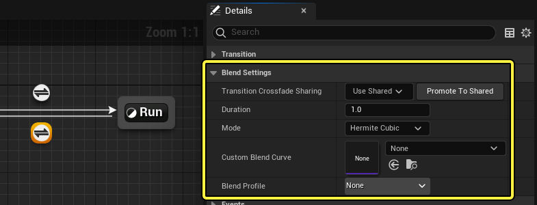

| 名称                                         | 说明                                                                                                                                                                    |
| ------------------------------------------ | --------------------------------------------------------------------------------------------------------------------------------------------------------------------- |
| **转换交叉转换共享（Transition Crossfade Sharing）** | 你可以使用此下拉菜单在不同转换之间共享 **混合设置（Blend Settings）** 属性。要创建新的共享设置，请点击 **提升为共享（Promote to Shared）** ，输入设置的名称，然后按 **Enter** 键。现在你可以在其他转换上访问此设置。这些设置将完全共享，因此，编辑一个转换的设置会影响其他所有转换。 |
| **时长（Duration）**                           | 转换所用的时间长度（以秒为单位）。                                                                                                                                                     |
| **模式（Mode）**                               | 与此转换混合时要使用的曲线类型。在每个选项上按住 **Ctrl + Alt** 将显示曲线形状的预览。                                                                                                                   |
| **自定义混合曲线（Custom Blend Curve）**            | 如果 **模式（Mode）** 设置为 **自定义（Custom）** ，你就可以在这里指定自定义插件的曲线资产，以在与此转换混合时用作曲线形状。                                                                                             |
| **混合配置文件（Blend Profile）**                  | 你可以选择在这里指定[混合配置](1.3.1-混合遮罩和混合描述.md)，以便在此转换期间让特定骨骼比其他骨骼更快地混合。                                                                                                         |

### 惯性化

一般来说如果未使用惯性化，在转换状态是会将上一个动画播完再混合到下一个动画；当使用惯性话规则时，切换将在动画播放中完成。
除了直接从一个状态混合到另一个状态之外，你还可以使用 **惯性化（Inertialization）** ，其中切换到新动画时发生的动画速度和加速用于向前推动运动。请参阅[惯性化](https://dev.epicgames.com/documentation/zh-cn/unreal-engine/animation-blueprint-blend-nodes-in-unreal-engine#%E6%83%AF%E6%80%A7%E5%8C%96)文档，了解更多信息。

如果你要将惯性化用作混合类型，你还必须确保在动画图表中使用 **Inertialization节点** 。该节点必须在状态机求值后放置。

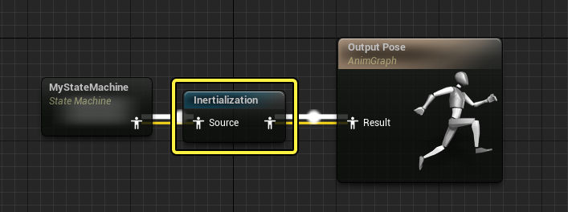

惯性化并不能在所有转换上都生成良好的结果，具体取决于转换周围的状态中使用的动画。使用惯性化混合时，需要谨记以下通用规则：

- 混合时长要尽可能短，最好小于0.4秒。
- 各个姿势差异极大时，不要使用惯性化。

### 自定义

自定义混合是你可以在其自己的动画图表中绘制和自定义的混合，其时长和曲线形状取决于[标准混合设置](https://dev.epicgames.com/documentation/zh-cn/unreal-engine/transition-rules-in-unreal-engine#%E6%A0%87%E5%87%86%E6%B7%B7%E5%90%88)。

**混合逻辑（Blend Logic）** 设置为 **自定义（Custom）** 时，你可以点击下拉菜单旁边的 **编辑混合图表（Edit Blend Graph）** ，或双击 **我的蓝图（My Blueprint）** 中的自定义混合图表以打开图表。

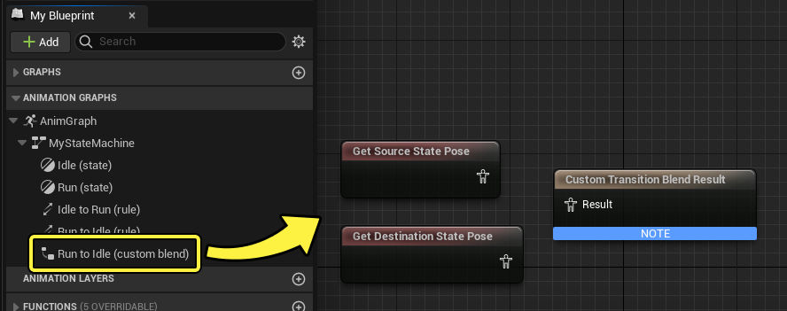

在自定义混合图表中，你可以使用以下特殊函数来读取转换时间和状态权重信息，以通知你的图表：

|名称|图像|说明|
|---|---|---|
|**State Weight**||获取上一个状态的混合权重。该数字在转换时长内逐渐从 **1** 减小到 **0** 。|
|**Get Transition Time Elapsed**||获取指定转换的耗时（以秒为单位）。|
|**Get Transition Time Elapsed (ratio)**||获取指定转换的耗时（以交叉转换时长的比例表示）。换句话说，该数字在转换时长内逐渐从 **0** 增大到 **1** 。|
|**Get Transition Crossfade Duration**||获取指定转换的交叉转换时长。这是 **混合设置（Blend Settings）> 时长（Duration）** 属性中使用的数字。|

通过自定义混合，你可以创建各种各样的混合逻辑。举一个简单例子，你可以将普通 **Blend** 节点用于 **Get Transition Time Elapsed (ratio)** 函数来复制[标准混合](https://dev.epicgames.com/documentation/zh-cn/unreal-engine/transition-rules-in-unreal-engine#%E6%A0%87%E5%87%86%E6%B7%B7%E5%90%88)。

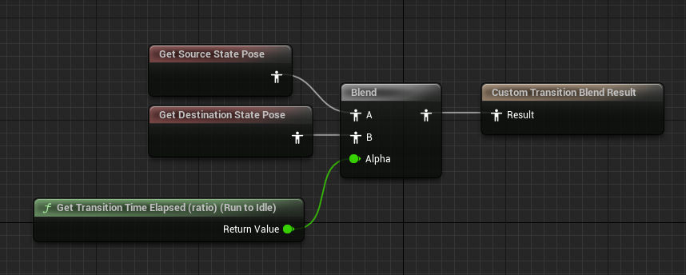

## 转换属性

转换包含以下属性：

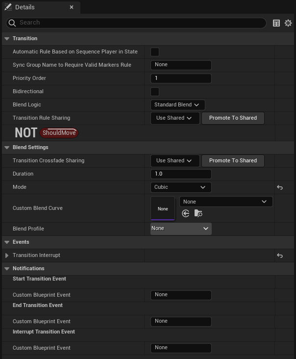

| 名称                                                                       | 说明                                                                                                                                                                                                                                                                                                |
| ------------------------------------------------------------------------ | ------------------------------------------------------------------------------------------------------------------------------------------------------------------------------------------------------------------------------------------------------------------------------------------------- |
| **优先级顺序（Priority Order）**                                                | 此转换的优先级顺序。如果多个转换同时成立，则选择优先级最小的转换。                                                                                                                                                                                                                                                                 |
| **双向（Bidirectional）**                                                    | 此设置不受支持，当前不起作用。                                                                                                                                                                                                                                                                                   |
| **混合逻辑（Blend Logic）**                                                    | 使用哪种[转换混合类型](https://dev.epicgames.com/documentation/zh-cn/unreal-engine/transition-rules-in-unreal-engine#%E8%BD%AC%E6%8D%A2%E6%B7%B7%E5%90%88%E7%B1%BB%E5%9E%8B)。                                                                                                                               |
| **转换规则共享（Transition Rule Sharing）**                                      | 你可以使用此下拉菜单在不同转换之间共享 **转换图表（Transition graph）** 。要创建新的共享设置，请点击 **提升为共享（Promote to Shared）** ，输入设置的名称，然后按Enter键。现在你可以在其他转换上访问此设置。图表将完全共享，因此，编辑一个转换的图表会影响其他所有转换。                                                                                                                                     |
| **基于状态中的序列播放器的自动规则（Automatic Rule Based on Sequence Player in State）**   | 启用后，该转换节点将尝试根据最相关资产播放器节点的剩余时间和 **AutomaticRuleTriggerTime** 属性的值自动开始转换，忽略内部时间。此属性可用于在第一次动画播放期间，通过更快地开始混合，更动态地在状态转换之间混合。                                                                                                                                                                           |
| **AutomaticRuleTriggerTime**                                             | 当 **基于状态中的序列播放器的自动规则（Automatic Rule Based on Sequence Player in State）** 属性也启用时，此处你可以设置何时开启自动转换规则。为此属性设置的值（以秒为单位）与相关资产播放器上的剩余时间相关。值小于 `0.0` 时，将使用混出交叉过渡时长自动转换动画（ `AnimiationLength - CrossFadeDuration` ）。值大于或等于 `0.0` 时，将使用此值（以秒为单位）手动设置触发转出的时间（ `AnimationLength - AutomaticRuleTriggerTime` ）。 |
| **需要有效标识规则的同步组名（Sync Group Name to Require Valid Markers Rule）**         | 如果你在这里指定[同步组](https://dev.epicgames.com/documentation/zh-cn/unreal-engine/animation-sync-groups-in-unreal-engine)名称，则仅在当前状态包含带有有效同步标识的动画时，才会使用此过渡。普通过渡规则仍适用。                                                                                                                                      |
| **转换交叉转换共享（Transition Crossfade Sharing）**                               | 你可以使用此下拉菜单在不同转换之间共享 **混合设置（Blend Settings）** 属性。要创建新的共享设置，请点击 **提升为共享（Promote to Shared）** ，输入设置的名称，然后按 **Enter** 键。现在你可以在其他转换上访问此设置。这些设置将完全共享，因此，编辑一个转换的设置会影响其他所有转换。                                                                                                                             |
| **时长（Duration）**                                                         | 转换所用的时间长度（以秒为单位）。                                                                                                                                                                                                                                                                                 |
| **模式（Mode）**                                                             | 与此转换混合时要使用的曲线类型。在每个选项上按住 **Ctrl + Alt** 将显示曲线形状的预览。                                                                                                                                                                                                                                               |
| **自定义混合曲线（Custom Blend Curve）**                                          | 如果 **模式（Mode）** 设置为 **自定义（Custom）** ，你就可以在这里指定自定义插件的曲线资产，以在与此转换混合时用作曲线形状。                                                                                                                                                                                                                         |
| **混合配置文件（Blend Profile）**                                                | 你可以选择在这里指定[混合配置文件](https://dev.epicgames.com/documentation/zh-cn/unreal-engine/blend-masks-and-blend-profiles-in-unreal-engine#%E6%B7%B7%E5%90%88%E9%85%8D%E7%BD%AE%E6%96%87%E4%BB%B6)，以便在此转换期间让特定骨骼比其他骨骼更快地混合。                                                                                   |
| **转换中断（Transition Interrupt）**                                           | 包含[转换中断](https://dev.epicgames.com/documentation/zh-cn/unreal-engine/transition-rules-in-unreal-engine#%E8%BD%AC%E6%8D%A2%E4%B8%AD%E6%96%AD)的设置。                                                                                                                                                  |
| **开始转换事件（自定义蓝图事件）（Start Transition Event (Custom Blueprint Event)）**     | 通过 **自定义蓝图事件（Custom Blueprint Event）** 字段中使用的名称创建[骨架通知](https://dev.epicgames.com/documentation/zh-cn/unreal-engine/animation-curves-in-unreal-engine#%E9%AA%A8%E6%9E%B6%E9%80%9A%E7%9F%A5)。此通知会在此转换开始时执行。与普通骨架通知一样，你可以在动画蓝图的 **事件图表（Event Graph）** 中创建事件来访问该事件。                                  |
| **结束转换事件（自定义蓝图事件）（End Transition Event (Custom Blueprint Event)）**       | 通过 **自定义蓝图事件（Custom Blueprint Event）** 字段中使用的名称创建骨架通知。此通知会在此转换结束时执行。                                                                                                                                                                                                                              |
| **中断转换事件（自定义蓝图事件）（Interrupt Transition Event (Custom Blueprint Event)）** | 通过 **自定义蓝图事件（Custom Blueprint Event）** 字段中使用的名称创建骨架通知。此通知将在转换[中断](https://dev.epicgames.com/documentation/zh-cn/unreal-engine/transition-rules-in-unreal-engine#%E8%BD%AC%E6%8D%A2%E4%B8%AD%E6%96%AD)时执行。                                                                                         |
- **基于状态中的序列播放器的自动规则（Automatic Rule Based on Sequence Player in State）**等价于：
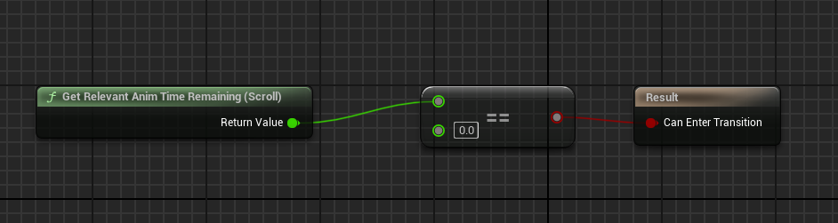