# 蓝图分工
## 概述
- 玩家控制器事件图表是处理玩家输入的
- 角色蓝图事件图表是处理角色数据逻辑的
- 动画蓝图事件图表是处理动画数据逻辑的
- 动画蓝图动画图表是处理动画逻辑的
## 交互
- 玩家控制器获取角色蓝图
- 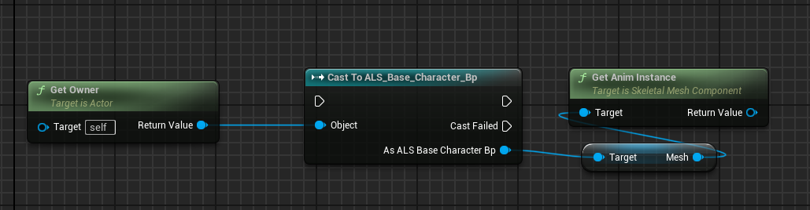
- 角色蓝图获取动画蓝图数据
- 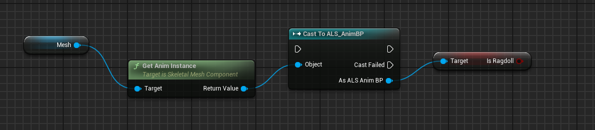
- 动画蓝图中获取角色蓝图数据
- 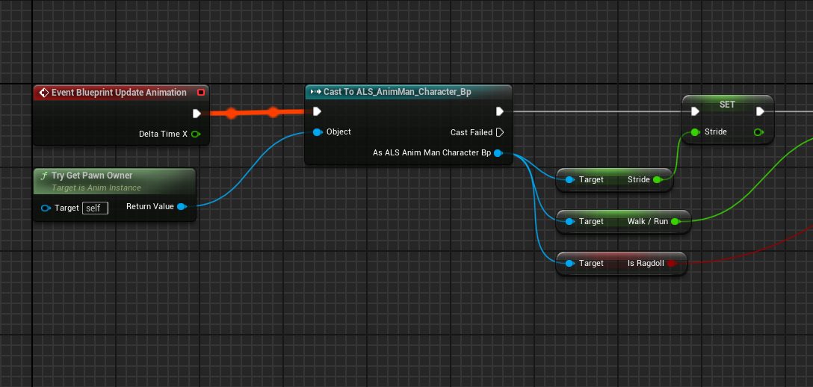
## **总结对比**

|图表类型|主要作用|典型场景|
|---|---|---|
|玩家控制器事件图表|处理玩家输入和全局控制逻辑|按键触发攻击、切换视角、显示UI等。|
|角色蓝图事件图表|管理角色行为和属性|控制角色移动、交互、攻击等。|
|动画蓝图事件图表|更新动画逻辑和状态|更新动画变量，根据状态切换动画（如跳跃到跑步）。|
|动画蓝图动画图表|定义动画流和状态机|管理动画切换、混合、特殊动作（如武器挥击、受击）。|
# 动画逻辑原理
## 跳跃逻辑
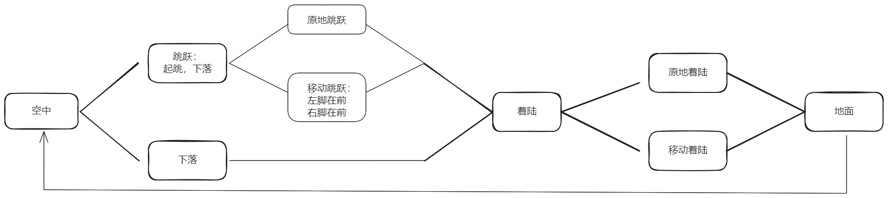
### 数据
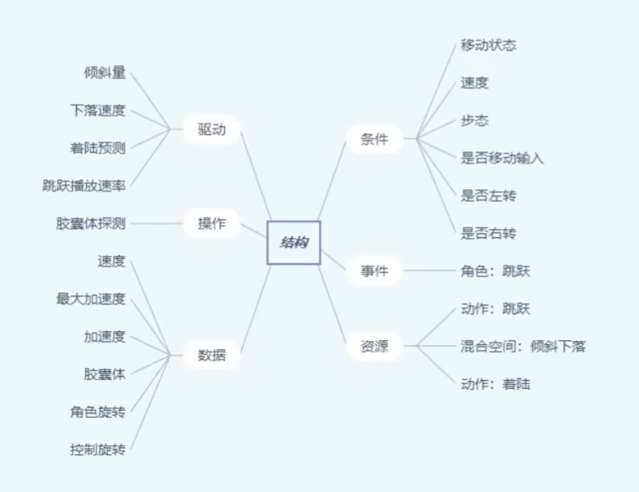
### 跳跃
- 其中跳跃可分为原地跳跃和移动跳跃，在移动跳跃中，左脚在前跳跃和右脚在前跳跃为不同的动画
- 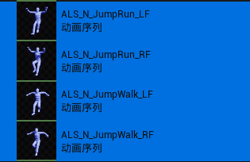
### 着陆
- 其中着陆动作有轻着陆和重着陆两种，他们分别有叠加动画。叠加动画_Additive是着陆动画和待机pose之间的叠加动画。
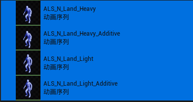  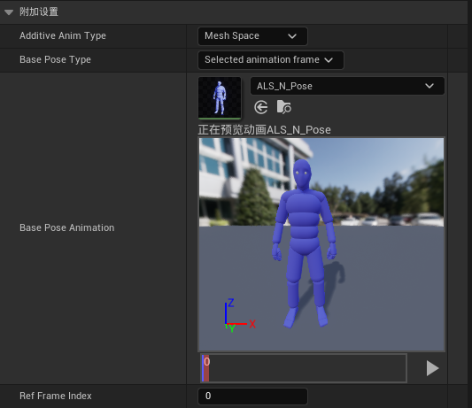

- 移动着陆没有对应的动画，轻着陆和重着陆都为原地着陆动画，那么如何实现移动着陆呢。是在移动动画中叠加了着陆的叠加动画，即： 着陆动画 - 待机动画 + 移动动画
## 地面逻辑
### 站立，蹲伏和翻滚
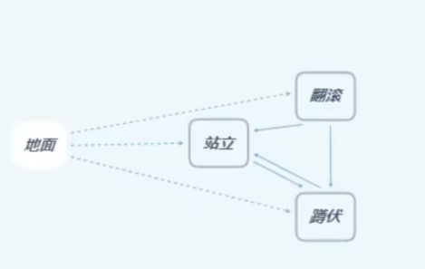

- 其中站立和蹲伏为状态，翻滚为蒙太奇
- 如果之前的姿态是站立，翻滚后仍然回到站立，如果之前的姿态是蹲伏，翻滚后仍然回到蹲伏状态。
- 会获取翻滚的最终pose然后与站立或翻滚动画混合。
#### 数据
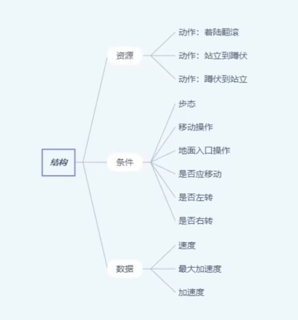
### 移动停止和转身停止
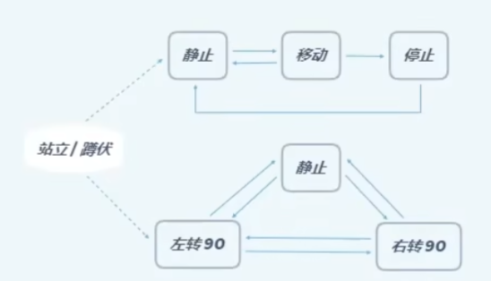
- 通过锁脚来实现不滑步的停止动画。
- 通过锁脚来修正滑步应用非常广泛，包括姿态（持枪，搬箱，女性，壮汉，受伤等）的切换，翻滚之后回 到站立或蹲伏。
#### 数据
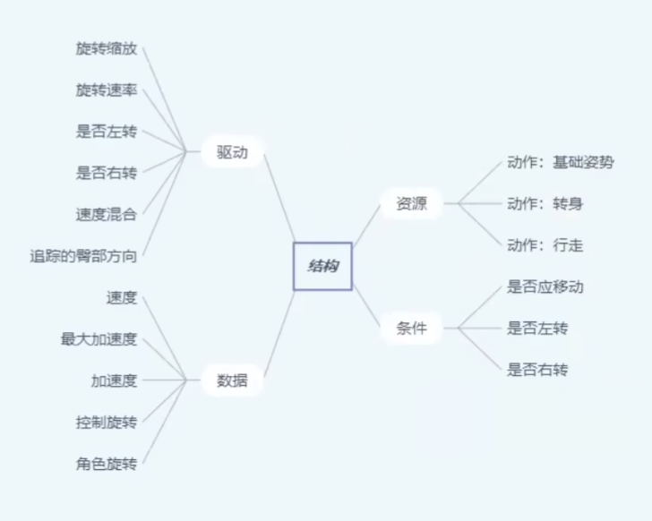
### 转身
- 转身动画在制作时做成根骨骼动画，在引擎中通过根骨骼动画计算旋转量曲线RotateAmount，然后锁定根骨骼，使其变为原地动画。通过旋转量曲线RotateAmount来计算旋转。
- 旋转量曲线RotateAmount是一个根骨骼的旋转值增量，即下一帧的旋转值减去上一帧的旋转值所得的值构成的曲线。
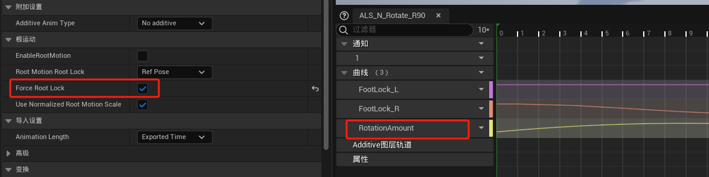
- 摄影机旋转超过一定的角度阈值的时候主角模型发生旋转，这里通过映射来实现，将90度的旋转动画映射为0-1，然后将所需旋转量（比如60度）也映射为0-1，按百分比来驱动动画。
# 移动
## 基本逻辑
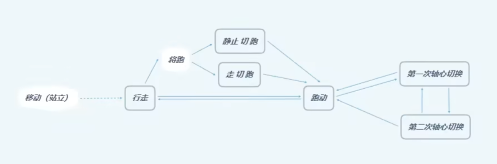
- 待机到奔跑中间会有**将跑**动画作为缓冲，行走到奔跑也一样。
- 在移动中，如果切换相反方向（由前向后，由左到右，左前到右后等），会发生脊椎骨倾斜的现象，即轴心切换。
### 数据
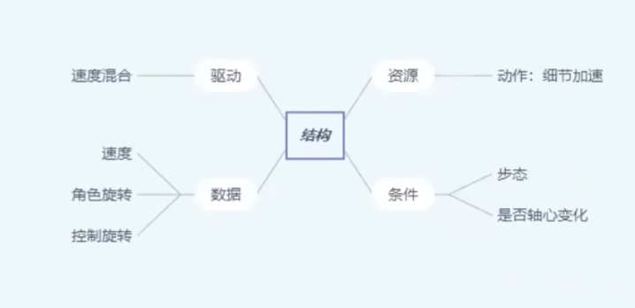

# 八向移动
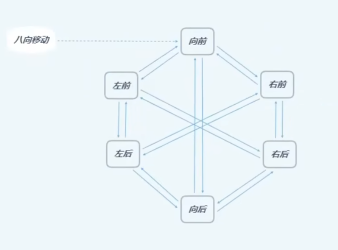
- 其中左前和右后的角色朝向是一样的，都是朝向左前方
- 右前和左后角色朝向是一样的，都是朝向右前方
- 本质上来说其实只有四个方向，前后左右，其中把左方向拆分成了左前左后，右方向拆分成了右前右后
- 默认情况下，左方向移动用的是左前动画，右方向移动用的是右前动画。
- 其中在左右切换的时候会有一个扭胯效果：
	- 左前 ——右后——右前
	- 右前——左后——左前
## 数据
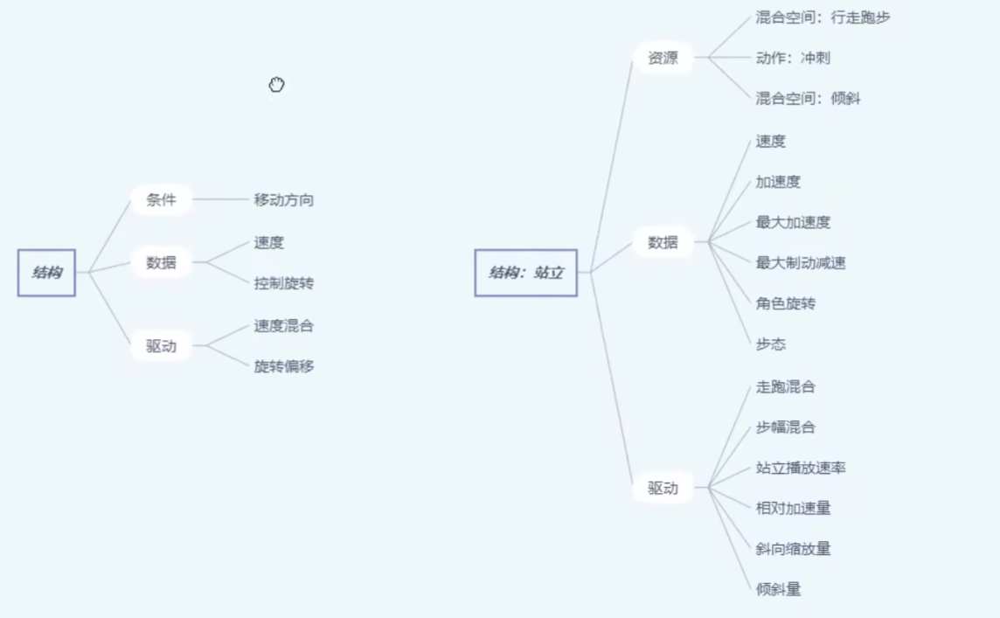

# 动画数据
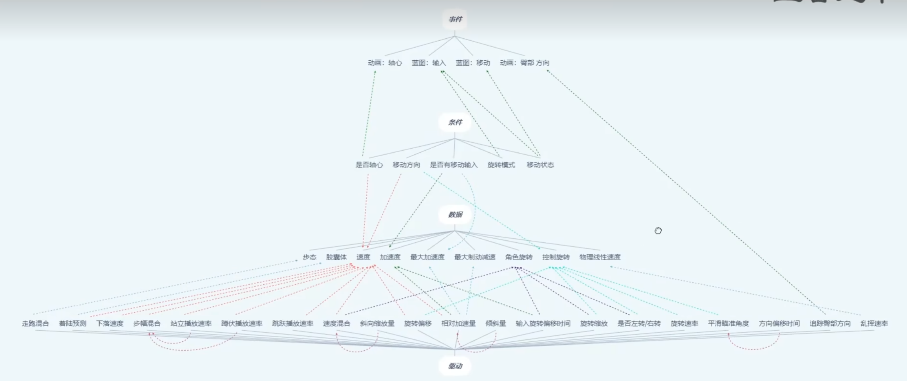
# 覆盖姿势
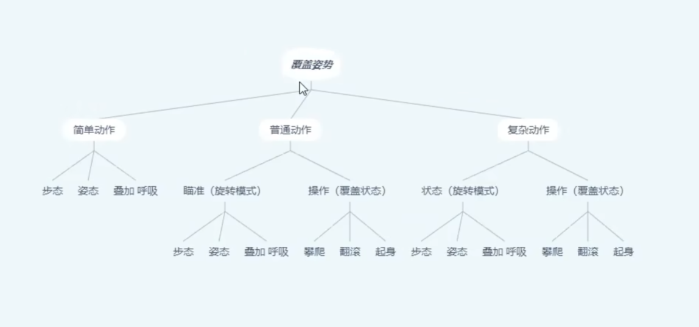
# 姿势混合
- 通过创建动态叠加的办法实现姿势的混合
- 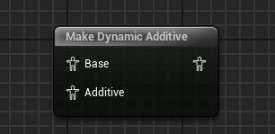
- 叠加度和混合度通过动画曲线来实现
- 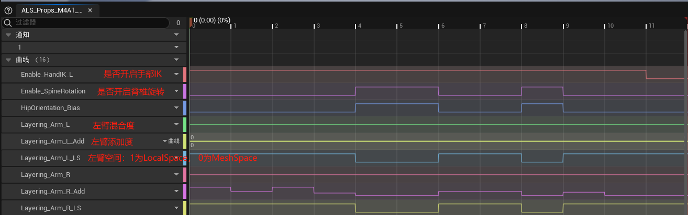
# 动画曲线
## 开关类
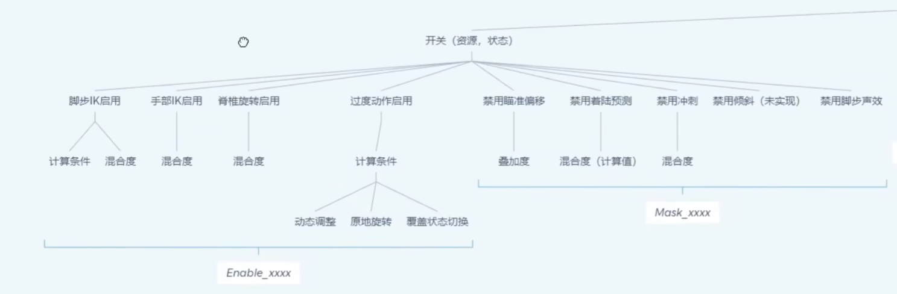
## 层混合类曲线
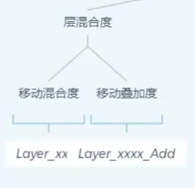
## 动画资源标注类
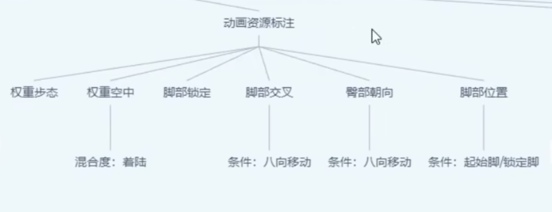
## 其他类曲线
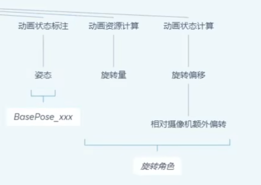