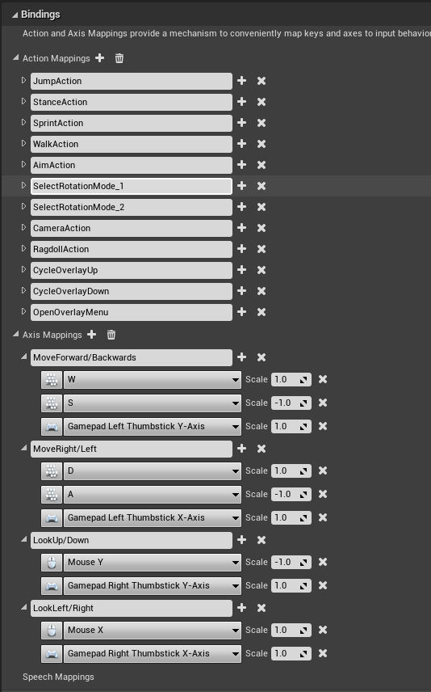
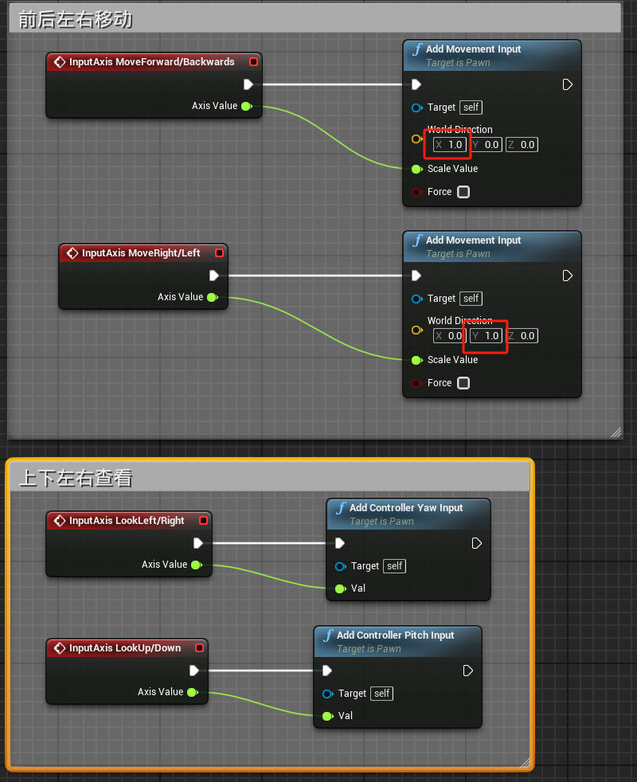
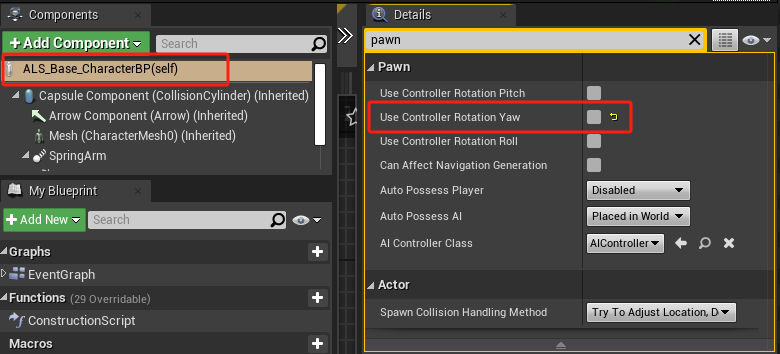
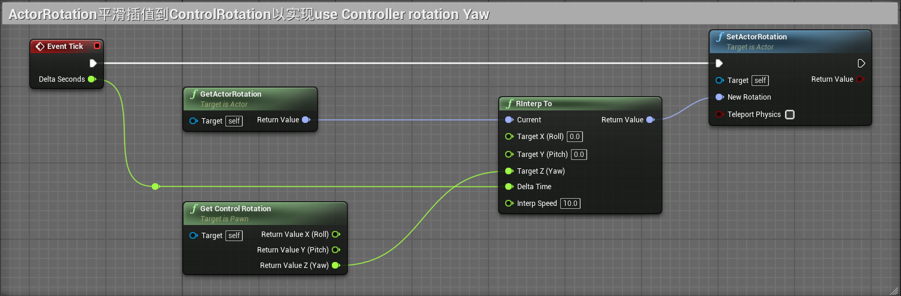
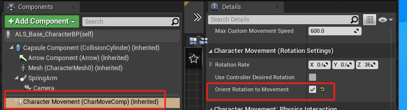
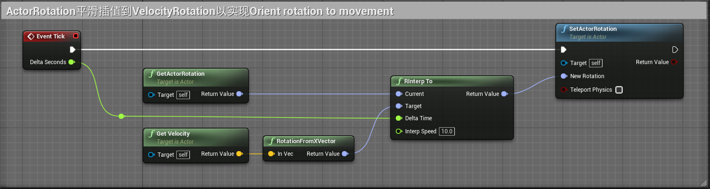
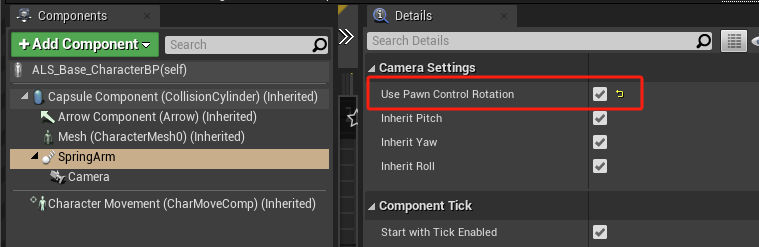
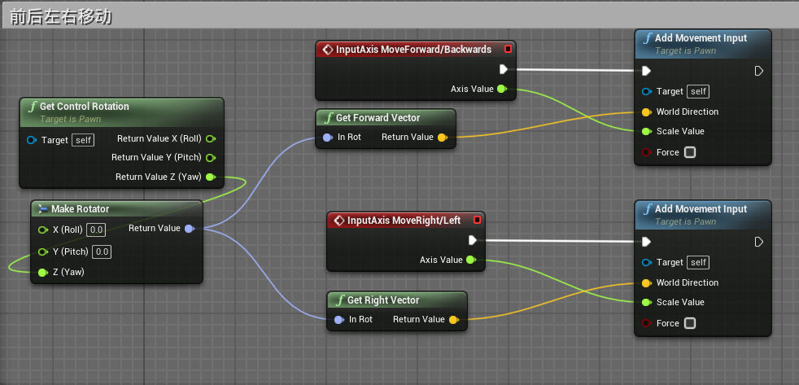

# 输入和移动
## 输入
- 分为操作映射（用于一次性操作）和轴映射（用于移动和转向）
- 
- 角色蓝图事件图表调用输入事件
- 
- 此时，角色可以前后移动，且角色完全跟随摄影机旋转
- 取消勾选use Controller rotation Yaw，控制器旋转将不再更新角色旋转，第一人称游戏需要勾选设置，第三人称不勾选
- 
- use Controller rotation Yaw实现原理
- 
- 勾选Orient rotation to movement，旋转朝向移动，角色将转向移动方向。但是摄影机也会转向移动方向。
- 
- Orient rotation to movement的实现原理
- 
- 勾选Use Pawn Control Rotation,使用拥有该Pawn的Controller控制旋转，控制器的输入会控制该Pawn的摄像机。此时摄影机不会转向移动方向了，而是使用控制器自身的旋转。
- 

- 此时，角色的前后左右方向是世界坐标的，我们要切换成自身坐标的，就是要求出角色向前向量来作为角色自身的前方。
- 我们在角色蓝图事件图表中获取控制器旋转，提取Yaw轴生成旋转体来获得角色自身的向前向量和向右向量
- 