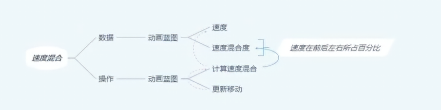
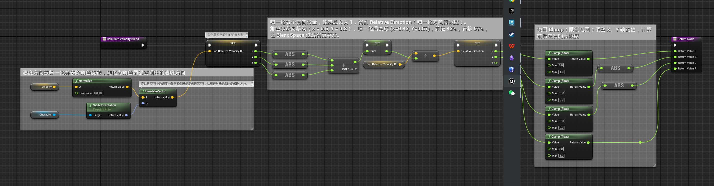
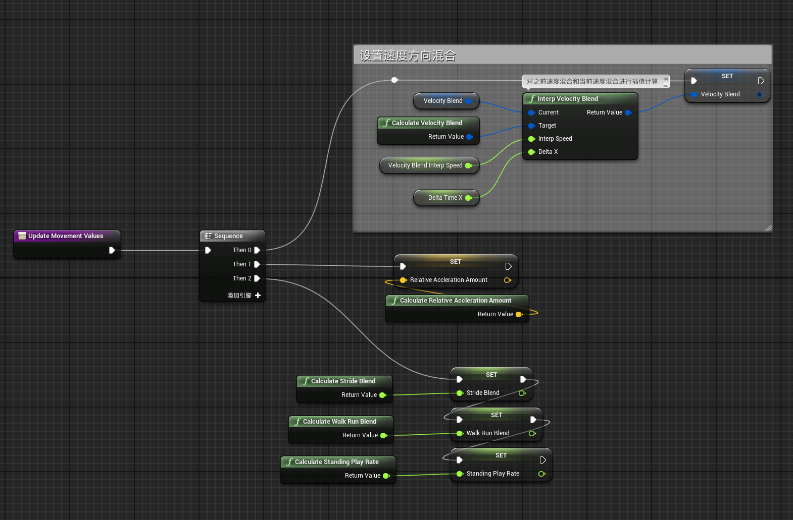
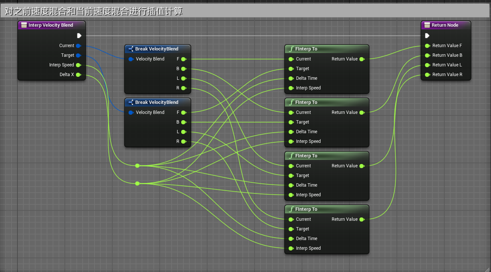

# 概述
- 根据速度的方向决定四个朝向动作的混合度  
- 

# 动画蓝图
## 事件图表
- Calculate Velocity Blend函数通过角色移动的Velocity计算角色前后左右的移动分量

- 在Update Movement Values函数中调用
- 
- 其中的Interp Velocity Blend函数，对之前速度混合和当前速度混合进行插值计算，用于平滑方向切换时的跳变
- 