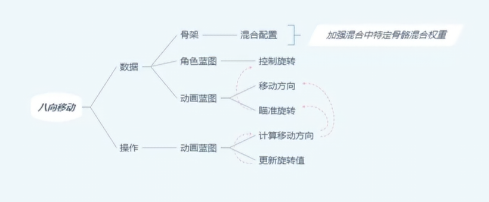
# 概述
- 讲之前四相移动扩展为八向移动。
- 在事件图表中通过Velocity和Controller Rotation之间的差值计算出角色局部旋转值，判断旋转值在前后左右哪个象限内来确定Movement Direction。
- 在动画图表中通过判断Movement Direction来确定播放哪个动画状态，每个状态都有自己的前后左右逻辑，其中
	- 前的左是左前，右是右前
	- 后的左是左后，右是右后
	- 左前的左是左前，右是右后
	- 左后的左是左后，右是右前
	- 右前的左是左后，右前的右是右前
	- 右后的左是左前，右是右后
# 角色蓝图
- 在接口函数中同步控制旋转
- 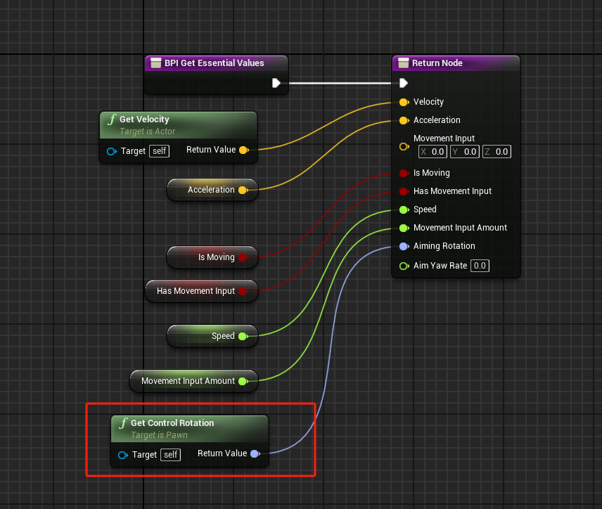
# 动画蓝图
## 事件图表
- Angle in Range函数， 检查角度是否在特定范围内的逻辑。
- 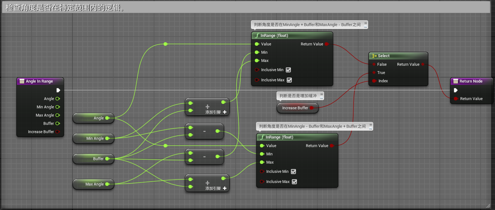
- 其中如果不增加缓冲（项目中Buffer值默认为5)，判断的是角度是否在MinAngle + Buffer和MaxAngle - Buffer之间
- 如果增加缓冲，判断的是角度是否在MinAngle - Buffer和MaxAngle + Buffer之间
- 如下图所示

- Calculate Quadrant计算象限函数，判断移动方向是在哪个象限内。
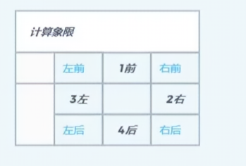
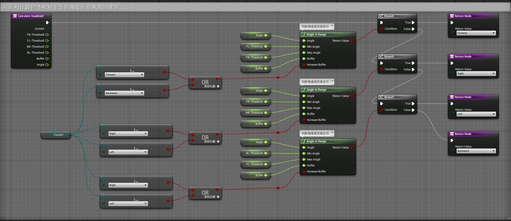

- Calculate Movement Direction计算运动朝向函数
- 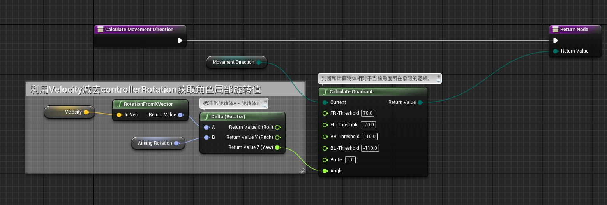
- Update Rotation Values函数
- 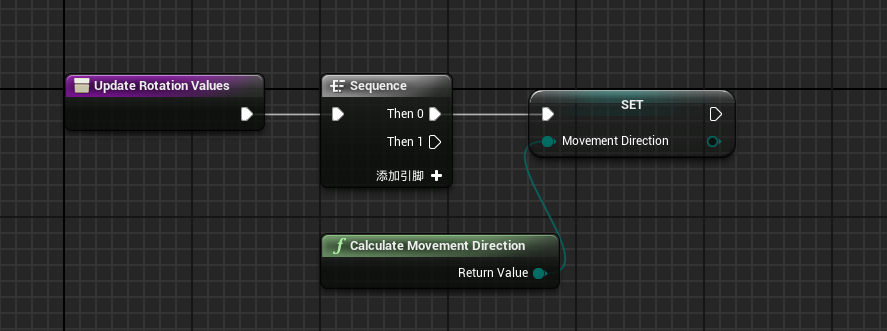
- 在Event Blueprint Update Animation中调用
- 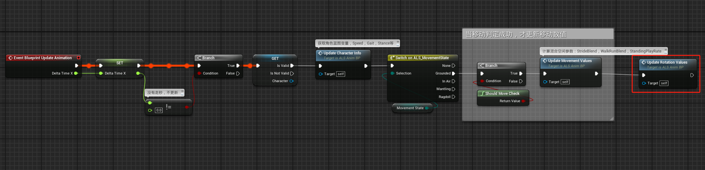
# 动画图表
- 新建一个状态机用于八向移动状态
- 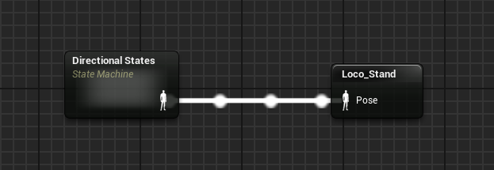
- 在状态机内创建状态和过渡条件
- 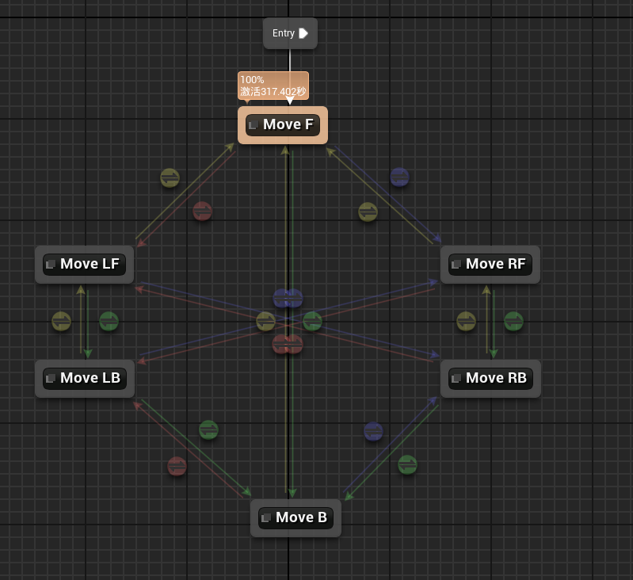
- 将四个过渡条件提升为共享，其中
	- 黄色的是Move F条件
	- 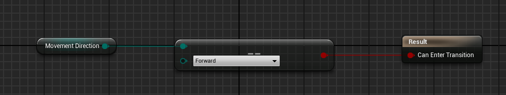
	- 绿色的是Move B条件
	- 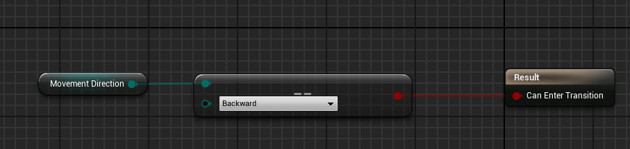
	- 红色的是Move L条件
	- 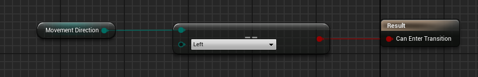
	- 蓝色的是Move R条件
	- 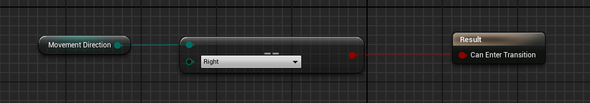
- 八个状态：
	- Move F
	- 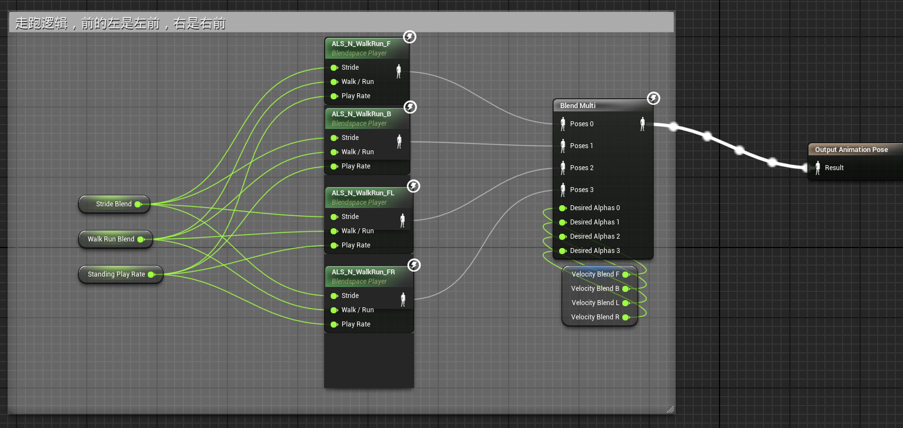
	- Move B
	- 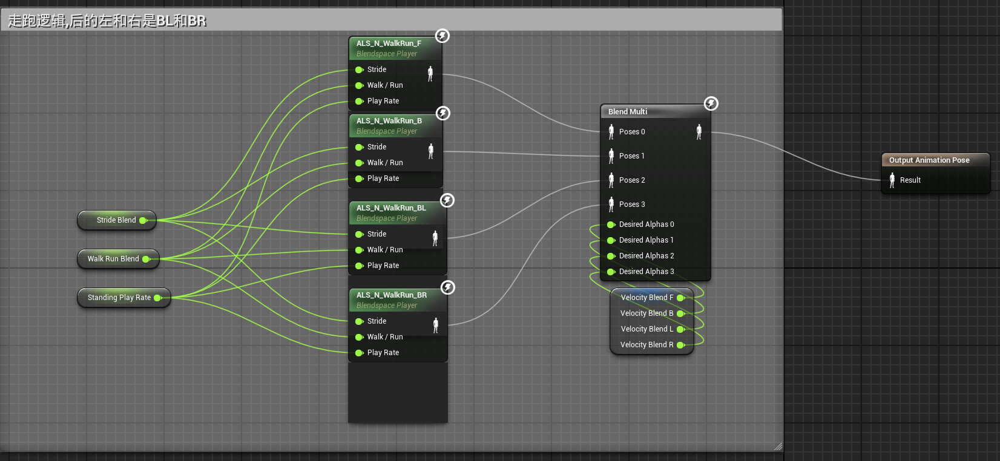
	- Move LF
	- 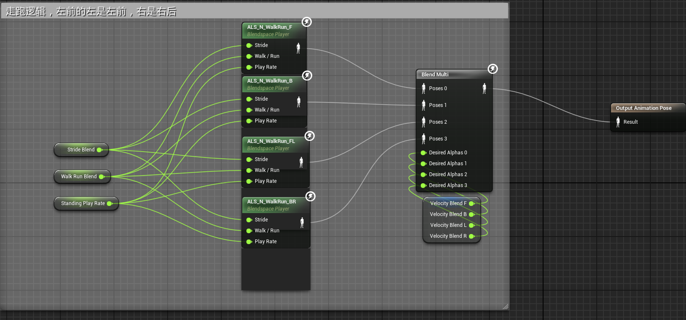
	- Move LB
	- 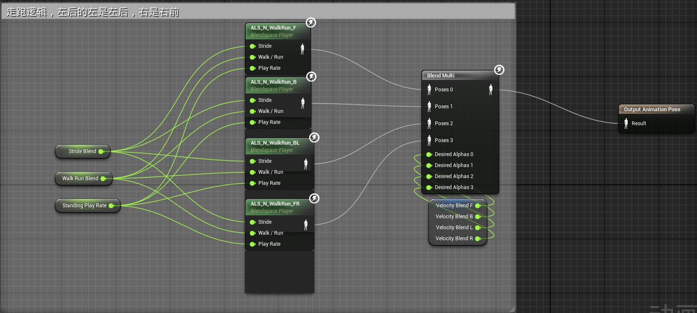
	- Move RF
	- 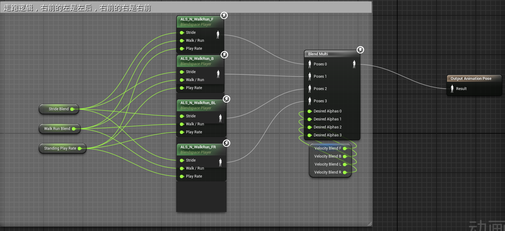
	- Move RB
	- 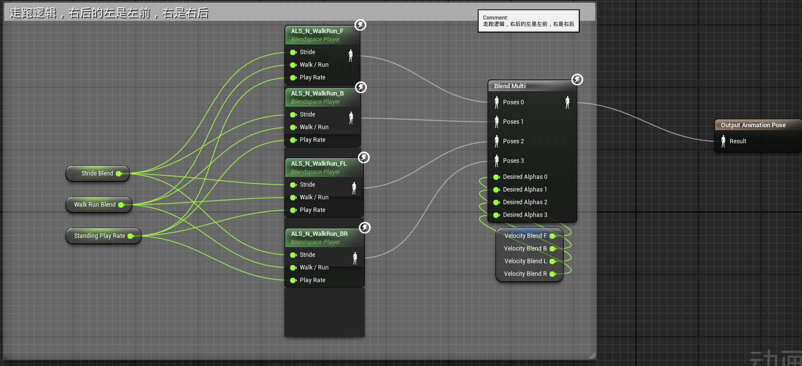