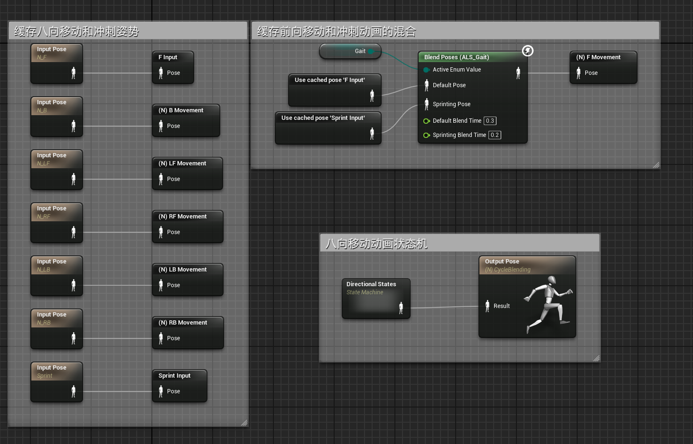
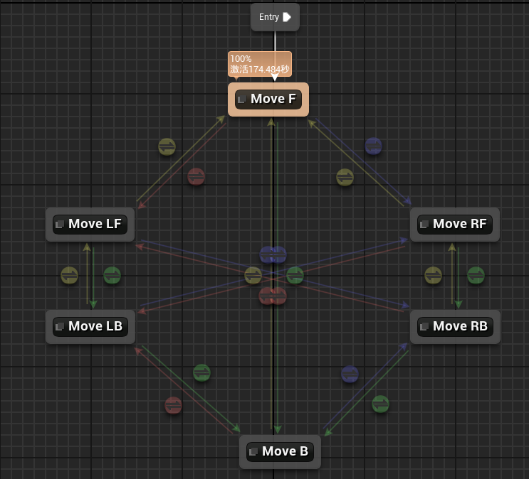
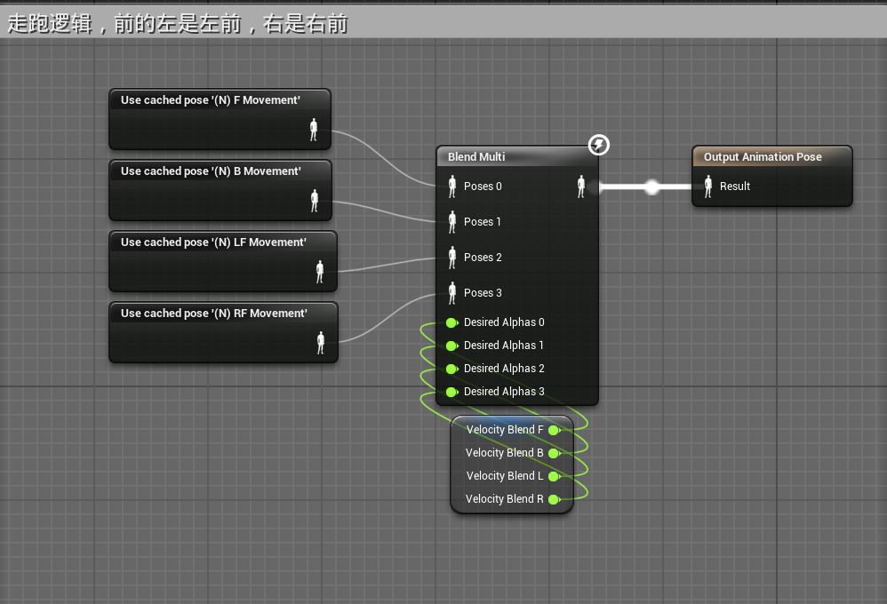
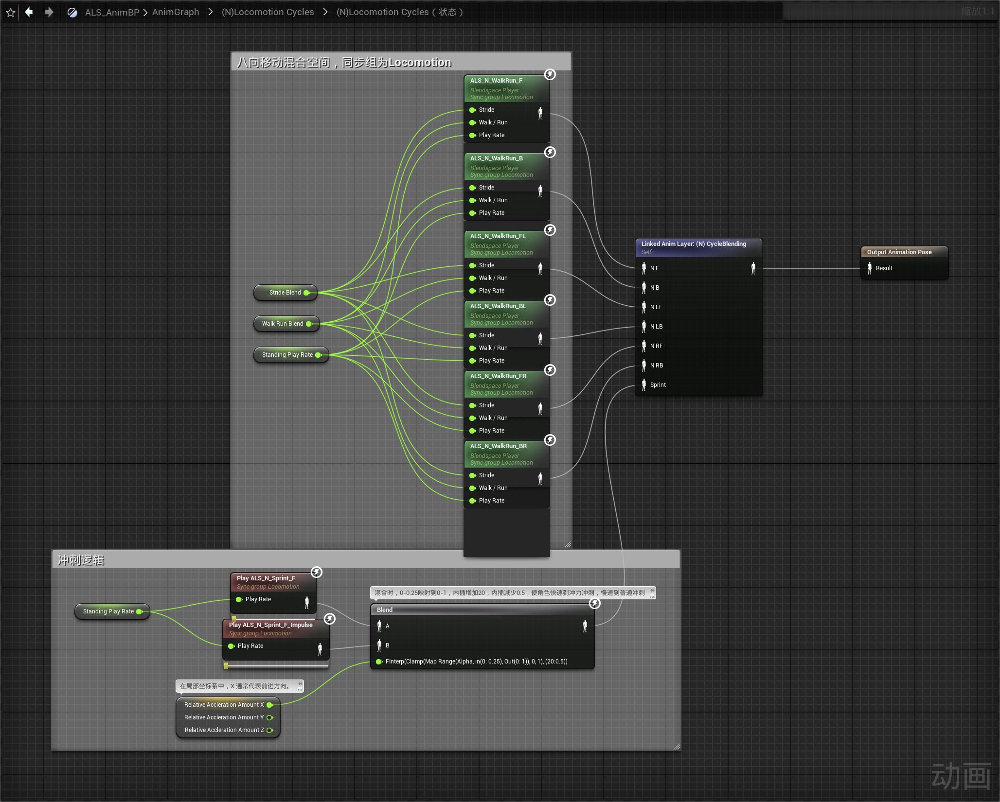

# 概述
- 利用动画层AnimLayer和缓存姿势 SaveCachePose来优化状态机融合冲刺动画
# 动画蓝图
## 动画图表
- 创建动画层(N) CycleBlending
- 
- 动画层中的状态机Directional States为八向移动状态机
- 
- 状态机中的各个状态动画资源替换为缓存的姿势
- 
- 还是之前的逻辑，不再一一截图，其中：
	- 所有状态的前和后都是前和后，只是左右不同
	- 前的左是左前，右是右前
	- 后的左是左后，右是右后
	- 左前的左是左前，右是右后
	- 左后的左是左后，右是右前
	- 右前的左是左后，右前的右是右前
	- 右后的左是左前，右是右后
- 在动画图表中调用动画层
- 