# 概述
# 八项移动混合的规则设置
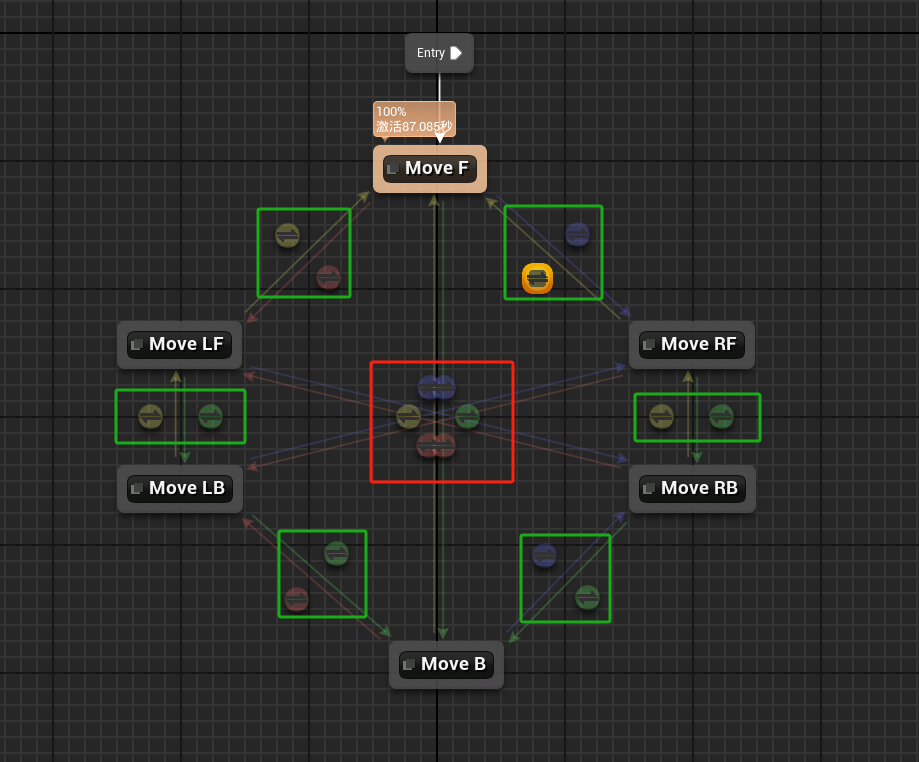
图中红色方框内的过度规则为：
- 淡入淡出过渡时长为0.5，模式为Cubic立方，并将其提升为共享：Pivot
- 混合描述为：ChangeDirection
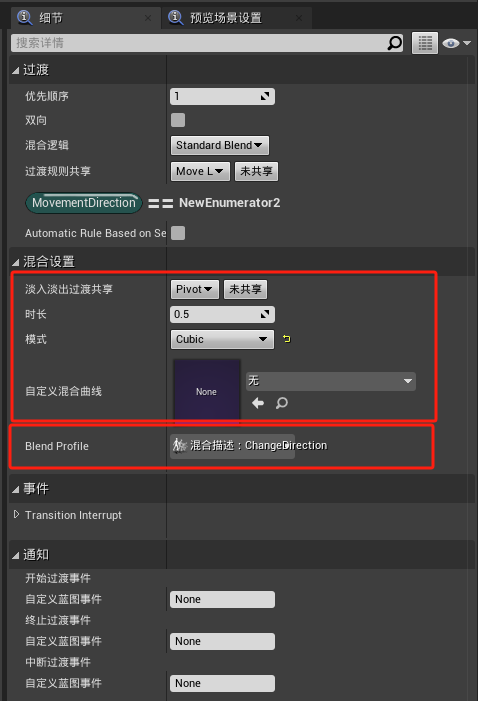
图中绿色方框内的过渡规则为
- 淡入淡出过渡时长为0.7，模式为Cubic立方，并将其提升为共享：ChangeDirection
- 混合描述为：ChangeDirection
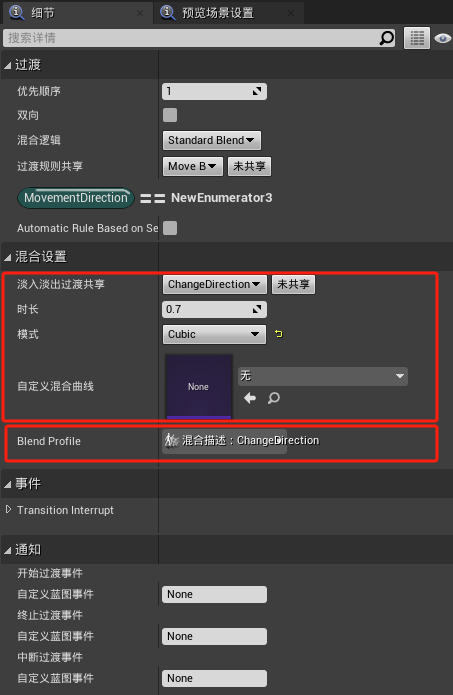
其中的混合描述为网格体骨架上创建的，值为1的意思是正常速度混合，值为2的意思是两倍速混合
- 只有双腿相关的骨骼混合速度为2，当进行动画过渡时，腿部先混合，其他部位再完成混合。
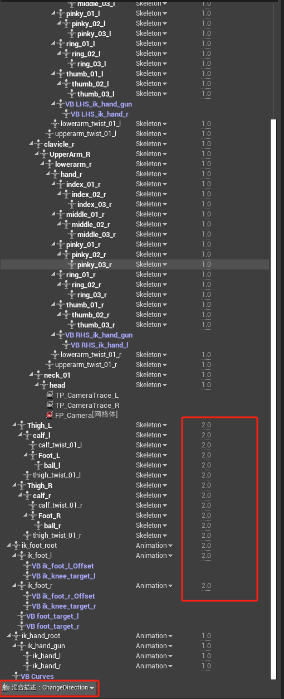
# 左右运动切换表现
- 高级运动系统角色在左右移动的时候顺序为：
	- 左 -> 右：左前 -> 右后 -> 右前
	- 右 -> 左：右前 -> 左后 -> 左前
- 而当前我们的动画状态只有
	- 左前 -> 右后
	- 右前 -> 左后 
- 因此我们在右后 -> 右前， 左后 -> 左前再次添加过渡规则
- 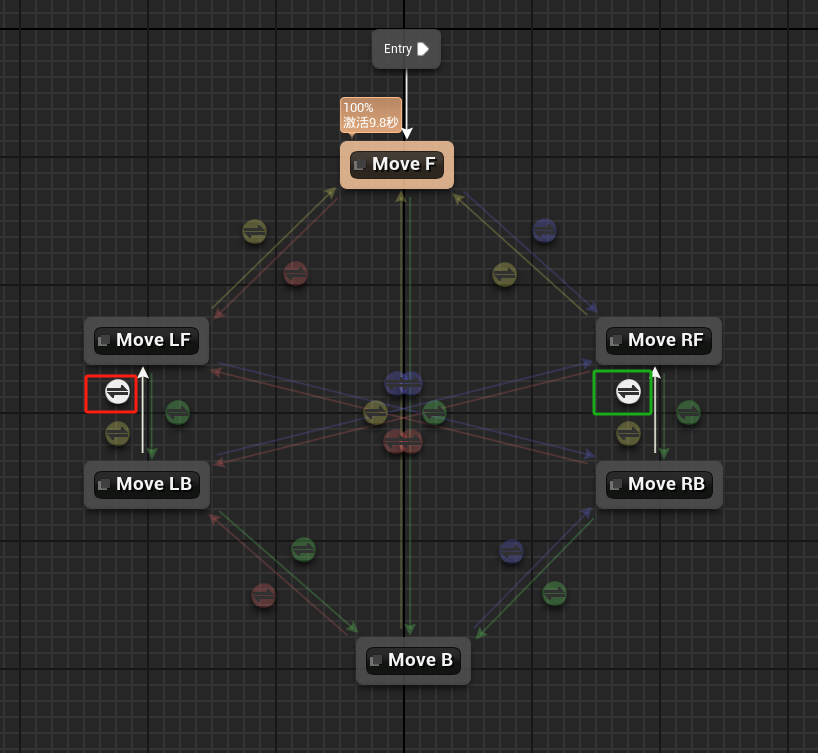
- 其中红框内的条件为
- 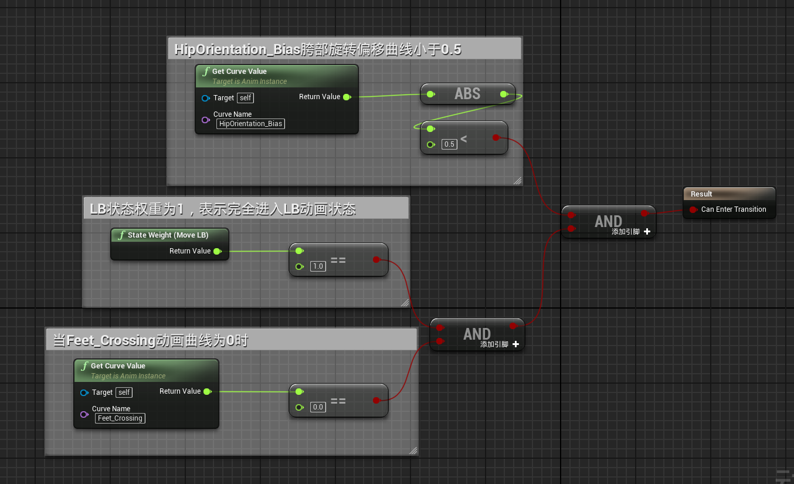
- 绿框内的条件为
- 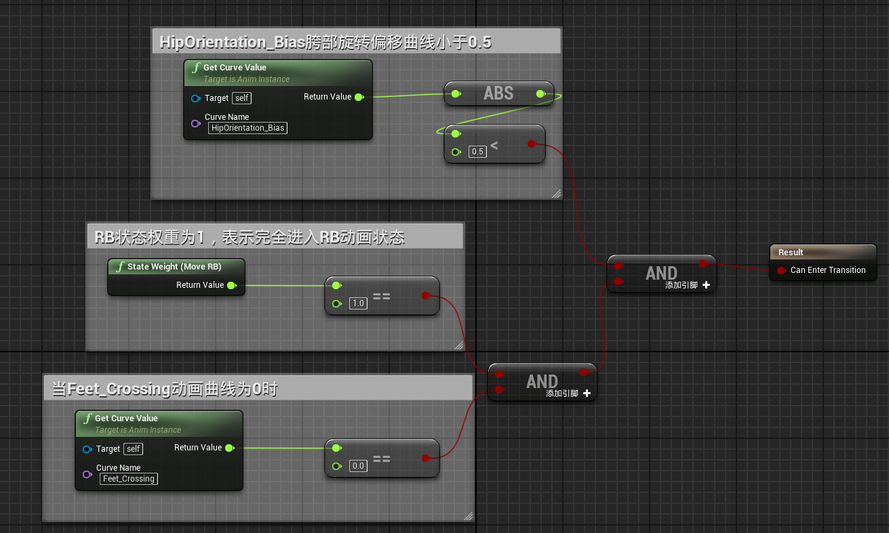
- 其中Feet_Crossing曲线是骨骼上的曲线，在左右运动的动画中有体现，表示为当双腿交叉结束后再混合过渡动画，防止出现动画错误。
- 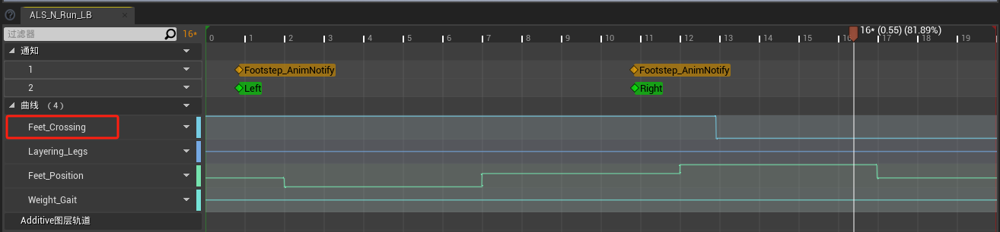
- 而HipOrientation_Bias曲线并非在Locomotion动画中，而是存在于overlay覆盖层动画中，比如射箭瞄准的时候为1，不瞄准的时候为0，也就是在不瞄准的时候才会过渡，瞄准的时候不过渡。
- 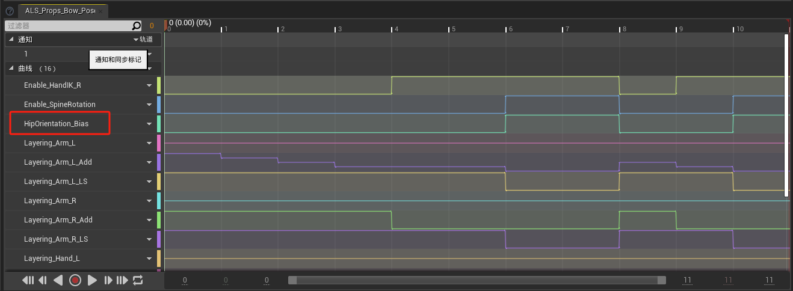
- 他们的混合设置为
- 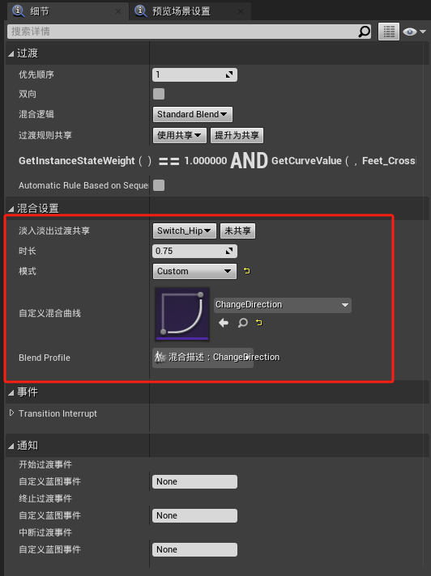
- 我们在右前 -> 右后，右后 -> 右前，左前 -> 左后，左后 -> 左前再次添加4个次级过渡规则，使动画状态根据曲线在左前左后和右前右后之间切换
- 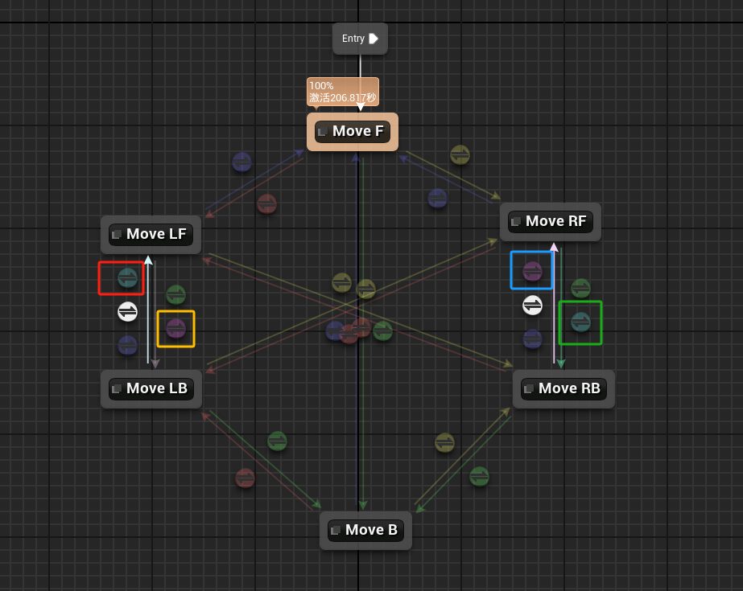
- 其中红色和绿色的过渡规则提升共享为Hips_Left，优先级设为2,低于1的优先级
- 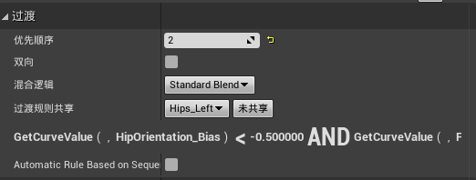
- 黄色和蓝色的过渡规则提升共享为Hips_Right，优先级设为2,低于1的优先级
- 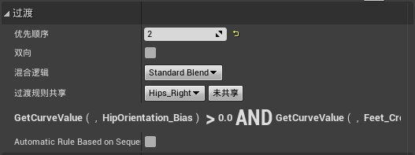
- 他们的混合设置都是Switch_Hip
- 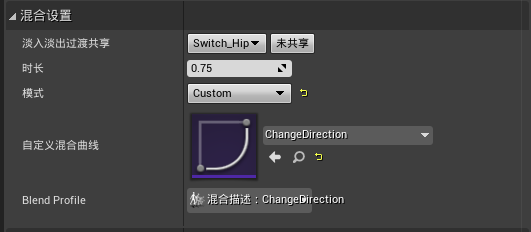
- 其中Hips_Left规则为：
- 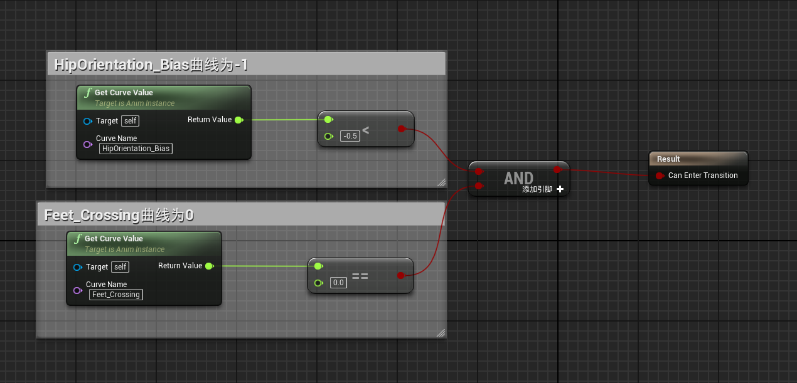
- 其中Hips_Right规则为：
- 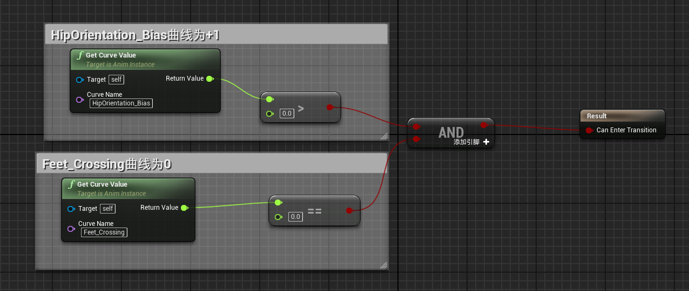
# 添加事件
- 来表明角色处于哪种状态
- 在每个状态中添加Hips_X蓝图事件
- 例如，在Move F状态中添加Move F蓝图事件，在Move RF状态中添加Hips_RF事件
- 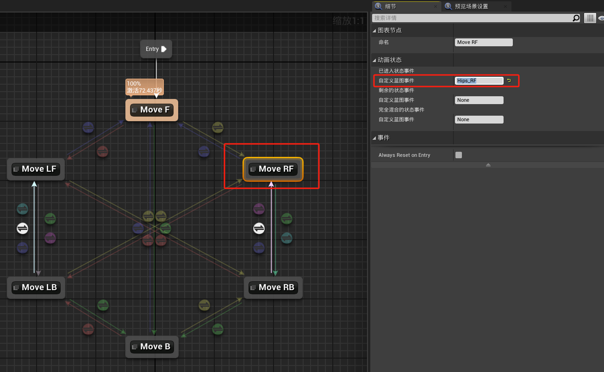
- 在轴心切换的过渡条件中添加Pivot事件
- 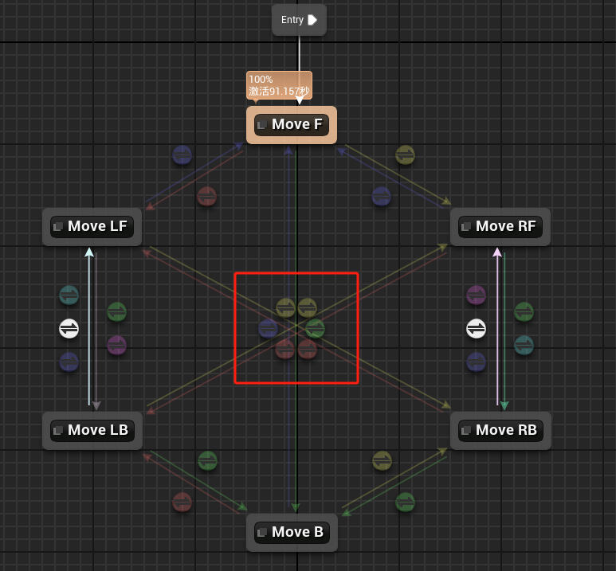
- 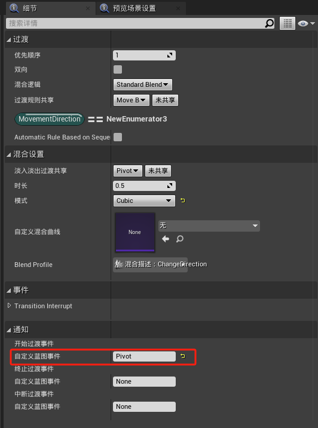
# 事件蓝图
- 在事件蓝图中可以找到这些事件
- 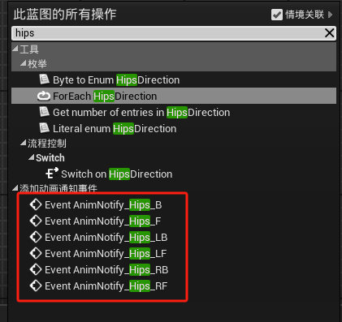
- 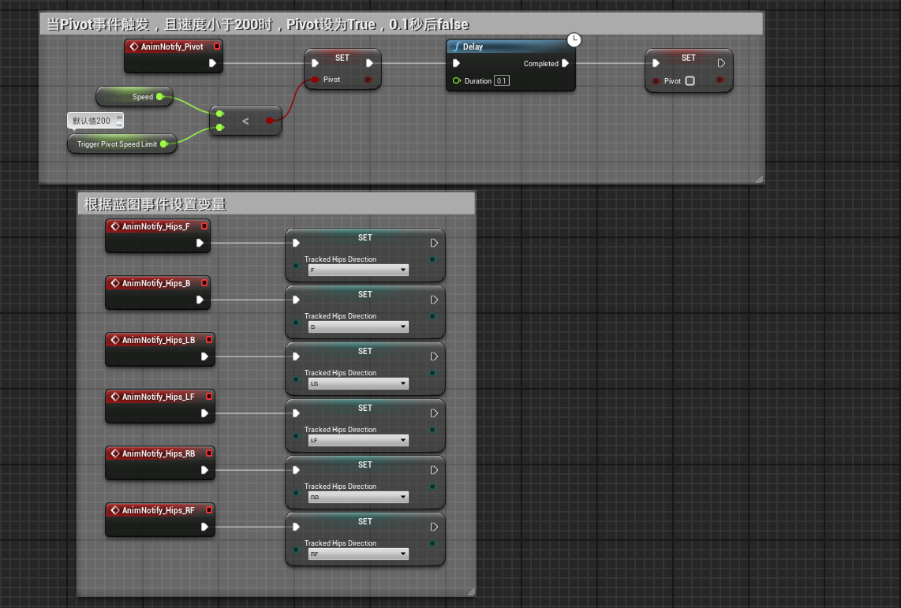