# 概述
- 因为在角色蓝图中，Use Controller Rotation Yaw 和运动组件中Oriente Rotation To Movement都已关闭，所以角色旋转需要自己处理
- 首先来实现Use Controller Rotation Yaw的功能
- 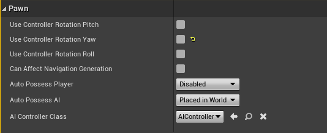
- 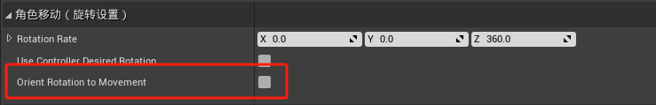
# 修正冲刺方向
- 目前的状态下，角色八方向都可以冲刺，我们要限制只有前方向可以冲刺
- 在动画蓝图Calculate Movement Direction函数中修改
- 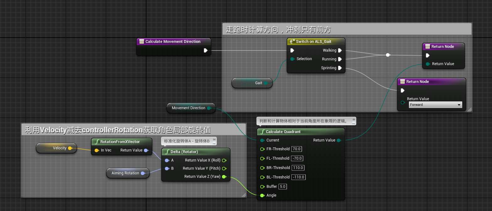
# 角色旋转处理
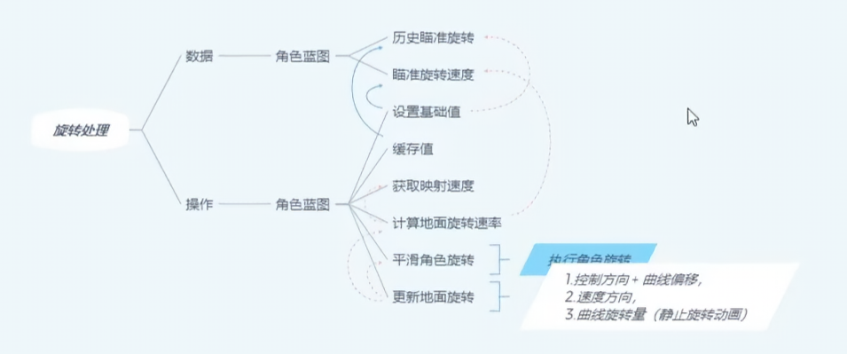
## 角色蓝图
- 主要修改两个函数，CacheValues和SetEssentialValues
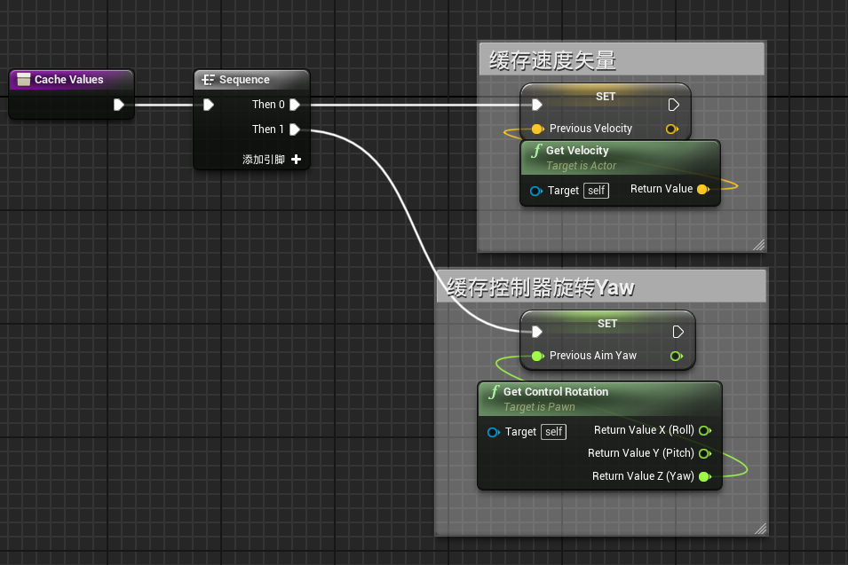
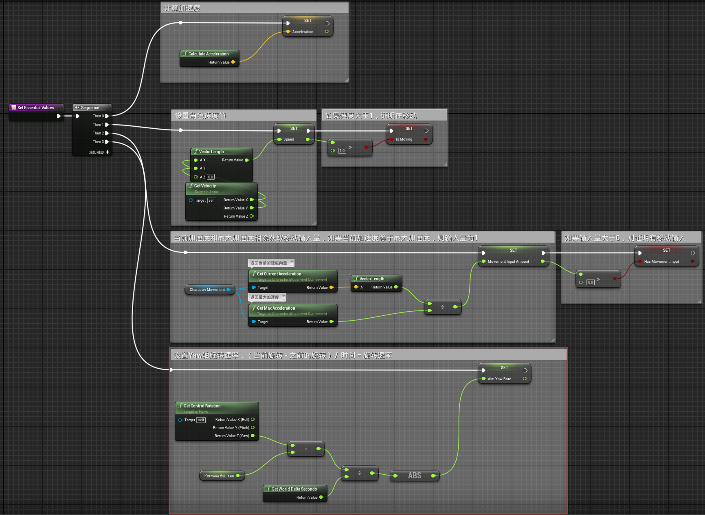

- 添加新的函数SmoothCharacterRotation，CalculateGroundedRotationRate，CanUpdateMovingRotation，UpdateGroundedRotation
- SmoothCharacterRotation函数实现角色蓝图中 Use Controller Rotation Yaw 的逻辑，从上一帧的RotationTarget线性插值到当前RotationTarget，再将角色的Rotation平滑插值到当前RotationTarget。
- 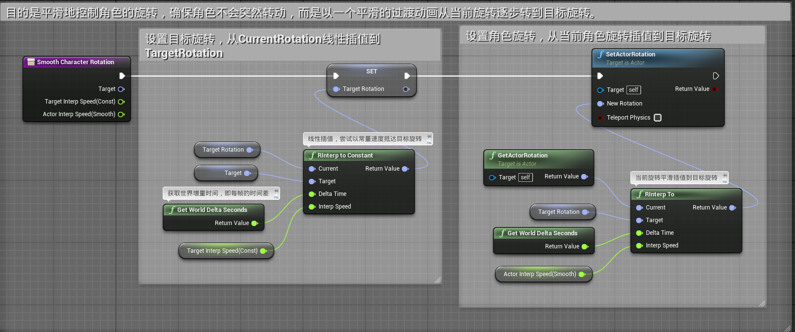
- CalculateGroundedRotationRate
- 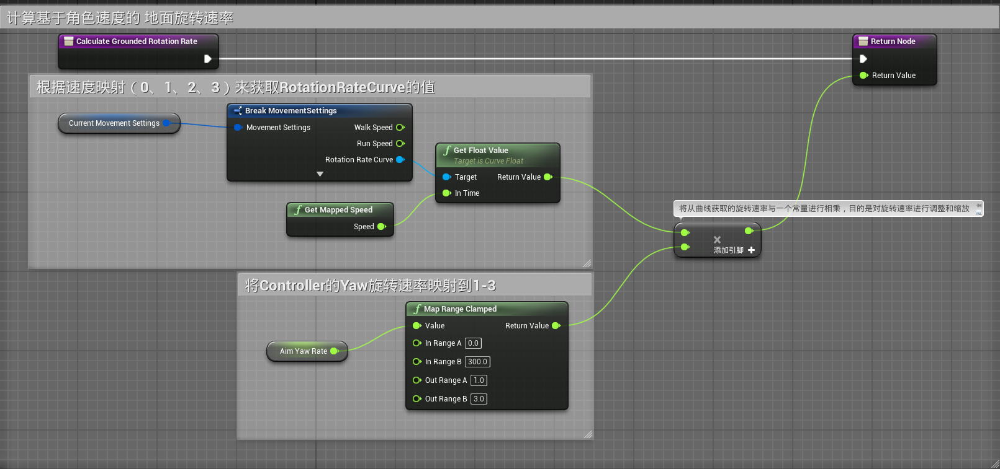
- 其中RotationRateCurve的曲线为下图，速度越快，旋转速率越快
- 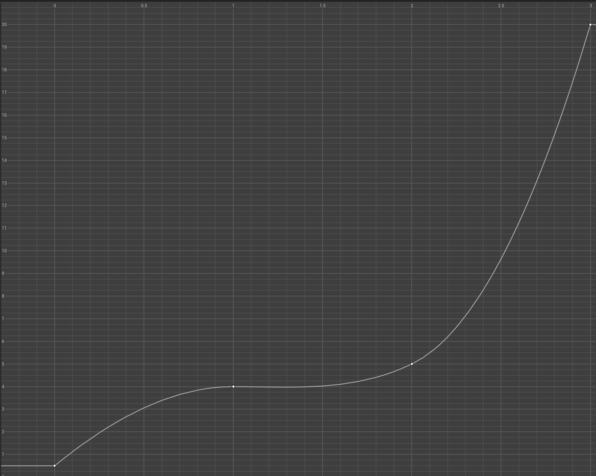
- CanUpdateMovingRotation
- 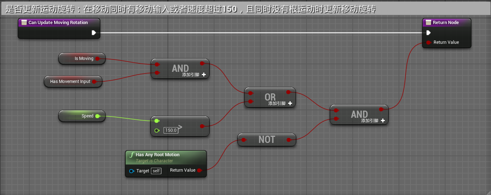
- UpdateGroundedRotation
- 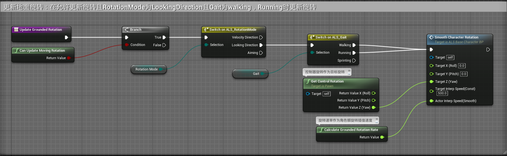
- 在TickGraph图表中TickEvent事件中调用
- 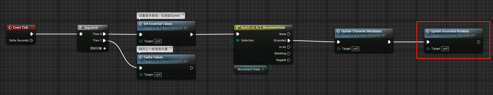
