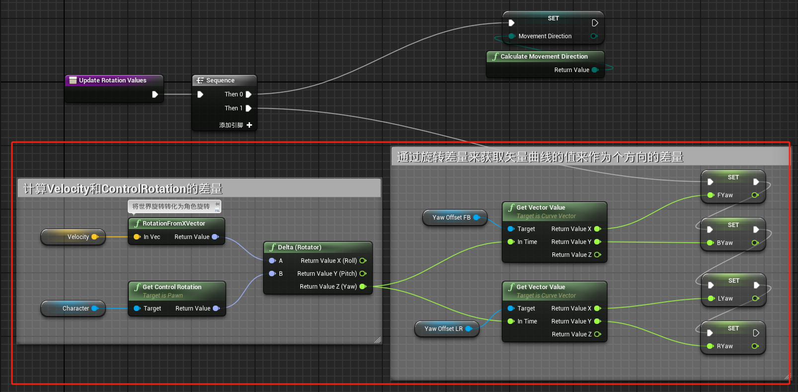
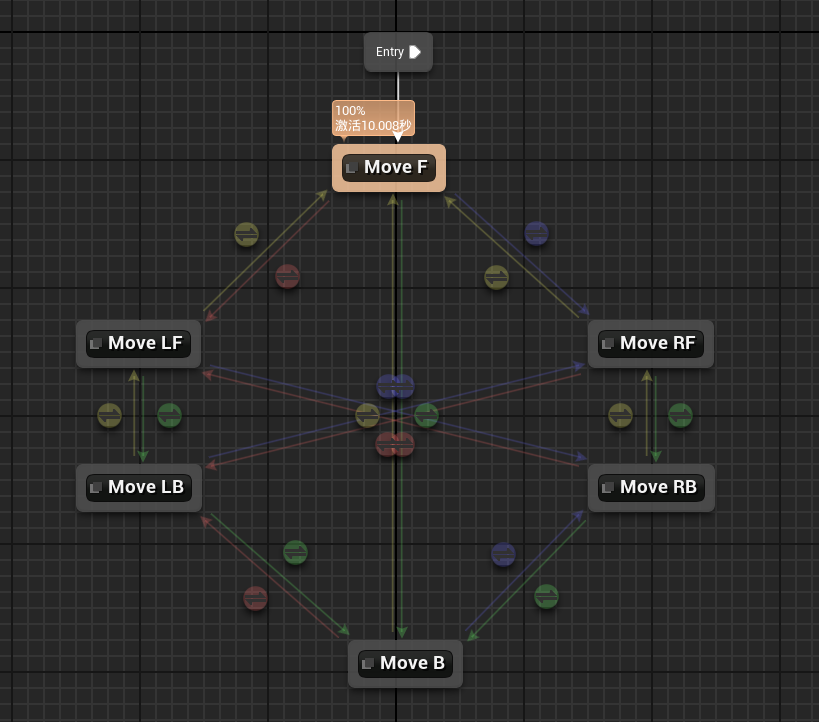
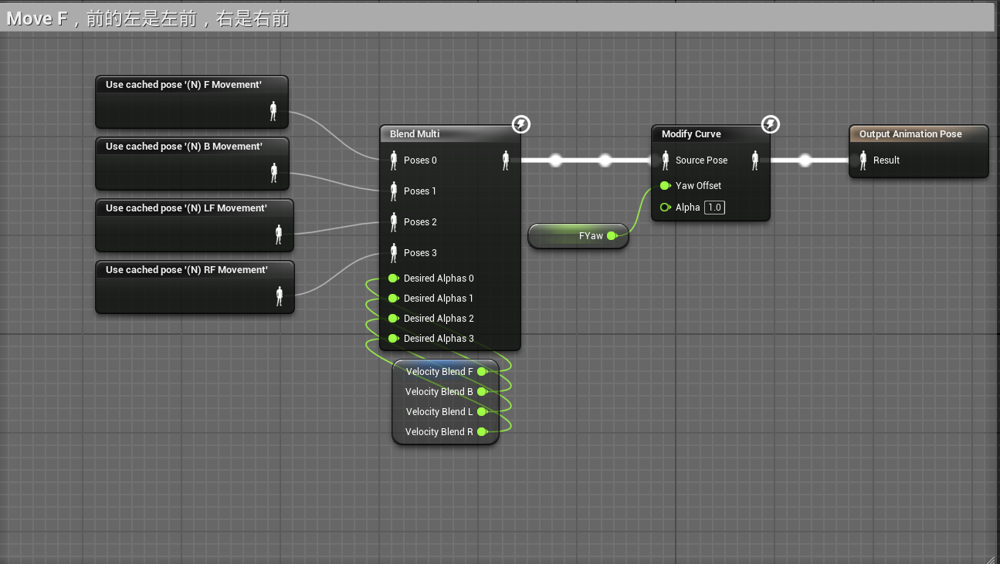
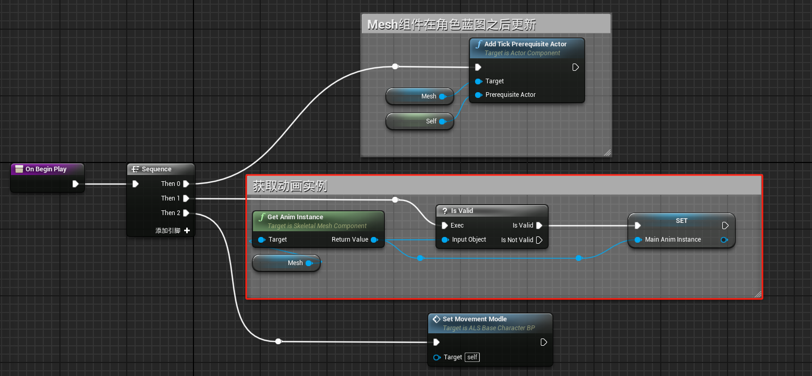
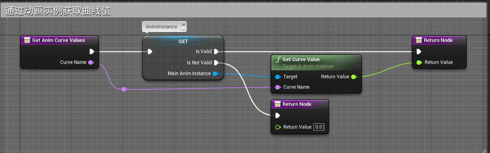
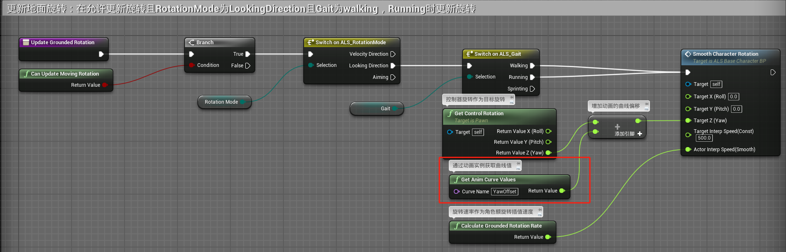

# 概述
- 在上一节我们完成了让角色转向控制器方向并以其为标准来决定玩家输入WASD时的运动表现。
- 本章内容为在转向控制器朝向的过程中，WASD四个方向根据不同的控制器与角色朝向差，会产生不同的表现。
- 这样做的优点在于将四方向的旋转偏移整合为一个共用属性YawOffset，我们只需要调整曲线的值就能达到控制四个方向的选转偏移表现，而不需要额外的方向判断处理。
- 
# 动画蓝图
## 事件图表
- 在Update Rotation Values函数中计算四方向的旋转差值
- 
## 动画图表
- 在动画蓝图的八方向移动状态中
- 
- 其中Move F中增加ModifyCurve节点，并添加曲线引脚YawOffset，将计算出的FYaw传入
- 
- 其他各个方向皆如此修改
	- Move B状态使用BYaw
	- Move LF LB 状态使用LYaw
	- Move RF RB 状态使用RYaw
# 角色蓝图
- 在OnBeginPlay中获取动画实例
- 
- 创建函数Get Anim Curve Values
- 
- 在Update Grounded Rotation函数中调用，增加旋转偏移
- 