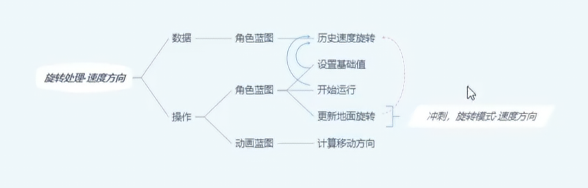
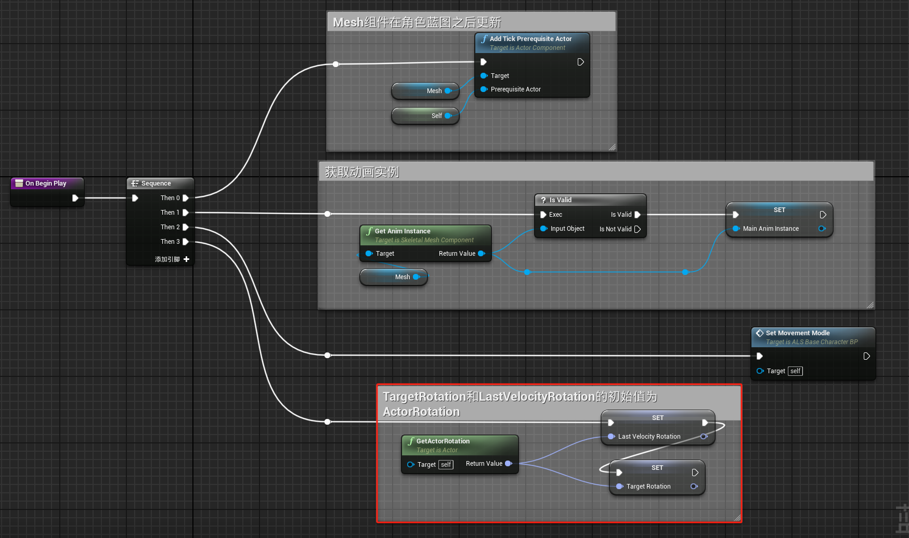
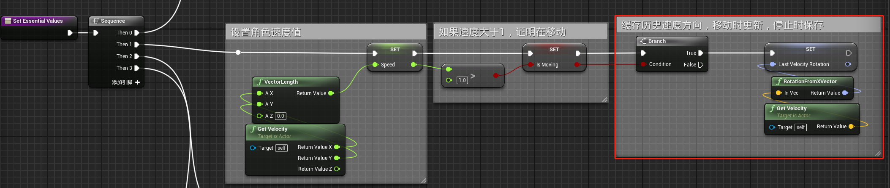
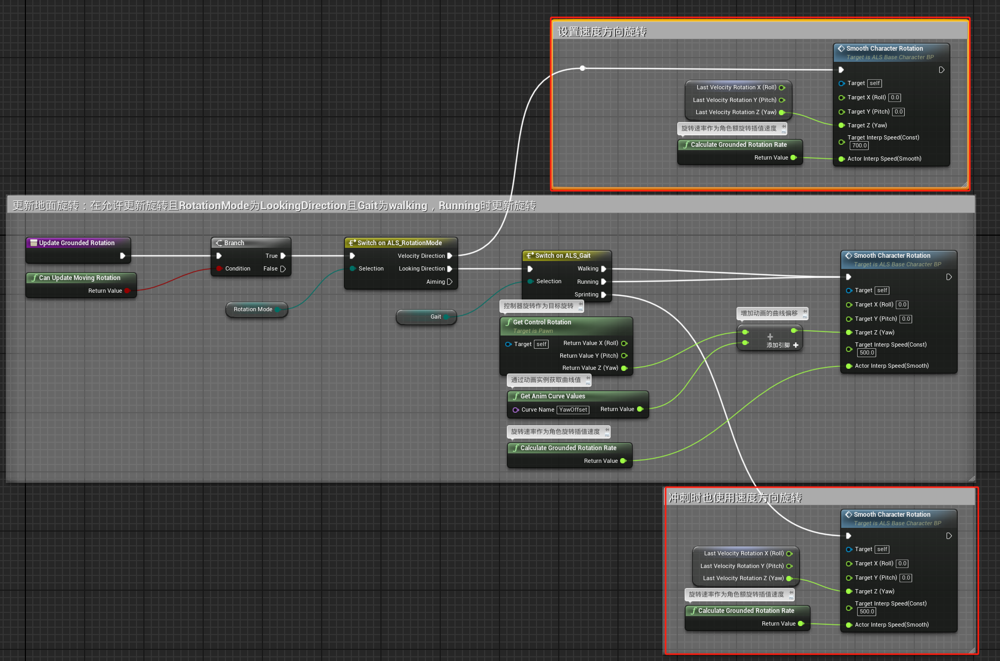
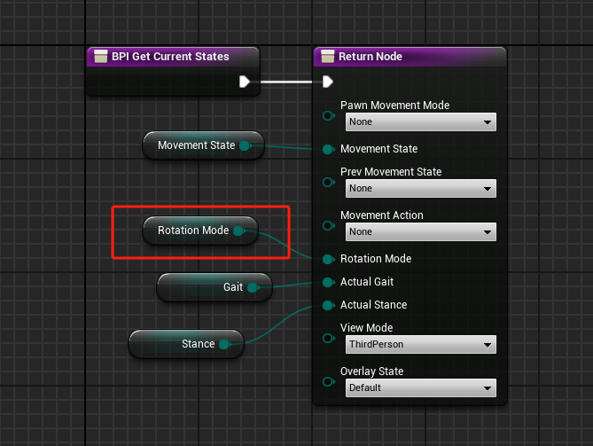
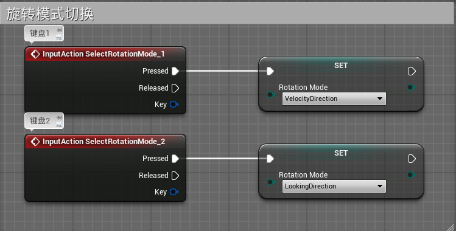
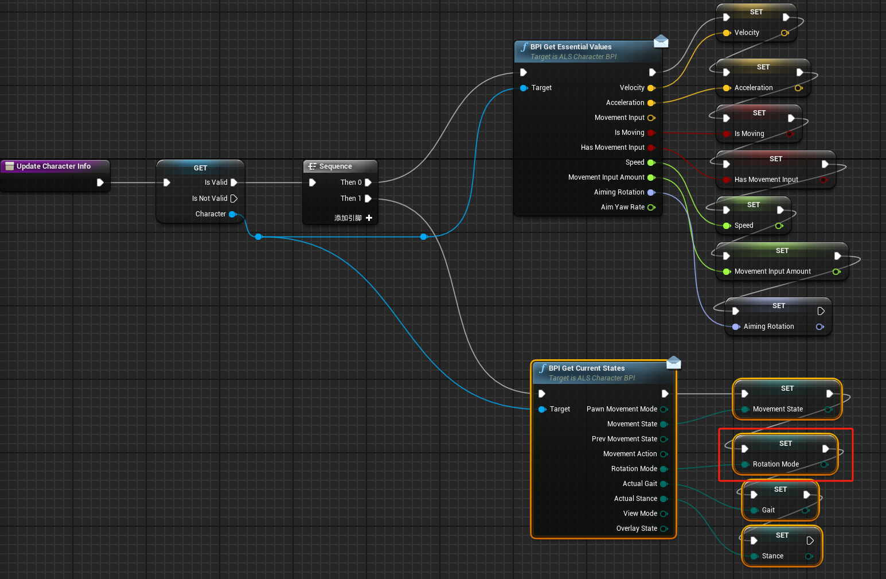
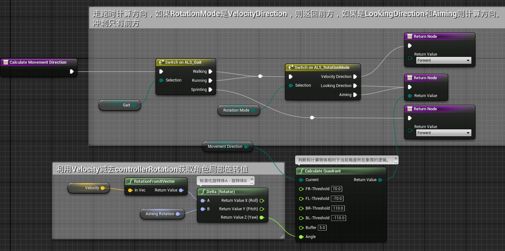

# 概述
- 实现速度方向Velocity上的旋转处理，实现运动组件中Oriente Rotation To Movement的功能
- 
# 角色蓝图
- 在On Begin Play函数中设置TargetRotation和LastVelocityRotation的初始值为ActorRotation
- 
- 在Set Essential Values函数中设置更新和缓存LastVelocityRotation值
- 
- 在Update Grounded Rotation函数中设置速度方向的旋转和冲刺的速度方向旋转
- 
- 在接口函数中传递RotationMode的变量
- 
- 在PlayerInputGraph中设置旋转模式切换
- 
# 动画蓝图
## 事件蓝图
- 在接口函数中接收RotationMode变量
- 
- 在Calculate Movement Direction函数中
- 