# 概述
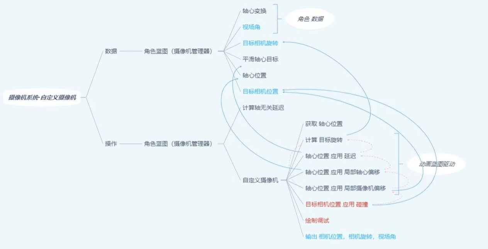
# 官方案例的摄像机系统
- 角色和弹簧臂的层级都在胶囊体至下
- 弹簧臂上挂摄像机，摄像机与角色的距离就是弹簧臂的长度。摄像机绕角色旋转时会以弹簧臂为轴绕角色旋转。
- 弹簧臂的“弹簧”指的是当角色靠近墙壁时，弹簧臂会自动缩短，避免摄像机穿过墙体导致穿模。

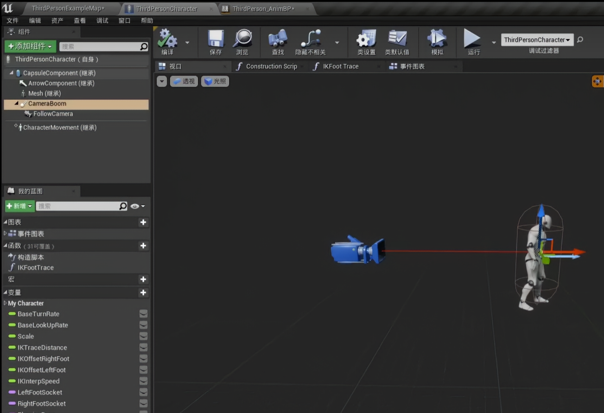
- 弹簧臂中有一个滞后选项，用于弹簧臂的移动和旋转滞后平滑插值到目标位置和旋转
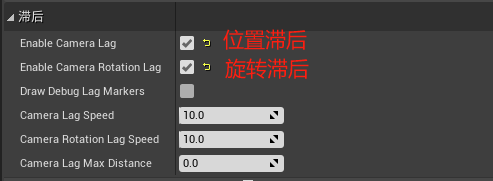
# 角色蓝图
- 在角色蓝图ALS_Base_CharacterBP中继承摄像机相关的接口
- 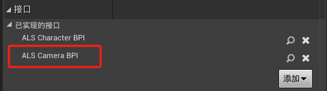
- 实现两个函数
- 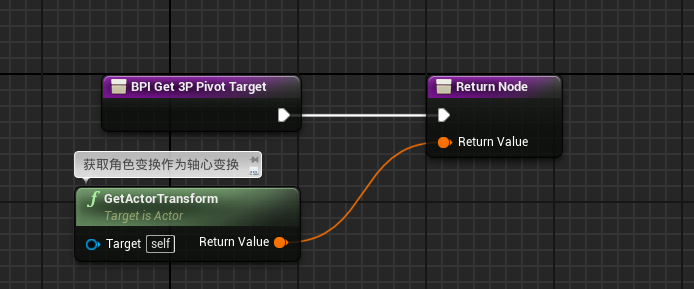
- 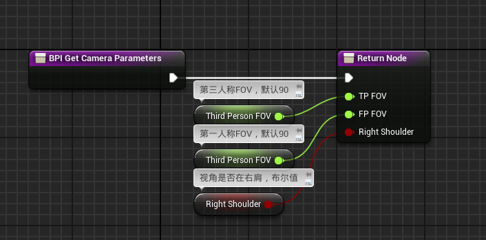
# 摄像机管理器类
- My_CameraManager_BP中创建三个函数，分别是
- Get Camera Begavior Param，用于获取摄像机骨骼网格体动画曲线值
- 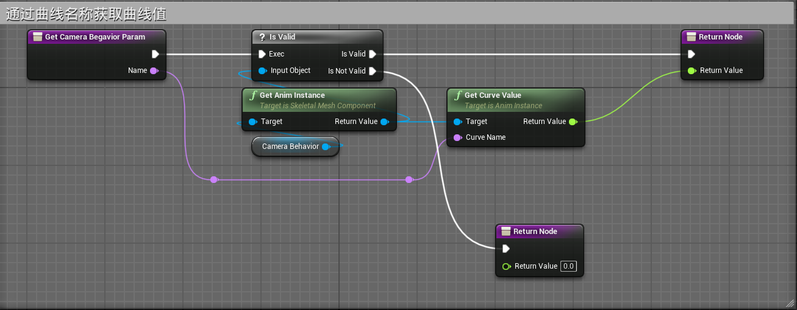
- Calculate Axis Independent Lag，用于插值计算摄像机当前位置和目标位置之间的插值实现摄像机的位置滞后效果
- 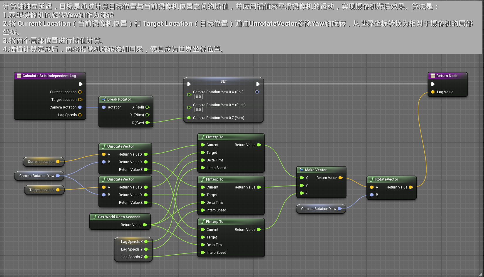
- 在这个蓝图中，先去除摄像机的旋转再进行插值计算，然后再将旋转添加回来，主要是为了分离出位置和旋转的独立控制，以便更精确地计算平滑的摄像机过渡。下面是详细解释：

 1. **避免旋转影响位置插值：**

- 位置插值（通过 **FInterp To** 节点进行）需要在 **目标位置** 和 **当前摄像机位置** 之间进行平滑过渡。如果摄像机的旋转直接影响到目标位置的计算，插值的结果就会变得不准确或不平滑。
- 通过 **UnrotateVector** 节点，我们首先将 **当前摄像机位置** 和 **目标位置** 转换到摄像机的本地坐标系，这样旋转不再影响插值计算。也就是说，我们首先 "去除" 了旋转，以便只计算位置的平滑过渡。

 2. **旋转和位置的独立控制：**

- 摄像机的 **旋转** 和 **位置** 在三维空间中是独立控制的，尤其是在需要平滑摄像机跟随目标的场景中。
- **去除旋转** 让我们能单独处理 **位置的插值**，确保在 **目标位置** 过渡的过程中不受旋转的影响。这样可以避免目标位置因为摄像机的旋转变化而产生的额外误差。

 3. **计算平滑的旋转：**

- 通过拆分摄像机的旋转（**Break Rotator**）为 **Yaw**、**Pitch**、**Roll**，我们可以单独处理每个方向上的旋转。
- 一旦完成位置插值后，我们会将插值结果带入到 **旋转** 的插值中，从而确保摄像机的旋转同样是平滑过渡的。
- 最后，将旋转信息（**Yaw**、**Pitch**、**Roll**）重新合并，并应用到目标位置上，使得摄像机的旋转和位置同步变化，得到自然且平滑的跟随效果。

 4. **保持自然的跟随：**

- 如果直接在旋转和位置插值时同时计算，可能会导致摄像机的旋转和位置之间产生不自然的过渡。通过先分离旋转和位置，可以分别对它们进行精确控制，使得最终的摄像机过渡既平滑又自然。

 5. **总结：**

- **去除旋转再插值**：使得位置的过渡不受旋转影响。
- **单独控制旋转和位置**：确保摄像机的旋转和位置能够平滑独立过渡。
- **重新添加旋转**：将旋转信息与插值后的目标位置结合，保证最终的摄像机跟随效果是自然的。

这种处理方法是为了确保摄像机的移动和旋转能够精确且流畅地结合，避免不必要的错误或突兀的过渡。
- Custom Camera Behavior，自定义摄像机行为函数，用于更新摄像机的位置，旋转以及FOV
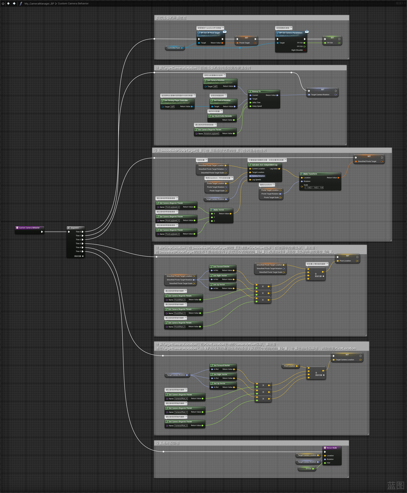
- 最终我们看到此函数只需要三个参数
	- TargetCameraLocation，由摄像机枢轴位置和角色位置插值实现滞后效果得到SmoothedPivotTarget，SmoothedPivotTarget再经过角色旋转偏移得到PivotLocation，PivotLocation再经过摄像机和控制之间旋转插值偏移得到TargetCameraLocation
	- TargetCameraRotation，由当前摄像机旋转和控制器旋转插值得到
	- TP FOV值为90.
- 最终我们在重载类方法 BlueprintUpdateCamera函数中调用
- 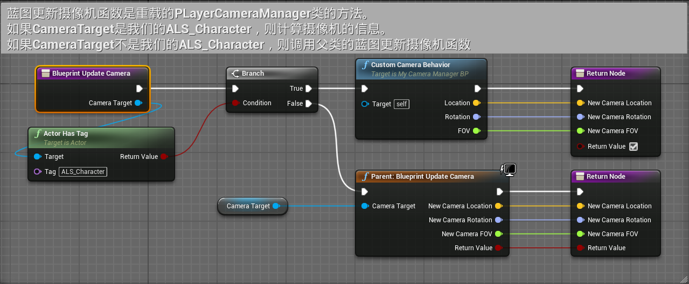
- 注意要在角色蓝图中打上ALS_Character的标签，摄像机才有效果
- 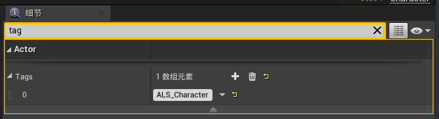
# 摄像机动画蓝图
- My_CameraBehavior_ABP
## 事件蓝图
Update Character Info函数中获取接口参数
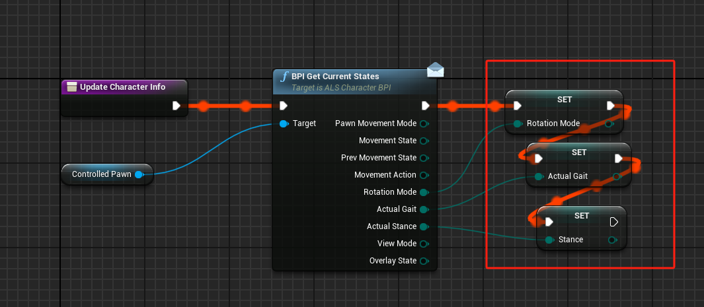
事件图标中事件蓝图更新动画中调用该函数
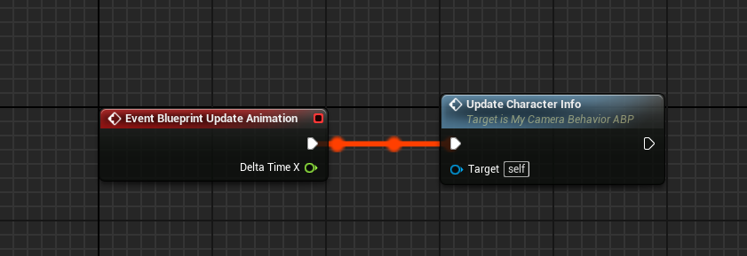
## 动画蓝图
- 创建状态机
- 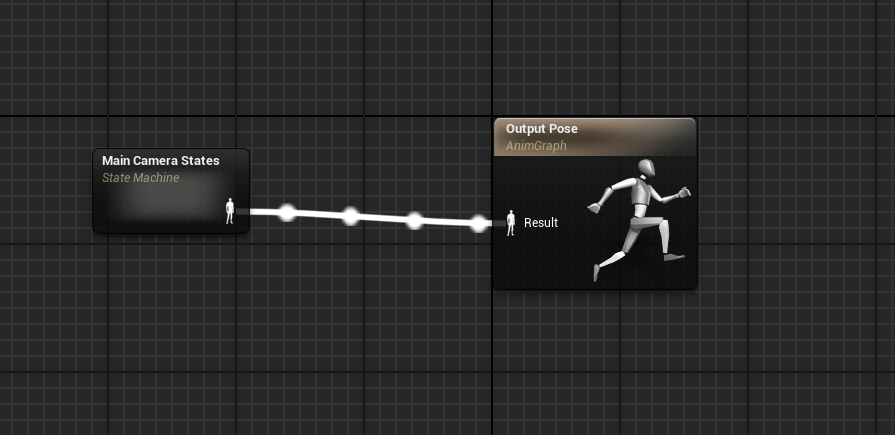
- 状态机内有三个状态：LookingDirection，VelocityDirection，Aiming。三个条件：->LookingDirection，->VelocityDirection，->Aiming。
	- 条件->LookingDirection
	- 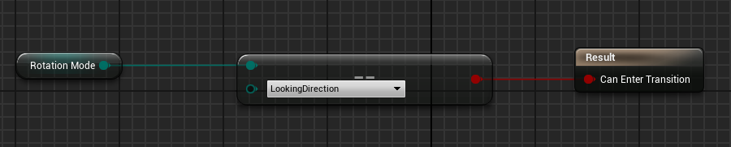
	- 条件设置为
	- 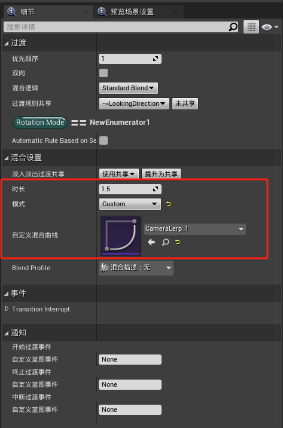
	- ->VelocityDirection
	- 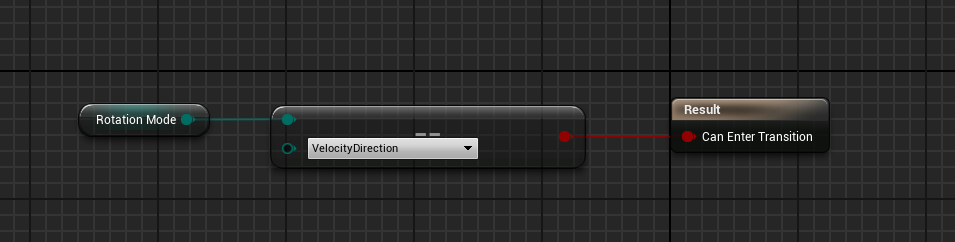
	- 条件设置为
	- 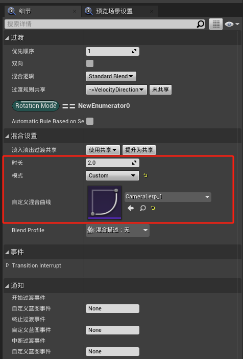
	- ->Aiming
	- 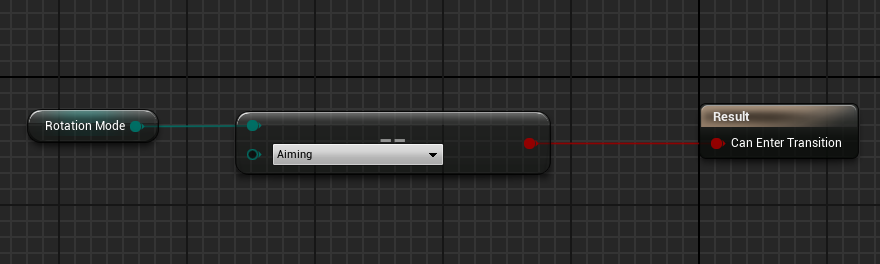
	- 条件设置为
	- 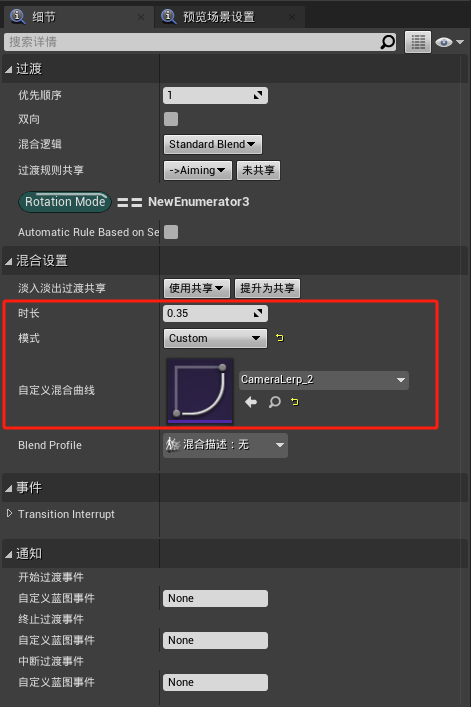
	- 其中三个状态LookingDirection，VelocityDirection，Aiming逻辑类似，只是参数不同
	- 其中用到的曲线 CameraOffset 是摄像机当前旋转到控制器旋转插值的偏移量，PivotLagSpeed是摄像机位移滞后效果的插值速度，PivotOffset 是角色变换位置插值的的偏移量，用于站立和蹲伏切换。
		- LookingDirection
		- 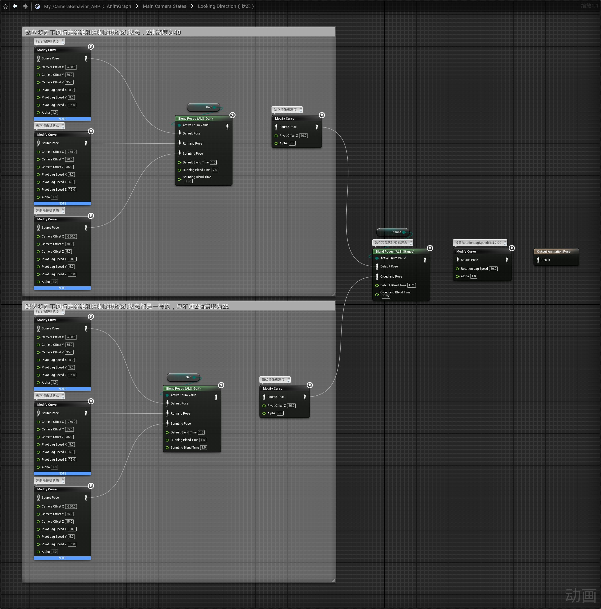
		- VelocityDirection
		- 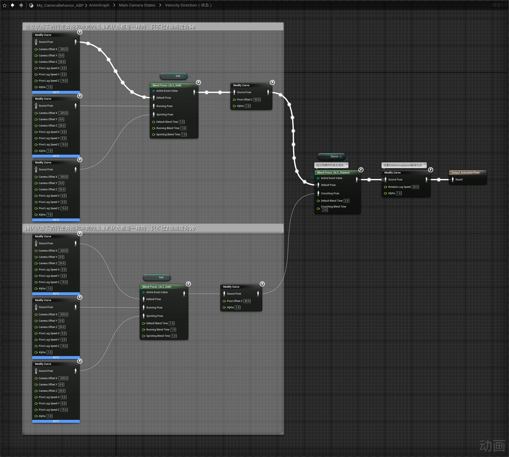
		- Aiming逻辑类似
		- 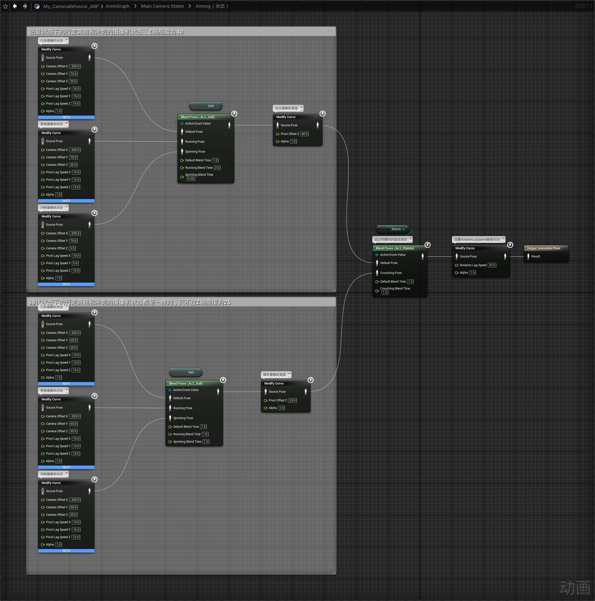