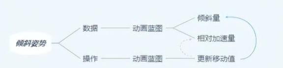
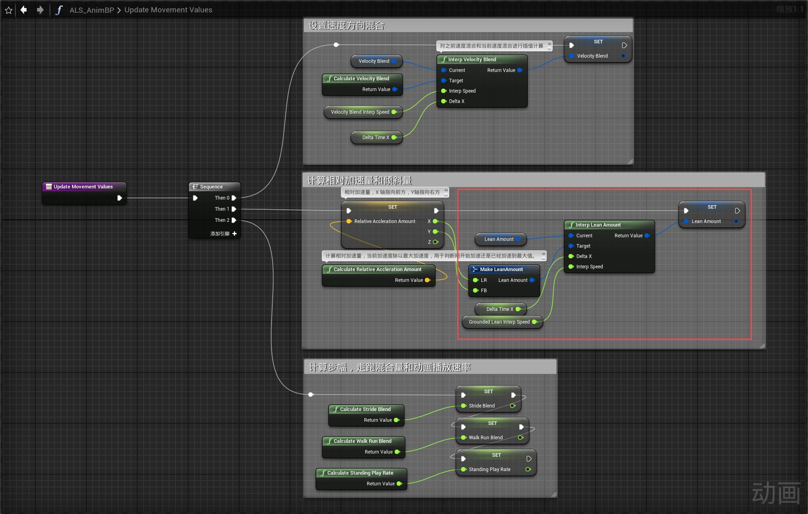
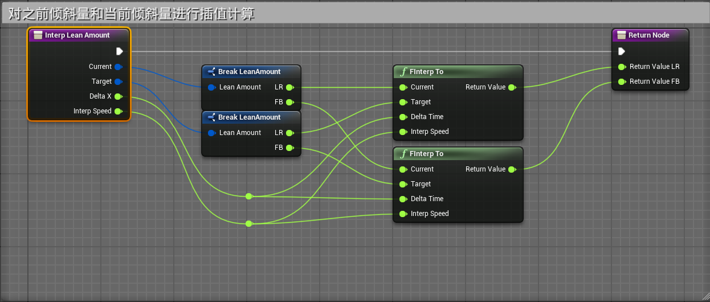
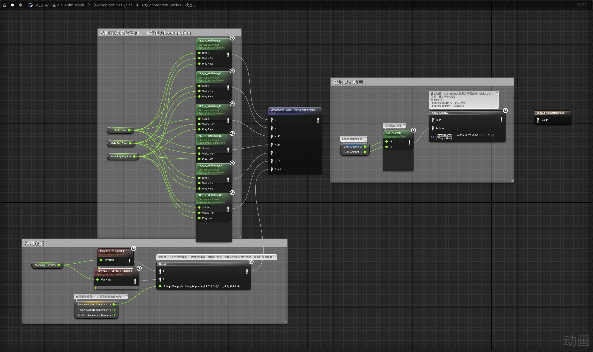

# 概述
- 在速度方向向其他方向进行加速的时候，向偏转方向添加倾斜

# 动画蓝图
## 事件图表
- 在Update Movement Values函数中，其中RelativeAccelerationAmount是相对加速量，用来判断每个方向的加速度大小，X轴为前后（-1为后最大加速度，1为前最大加速度，0为不加速），Y轴为左右（-1为左最大加速度，1为右最大加速度，0为不加速）。
- 
- 其中的Interp Lean Amount函数
- 
## 动画图表
