# 概述
- 现在我们的步态调整是硬切的，而ALS系统的步态是可以动态调整的，举例来说，不能从行走直接混合到冲刺，而是要从行走到奔跑再到冲刺。
- 有三个概念：
	- 期望步态（DesiredGait）：由输入决定
	- 允许的步态（AllowedGait）：移动状态旋转模式等条件限制
	- 实际步态（ActualGait）：根据速度计算得到

# 角色蓝图
- 创建DesiredGait 变量，类型为ALS_Gait，作为输入驱动的期望步态
- 在PlayerInputGraph图表中替换之前的Gait变量
- 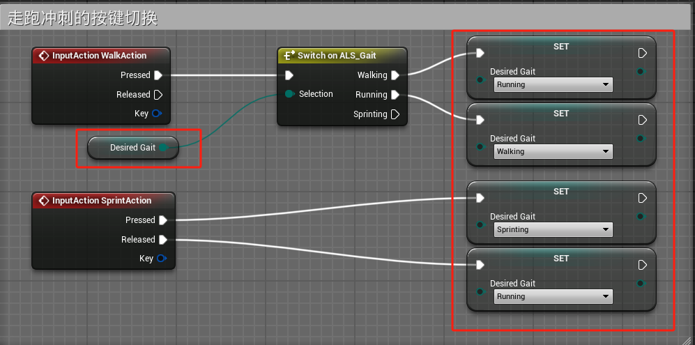
- 创建三个方法Can Sprint（是否可以冲刺），GetAllowedGait（计算允许步态），GetActualGait（计算实际步态）
- 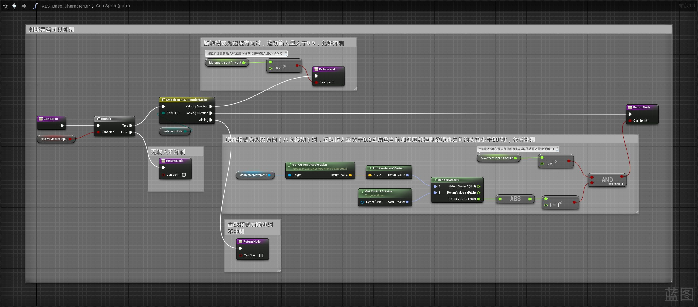
- 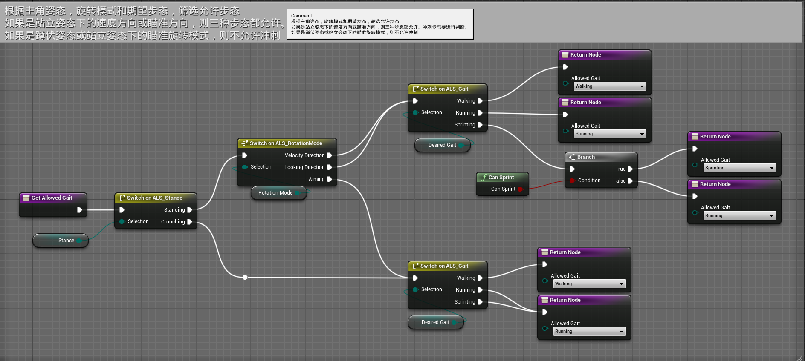
- 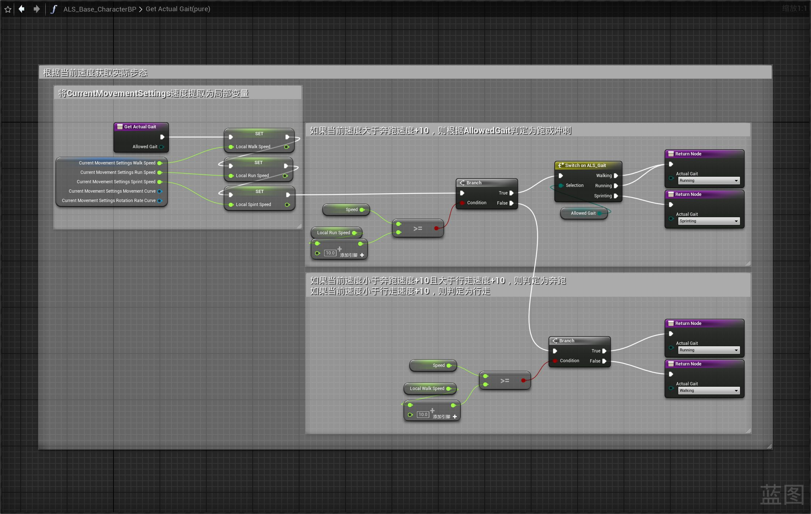
- 在UpdateDynamicMovementSettings函数中调用GetActualGait
- 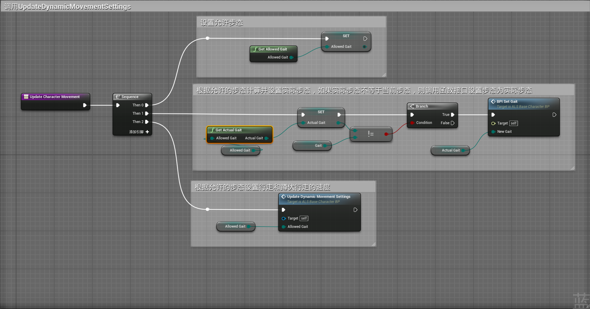
- 最后一步要实现函数接口中的BPI Set Gait函数，选中函数，点右键选择实现，实现该函数需要一个 状态比较宏，我们创建一个宏库来实现这个宏
- 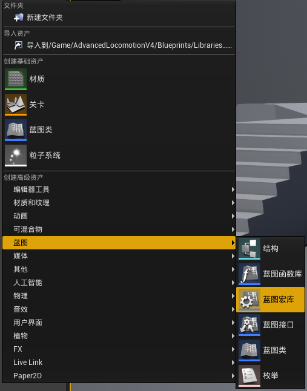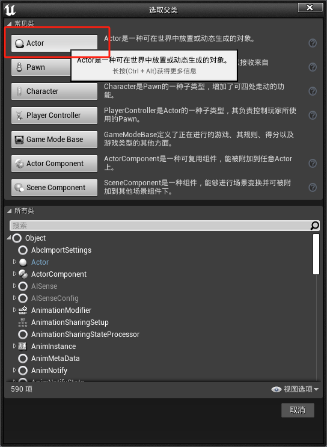
- 在宏库中创建宏ML_IsDifferent(Byte)，比较两个通配符是否相等，并输出新的通配符值
- 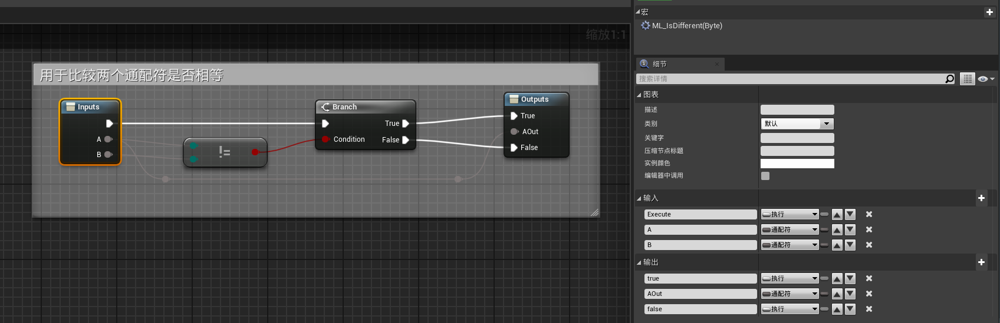
- ML_SetPreviouseAndNewValue宏
- 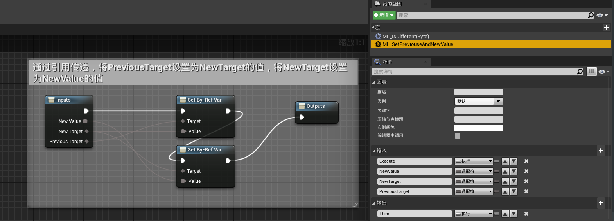
- 创建一个新的函数用于储存新的ActualGait和之前的PreviousActualGait
- 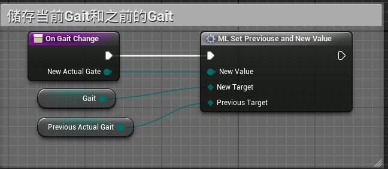
- 在事件图表中实现接口函数BPI Set Gait
- 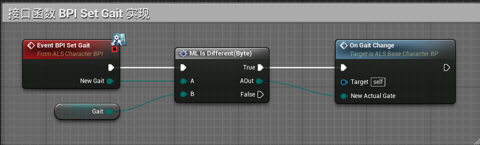