# 概述
- 加速动作的表现是启动时或轴心切换时或加速时先向运动方向倾斜
- 主要针对于起步时的加速运动或由走到跑的加速过程，或者是轴心切换的加速过程
- 主要原理是通过四个叠加动画来实现，通过判断哪些条件下需要叠加加速动画来实现加速过程

- 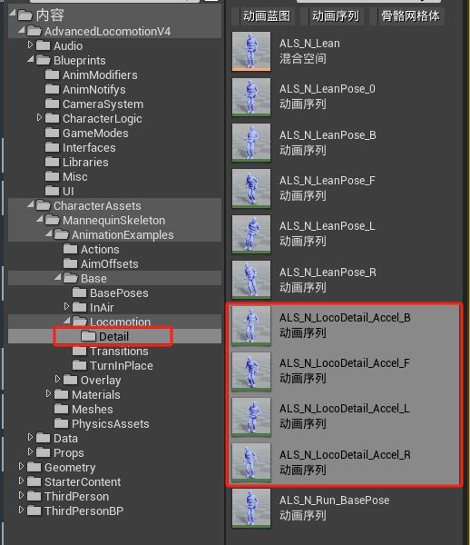
- 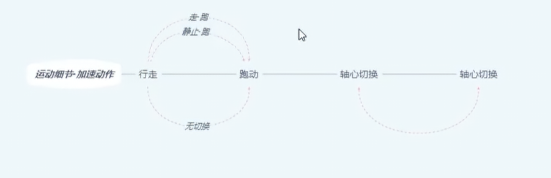
# 动画蓝图
## 动画图表
### 状态机(N)Locomotion Cycles
- 创建新状态机(N)Locomotion Cycles，并保存姿势为(N)Locomotion Cycles
- 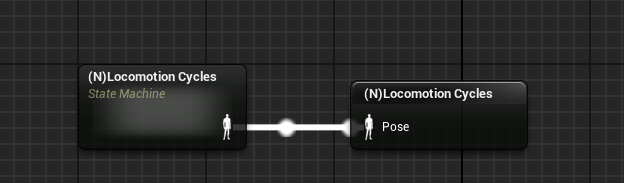
- 在状态机内新建状态(N)Locomotion Cycles
- 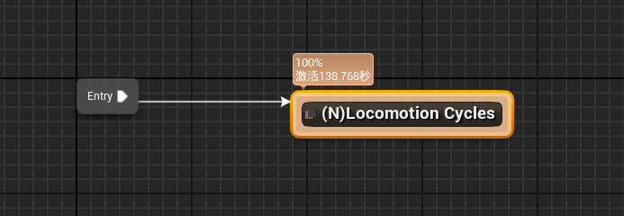
- 将之前的八向移动逻辑放入(N)Locomotion Cycles状态
- 
### 状态机(N)Locomotion Details
- 创建新状态机(N)Locomotion Details并保存姿势为(N)Locomotion Details
- 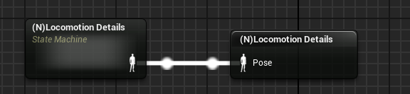
- 在(N)Locomotion Details状态机逻辑如下
- 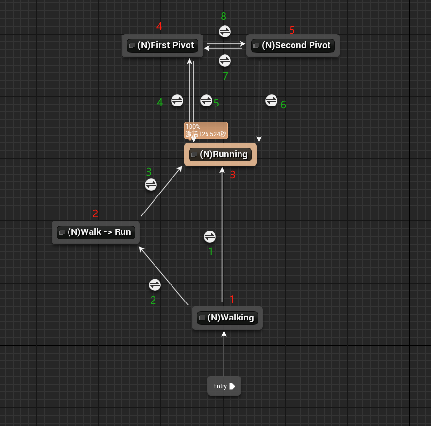
#### 过渡规则
1. 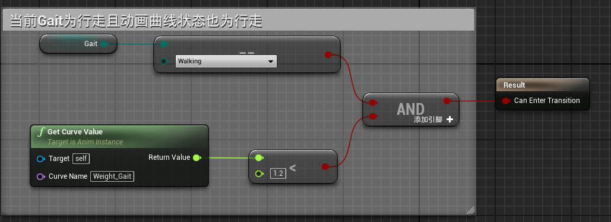
2. 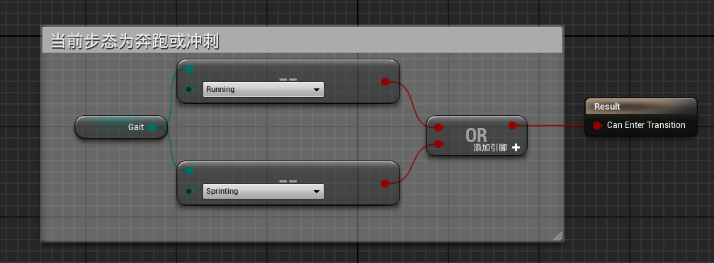
3. 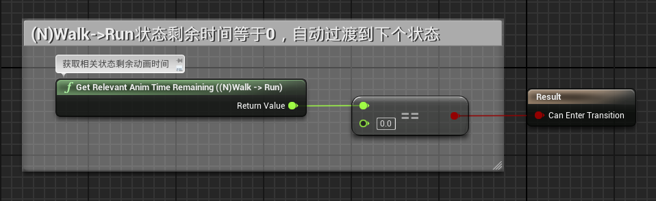
4. 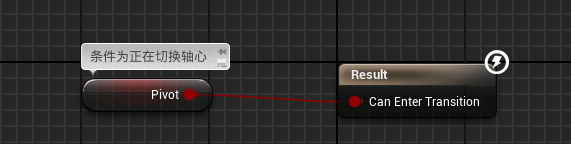
5. 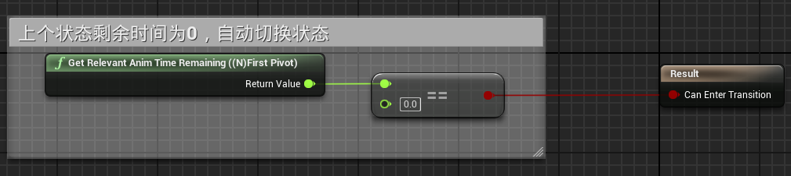
6. 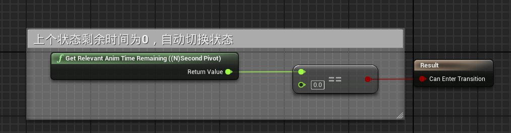
7. 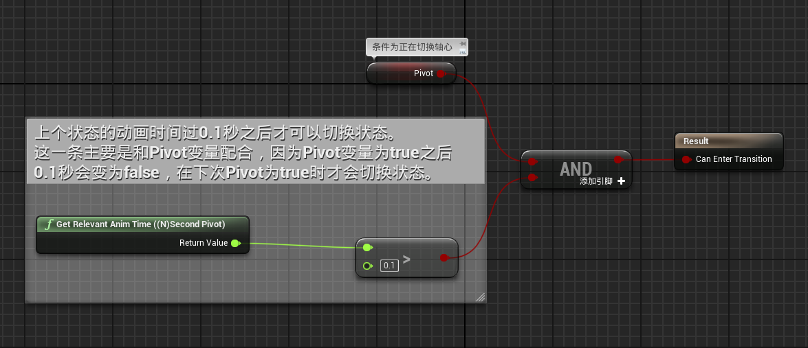
8. 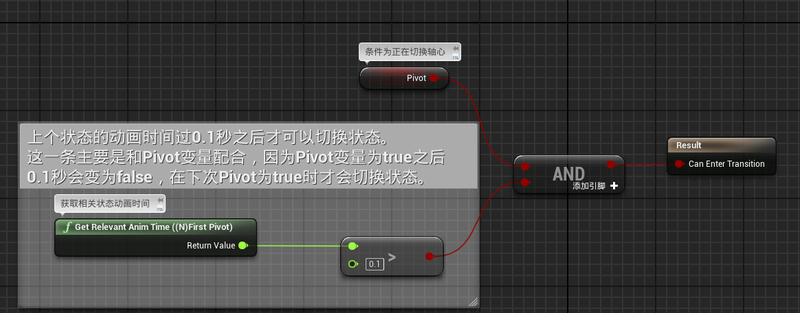
#### 运动状态
- 其中运动状态1和3是相同的都是
- 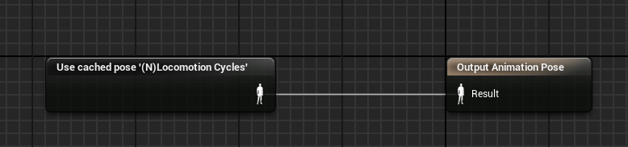
- 其他状态为：
- 2：动画资产的同步组为设为RunStart并取消动画循环
- 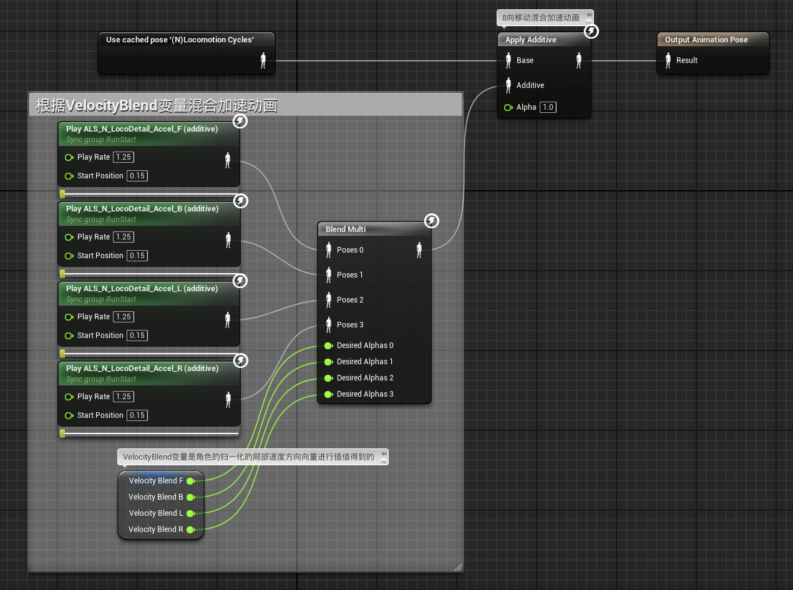
- 4：动画资产的同步组为设为Pivot1并取消动画循环
- 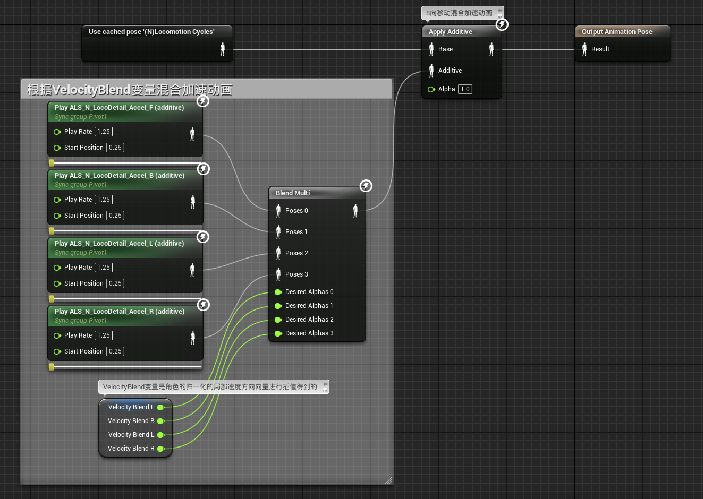
- 5：动画资产的同步组为设为Pivot2并取消动画循环
- 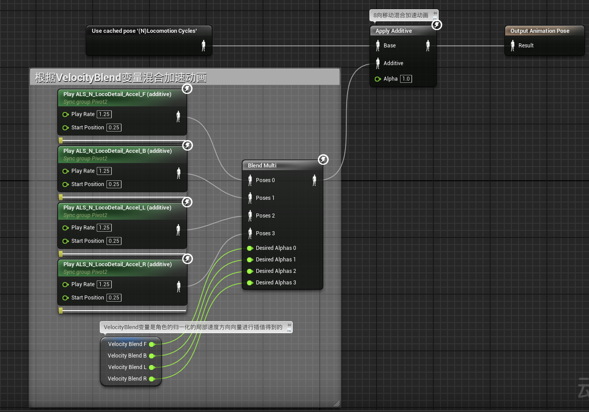
### 保存姿态
- 最后将(N)Locomotion Details保存姿势为LocomotionN供状态机调用
- 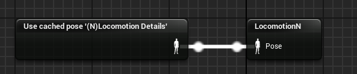