# 动画蓝图
## 事件图表
- 在UpdateGraph中设置ShouldMove变量
- 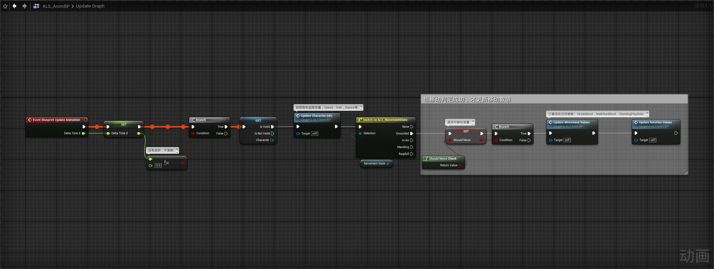
## 动画图表
- 创建状态机(N)Locomotion States并保存姿态(N)Locomotion States，使用(N)Locomotion States保存姿态为LocomotionN
- 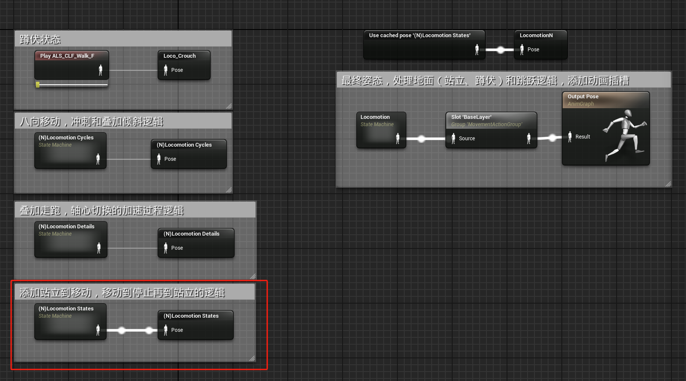
### (N)Locomotion States状态机
- 在状态机(N)Locomotion States中创建动画逻辑
- 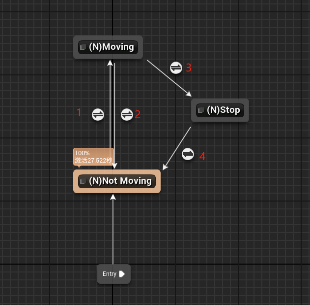
#### 过度规则
- 其中过度规则2和3的优先级不同，过度规则2的优先级为2，过度规则3的优先级为1，
- 过度规则1为：
- 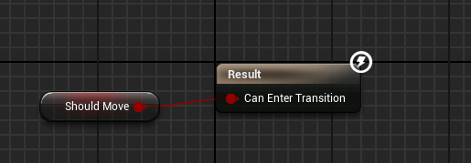
- 过度规则2为：过渡优先级为2
- 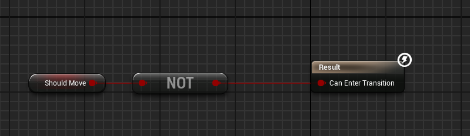
- 过度规则3为：过渡优先级为1
- 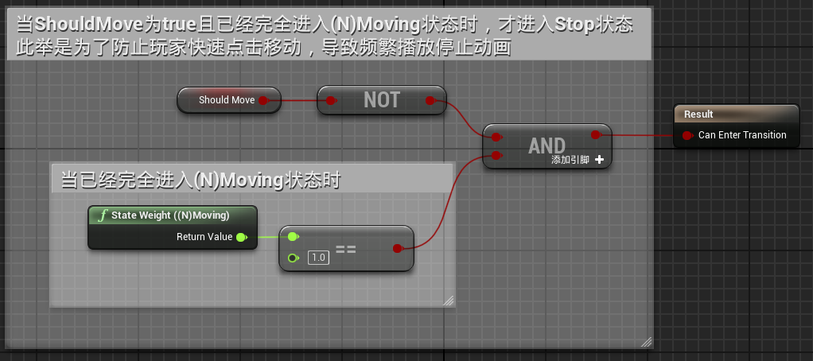
- 过渡规则4为：
- 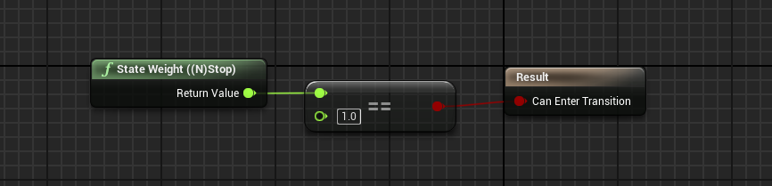
#### 状态逻辑
- 状态(N)Not Moving为
- 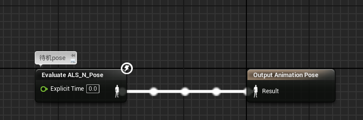
- 状态(N)Moving为
- 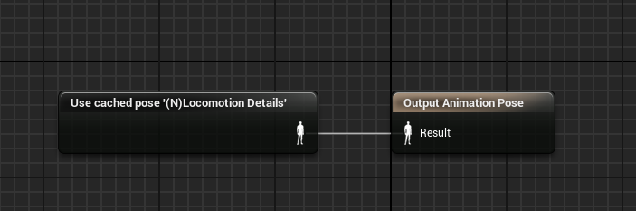
- 状态(N)Stop为(N)Stop States状态机
- 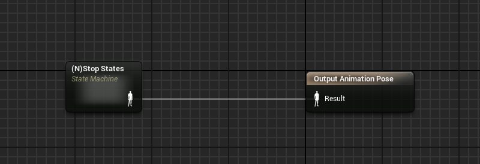
### (N)Stop States状态机

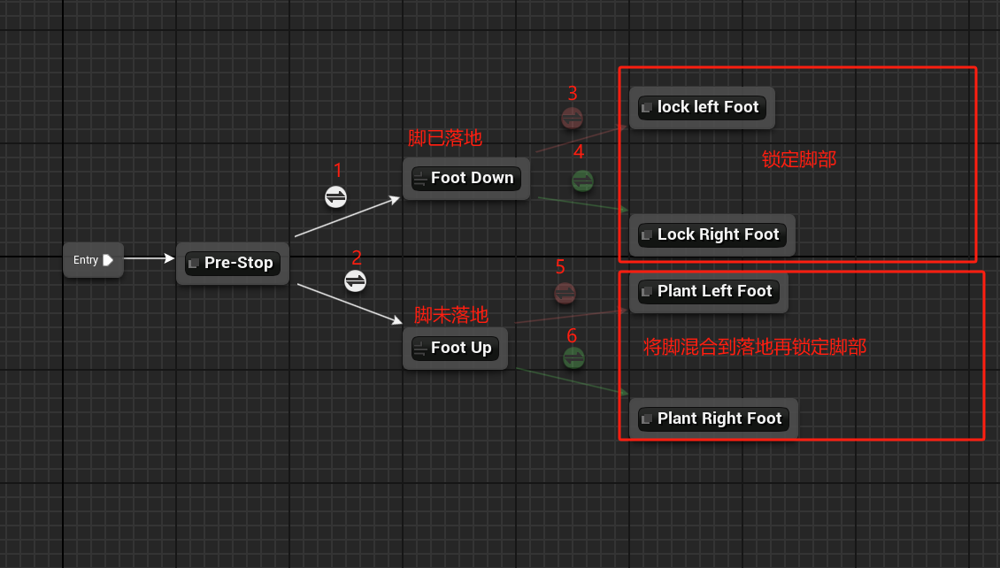
#### 过渡条件
- 要了解过渡条件我们要先理解动画曲线Feet_Position
- 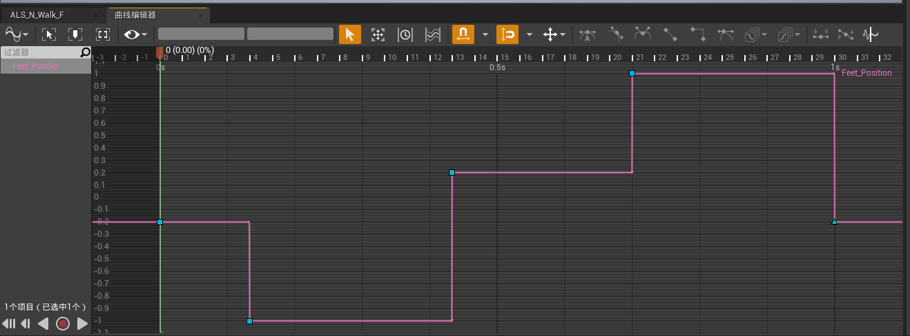
- 其中当值为 -0.2 时为左脚即将落地，为 -1 时是左脚落地
- 当值为 0.2 时为右脚即将落地，为 1 时为右脚落地
- 过渡条件1
- 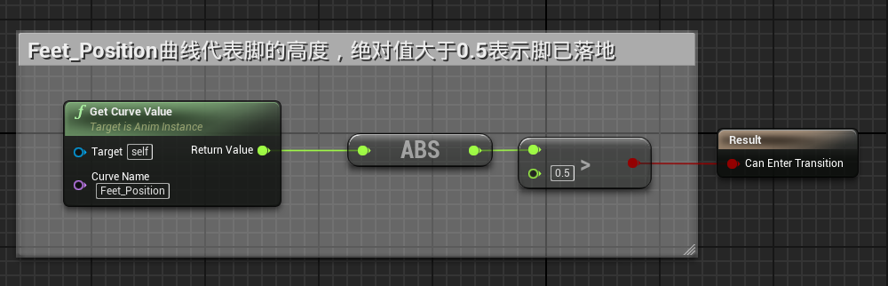
- 过渡条件2
- 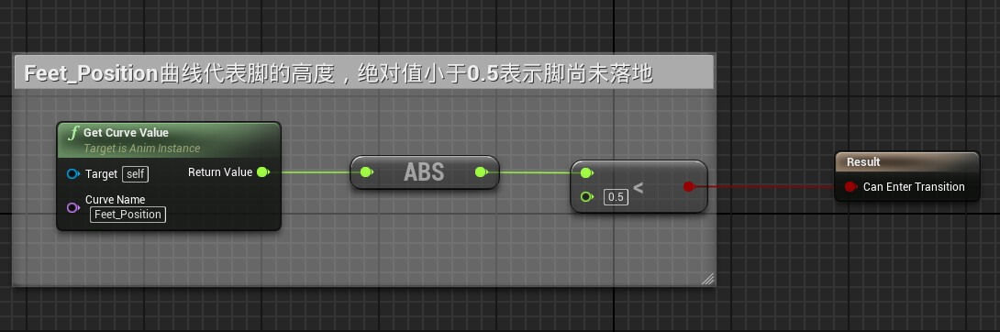
- 过渡条件3、5
- 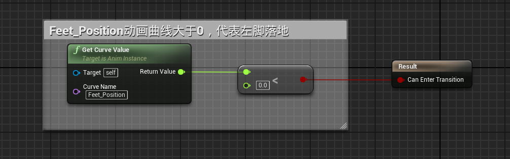
- 过渡条件4、6
- 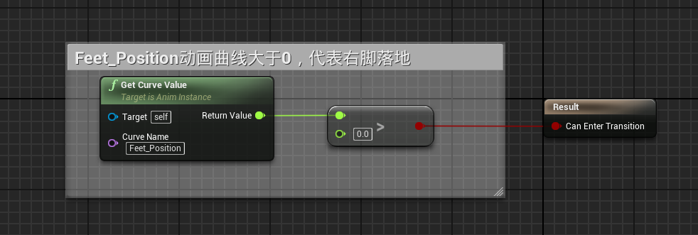
- 其中过渡条件3、4的混合时长为0，因为脚已经落地
- 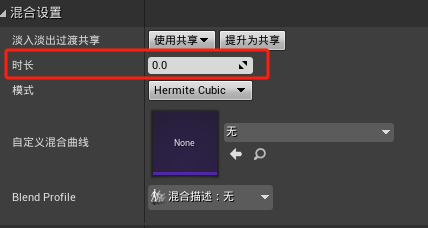
- 其中过渡条件5、6的混合时长为0.1，需要快速过渡到落地
- 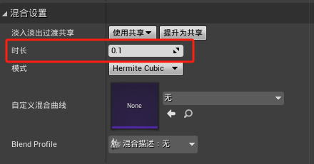
#### 状态逻辑
- 状态Pre-Stop
- 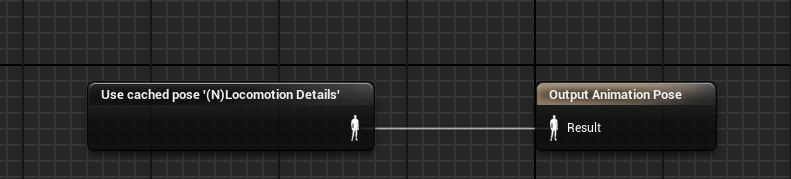
- 导管Foot Down和Foot Up
- 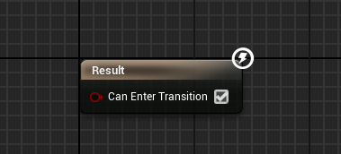
- 状态lock left Foot，为修改曲线Foot Lock L，添加进入状态事件 -> N Stop L，用于触发过渡动画蒙太奇
- 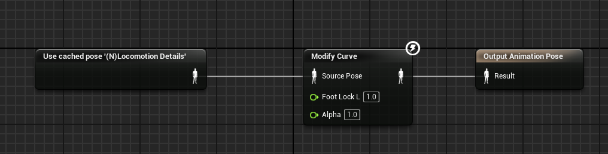 
- 状态Lock Right Foot，为修改曲线Foot Lock R
- 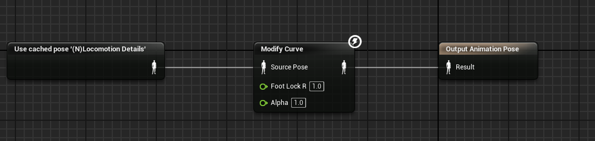
- 状态Plant Left Foot，为将左腿混合到落地状态
- 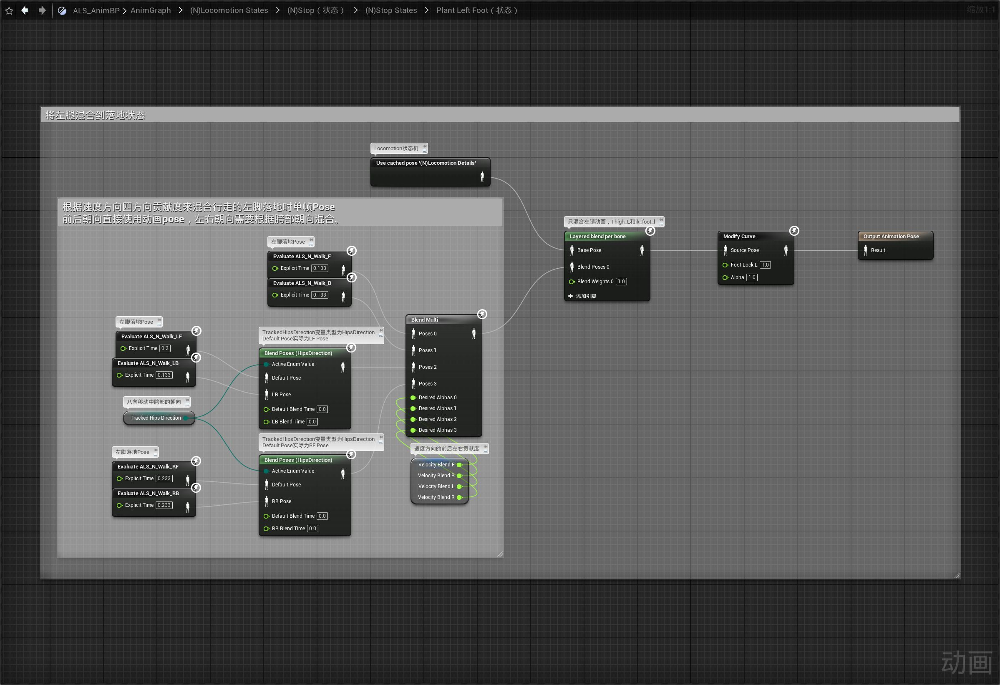
- 状态Plant Right Foot，为将右腿混合到落地状态
- 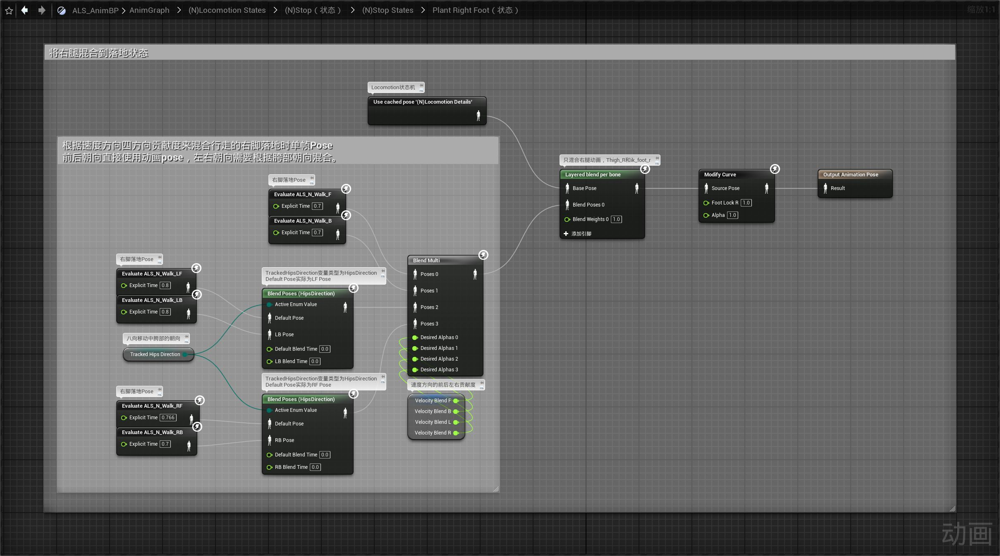