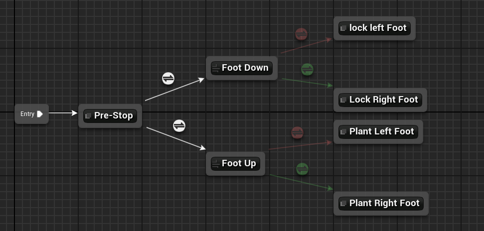
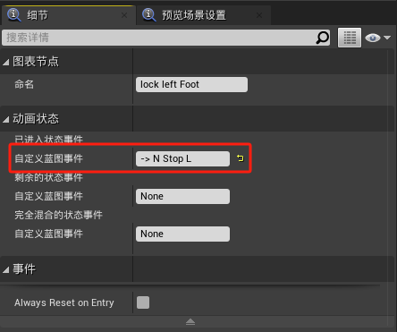
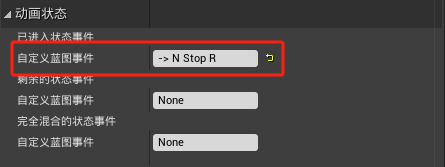
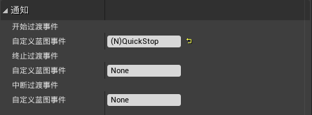
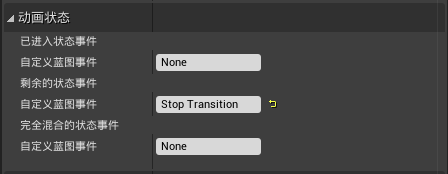
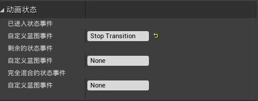
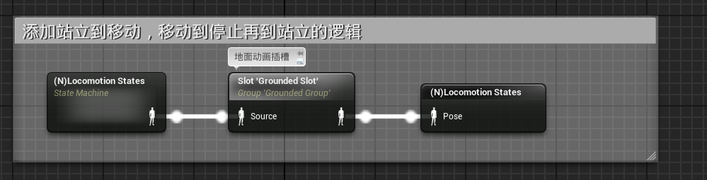
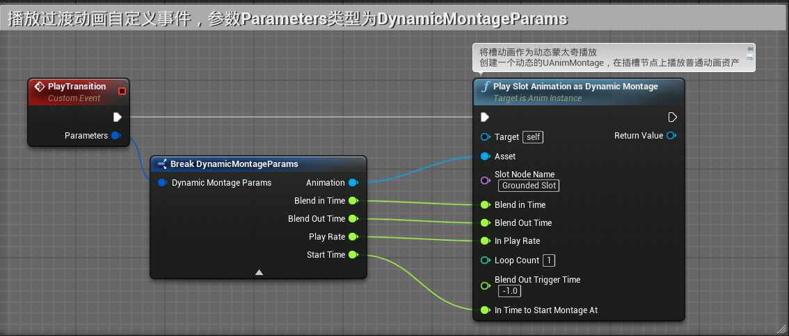
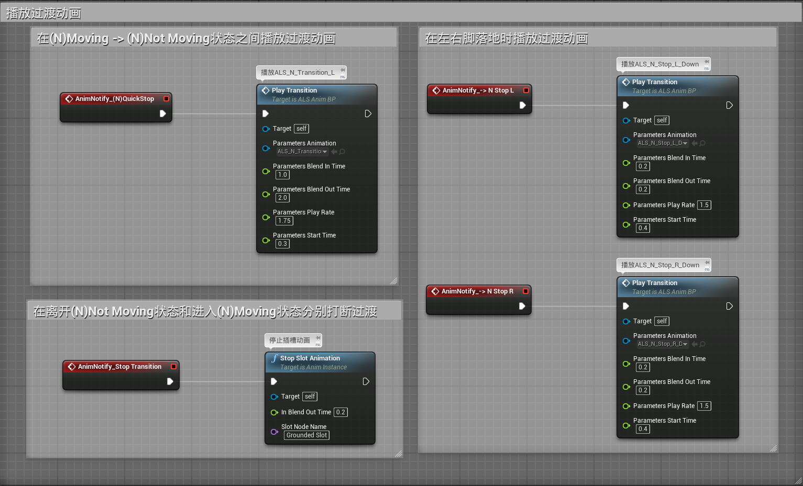

# 概述
- 在角色移动停止的瞬间播放一个脚步调整的过渡动作
- 主要原理是通过状态机创建事件通知来调用蒙太奇的播放
# 动画蓝图
## 动画图表

### (N)Stop States状态机

- 状态lock left Foot和Plant Left Foot中，添加进入状态事件 -> N Stop L，用于触发过渡动画蒙太奇
- 
- 状态lock Right Foot和Plant Right Foot中，添加进入状态事件 -> N Stop R，用于触发过渡动画蒙太奇
- 
### (N)Locomotion States状态机
- 在离开静止状态和进入移动状态分别创建事件用于用于打断 停止过渡动作
- 
- 在过渡规则2上添加开始过渡事件(N)QuickStop
- 
- 在状态(N)Not Moving添加离开状态事件Stop Transition，用于打断 停止过渡动作
- 
- 在状态(N)Moving添加已进入状态事件Stop Transition，用于打断 停止过渡动作
- 
- 最后在动画蓝图中添加GroundedSlot动画插槽
- 

## 事件图表
- 在事件蓝图中创建自定义事件用于播放过渡动画
- 
- 播放过渡动画
- 