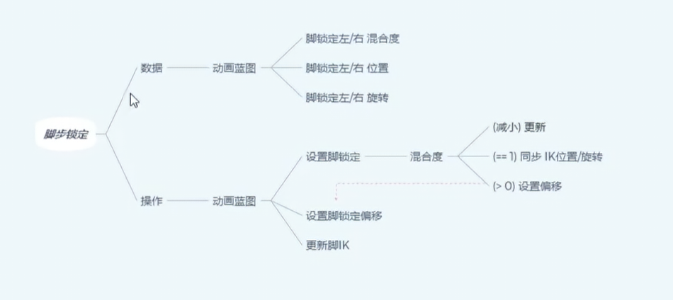
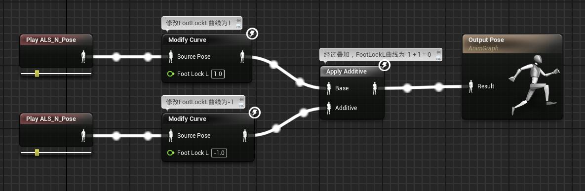
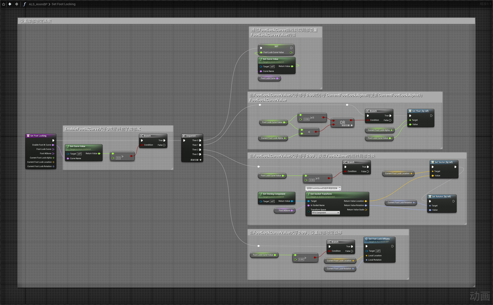
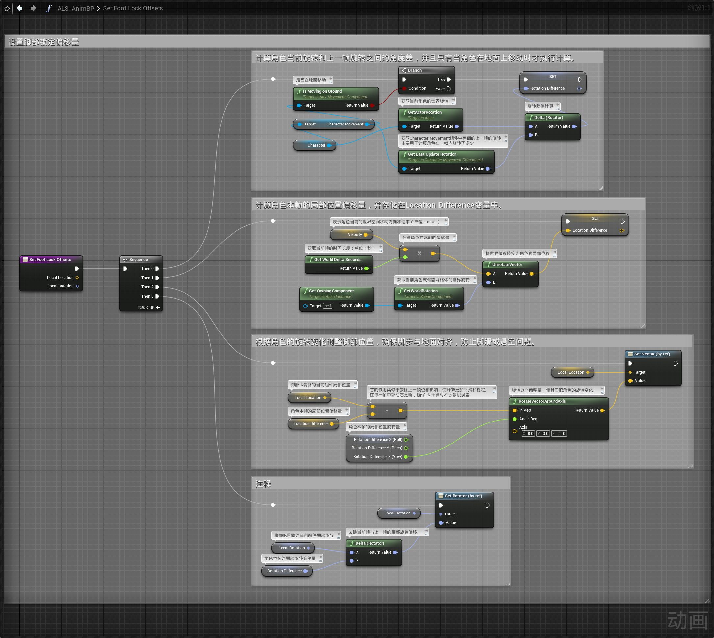
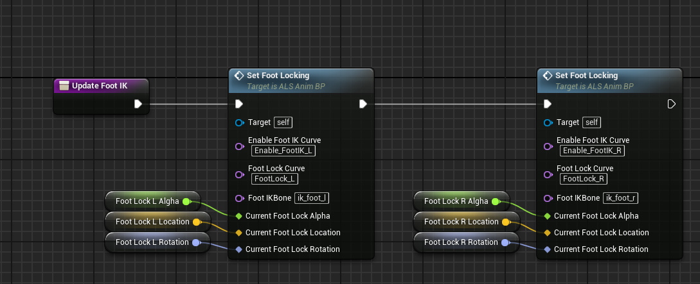
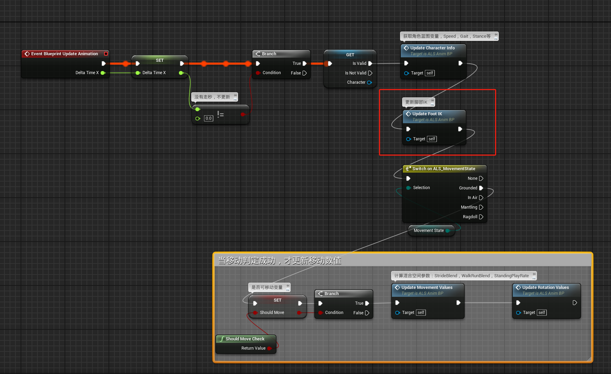
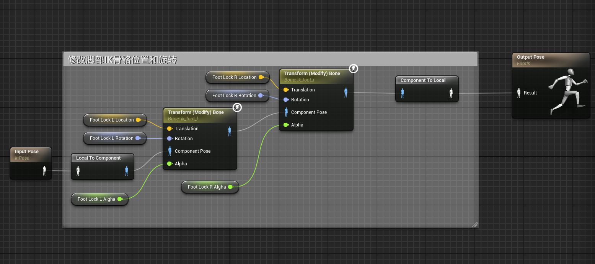
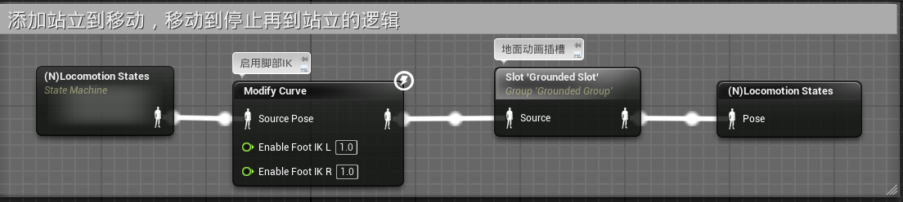

# 概述
- 脚步锁定用来配合角色移动停止时的左右顿脚过渡动画的
- 
# 前置知识
unreal engine中的叠加动画（Additive）,不仅叠加动画效果，动画中的曲线值也会相加。

# 动画蓝图
## 事件图表
- Set Foot Locking函数
- 
- 其中Set Foot Lock Offsets函数设置脚部锁定偏移
- 
- 创建Update Foot IK函数中调用Set Foot Locking函数
- 
- 在UpdateGraph中调用Update Foot IK函数
- 
## 动画图表
- 创建新的动画层FootIK
- 
- 在动画蓝图中修改曲线值，启用脚部IK
- 