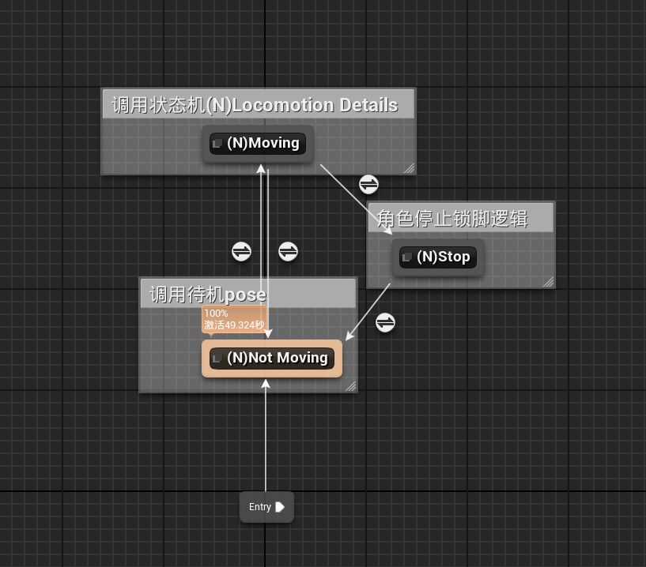
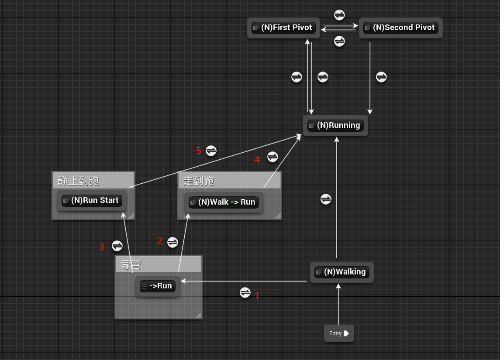
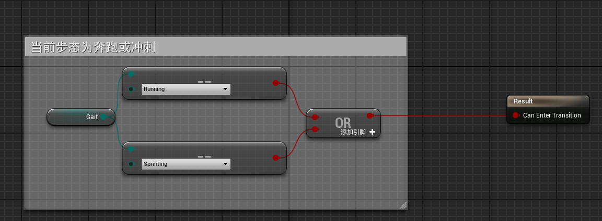
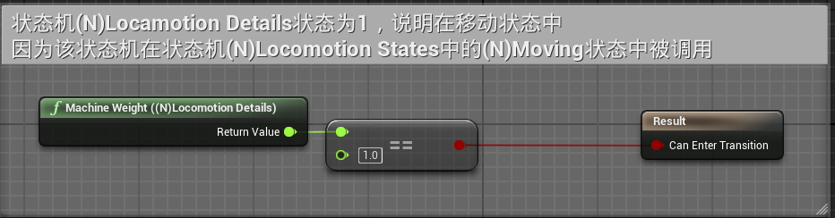
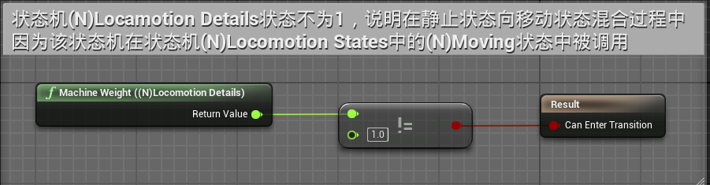
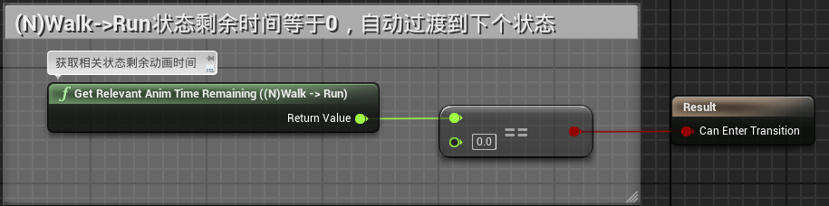
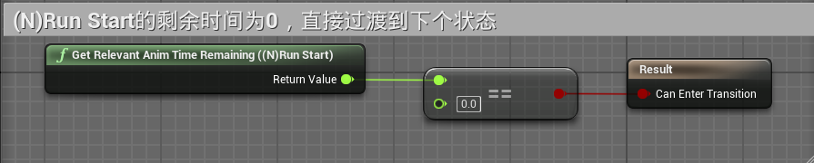
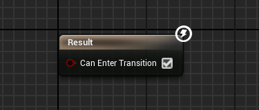
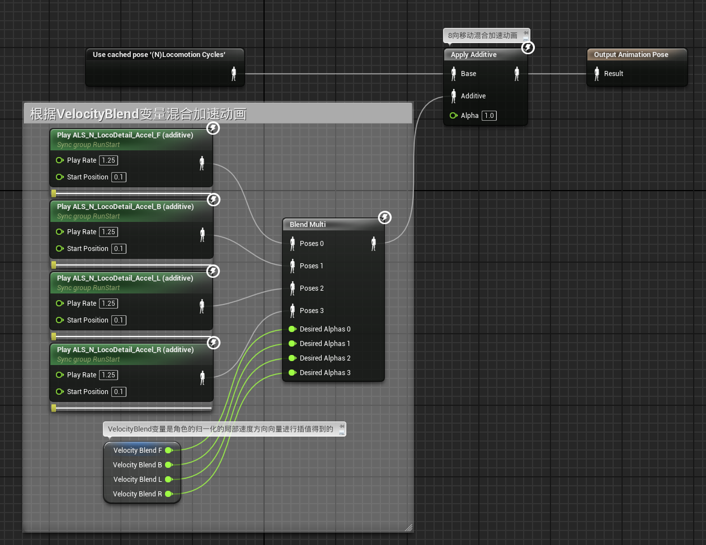
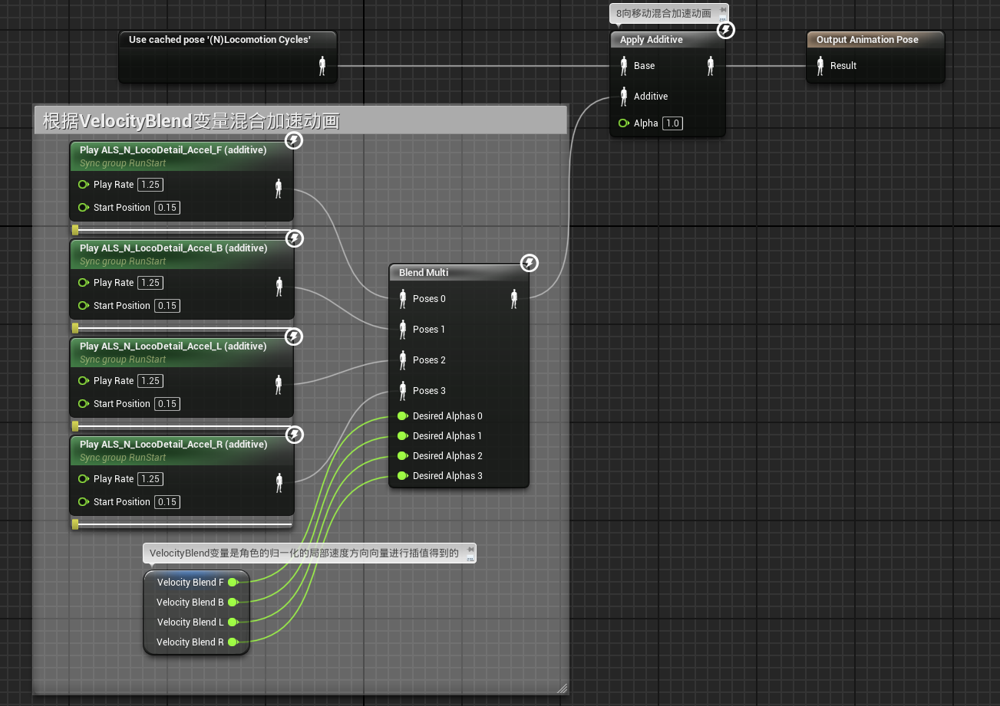

# 概述
- 在状态机(N)Locomotion States中已经具备了从静止到移动的切换
- 
- 在状态机(N)Locomotion Details中添加 **由静止到奔跑** 和 **由行走到奔跑** 的区分，原本的状态机中只有行走到奔跑，没有静止到奔跑。
# 动画蓝图
## 动画图表

### 过渡规则
- 规则1，进入导管 ->Run
- 
- 规则2
- 
- 规则3
- 
- 规则4
- 
- 规则5
- 
### 状态逻辑
- ->Run导管
- 
- (N)Walk -> Run 行走到奔跑
- 
- (N)Run Start，静止到奔跑
- 
# 总结
- 在状态机(N)Locomotion States中已经具备了从静止到移动的切换
- 当从静止起换到移动时，如果要进入奔跑或冲刺状态（过渡规则1），会判断(N)Locomotion Details状态权重是否为1
	- 如果为1，说明在移动状态中，则进入行走到奔跑的逻辑
	- 如果不为1，说明在静止状态向移动状态混合过程中，则进入静止到奔跑的逻辑