# 蹲伏和跳跃
## 角色蓝图
- 创建基于枚举类ALS_Stance的变量Stance
- 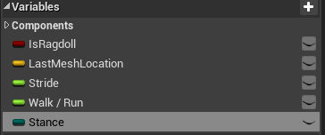
- 角色运动组件中勾选可蹲伏选项
- 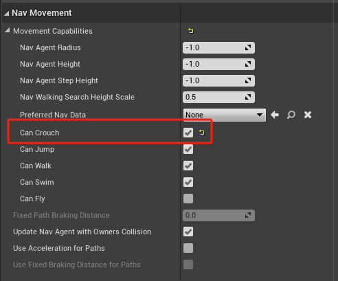
- 事件图表
- 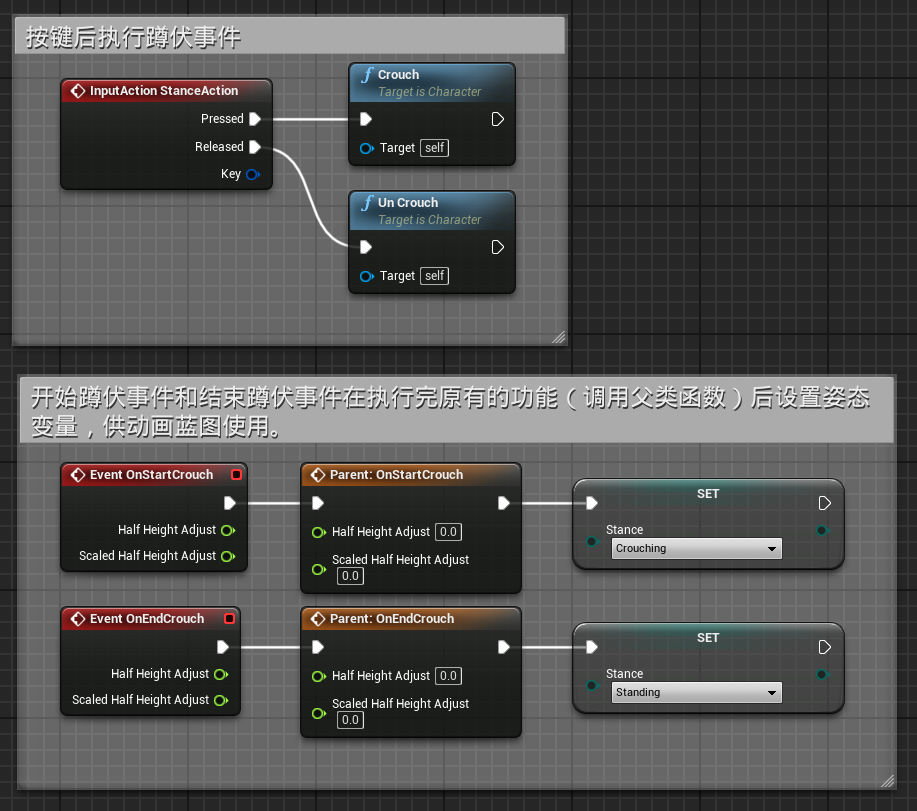
## 动画蓝图
- 创建基于枚举类ALS_Stance的变量Stance
- 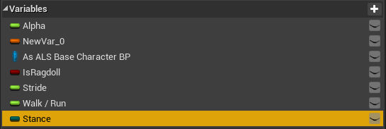
- 事件图表中传递此变量
- 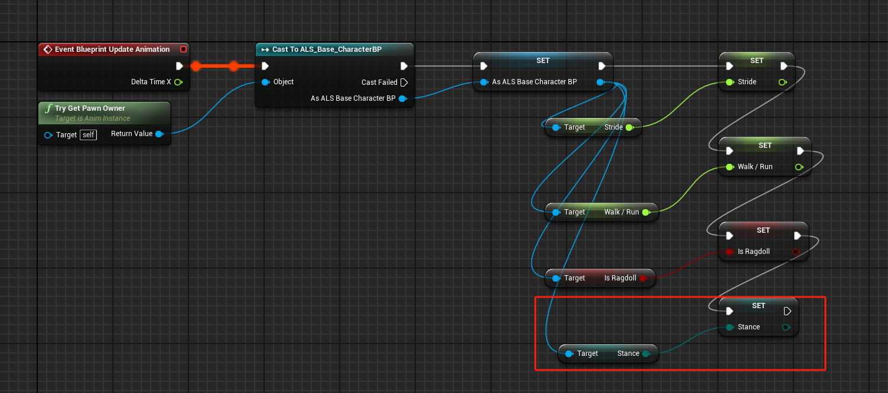
- 动画图表
	- AnimGraph
	- 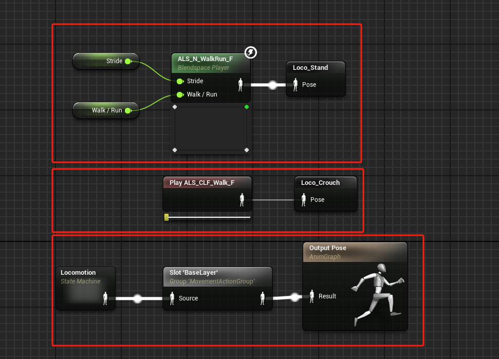
	- Locomotion状态机
	- 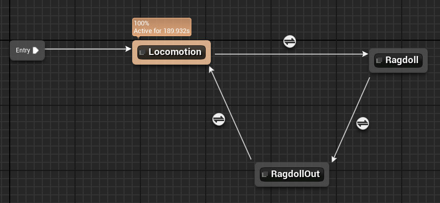
	- Locomotion状态内新建一个stand/Crouch状态机
	- 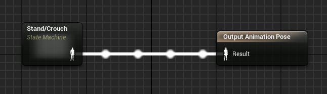
	- stand/Crouch状态机
	- 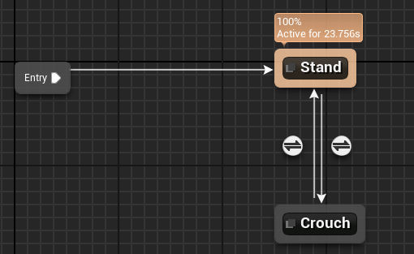
	- 内部姿态为缓存的站立动画和蹲伏动画，条件为Stance变量的值。
# 跳跃
## 角色蓝图
- 创建变量MovementState，类型为MovementState枚举类
- 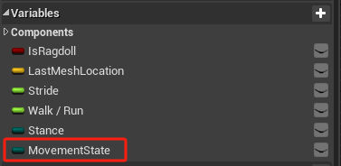
- 事件图表
- 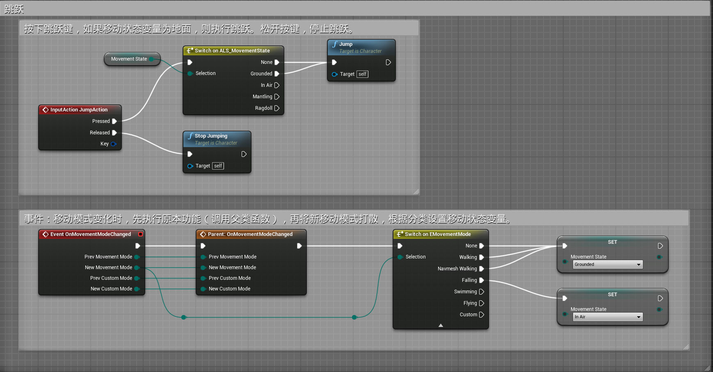
## 动画蓝图
- 事件图表，从角色蓝图到动画蓝图传递变量
- 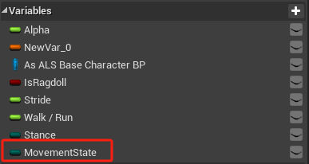
- 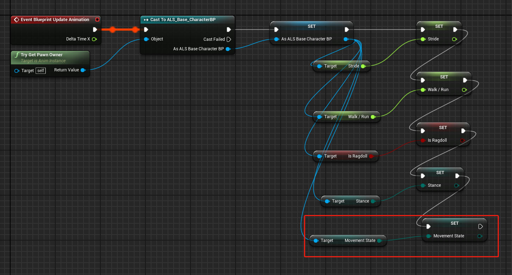
- 动画图表
- 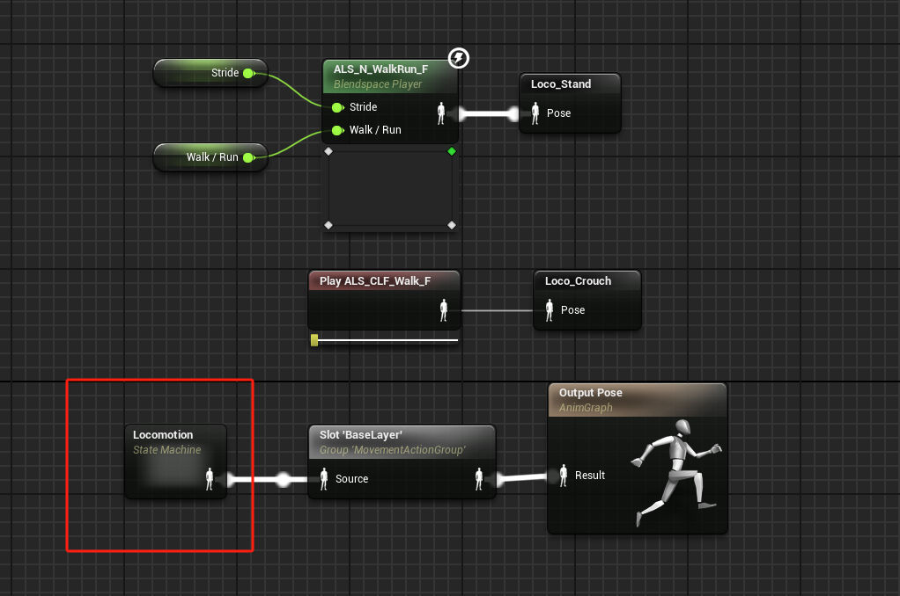
- 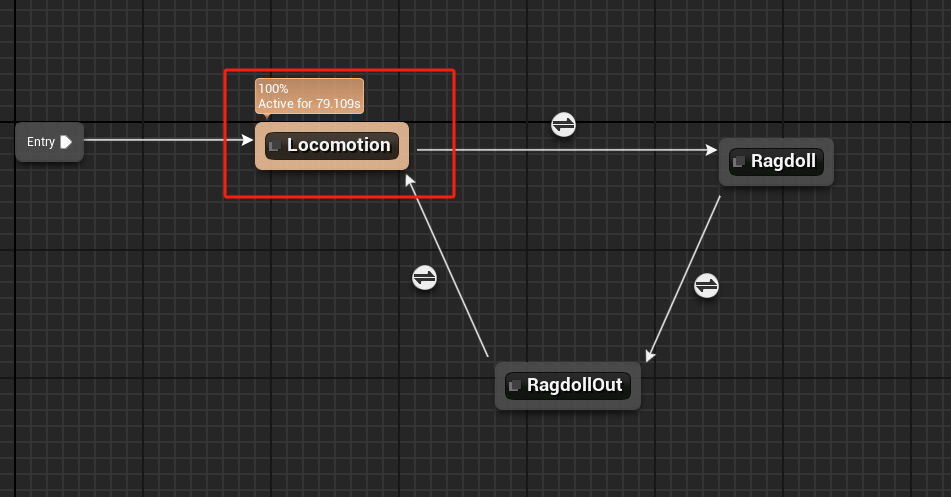
- 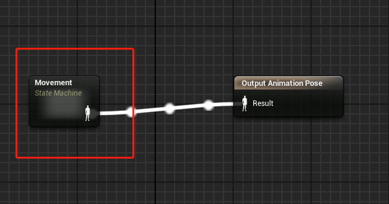
- 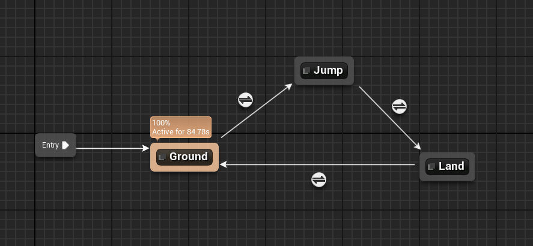
- Ground状态为站立蹲姿状态机
- 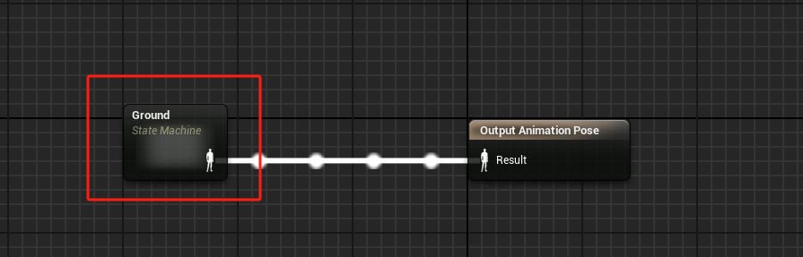
- 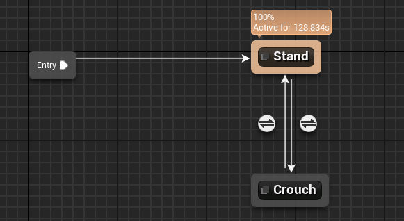
- Jump状态为跳跃下落循环动画
- land状态为落地动画
- 他们之间的条件：
	- G to J为MovementState为 InAir
	- J to L 为MovementState不为 InAir
	- L to G 为自动播放规则