# 概述
- 处理瞄准状态（Aiming）下的原地旋转
- 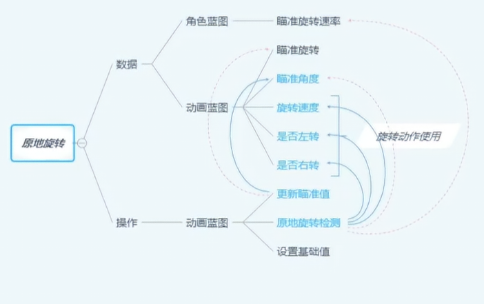
# 角色蓝图
## 事件蓝图
- 在接口函数 BPI GetEssentialValues函数中同步AimYawRate变量，该变量是由（当前控制器旋转 - 之前控制器的旋转） /  Delta时间 = 旋转速率
- 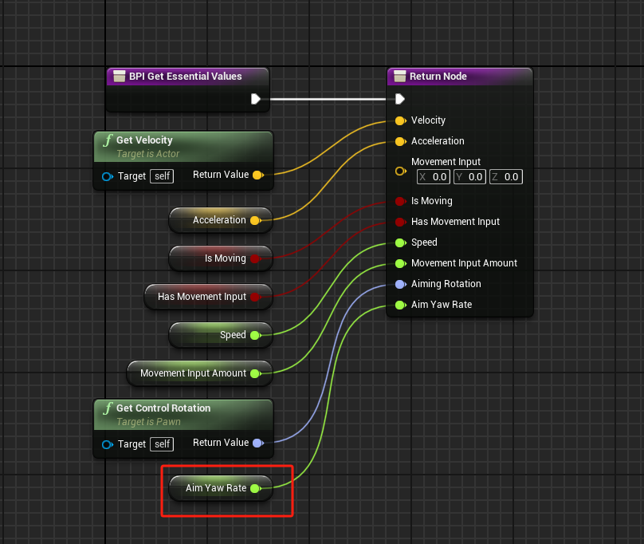
- 创建三个函数Can Rotate Inplace，Update Aiming Values，Rotate Inplace Check
- Can Rotate Inplace函数判断是否是在瞄准状态
- 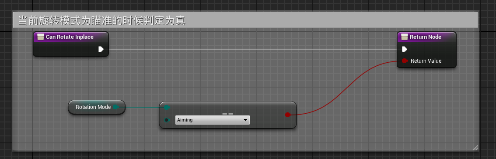
- Update Aiming Values计算控制器旋转和角色旋转之间的差值，仅返回YZ轴
- 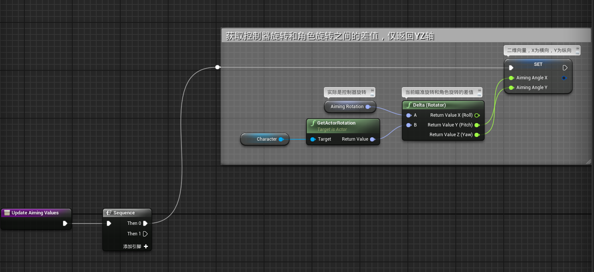
- Rotate Inplace Check计算布尔值左右转和旋转速率
- 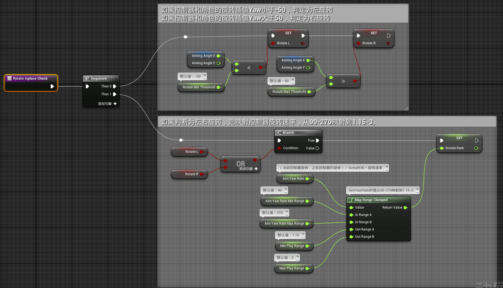
- 在UpdateGraph中调用这些函数
- 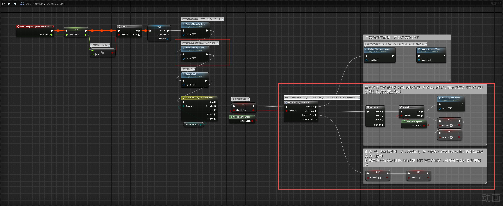
- 其中ML_DoWhile(TrueFalse)宏
- 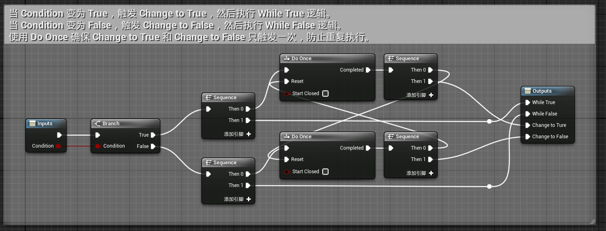
# 动画蓝图
## 事件图表
- 在Update Character Info函数中同步变量
- 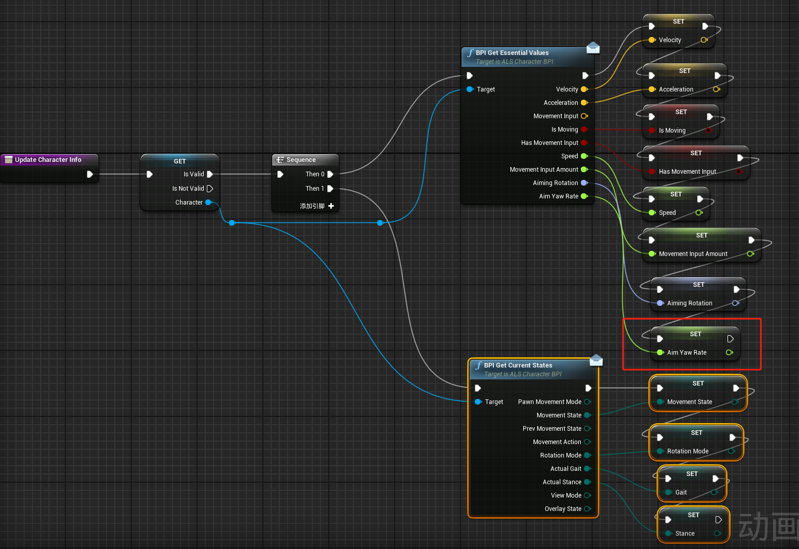
## 动画图表
- 在(N)Locomotion States状态机中
- 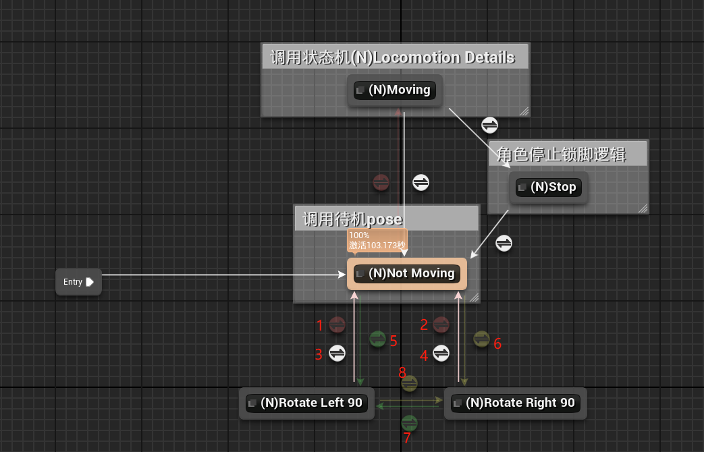
### 过渡规则
- 过渡规则1、2，过渡时长为0.2s
- 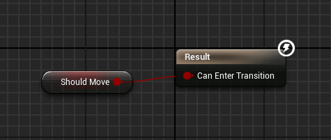
- 过渡规则3、4为自动规则，过渡时长为0s
- 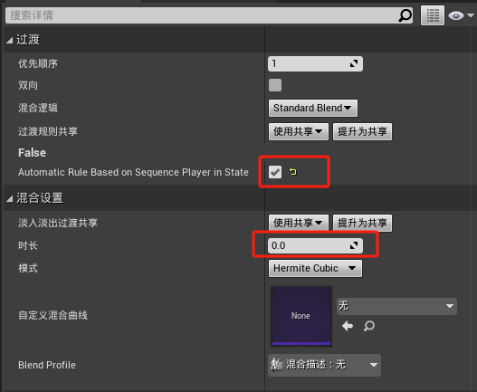
- 过渡规则5、7，过渡时长为0.2s
- 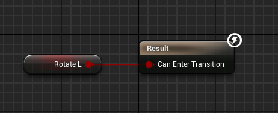 
- 过渡规则6、8，过渡时长为0.2s
- 6.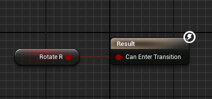
### 状态逻辑
- （N）Moving，添加进入蓝图状态事件Stop Transition
- 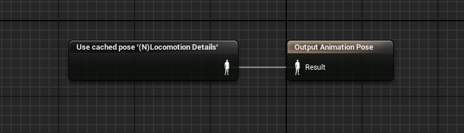
- 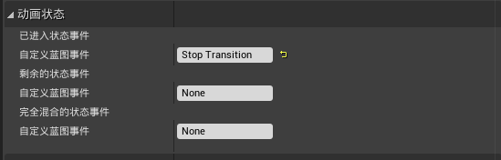
- (N)Rotate Left 90，添加进入蓝图状态事件Stop Transition
- 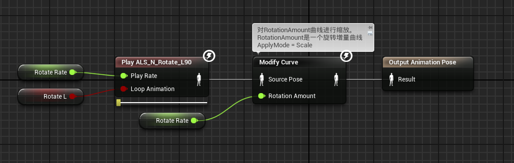
- (N)Rotate Right 90，添加进入蓝图状态事件Stop Transition
- 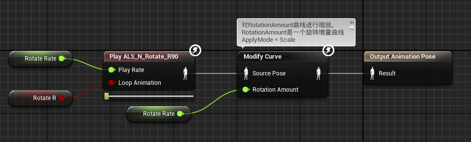