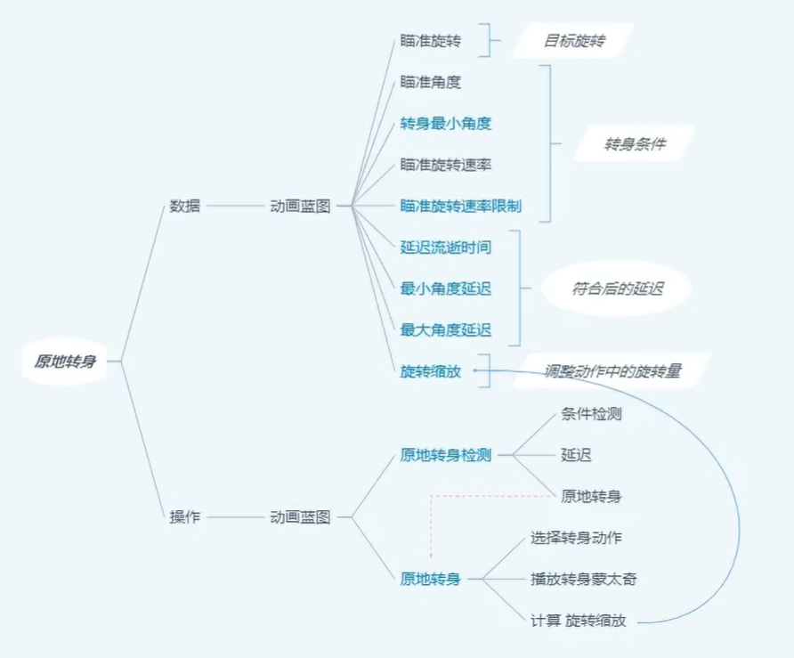
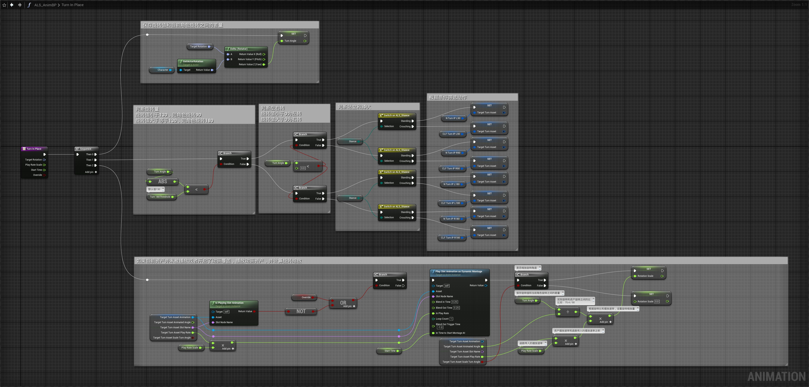
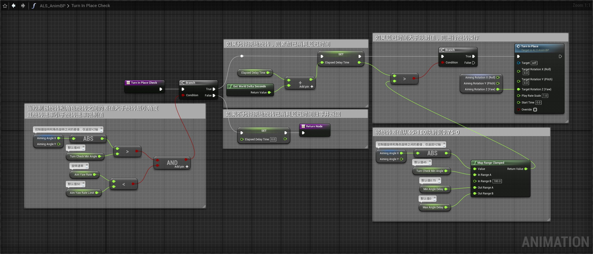
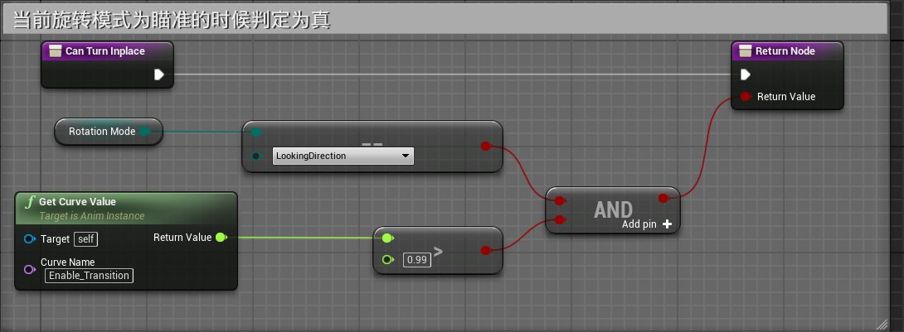
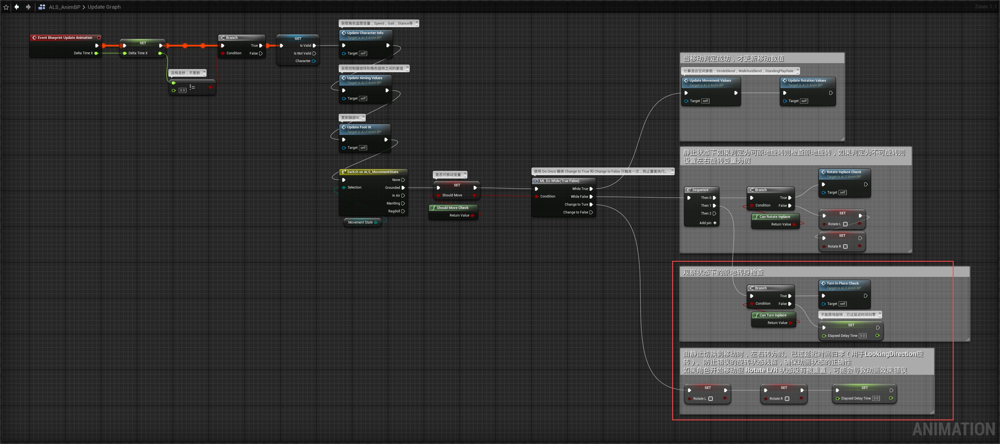
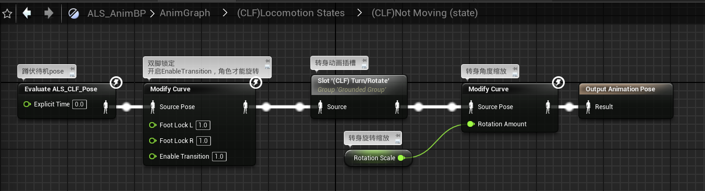
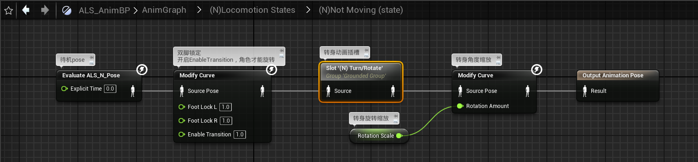

# 概述
- 处理观察状态（LookingDirection）下的原地转身
-  
# 动画蓝图
## 事件图表
- 创建函数Turn in Place，Turn in Place Check， Can Turn Inplace
- Turn in Place
- Turn in Place Check
- Can Turn Inplace
- 
- 在UpdateGraph中调用
## 动画图表
- 蹲伏状态机
- 
- 站立状态机
- 