# 概述
创建蹲伏移动时的八向移动，跟站立姿态下的八向移动非常相似，但是少了冲刺状态，也没有使用混合空间
# 动画蓝图
## 动画图表
- 直接复制(N)Locomotion Cycles状态改为(CLF)Locomotion Cycles
- 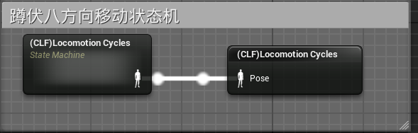
- 暂时将站立移动状态机切换为蹲伏移动状态机
- 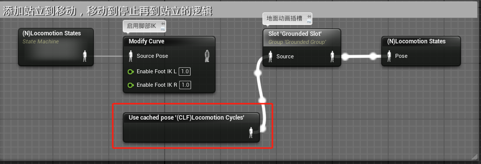
- 进入(CLF)Locomotion Cycles状态机，将其中的唯一状态改为(CLF)Locomotion Cycles
- 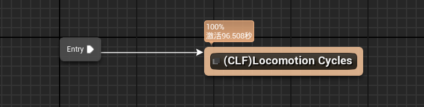
- 进入(CLF)Locomotion Cycles状态
- 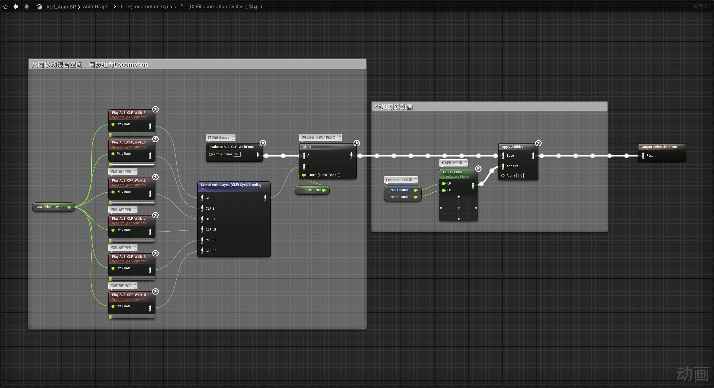
- 其中LINK的(CLF) CycleBlending动画层为
- 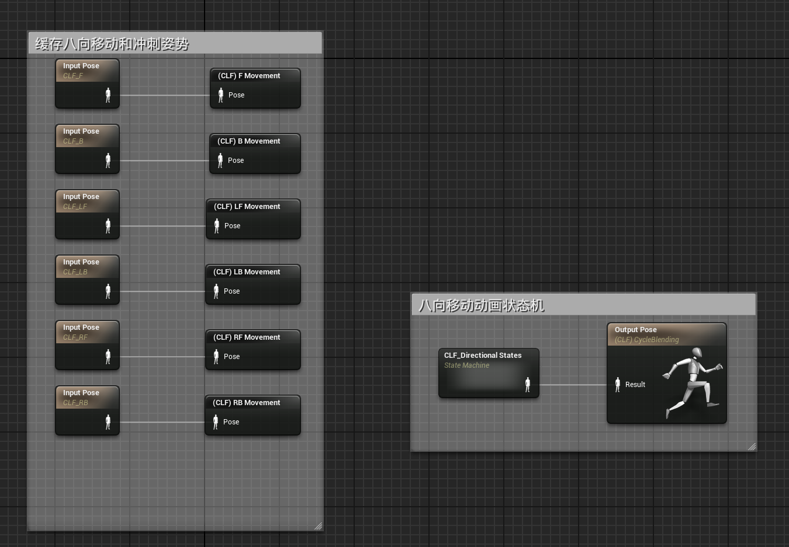
- 动画层中的CLF_Directional States状态机为
- 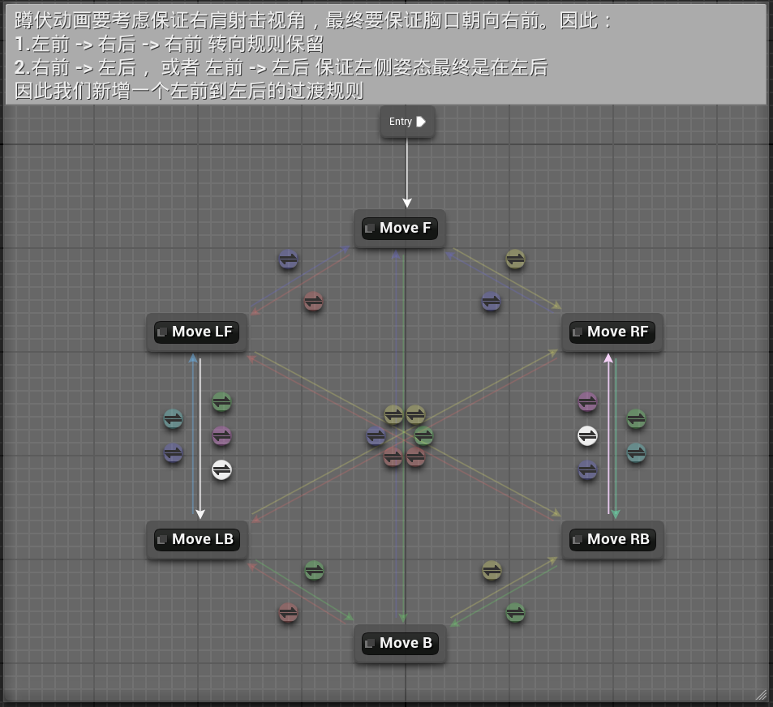
- 在过渡规则中，蹲伏动画要考虑保证右肩射击视角，最终要保证胸口朝向右前。因此：
1. 左前 -> 右后 -> 右前 转向规则保留
2. 右前 -> 左后， 或者 左前 -> 左后 保证左侧姿态最终是在左后
- 因此我们移除MoveLB -> MoveLF的自动切换规则，新增一个MoveLF -> MoveLB的过渡规则
- 移除MoveLB -> MoveLF的自动切换规则
- 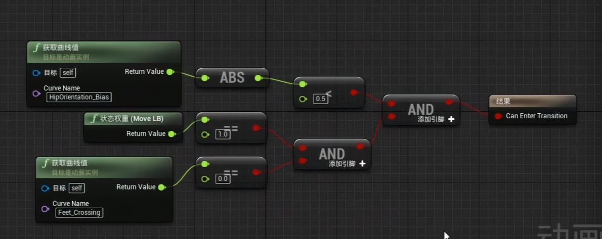
- 新增MoveLF -> MoveLB的自动切换规则
- 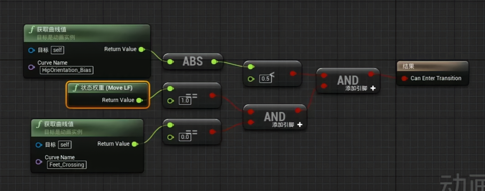
- 过渡时间都变长了，所有的过渡条件都为ChangeDirection 过渡时长为0.7
- 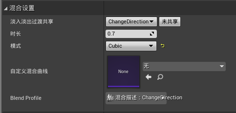
- 在所有状态中替换姿态，规则跟站立相似，不再一一截图
- 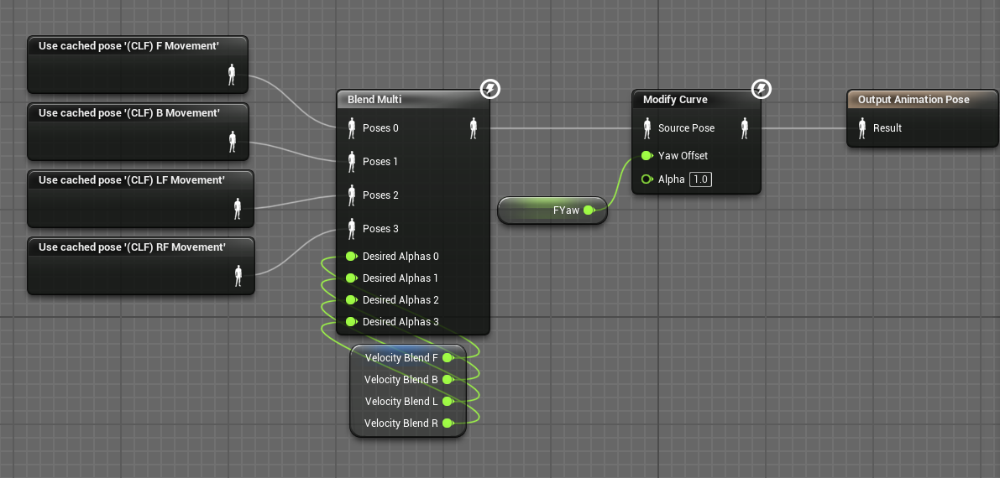
## 事件图表
- 主要是计算CrouchingPlayRate变量
- 创建CalculateCrouchingPlayRate函数
- 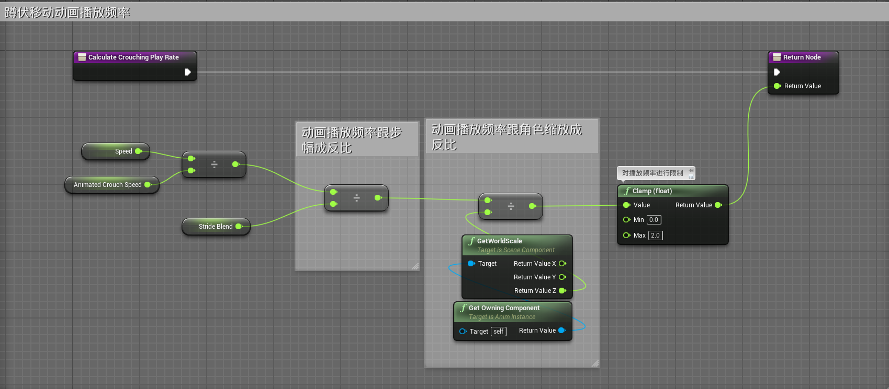
- 在Update Movement Values函数中调用
- 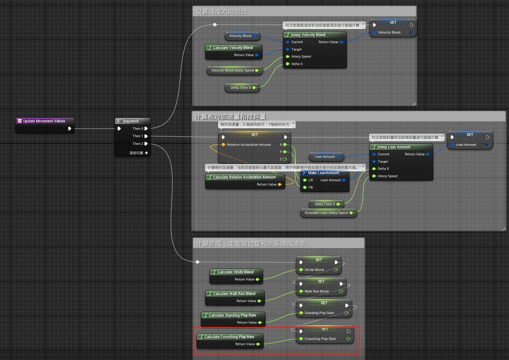