# 概述
- 处理蹲伏的移动、停止和原地旋转状态
# 动画蓝图
## 动画图表
- 复制状态(N)Locomotion States为(CLF)Locomotion States，并保存姿态顶替掉之前的(CLF)Locomotion Cycles
- 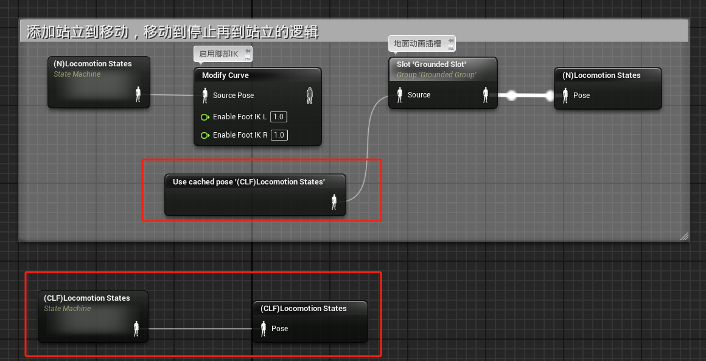
- 在(CLF)Locomotion States中
- 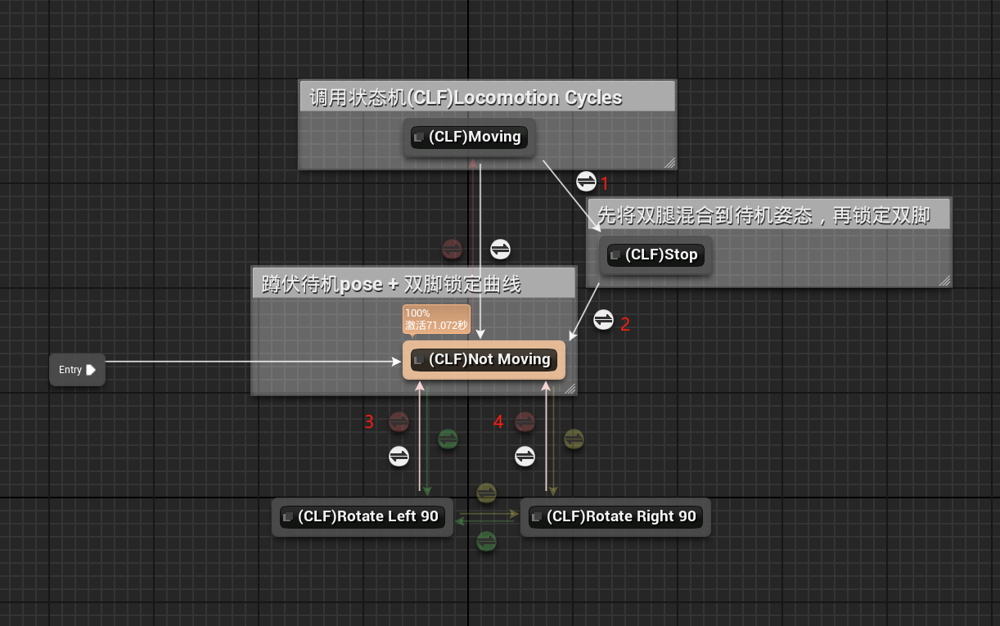
### 过渡规则
- 部分过渡时间要加长
1. 过渡时间改为0.1
2. 过渡时间改为0.5，并添加混合配置，使得双脚快速混合
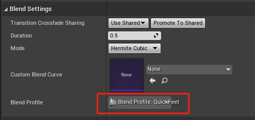
3. 过渡时间改为0.4
4. 过渡时间改为0.4
### 状态逻辑
- (CLF)Moving，进入状态自定义事件为Stop Transition
- 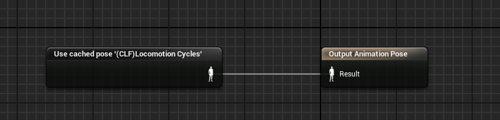
- 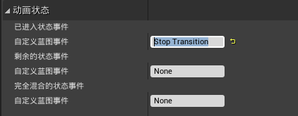
- (CLF)Not Moving，离开状态自定义事件为Stop Transition
- 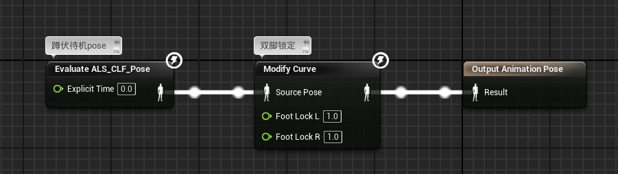
- 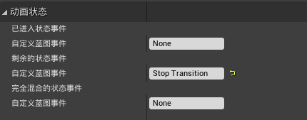
- (CLF)Stop，进入状态自定义事件为->CLF Stop
- 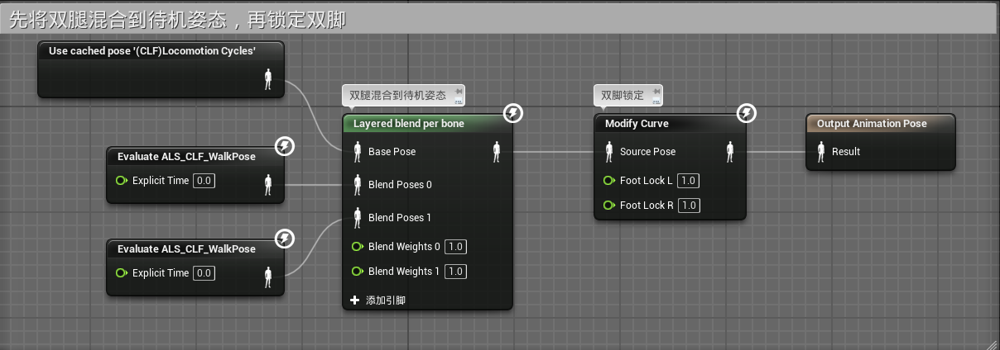
- 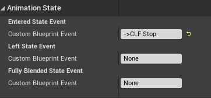
- (CLF)Rotate Left 90状态，进入状态自定义事件为Stop Transition
- 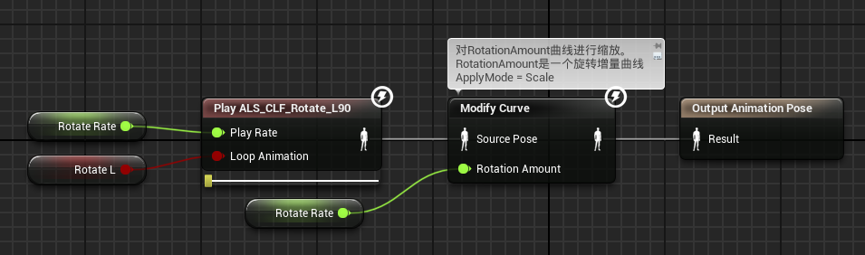
- 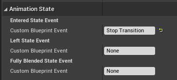
- (CLF)Rotate Right 90，进入状态自定义事件为Stop Transition
- 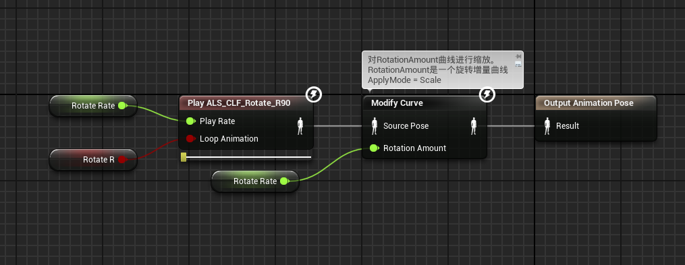
- 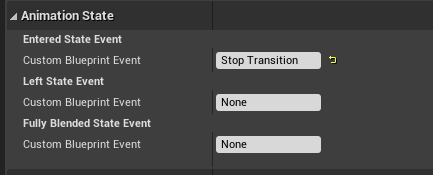
## 事件图表
- 在事件图表中播放蹲伏停止动画
- 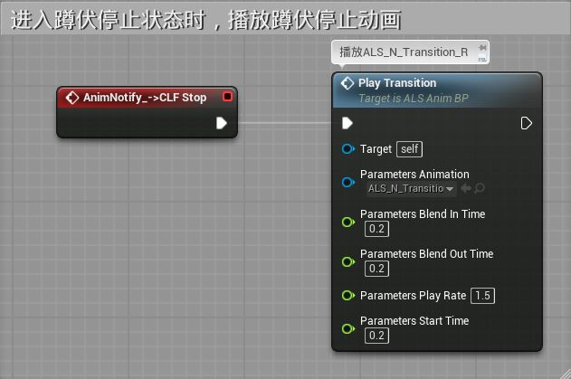