# 概述
- 站立和蹲伏混合为地面状态
# 动画蓝图
## 动画图表
- 创建地面状态机Main Grounded States，混合站立和蹲伏状态
- 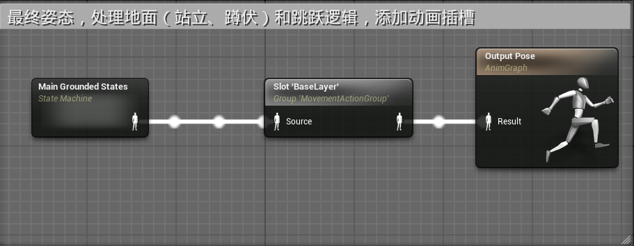
- 在状态机内
- 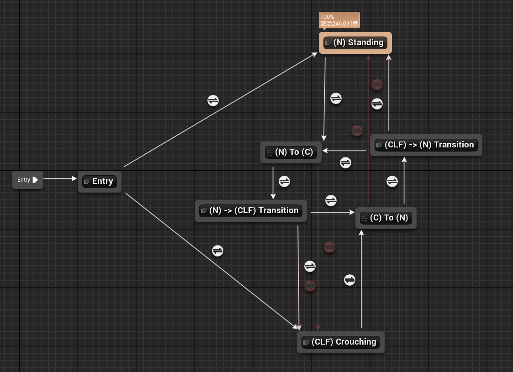
## 状态逻辑
### 过渡规则
- 从入口状态进入分支根据BasePose_CLF曲线的值确定目前是站立还是蹲伏
- 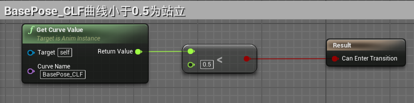
- 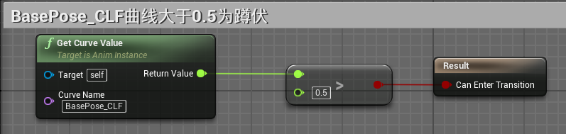
#### 站立到蹲伏
- 在站立姿态下。如果Stance的值为Crouching，则进入(N) To (C)导管
- 
- 进入导管后(N) To (C)
	- 如果目前触发了移动和旋转，则打断过渡直接切换到(CLF) Crouching状态
	- 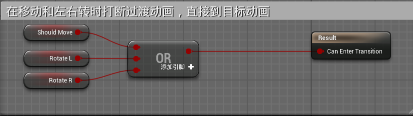
	- 如果没有触发移动和旋转，则进入过渡动画状态(N) -> (CLF) Transition，此过渡优先级为2
	- 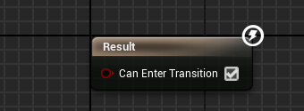
- 在(N) -> (CLF) Transition过渡动画状态
	- 采用自动过渡进入(CLF) Crouching
	- 如果此时触发了移动和旋转，则打断过渡直接切换到(CLF) Crouching状态
	- 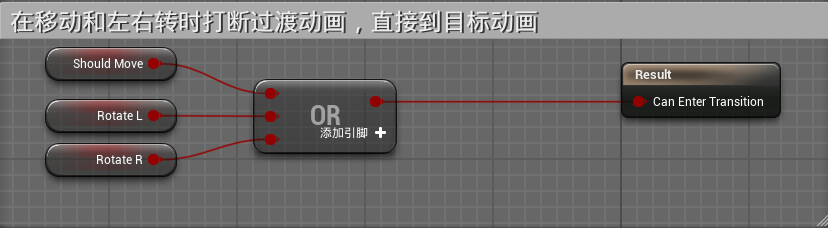
	- 如果此时按下姿态切换键，Stance状态变成Standing，则进入(C) To (N)导管回到站立状态
	- 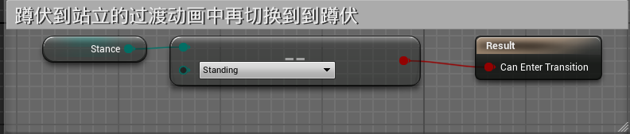
#### 蹲伏到站立
- 在(CLF) Crouching状态，如果Stance的值为Standing，则进入(C) To (N)导管
- 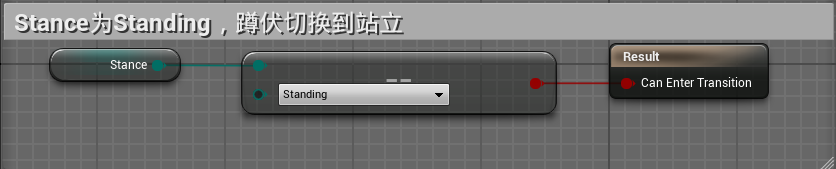
- 在(C) To (N)导管状态下
	- 如果此时触发了旋转或移动，则打断过渡直接进入站立状态(N) Standing
	- 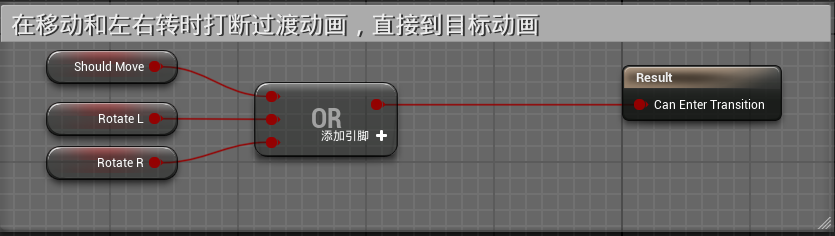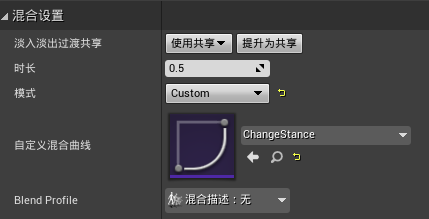
	- 如果没有触发旋转或移动，则进入过渡动画状态(CLF) -> (N) Transition，此过渡优先级为2
	- 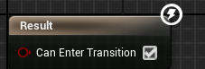
- 在(CLF) -> (N) Transition过渡动画状态下
	- 采用自动过渡规则进入站立状态(N) Standing
	- 如果触发了旋转和移动则打断过渡直接进入站立状态(N) Standing
	- 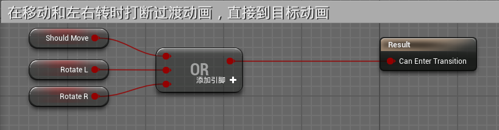
	- 如果此时按下姿态切换键，Stance状态变成Crouching，则进入(N) To (C)导管回到蹲伏状态
### 状态逻辑

- Entry是一个空状态用于分出站立和蹲伏的分支
- (N) Standing
- 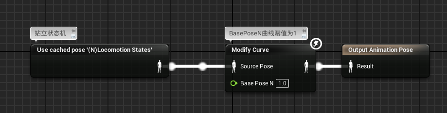
- (CLF) Crouching
- 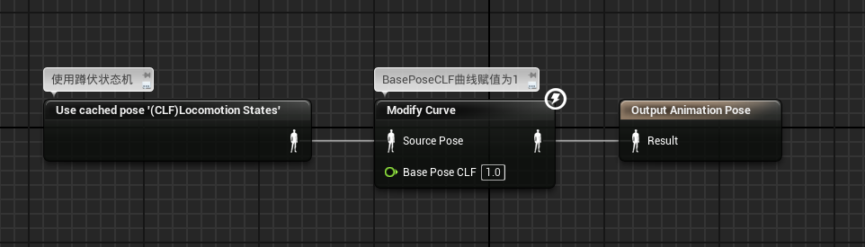
- (CLF) -> (N) Transition，过渡状态，添加进入蓝图事件Stop Transition，停止播放蒙太奇
- 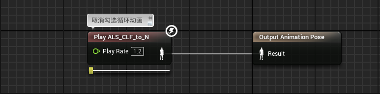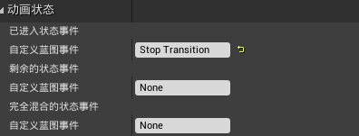
- (N) -> (CLF) Transition添加进入蓝图事件Stop Transition，停止播放蒙太奇
- 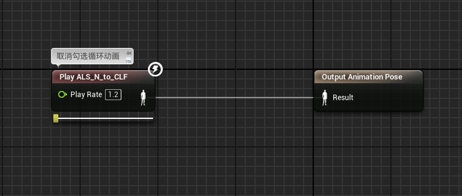
- (N) To (C)和(C) To (N)为导管，用于分支
- 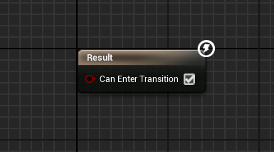
## 事件图表
- 实现蓝图事件Stop Transition
- 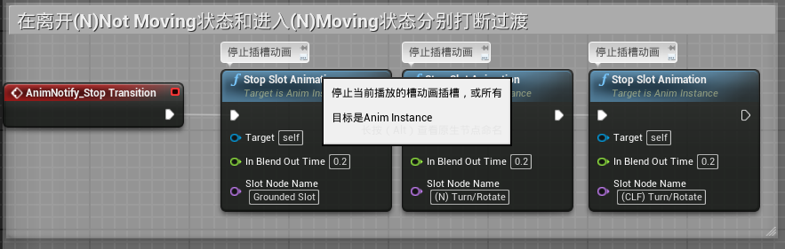
# 角色蓝图
- 在角色蓝图中完善蹲伏站立的输入逻辑
- 创建一个宏MutiTapInput，用于判断输入是单击还是双击
- 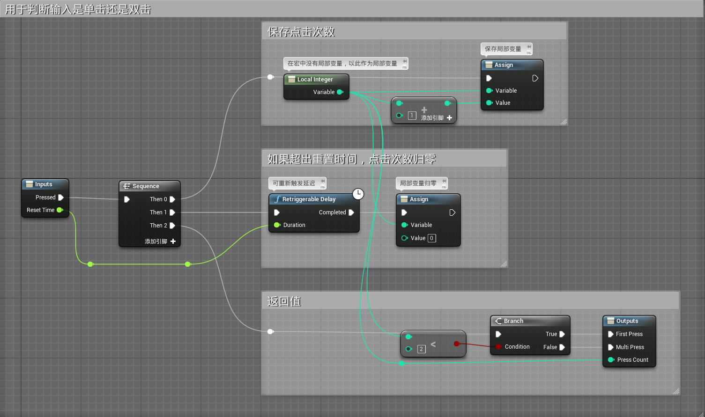
- 完成输入处理
- 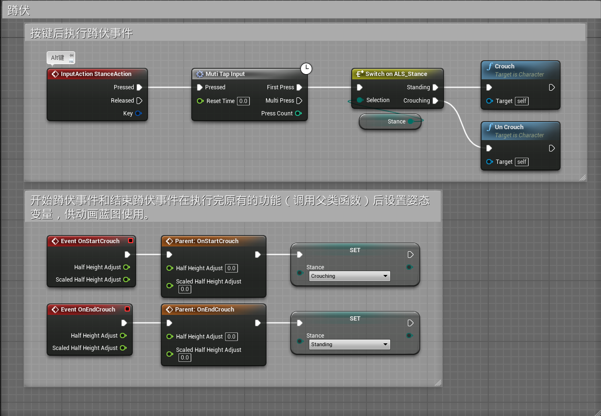