# 概述
- 翻滚处理
- 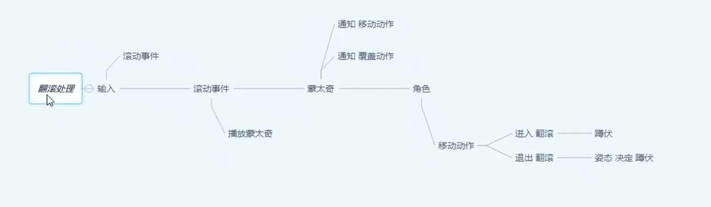
# 角色蓝图
## ALS_Base_CharacterBP
### 事件图表
- 在接口函数BPIGetCurrentState中同步变量MovementAction
- 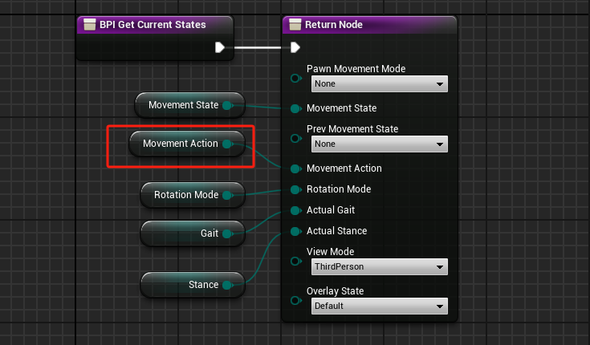
- 创建函数On Movement Action Changed
- 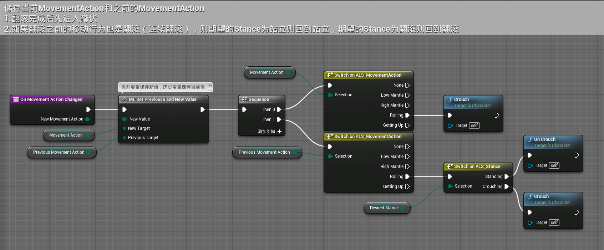
- 实现接口函数BPISetMovementAction
- 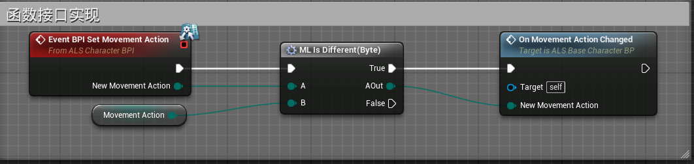
- 创建函数On Stance Changed
- 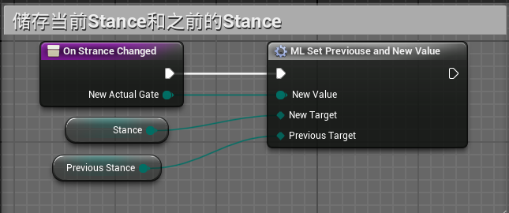
- 创建函数Get Roll Animation，用于获取所需的翻滚动画（持武器，空手）。不实现，由子类蓝图覆盖实现。
- 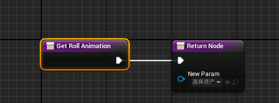

- 在InputGraph中更新
- 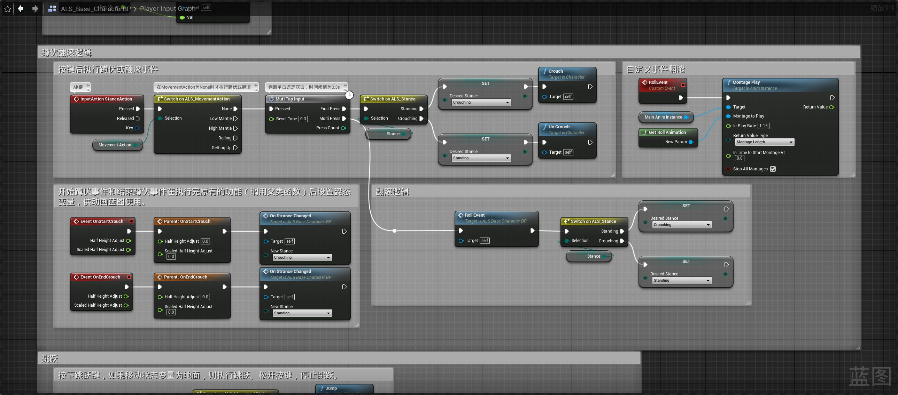
## ALS_AnimMan_CharacterBP
- 在子蓝图中重载
- 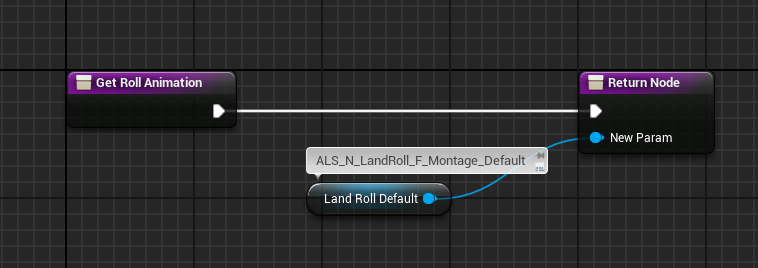
- 
# 动画蓝图
## 事件图表
- 在Update Character Info函数中同步变量MovementAction
- 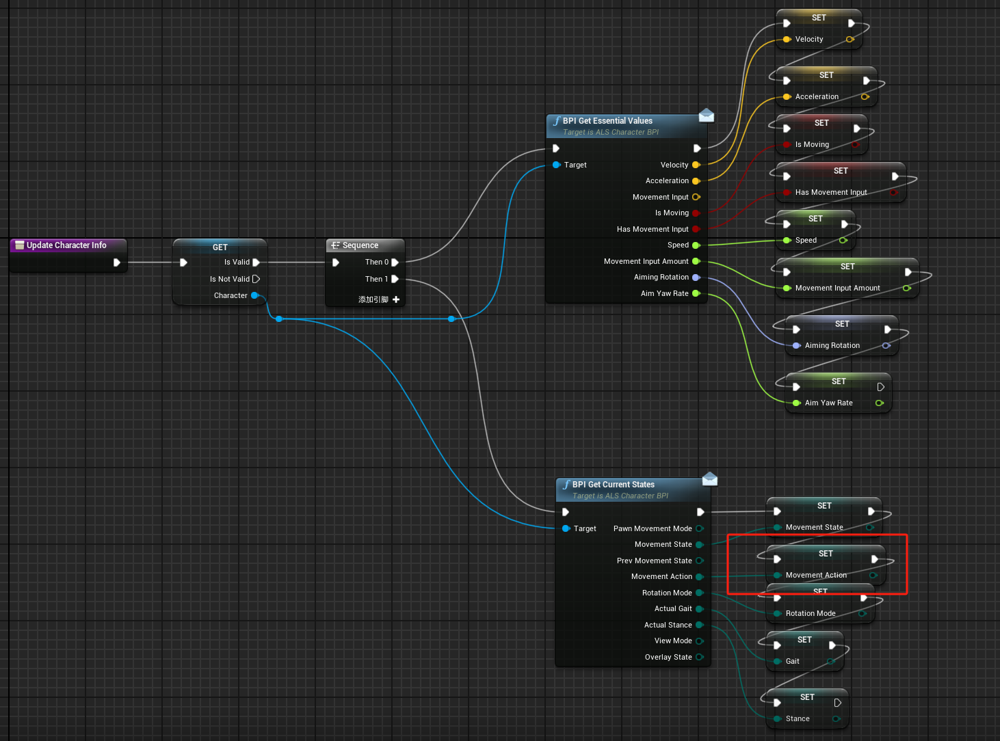
- 在蓝图中继承接口ALS Anim BPI
- 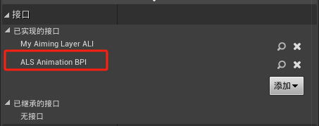
- 实现其中的函数Event BPI Grounded Entry State，此变量用于结束翻滚动画，混合到地面状态
- 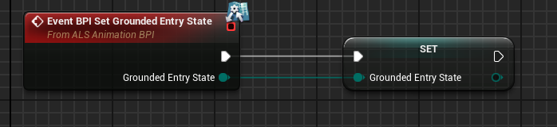
## 动画图表
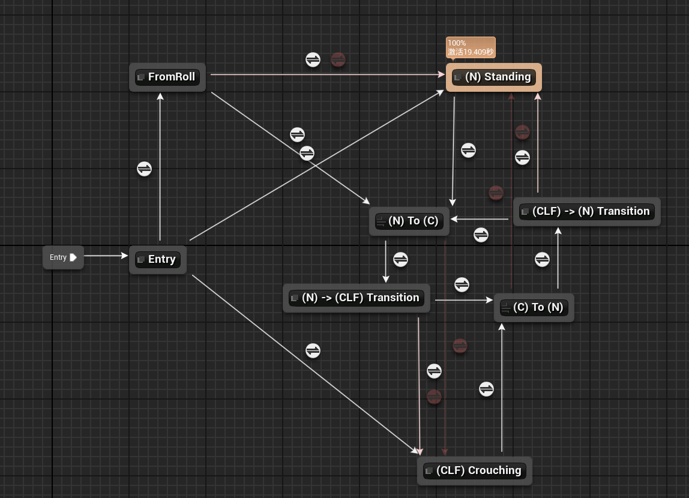
- 在Entry状态新增进入蓝图事件Reset-GroundedEntryState，用于重置Grounded Entry State变量
- 新增FromRoll状态
- 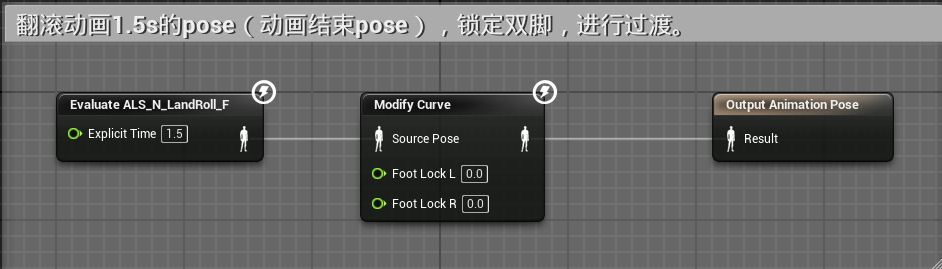
- 当Grounded Entry State为Roll时从 Entry 进入FromRoll
- 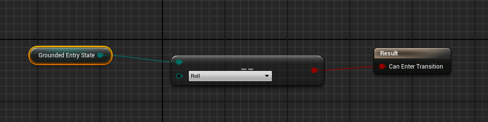
- 在FromRoll状态
	- 当角色位移或旋转时，打断过渡，直接过渡到(N) Standing
	- 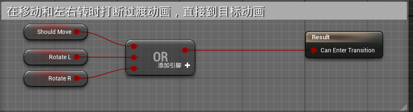
	- 当角色没有位移或旋转时，自动过渡到(N) Standing，加入开始过渡事件Roll -> Idle
	- 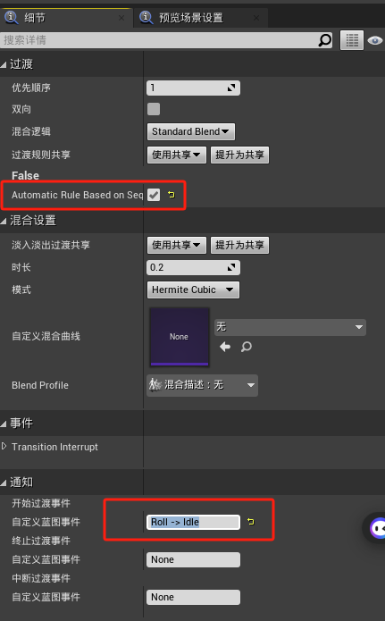
	- 当Stance为couching时，过渡到(N) To (C)导管
	- 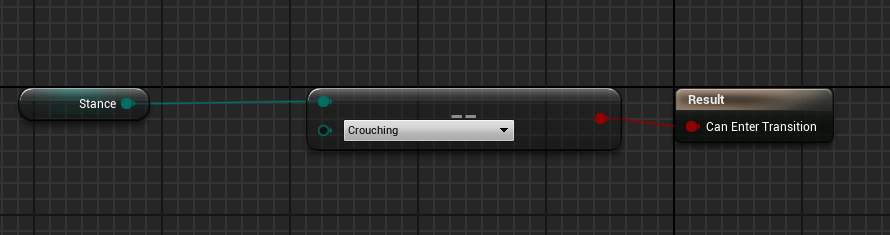
此时，去事件蓝图中实现Roll -> Idle和Reset-GroundedEntryState
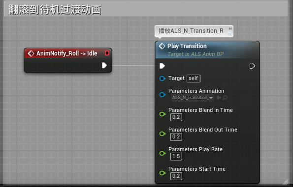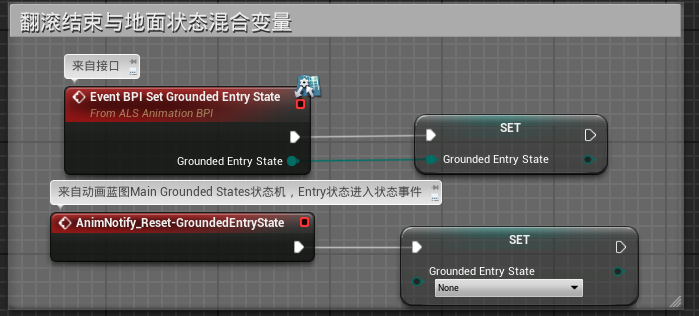

# 动画通知
## MovementAction_NotifyState 
- 角色翻滚是通过动画通知来修改MovementAction变量的
- 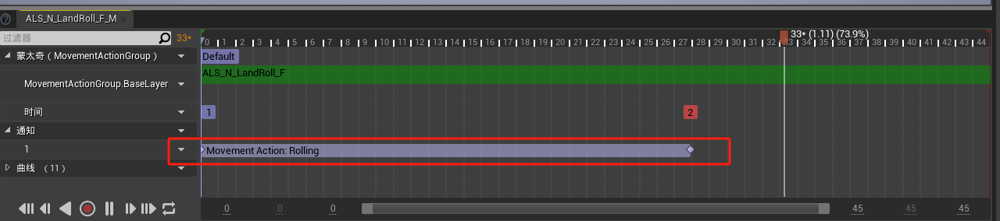
- MovementAction_NotifyState   AnimNotify蓝图类，该动画通知蓝图类 重载三个函数
- 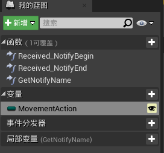
- Received_NotifyBegine函数
- 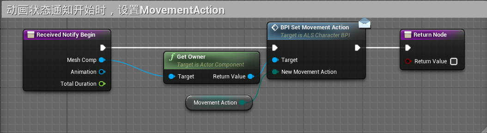
- Received_NotifyEnd函数
- 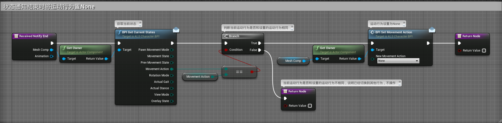
- GetNotifyName
- 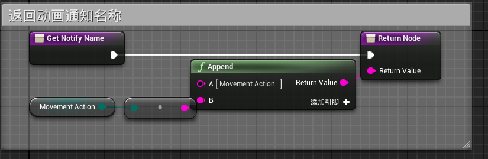
## GroundedEntryState_AnimNotify
- 有对应的动画通知蓝图类GroundedEntryState_AnimNotify
- 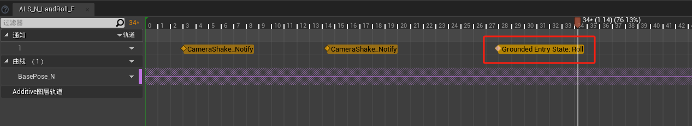
- 蓝图类GroundedEntryState_AnimNotify重载的方法Received_Notify为
- 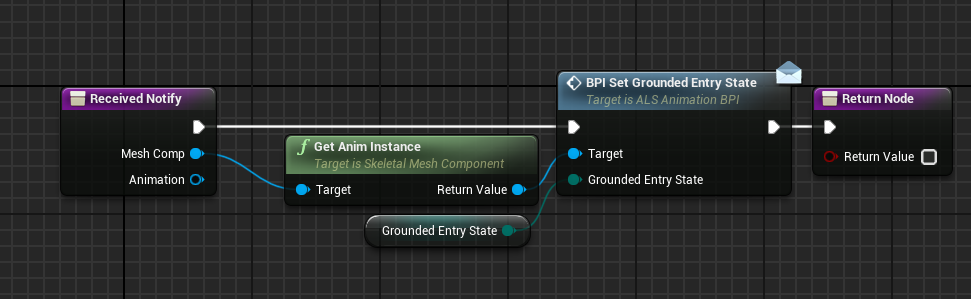