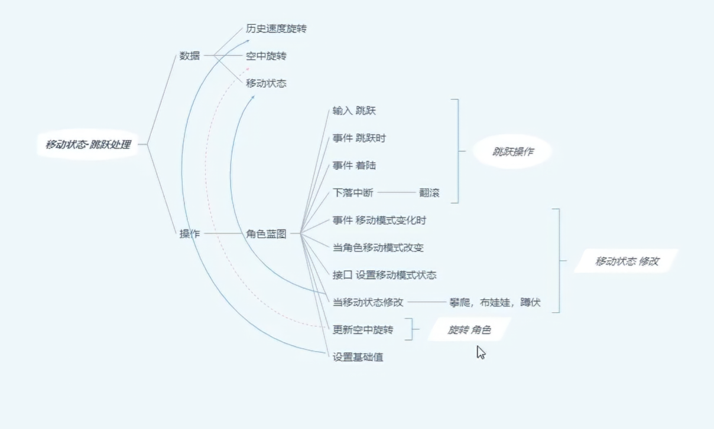
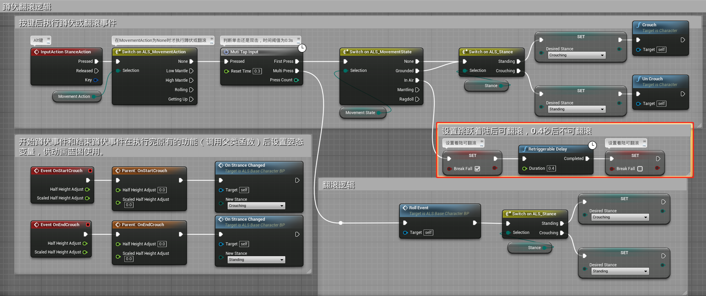
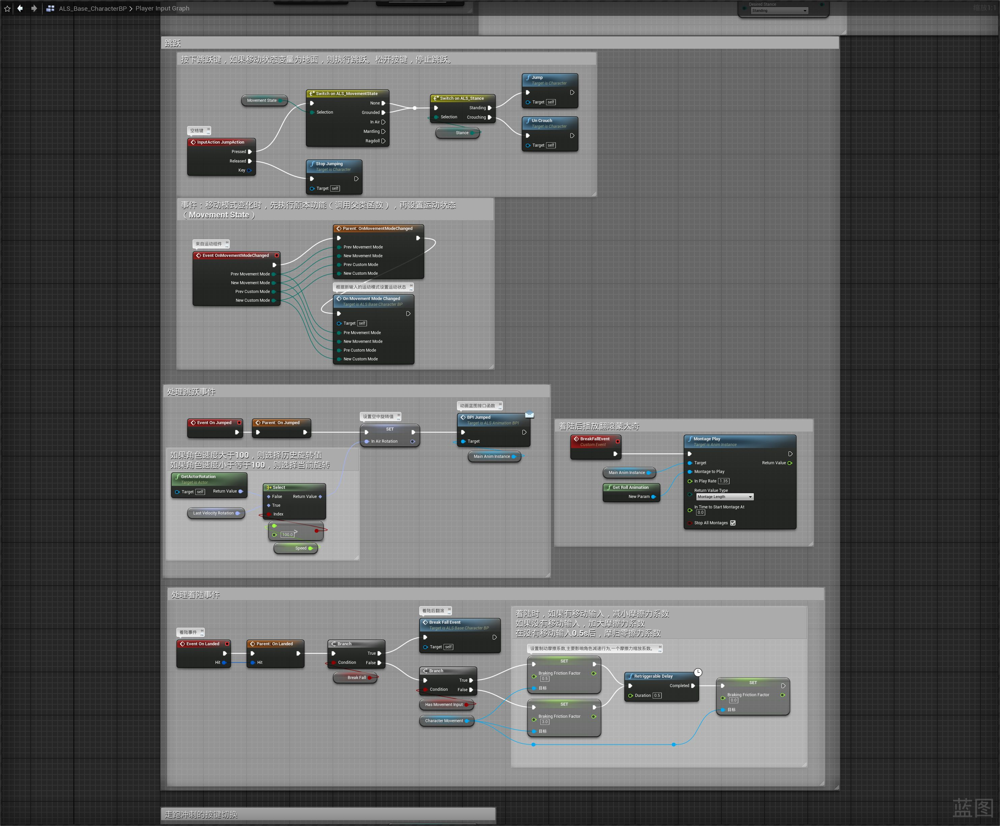
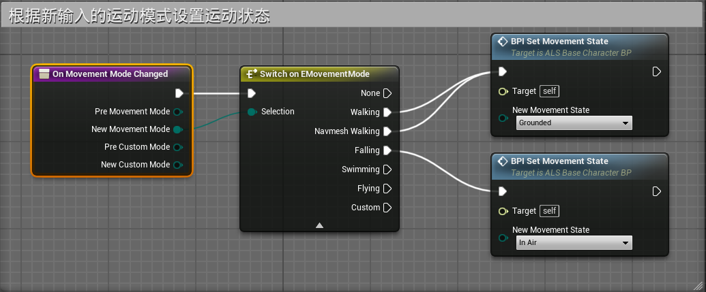
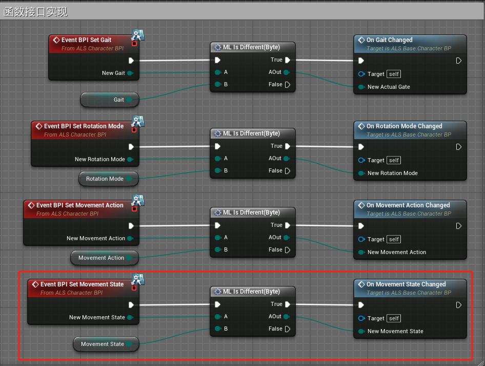
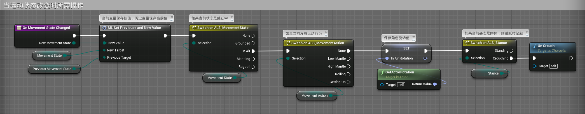

# 概述
- 处理跳跃系统
- 
# 角色蓝图
## 事件图表
- 在PlayerInputGraph中翻滚行为中添加空格键跳跃着陆时按ALT键可翻滚的布尔变量BreakFall
- 
- 创建函数On Movement Mode Changed 来对接PlayerInputGraph中运动组件的事件Event OnMovementModeChanged
- 
- On Movement Mode Changed 函数
- 
- 创建函数On Movement State Changed 来对接事件图表中接口函数 Event BPI Set Movement State
- 
- 其中On Movement State Changed 函数
- 