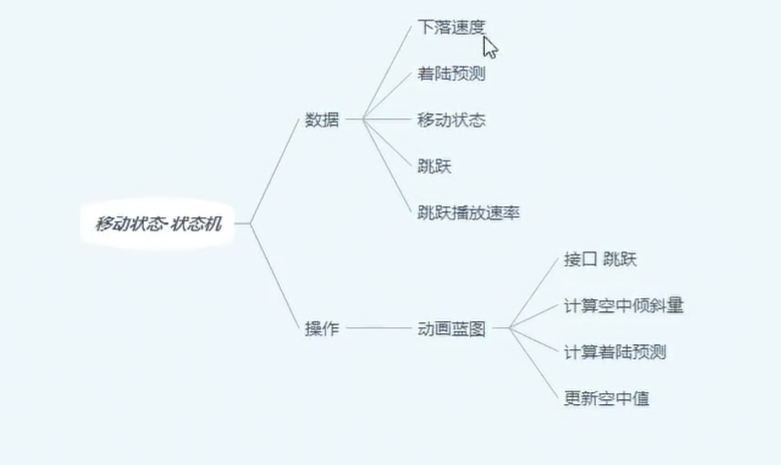
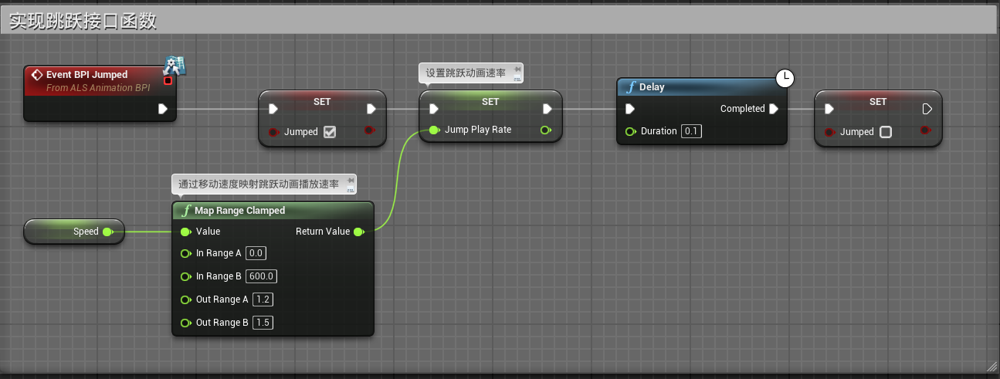
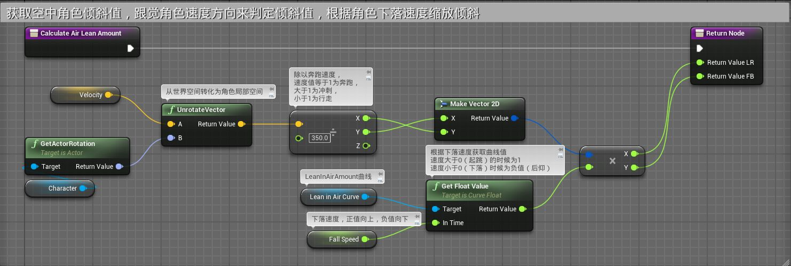
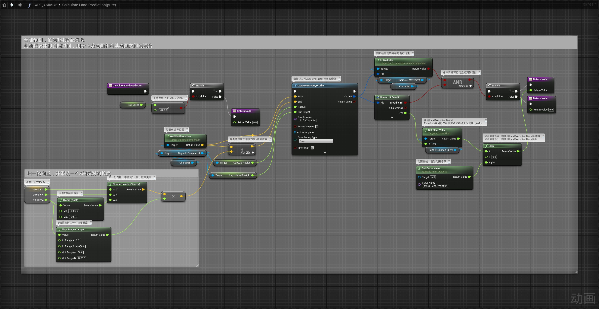
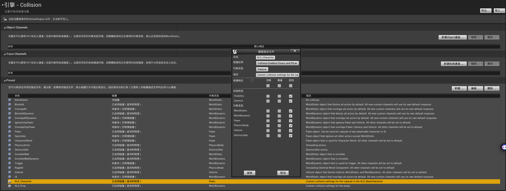
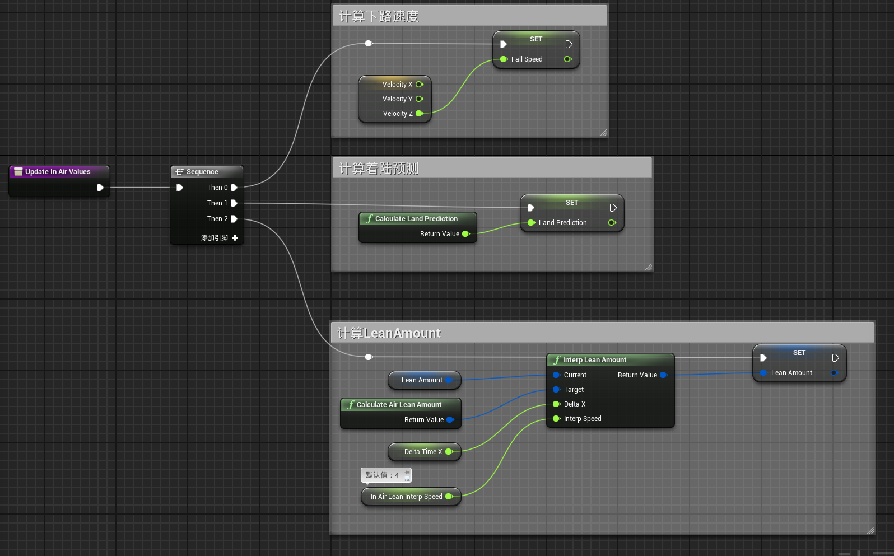
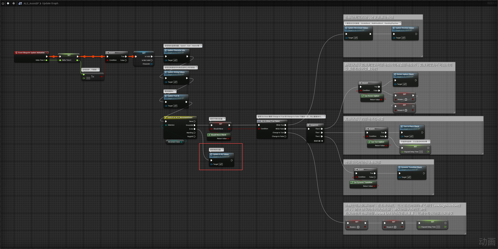

# 概述
- 跳跃处理动画蓝图数据获取
- 
# 动画蓝图
## 事件图表
- 在事件图表中实现跳跃接口函数
- 
- 创建三个函数Calculate Air Lean Amount，Calculate Land Prediction，Update in Air Values
- Calculate Air Lean Amount
- 
- Calculate Land Prediction
- 
- 其中胶囊体检测节点的的ProfileName：ALS_Character为
- 
- Update in Air Values
- 
- 在UpdateGraph中更新Update In Air Values
- 