# 概述
- 跳跃系统状态机
# 动画蓝图
## 动画图表
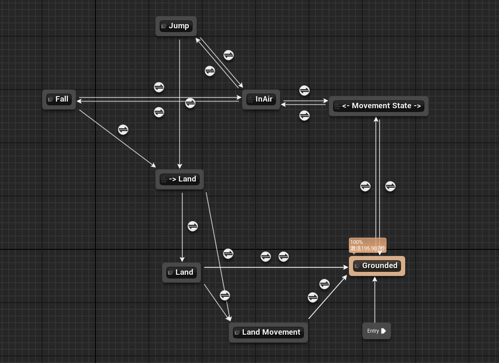
### 状态和导管
- Grounded 地面状态
- 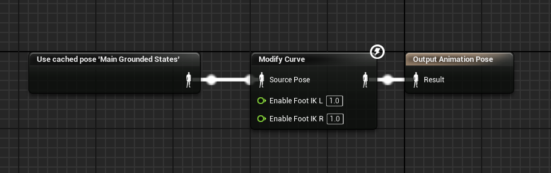
- - <- Movement State ->导管指向所有非地面状态
- 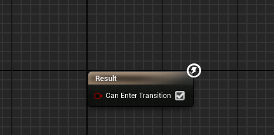
- - InAir导管指向所有空中状态包含Jump和Fall
- 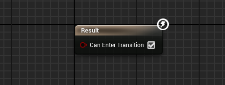
- Jump，跳跃状态
- 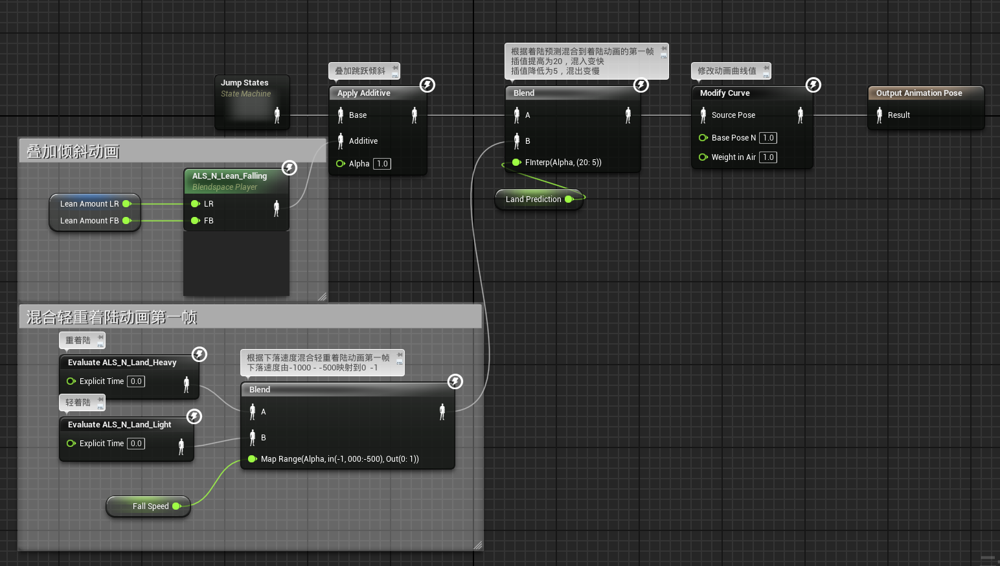
- 其中的JumpStates状态机
- 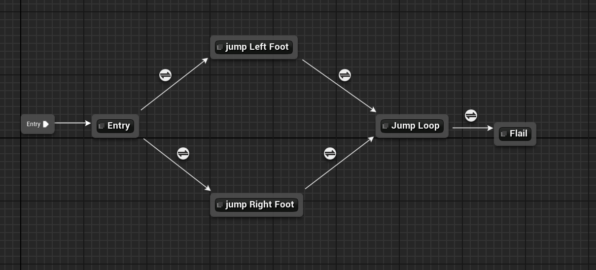
	- jump Left Foot状态
	- 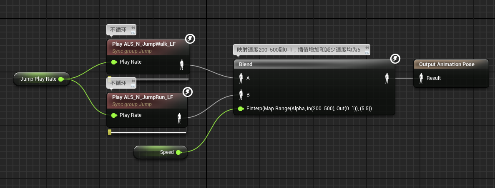
	- jump Right Foot状态机
	- 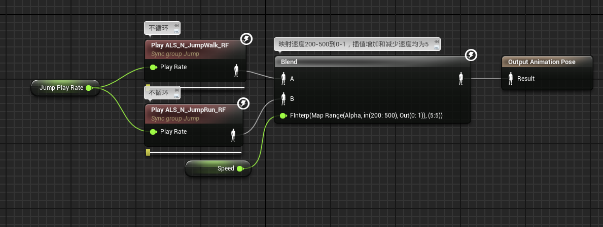
	- Jump Loop状态
	- 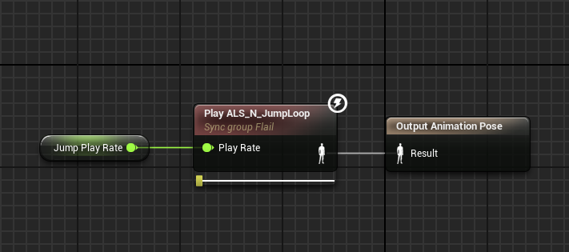
	- Flail状态
	- 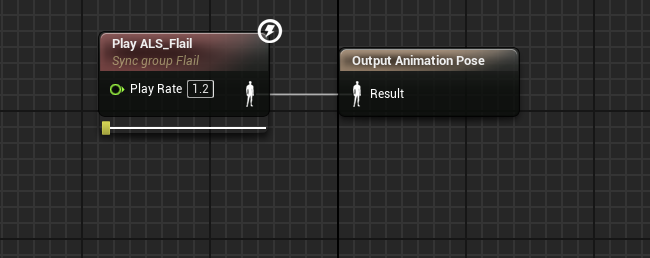
	- Entry -> jump Left Foot
	- 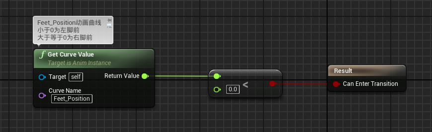
	- Entry -> jump Right Foot
	- 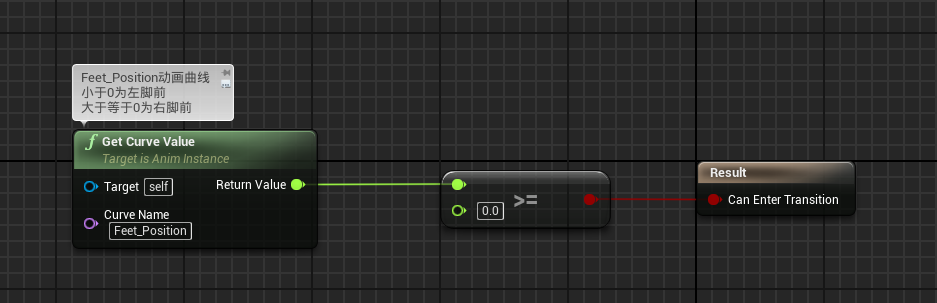
	-  jump Left Foot  -> JumpLoop
	- 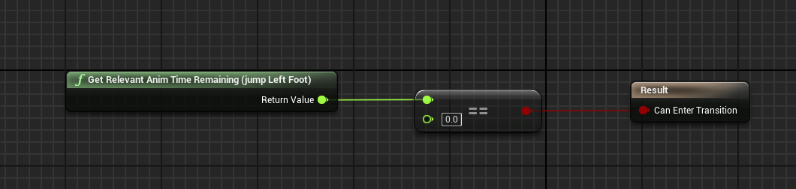
	- jump Right Foot -> JumpLoop
	- 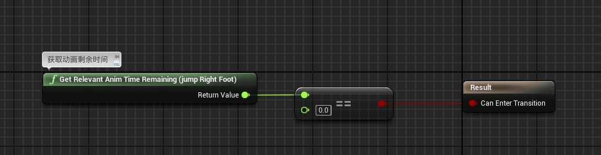
	- JumpLoop   -> Flail，这里作者应该是没有写完，直接过渡到挥舞手臂动画
	- 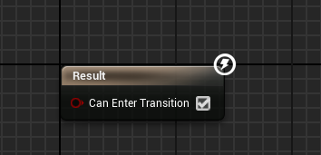
- Fall，下落状态
- 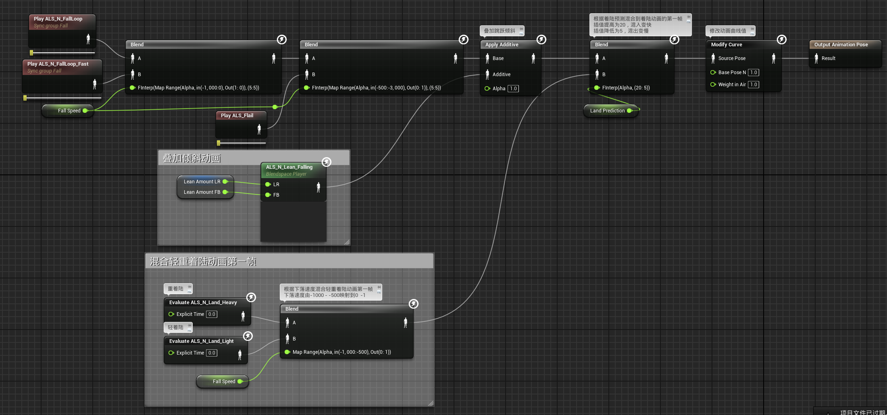
- -> Land导管，对接着陆Land和运动着陆LandMovement
- 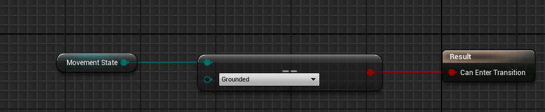
- Land,着陆状态
- 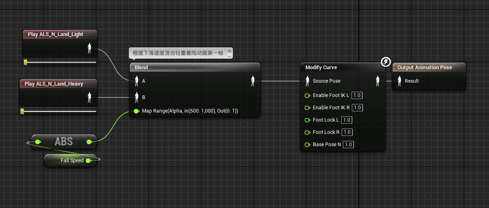
- Land Movement，运动着陆
- 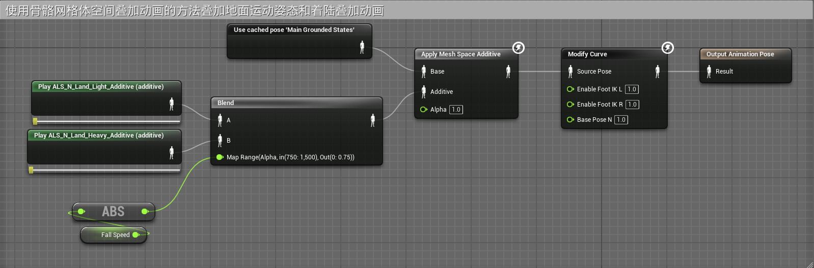
- 注意，这里的两个叠加动画资产也要设置为网格体空间叠加
- 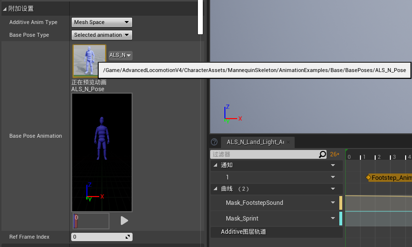
### 过渡规则

- 进入Grounded状态
	- 如果MovementState 不为地面状态，则切换到<- Movement State ->导管
	- 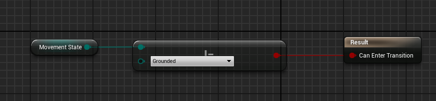

- <- Movement State ->导管中
	- 如果MovementState 为地面状态，则切换回地面状态Grounded 
	- 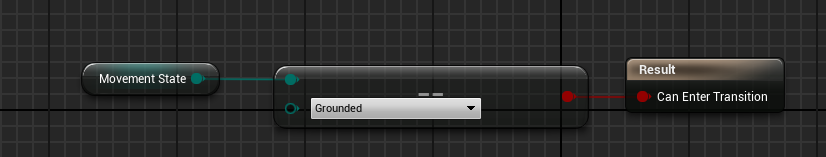
	- 如果MovementState 为InAir，则过渡到-> InAir导管
	- 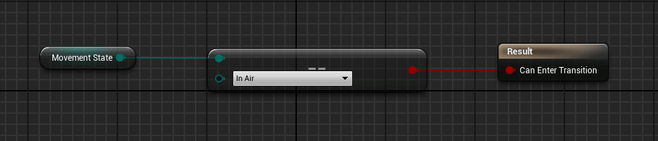

- InAir导管
	- 如果MovementState 不为InAir，则回到<- Movement State ->导管
	- 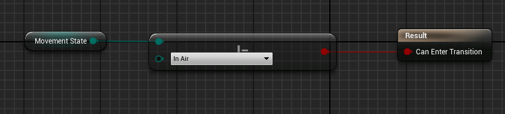
	-  如果Jumped为真，进入Jumped状态
	- 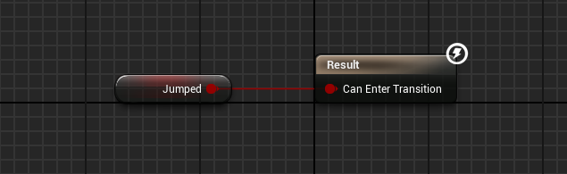
	- 如果MovementState为InAir，进入Fall状态，这一条优先级为2
	- 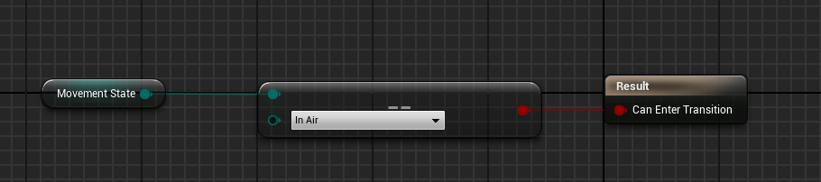
- Jump状态
	- 如果MovementState不为InAir，则回到-> InAir导管
	- 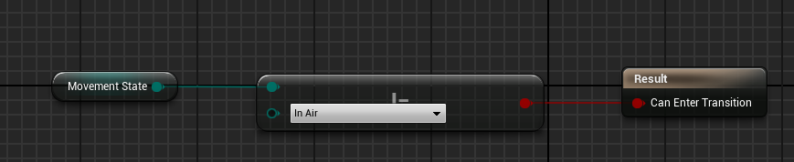
	- 直接过渡到-> Land导管
	- 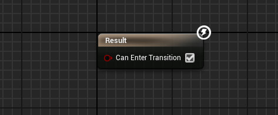
- Fall状态
	- 如果MovementState不为InAir，则回到-> InAir导管
	- 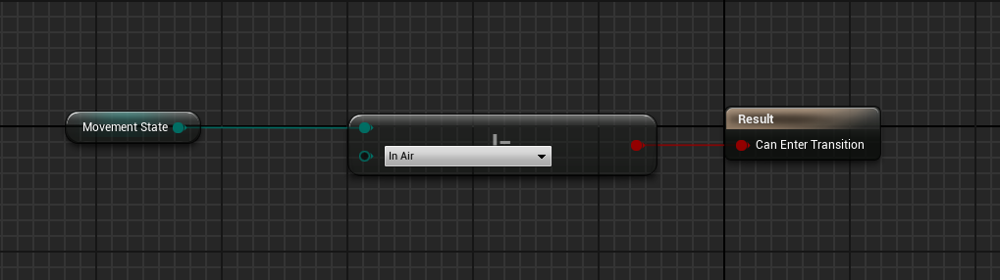
	- 直接过渡到-> Land导管
	- 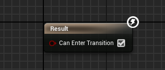
- -> Land 导管
	- 直接过渡到Land状态
	- 
	- 如果有位移的旋转输入，则过渡到Land Movement状态
	- 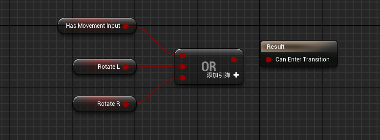
- Land状态
	- 如果有位移的旋转输入，或移动速度大于650，进入Land Movement状态
	- 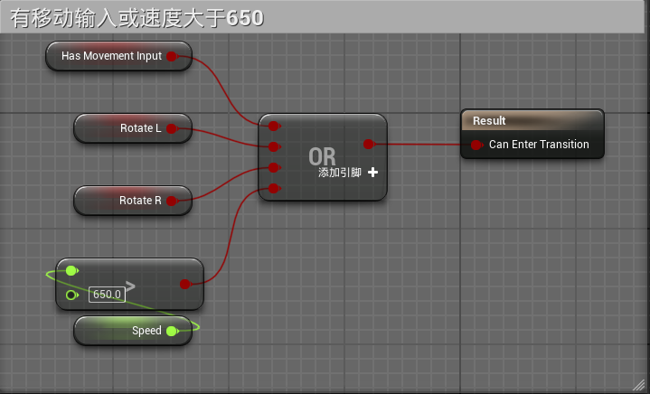
	- 如果动画播放完毕，进入Grounded状态
	- 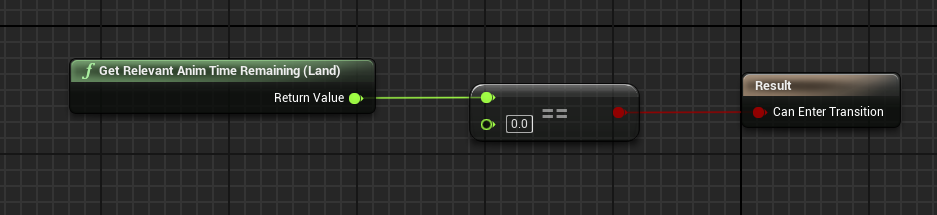
	- 如果movement state 不为Grounded或者Stance不为Stand，强制进入进入Grounded状态
	- 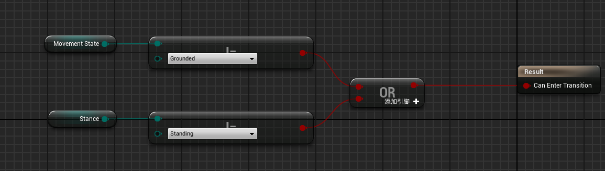
- LandMovement状态
	- 采用自动过渡到Grounded状态
	- 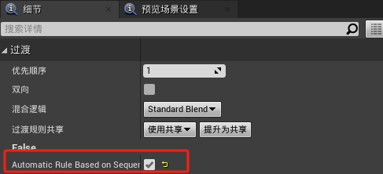
	- 如果movement state 不为Grounded或者Stance不为Stand，强制进入进入Grounded状态
	- 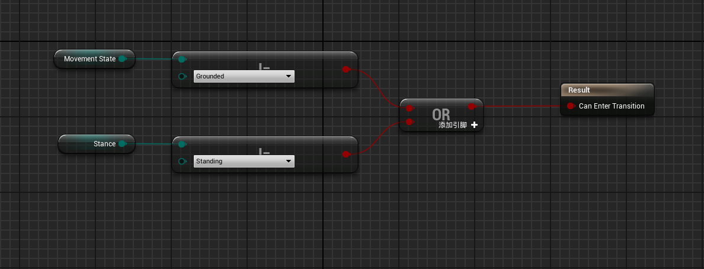