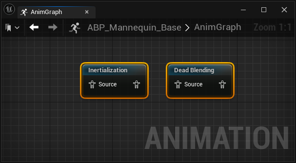
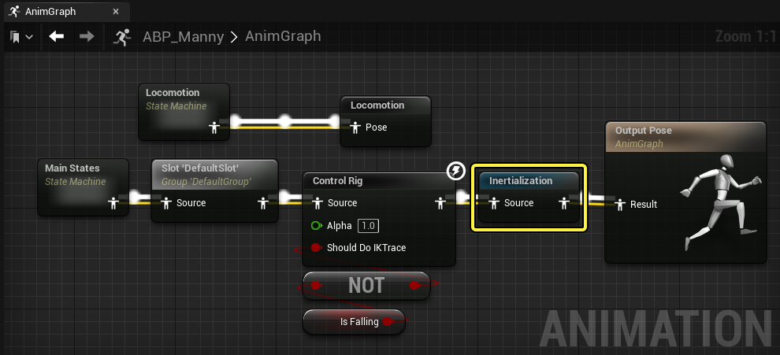
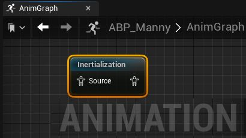
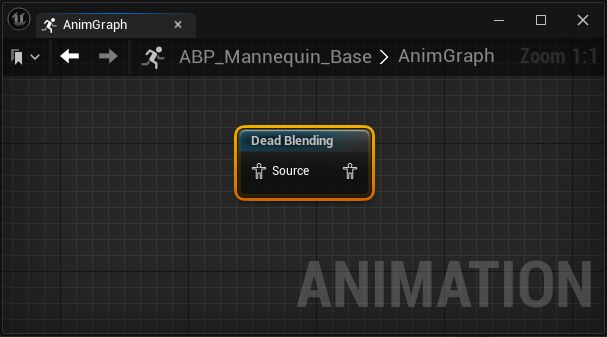
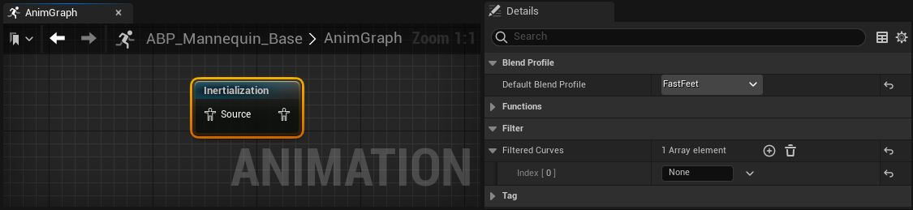
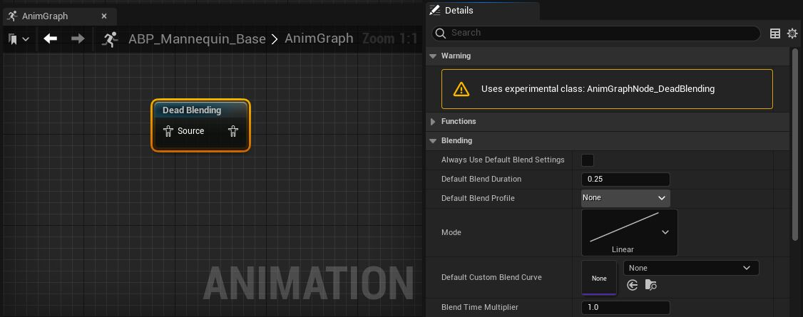
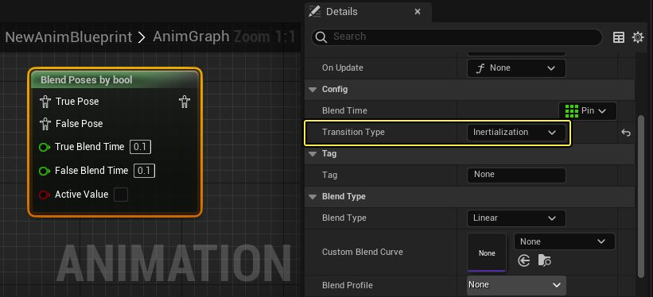
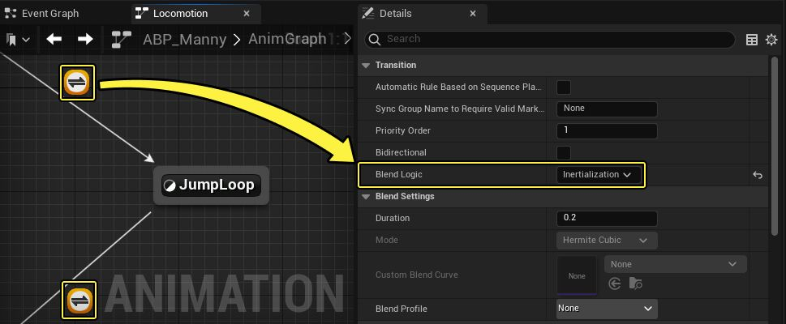
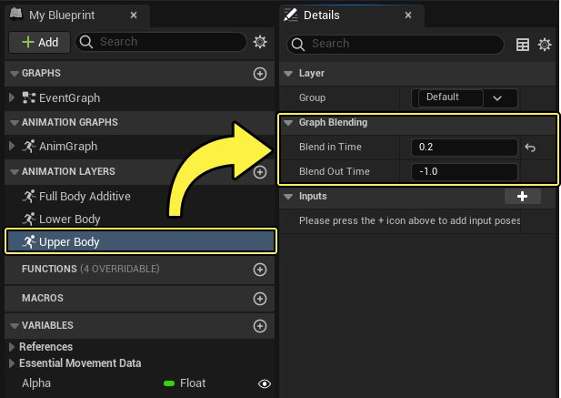

# 概述
- **惯性混合(Inertial blending）** 是传统动画淡入淡出的高性能替代方案，可生成后期处理的自然过渡。激活惯性混合后将不再计算源姿势。相反，传统混合在过渡期间会计算源姿势和目标姿势，将其组合成混合姿势。
	- 普通混合是将源姿势权重由1到0，同时目标姿势由0到1进行权重混合
	- 惯性化过渡不再将源姿势权重由1到0，而是直接从 源姿势过渡时间点的pose 过渡到 目标姿势
### 🟢 **惯性化的核心原理**

当一个动画突然停止，而新的动画开始播放时，角色的姿态可能会出现剧烈变化。惯性化通过以下方式解决这一问题：
1. **记录旧动画的运动趋势**（位置、速度、旋转）。
2. **预测角色的运动轨迹**，然后将其逐渐调整到新动画的姿态。
3. **利用缓冲数据**，在较短时间内模拟“物理惯性”效果，使过渡更自然。
简单来说，它的作用类似于“惯性补偿”，可以让动画在切换时表现得更平滑，而不会立即硬切到新动画的姿态。

要使用惯性混合，你可以在你要进行惯性混合的源动画之后的位置，将 **Inertialization** 或 **Dead Blending** 节点添加到 **AnimGraph** 。每个节点通过不同的方法处理惯性混合。

Inertialization和Dead Blending节点将跟踪 **动画曲线（Animation Curves）** 中的动画姿势运动和变化，以便在惯性混合激活时，运动能继续向目标动画移动。这些节点通过连接至其 **源** 输入姿势引脚的 **惯性混合请求** 激活。[状态机过渡](https://dev.epicgames.com/documentation/zh-cn/unreal-engine/animation-blueprint-blend-nodes-in-unreal-engine#%E6%9D%A5%E8%87%AA%E7%8A%B6%E6%80%81%E6%9C%BA%E8%BF%87%E6%B8%A1%E7%9A%84%E8%AF%B7%E6%B1%82)、[混合节点](https://dev.epicgames.com/documentation/zh-cn/unreal-engine/animation-blueprint-blend-nodes-in-unreal-engine#%E6%9D%A5%E8%87%AA%E6%B7%B7%E5%90%88%E8%8A%82%E7%82%B9%E7%9A%84%E8%AF%B7%E6%B1%82)、[链接动画图表和链接动画层](https://dev.epicgames.com/documentation/zh-cn/unreal-engine/animation-blueprint-blend-nodes-in-unreal-engine#%E6%9D%A5%E8%87%AA%E9%93%BE%E6%8E%A5%E5%92%8C%E5%88%86%E5%B1%82%E5%8A%A8%E7%94%BB%E5%9B%BE%E8%A1%A8%E7%9A%84%E8%AF%B7%E6%B1%82)均可触发惯性混合。 Inertialization或Dead Blending节点必须在惯性混合请求源之后的位置连接，但不一定要紧挨着。延迟更靠近 **Output Pose** 节点的Inertialization或Dead Blending节点，有助于减少或消除图表中的标准混合，并提升动画系统的性能。单个Inertialization或Dead Blending节点可以处理很多惯性混合请求。处理多个惯性混合请求时，将使用 **请求的最短混合时长**。

### Inertialization和Dead Blending节点

虚幻引擎中有两种惯性混合节点：Inertialization节点和Dead Blending节点。

|Inertialization节点|Dead Blending节点|
|---|---|
|||
|Inertialization节点会记录传入和传出动画之间的偏移，并将此淡出以防止姿势弹出。|Dead Blending节点会尝试预测传出动画的未来姿势，并将这些与传入动画混合。  此节点为试验性节点，因此我们不推荐发布依赖此功能的项目。|

一般来说，Dead Blending节点往往表现更好，特别是在姿势差异较大的动画之间过渡时，但有时可能会导致动作更僵硬。Dead Blending节点还考虑了过渡混合曲线，而Inertialization节点会忽略这一点。

#### Initialization节点参考

此处你可以参考Inertializtion节点属性列表及其作用描述。

|属性|说明|
|---|---|
|**混合配置文件（Blend Profile）**|可以选择设置默认混合配置文件，以便在源节点未通过惯性混合请求提供混合配置文件时使用。你可以使用下拉菜单设置混合配置文件。|
|**过滤曲线（Filtered Curves）**|设置不得使用惯性混合的动画曲线列表。进行惯性混合时，这些曲线将立即变化。要过滤曲线，需使用（ **+** ）将新数组添加到属性，然后在所提供的 **索引（Index）** 字段输入曲线的名称，从而设置曲线。|

#### Dead Blend节点参考

此处你可以参考Dead Blend节点属性列表及其作用描述。

此节点为试验性节点，因此我们不推荐发布依赖此功能的项目。

|属性|说明|
|---|---|
|**始终使用默认混合设置（Always Use Default Blend Settings）**|启用后，将使用默认混合设置，而不是来自提供惯性混合请求的源节点的设置。|
|**默认混合时长（Default Blend Duration）**|设置当提供惯性混合请求的源节点未指定混合时长，或当 **始终使用默认混合设置（Always Use Default Blend Settings）** 属性启用时，要使用的默认混合时长。|
|**默认混合配置文件（Default Blend Profile）**|设置当提供惯性混合请求的源节点未指定混合配置文件，或当 **始终使用默认混合设置（Always Use Default Blend Settings）** 属性启用时，要使用的默认混合配置文件。你可以使用下拉菜单设置混合配置文件。|
|**模式（Mode）**|设置当提供惯性混合请求的源节点未指定混合模式，或当 **始终使用默认混合设置（Always Use Default Blend Settings）** 属性启用时，要使用的默认混合模式。你可以使用下拉菜单选择所提供的曲线之一，从而设置混合模式。|
|**默认自定义混合曲线（Default Custom Blend Curve）**|可以选择设置当提供惯性混合请求的源节点未指定混合曲线，或当 **始终使用默认混合设置（Always Use Default Blend Settings）** 属性启用时，要结合混合模式使用的默认混合曲线。你可以使用下拉菜单从你的项目中选择一个曲线资产，从而设置混合曲线。|
|**混合时间倍数（Blend Time Multiplier）**|设置可用于缩放来自惯性混合请求的总应用时长的混合时间倍数。|
|**线性内插比例（Linearly Interpolate Scales）**|启用后，骨骼比例进行线性内插。这稍微提高了性能，并且与虚幻引擎的其余部分保持一致，但在视觉上形成比例变化率受骨骼整体尺寸影响的效果。|
|**过滤曲线（Filtered Curves）**|设置不得使用惯性混合的动画曲线列表。进行惯性混合时，这些曲线将立即变化。要过滤曲线，需使用（ **+** ）将新数组添加到属性，然后在所提供的 **索引（Index）** 字段输入曲线的名称，从而设置曲线。|
|**过滤骨骼（Filtered Bones）**|设置角色的骨架中不得使用惯性混合的骨骼列表。当进行惯性混合时，这些骨骼的运动会立即改变。要过滤骨骼，需使用（ **+** ）将新数组添加到属性，然后在所提供的 **索引（Index）** 字段，使用下拉菜单从骨架（Skeleton）层级中选择骨骼。|
|**外推半衰期（Extrapolation Half Life）**|设置外推动画时要使用的平均衰减半衰期，以秒为单位。为了获得最终的衰减半衰期，该值将根据正在过渡的动画向同样正在过渡的动画移动的速度进行缩放。|
|**最小外推半衰期（Minimum Extrapolation Half Life）**|设置外推动画时要使用的最小衰减半衰期，以秒为单位。当正在过渡的动画的速度非常小或远离同样正在过渡的动画时，将使用此属性。|
|**最大外推半衰期（Maximum Extrapolation Half Life）**|设置外推动画时要使用的最大衰减 `half_life` ，以秒为单位。这将决定当正在过渡的动画的速度较小并且向同样正在过渡的动画移动时可能的最长衰减时长。|
|**最大平移速度（Maximum Translation Velocity）**|设置允许骨骼平移外推的最大速度（以厘米/秒为单位）。较小的值可能有助于防止姿势在混合期间中断，但值太小可能会降低混合的平滑性。默认值为 `500.0` 。|
|**最大旋转速度（Maximum Rotation Velocity）**|设置允许骨骼旋转外推的最大速度（以度/秒为单位）。较小的值可能有助于防止姿势在混合期间中断，但值太小可能会降低混合的平滑性。默认值为 `360.0` 。|
|**最大缩放速度（Maximum Scale Velocity）**|设置允许骨骼缩放外推的最大速度。较小的值可能有助于防止姿势在混合期间中断，但值太小可能会降低混合的平滑性。默认值为 `4.0` 。|
|**最大曲线速度（Maximum Curve Velocity）**|设置允许曲线外推的最大速度。较小的值可能有助于防止混合期间出现极端曲线值，但值太小可能会降低曲线混合的平滑性。默认值为 `100.0` 。|
|**预分配内存（Preallocate Memory）**|启用后，Dead Blending节点将预分配内存，而不是在混合激活或不激活时分配和释放内存。此属性可以提升性能，但可能导致更大的内存占用，特别是当动画图表中有多个并非同时使用的Dead Blending节点时。|
|**显示外推（Show Extrapolations）**|启用后，Dead Blending节点将输出与外推匹配的姿势。将渲染调试图，显示正在生成动画的外推效果。|

### 来自混合节点的请求

在惯性化兼容节点的 **细节（Details）** 面板中，你可以将 **过渡类型（Transition Type）** 属性设置为 **惯性化（Inertialization）** ，以激活惯性混合请求。要使用惯性混合，必须将Inertialization节点置于动画图表中发出惯性混合请求的混合节点之后的位置。

### 来自状态机过渡的请求

[状态机](https://dev.epicgames.com/documentation/zh-cn/unreal-engine/state-machines-in-unreal-engine)可以发出惯性混合请求。在[过渡规则](https://dev.epicgames.com/documentation/zh-cn/unreal-engine/transition-rules-in-unreal-engine)的细节面板中，可以将 **混合逻辑（Blend Logic）** 属性设为 **惯性化（Inertialization）** 。

### 来自链接和分层的动画图表的请求

[分层动画](https://dev.epicgames.com/documentation/zh-cn/unreal-engine/editing-animation-layers)或者[链接动画图表](https://dev.epicgames.com/documentation/zh-cn/unreal-engine/animation-blueprint-linking-in-unreal-engine)中也可以定义惯性化属性。从 **我的蓝图** 面板中选中图表后，在 **细节（Details）** 面板的属性中可以找到 **图表混合（Graph Blending）** 部分。分层动画可以过渡 **进入（in）** 或者 **淡出（out）** ，但是只能通过 **惯性混合（inertial blending）** 实现。 **Inertialization** 或 **Dead Blending** 节点必须放置在链接该动画蓝图的 **Linked Anim Layer** 节点之后。负值意味着混合时间会由另一个输入或输出分层动画决定。

