# 概述
- 为动画蓝图添加惯性化过渡
# 动画蓝图
## 动画图表
### 处理动画层
- 我们将动画图表中的逻辑全部迁移到新的动画层BaseLayer
- 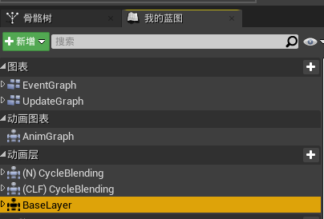
- 并且在动画蓝图中Link该动画层
- 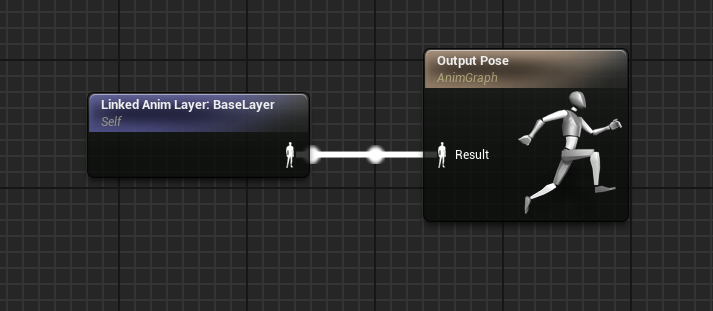
- 在动画层BaseLayer最终输出姿势时添加惯性化节点Inertialization
- 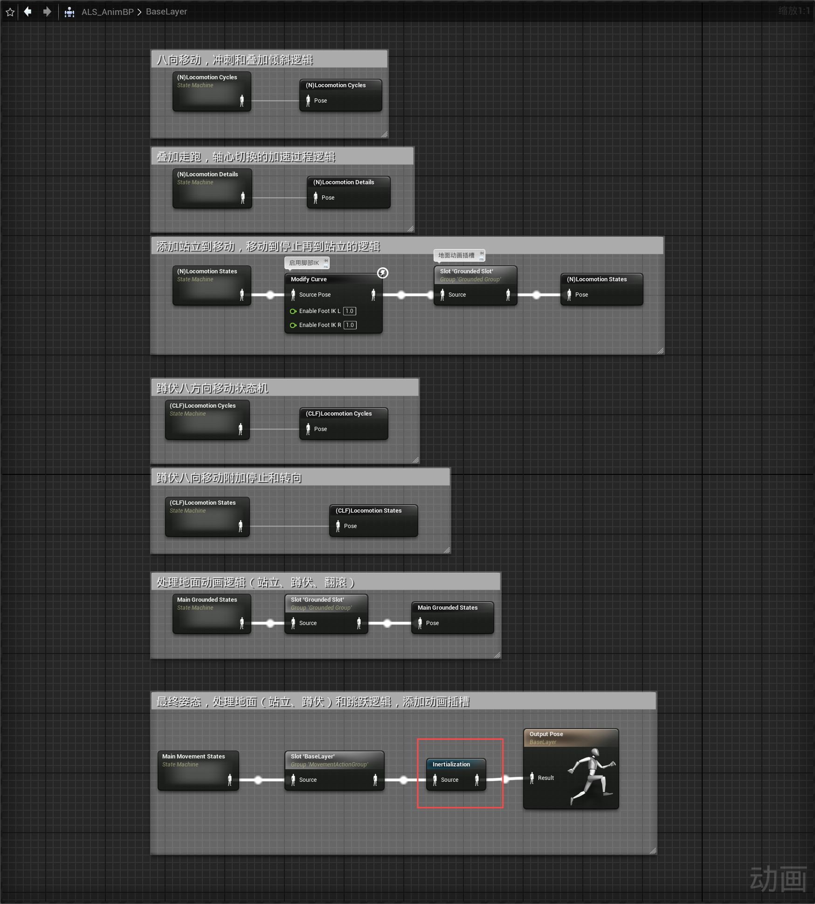
### 处理动画过渡
- 在(N)Locomotion Details状态机中将红框中的过渡规则改为惯性化
- 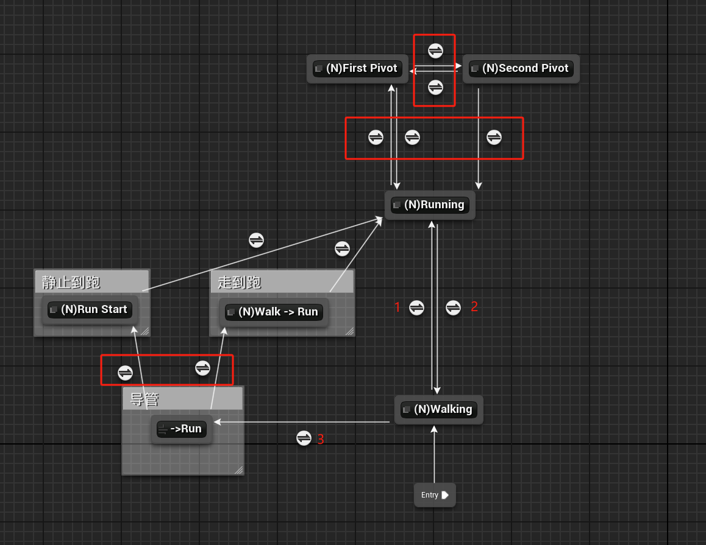
- 且混合时长缩短为0.1
- 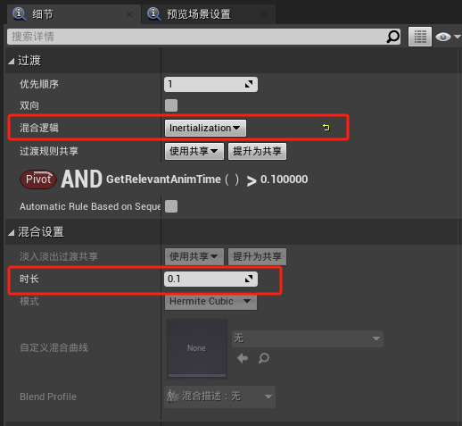
- 因为增加了跳跃和滞空等状态，所以修改过渡条件
	- 过渡条件1
	- 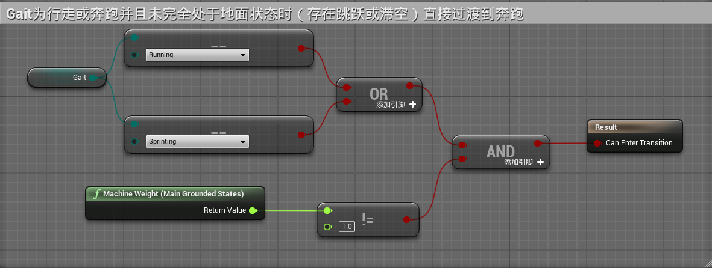
	- 过渡条件2
	- 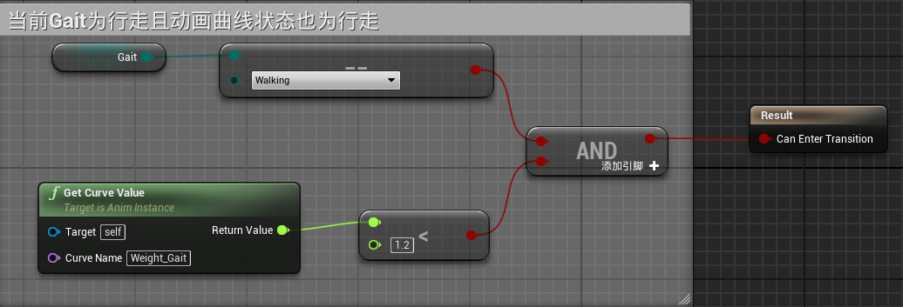
	- 过渡条件3
	- 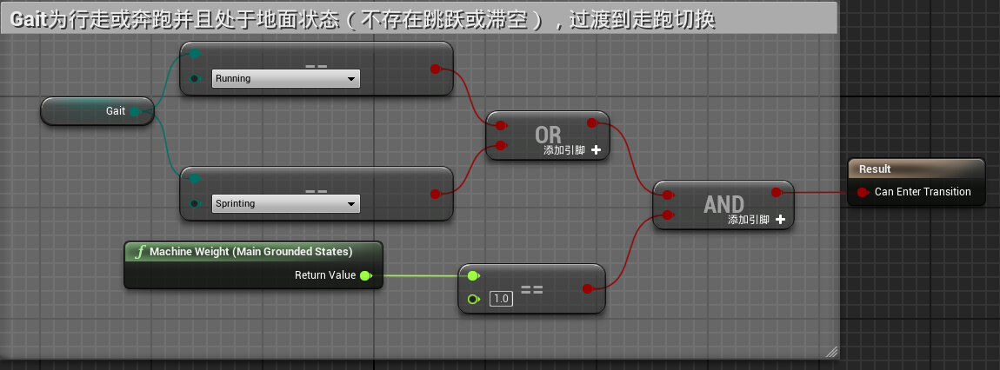
- 在(N)Locomotion States状态中，将红框中的过渡规则改为惯性化
- 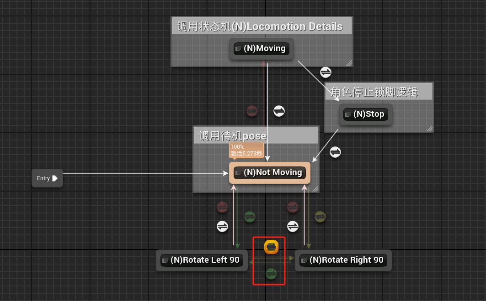
- 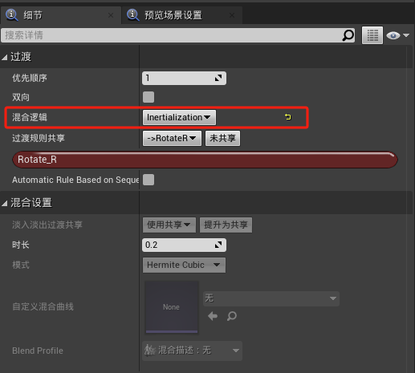
- 在(CLF)Locomotion States状态中将红框中的过渡规则改为惯性化
- 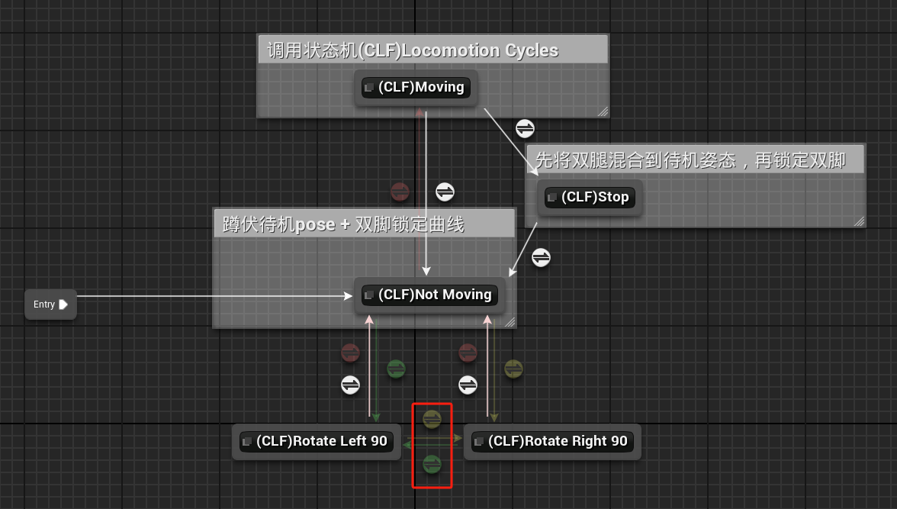
- 在Main Grounded States状态机中，将红框中的过渡规则改为惯性化，混合时长为0.3
- 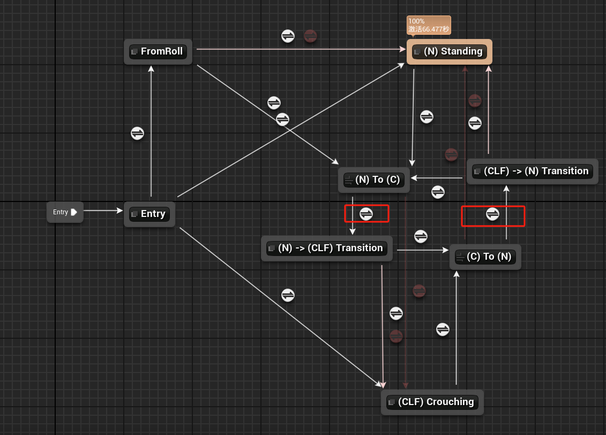
- 在Main Movement States状态中将红框中的过渡规则改为惯性化
- 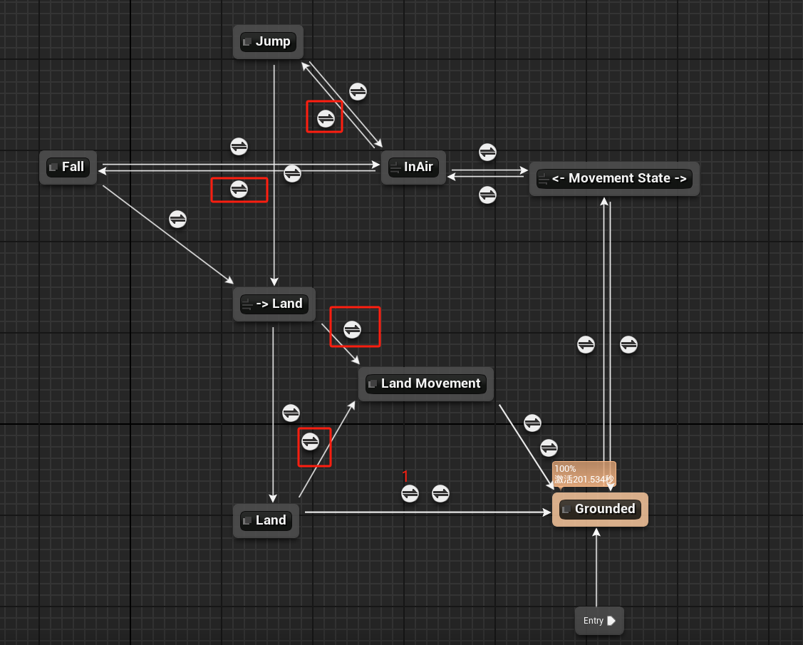
- 在过渡条件1的位置添加开始过渡事件 Land -> Idle
- 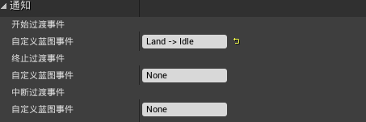
- 在事件蓝图中播放过渡动画
- 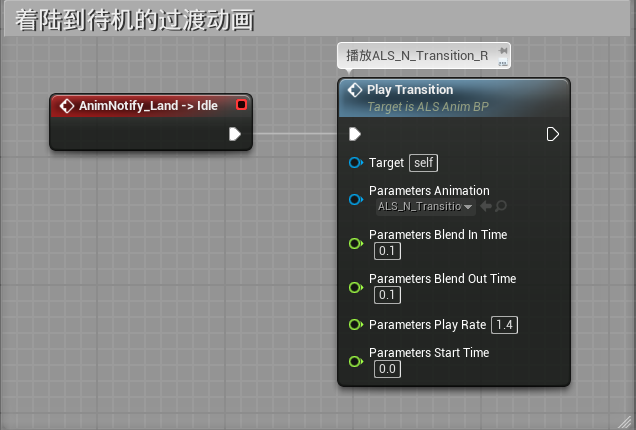