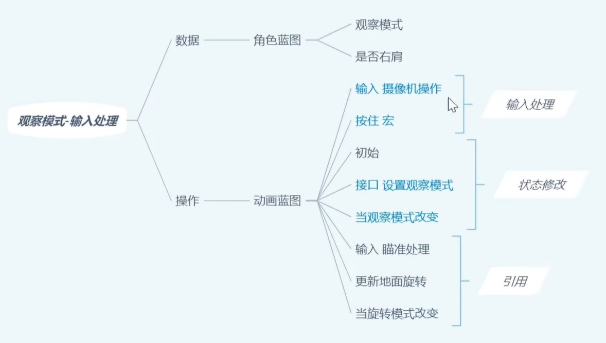
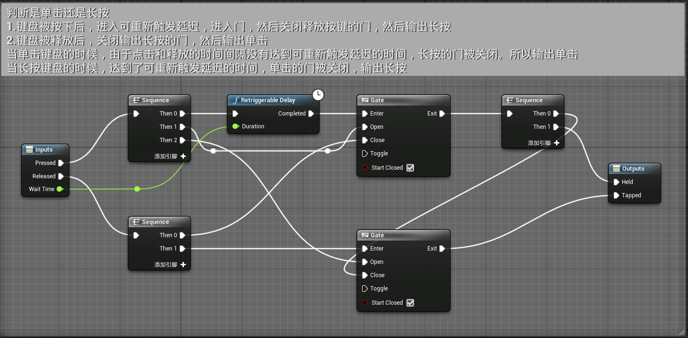
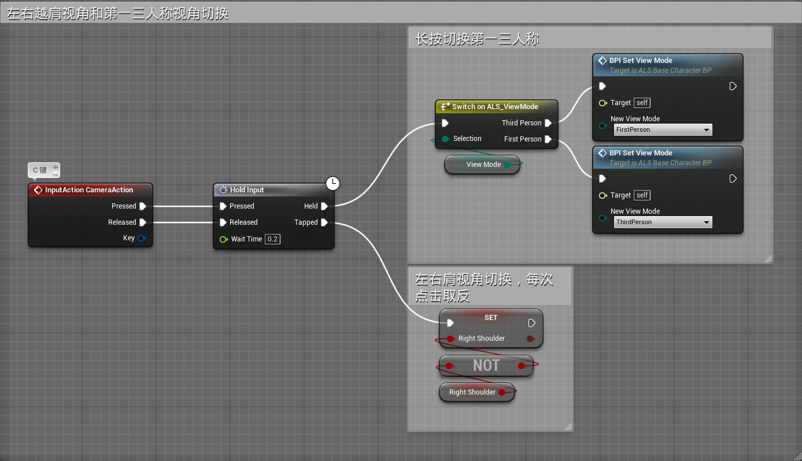
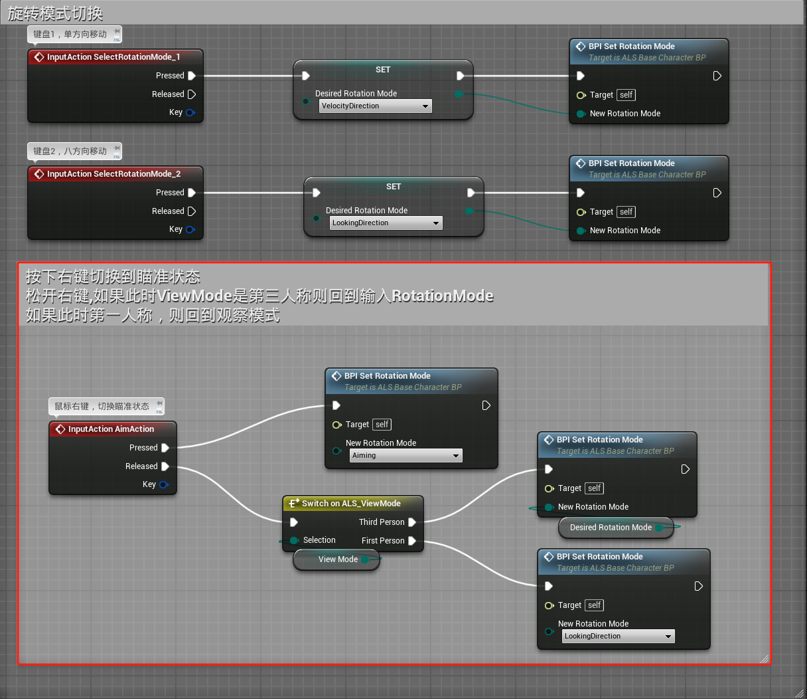
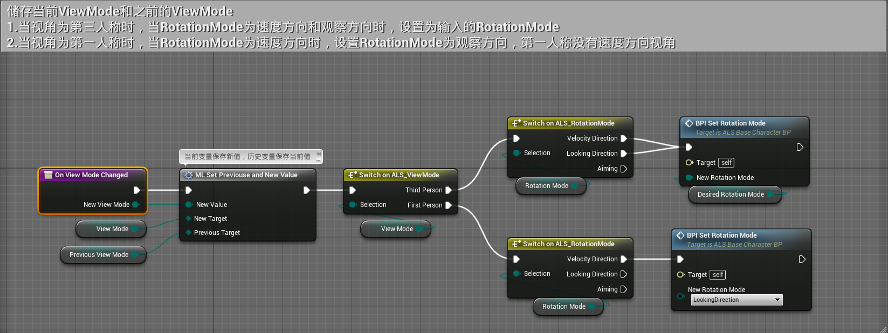
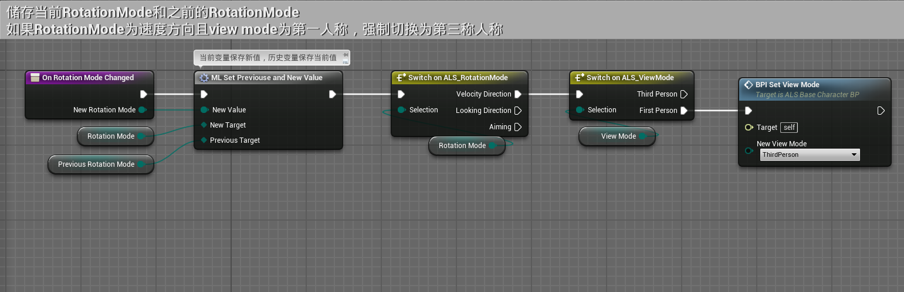
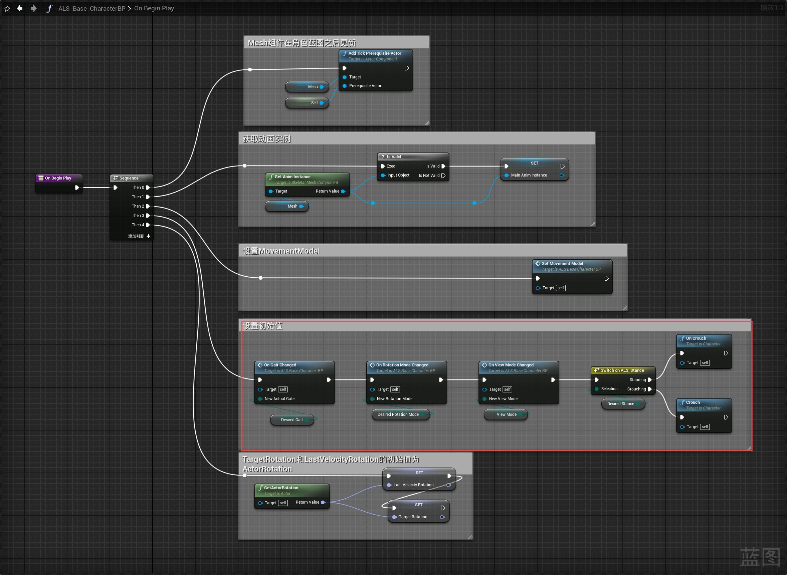
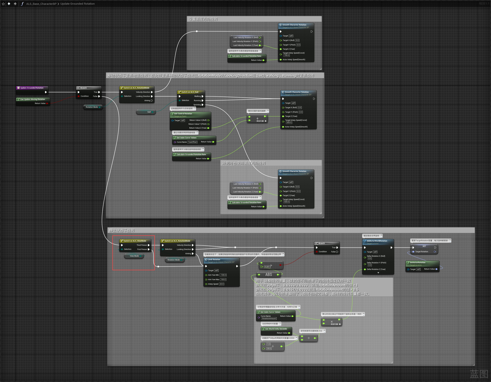
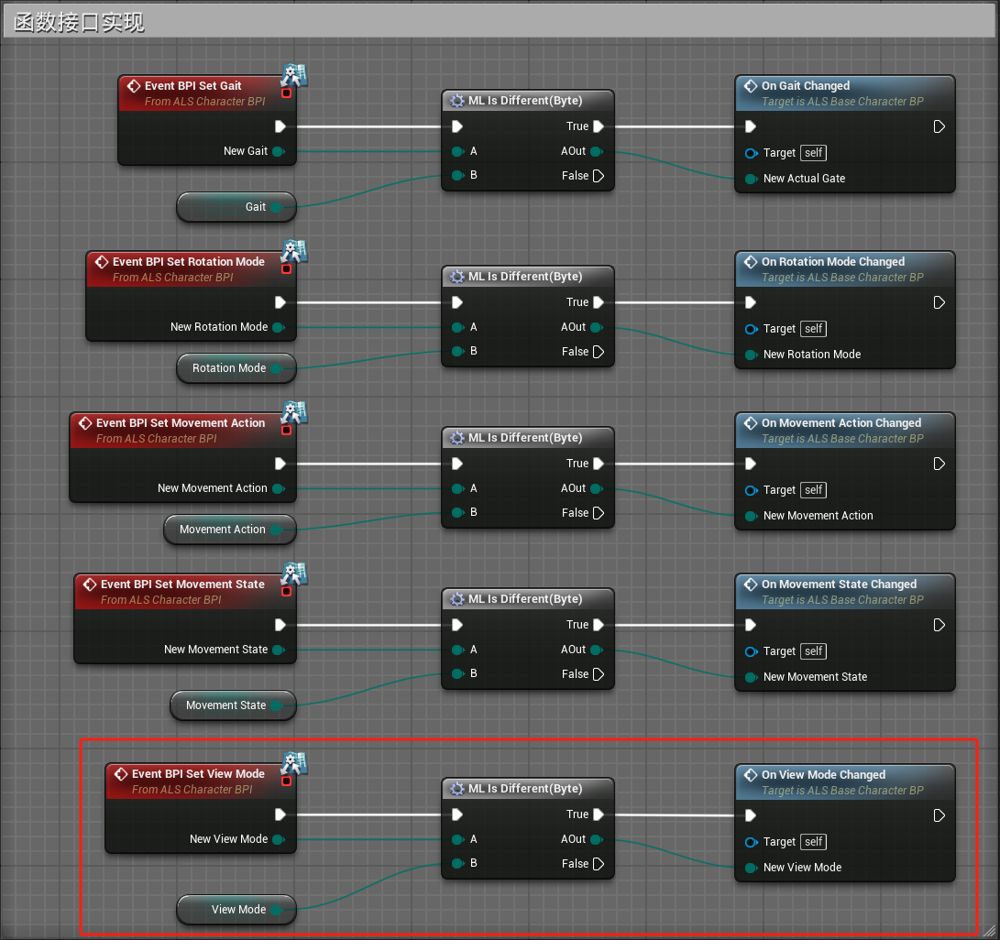

# 概述
- 第一人称和第三人称切换，左右越肩视角切换
- 
# 角色蓝图
## 事件图表
- 创建一个宏HoldInput用于判定输入是点击还是长按
- 
- 在PlayerInputGraph图表中添加左右越肩视角和第一三人称视角切换逻辑
- 
- 在PlayerInputGraph图表中更新旋转模式切换逻辑
- 
- 创建函数On View Mode Changed
- 
- 更新函数On Rotation Mode Changed
- 
- 更新函数On Begin Play
- 
- 更新函数Update Grounded Rotation
- 
- 在事件蓝图中实现接口
- 