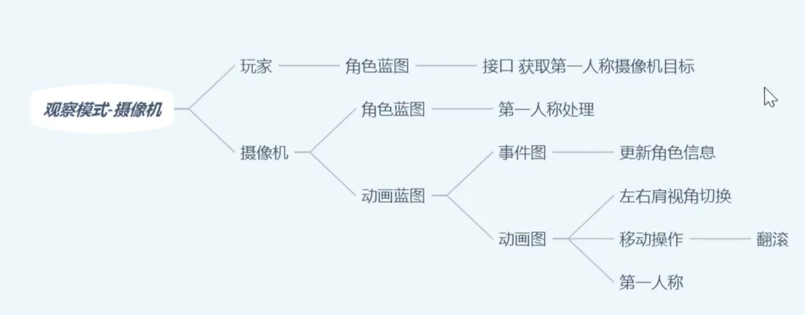
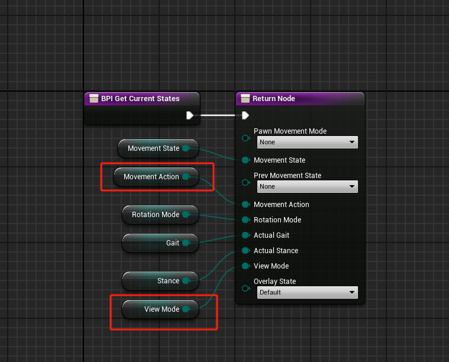
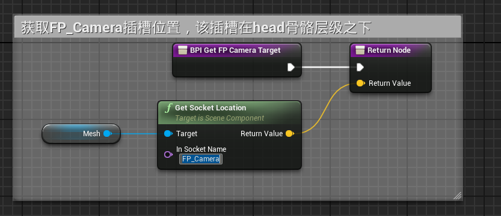
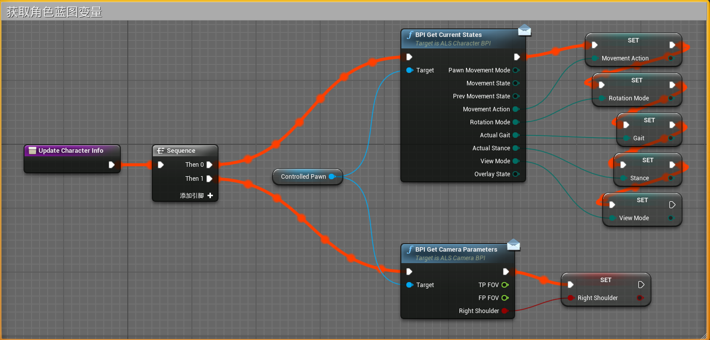
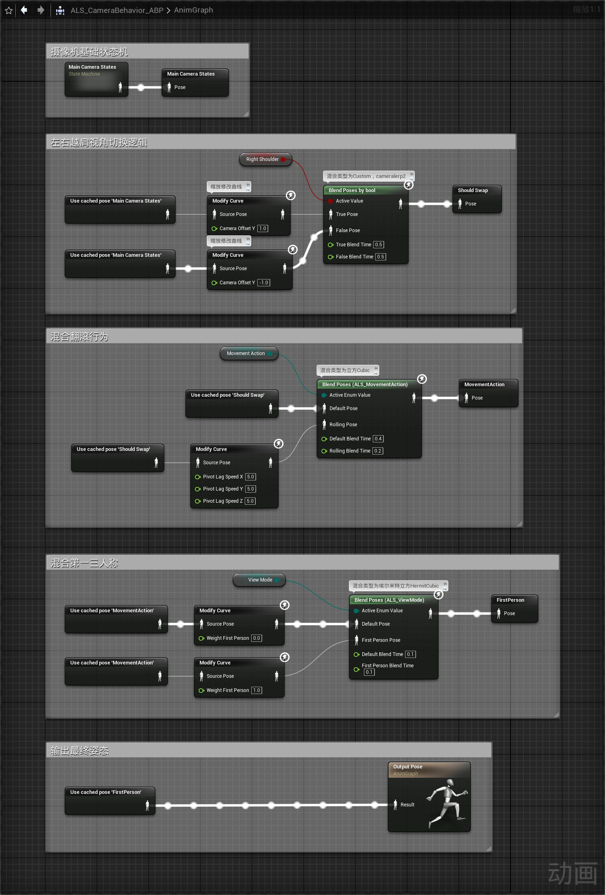
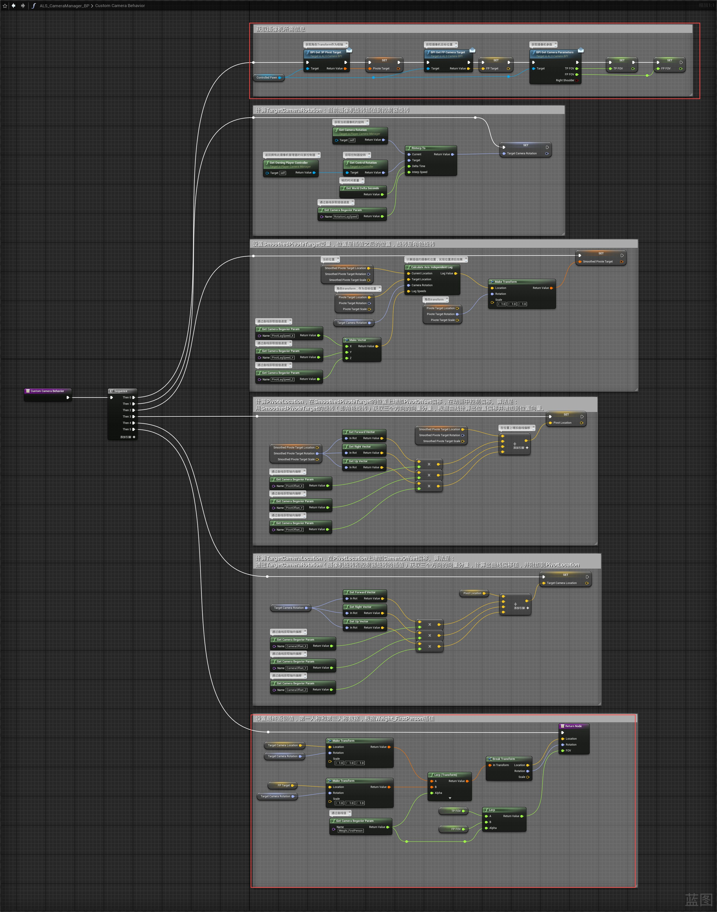

# 概述
- 更新摄像机功能，第一三人称和左右越肩视角
- 
# 角色蓝图
- ALS_Base_CharacterBP
## 事件图表
- 更新接口函数实现BPIGetCurrentStates
- 
- 实现接口函数BPIGetFPCameraTarget，该函数返回FP_Camera插槽的位置
- 
# 摄像机动画蓝图
## 事件图表
- 在ALS_CameraBehavior_ABP中更新Update Character Info函数
- 
## 动画图表
- 
# 摄像机管理器蓝图类
- ALS_CameraManager_BP，更新Custom Camera Behavior函数
- 