# 概述
- 在速度方向、观察方向和瞄准方向上叠加瞄准偏移
- 在ALSv4动画系统中使用的是1D混合空间叠加偏移效果而不是直接使用瞄准偏移
- 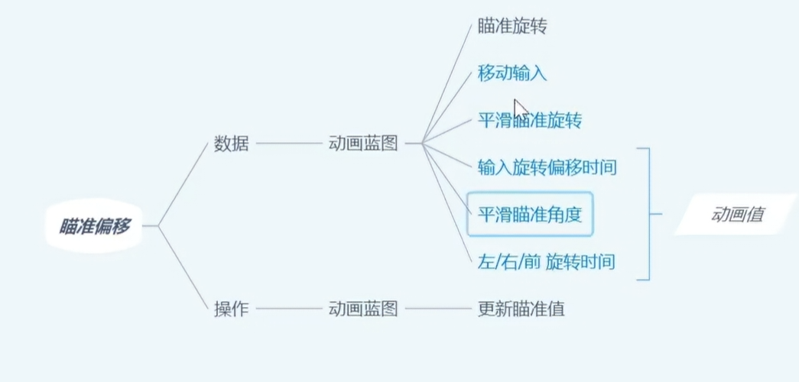
-  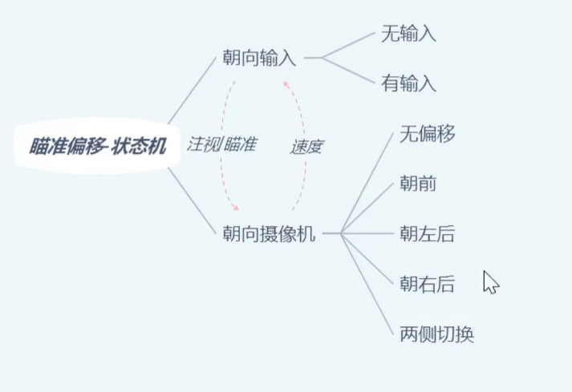
# 角色蓝图
- 更新BPIGetEssentialValues接口函数
- 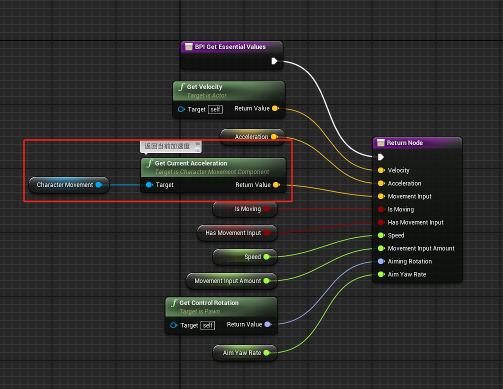
- 注意其中的变量Acceleration是通过Calculate Acceleration函数计算出来的：当前速度 - 上一帧时间的速度 / 时间，是角色当前的实际加速度
- Movement Input是要通过角色运动组件获取的当前加速度，是能表现玩家键盘输入的加速度
# 动画蓝图
## 事件图表
- 更新Update Character Info函数
- 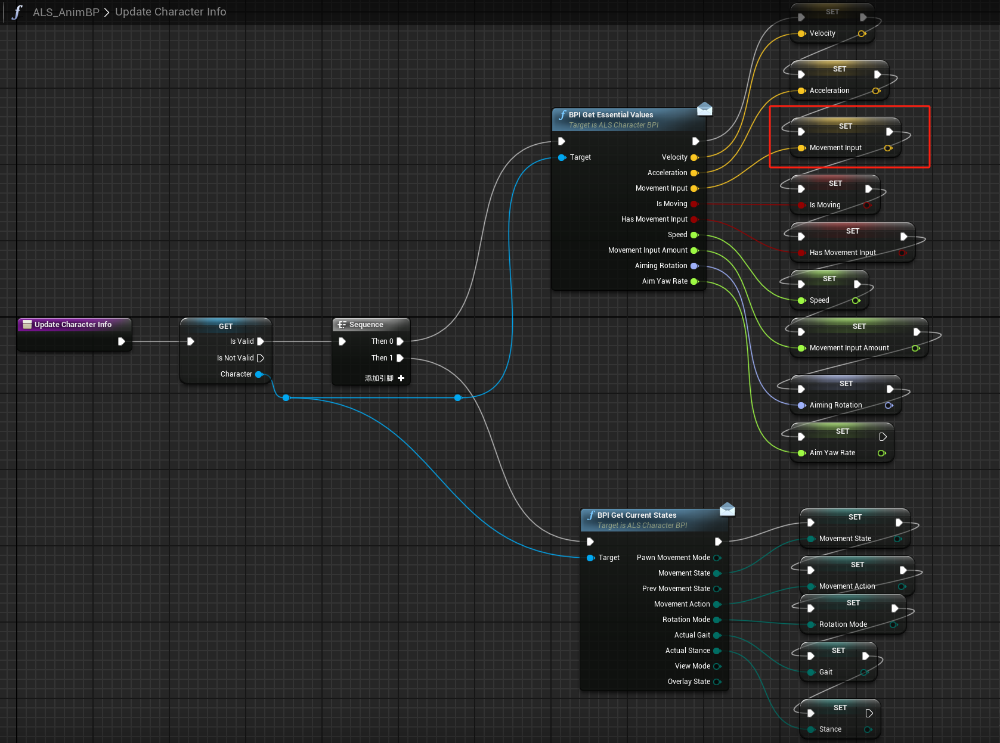
- 更新Update Aiming Values函数
- 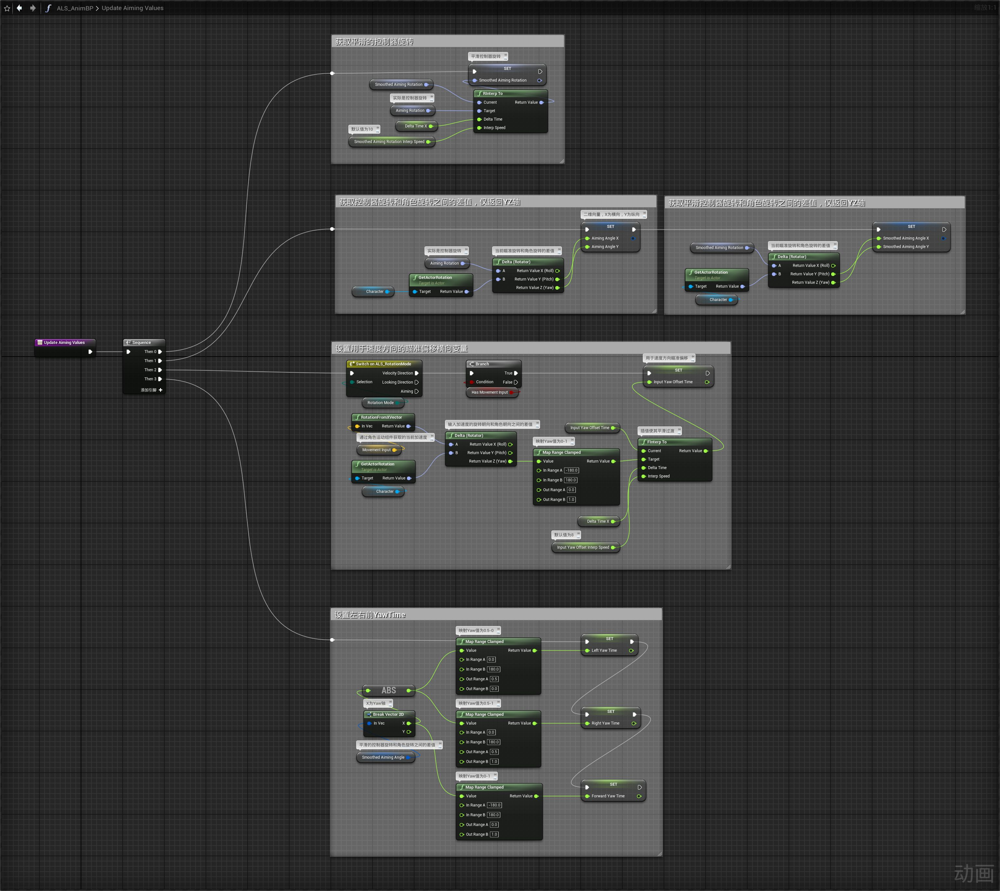
## 动画图表
- 创建AimOffsetBehaviors动画层，并在动画图表中叠加该层
- 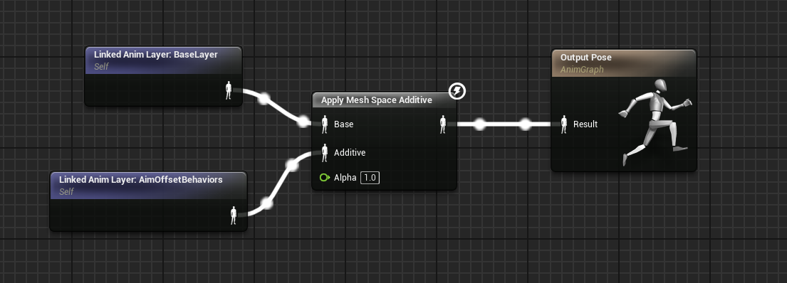
### AimOffsetBehaviors动画层
- 在AimOffsetBehaviors动画层内创建Aim Offset Behavior States状态机
- 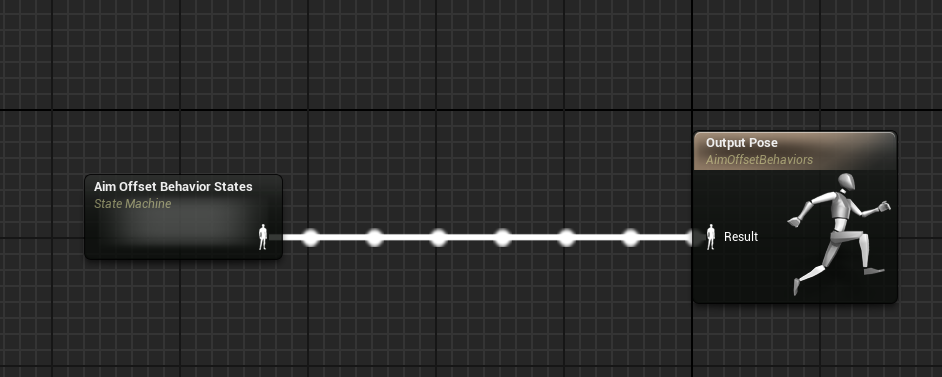
### Aim Offset Behavior States状态机
- 在Aim Offset Behavior States状态机内添加状态逻辑，根据RotationMode分为两个状态
- 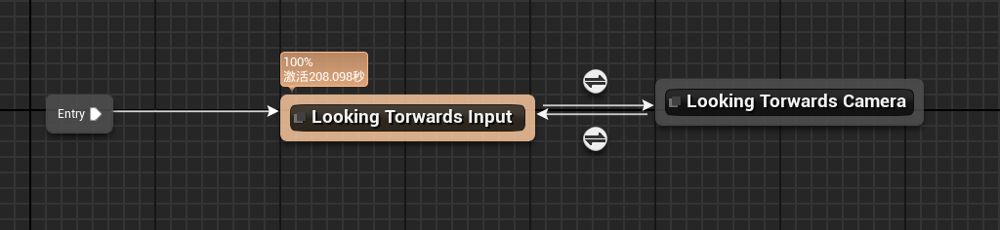
- 如果RotationMode为 观察方向 或 瞄准方向 则切换到Looking Torwards Camera
- 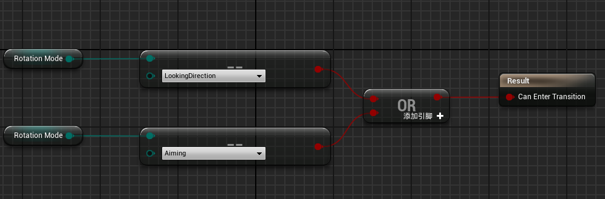
-  如果RotationMode为速度方向 则切换到Looking Torwards Input 
- 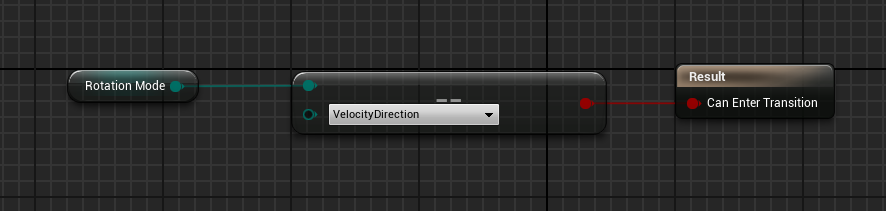
#### Looking Torwards Input 状态
- Looking Torwards Input 状态内为Looking Torwards Input States状态机
- 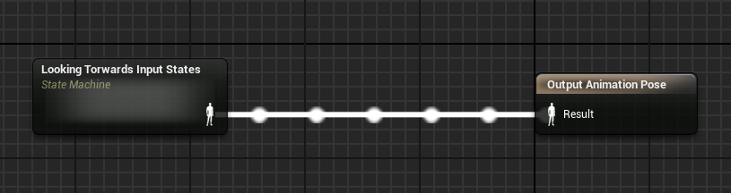
- Looking Torwards Input States状态机内逻辑根据是否有键盘输入分状态
- 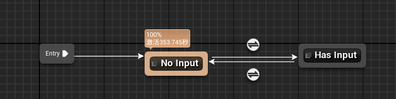
- 如果有键盘输入则切换到HasInput状态
- 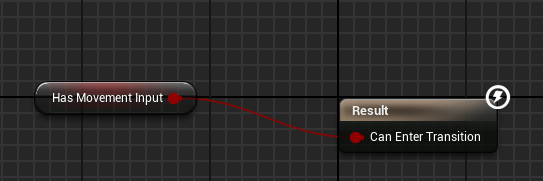
- 如果没有输入切换到NoInput状态
- 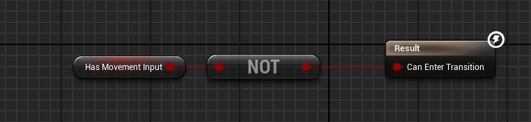
- NoInput状态
- 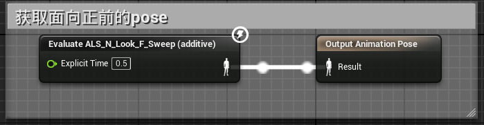
- HasHasInput状态
- 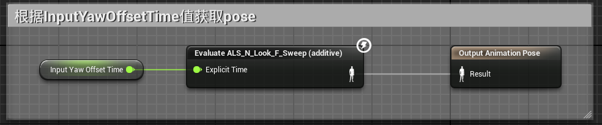
#### Looking Torwards Camera状态
- 状态内为Looking Torwards Camera States状态机，该状态机比较复杂
- 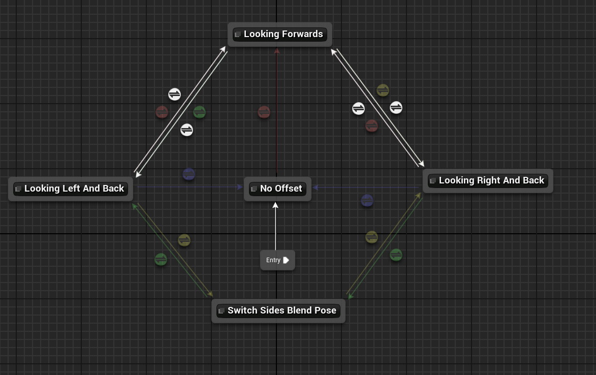
- 基本逻辑为
	- 开始进入No Offset状态该状态是一个中立姿势
	- 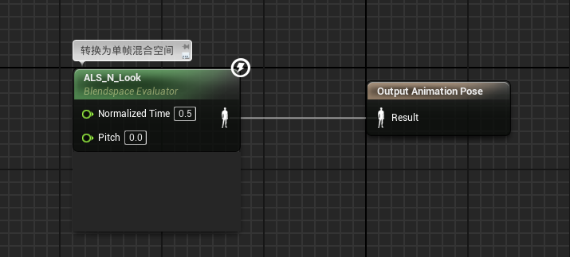
	- 如果SmoothedAimingAngle在+-125之间则进入Looking Forwards状态
	- 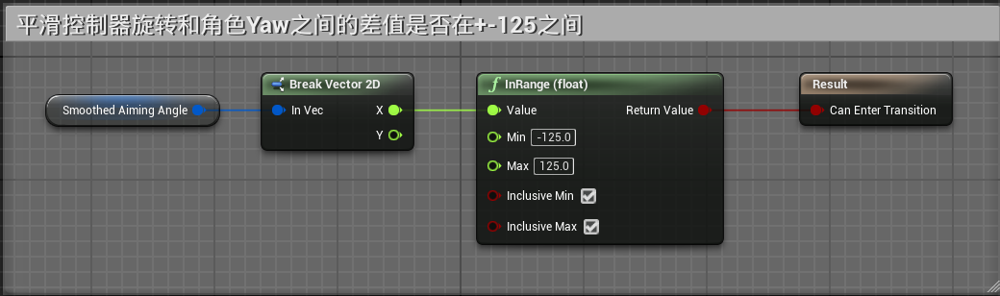
	- Looking Forwards状态
	- 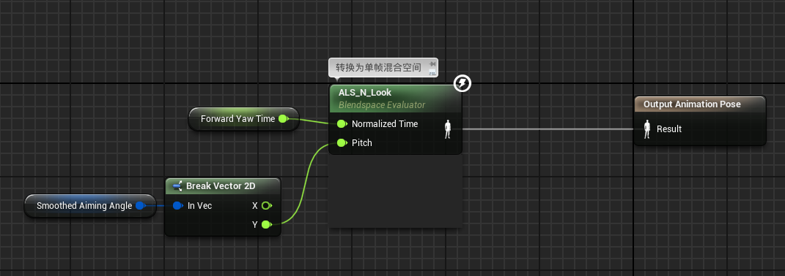
		- 如果SmoothedAimingAngle在-180：-130之间则进入Looking Left And Back状态
		- 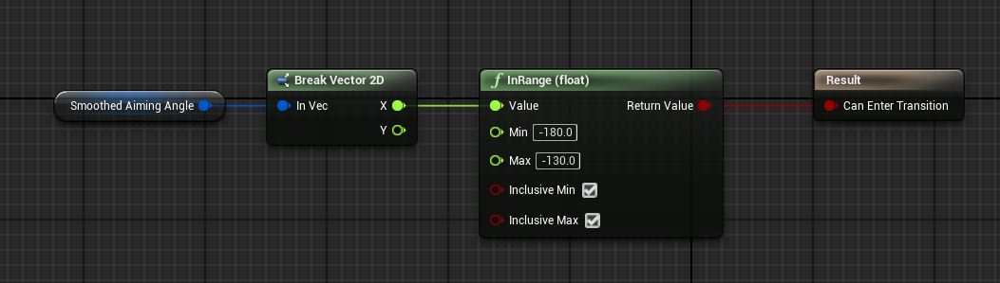
		- 如果SmoothedAimingAngle在130：180之间则进入Looking Right And Back状态
		- 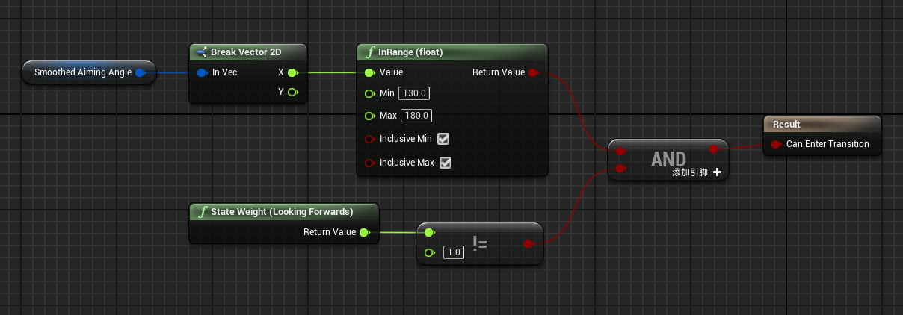
	- Looking Left And Back状态
	- 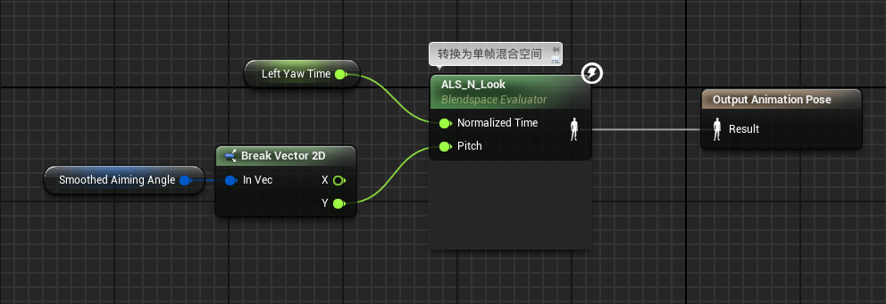
		- 如果如果SmoothedAimingAngle在-125：125之间则回到Looking Forwards状态
		- 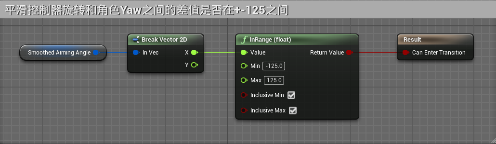
		- 如果当前状态大于2s，则回到No Offset状态
		- 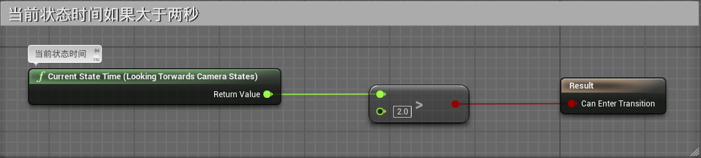
		- 如果如果SmoothedAimingAngle在130：180之间则切换到Switch Sides Blend Pose状态
		- 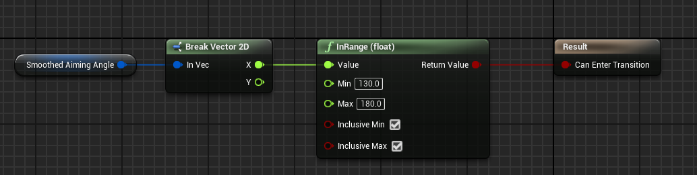
	- Looking Right And Back状态
	- 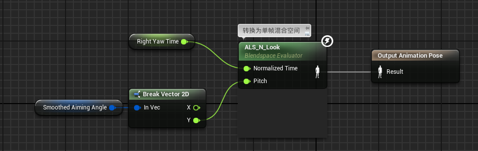
		- 如果如果SmoothedAimingAngle在-125：125之间则回到Looking Forwards状态
		- 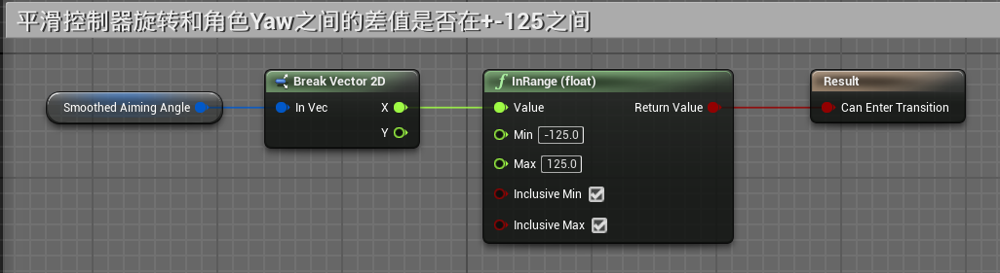
		- 如果当前状态大于2s，则回到No Offset状态
		- 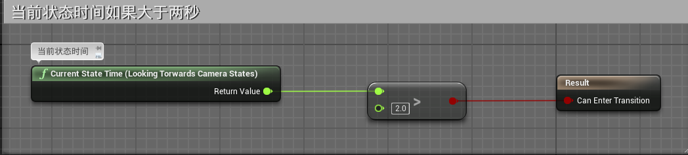
		- 如果如果SmoothedAimingAngle在-180：-130之间则切换到Switch Sides Blend Pose状态
		- 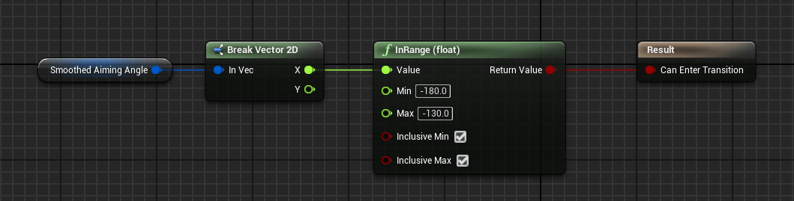
	- Switch Sides Blend Pose状态
	- 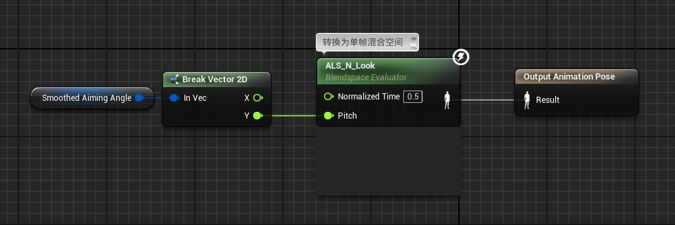
		- 如果SmoothedAimingAngle在-180：-130之间则进入Looking Left And Back状态
		- 
		- 如果SmoothedAimingAngle在130：180之间则进入Looking Right And Back状态
		- 