# 概述
- 鼠标滚轮实现姿势状态切换
# OverlayStateButton 控件蓝图
## 设计器
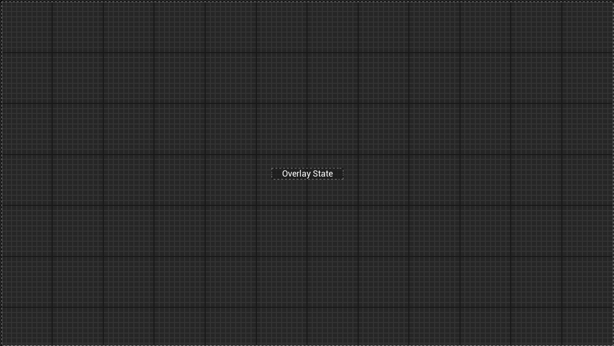
## 图表
- 函数SetVisualParameters
- 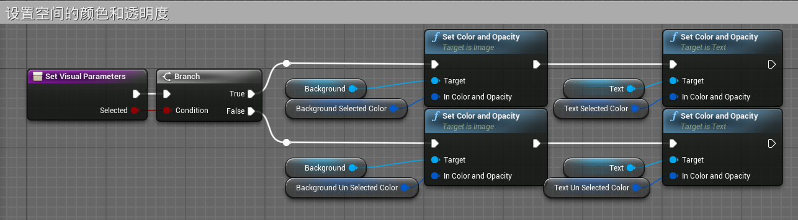
# OverlayStateButtonParams结构体
- 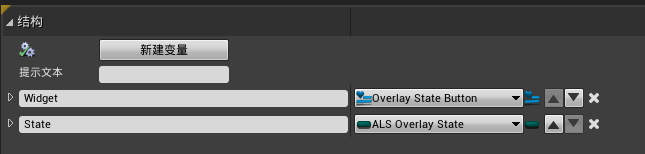
# OverlayStateSwitcher蓝图控件
## 设计器
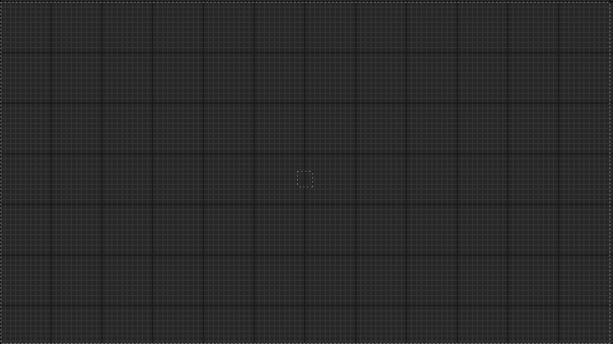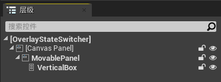
## 图表
- CreateButtons函数
- 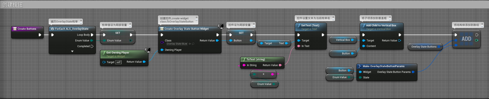
- 在ALS_AnimMacroLibrary宏库中添加宏
	- ML_GetPreviousArrayItem，实现向上轮询
	- 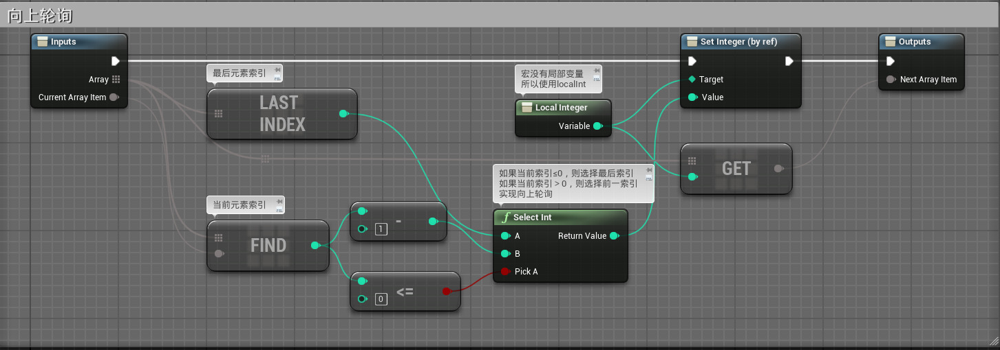
	- ML_GetNextArrayItem实现向下轮询
	- 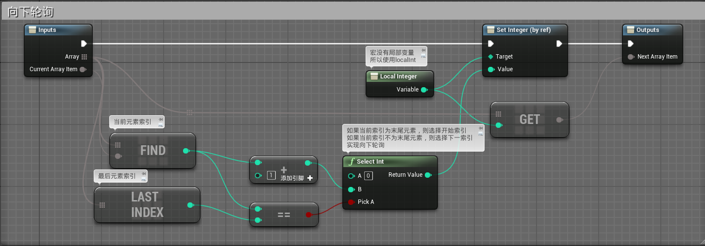
- CycleState函数
- 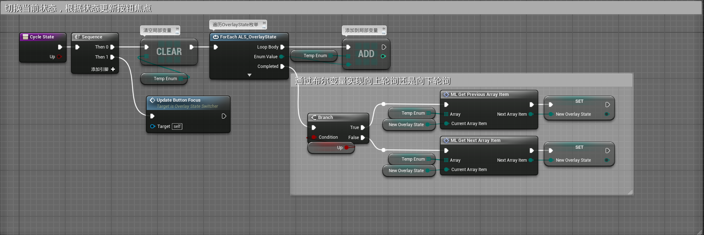
- UpdateButtonFocus函数
- 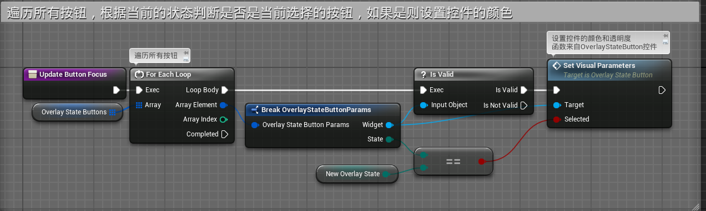
- 事件蓝图
- 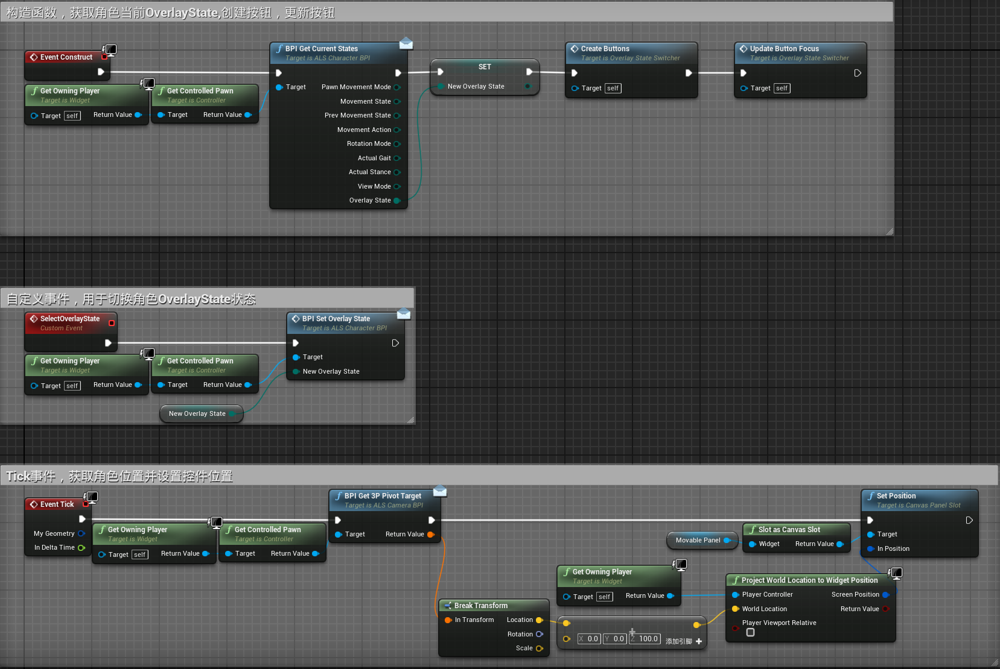