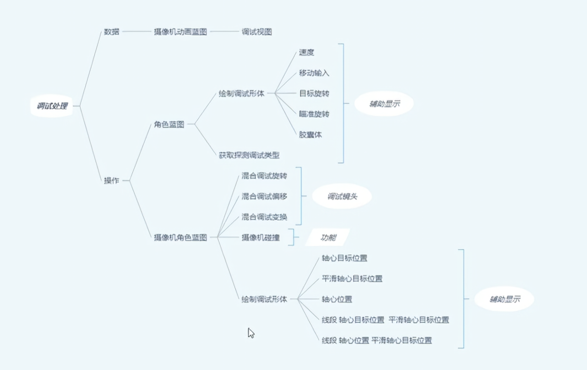
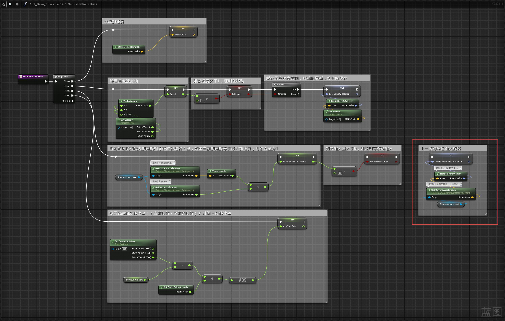
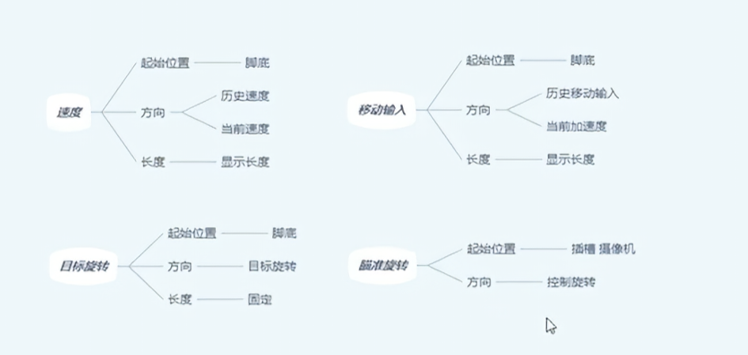
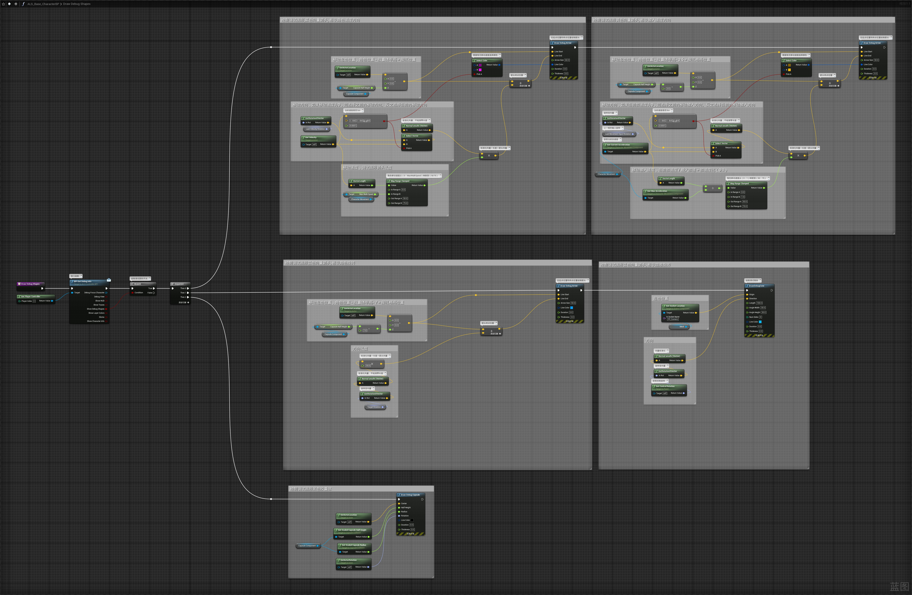
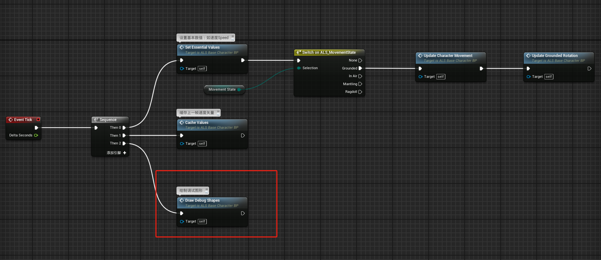
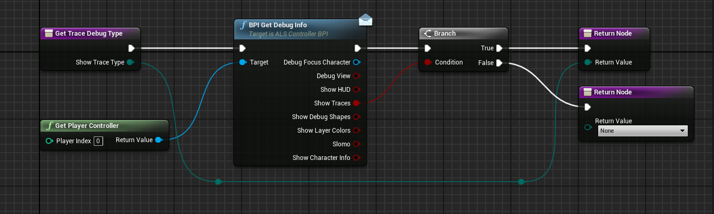
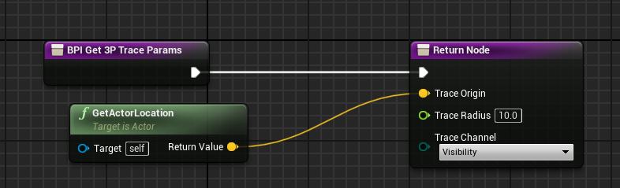
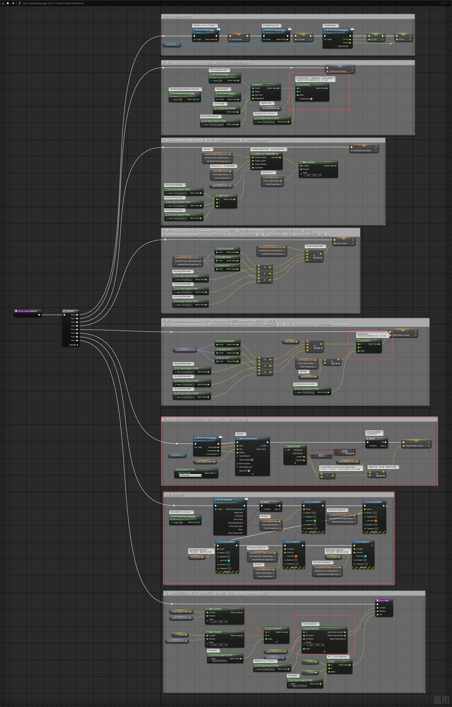
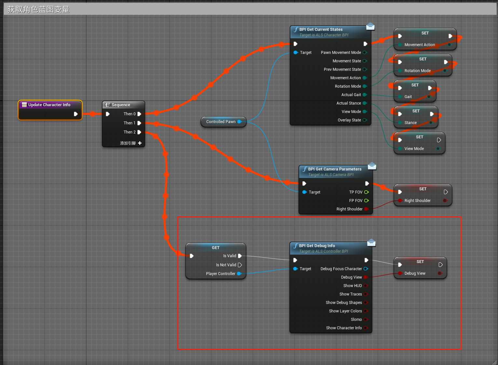
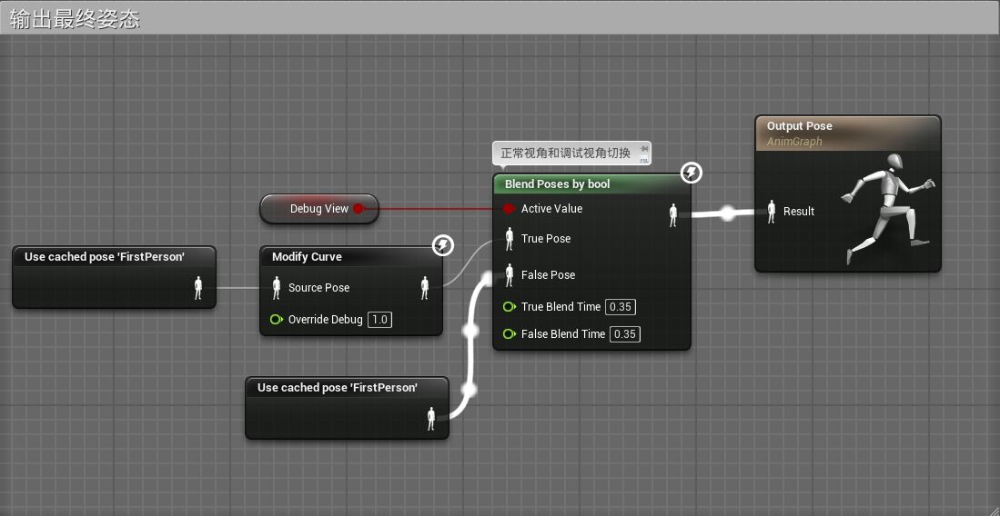

# 概述
- 处理调试信息 
- 
# 角色蓝图
- 更新Set Essential Values函数
- 
- 创建DrawDebugShapes函数用于绘制移动速度方向箭头
- 
- 
- 在TickGraph中调用函数
- 
- 创建GetTraceDebugType函数
- 
- 实现蓝图接口ALS Camera BPI 函数BPIGet3PTraceParams
- 
# 摄像机管理蓝图
- ALS_CameraManager_BP
- 更新Custom Camera Behavior函数
- 
# 摄像机动画蓝图
- ALS_CameraBehavior_ABP
## 事件图表

- 更新Update Character Info函数
- 

## 动画图表
- 