# 概述
- 标识叠加动画的颜色系统，标识有哪些部位混合了叠加层
- 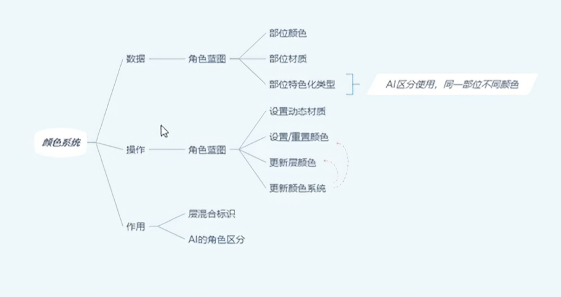
# 角色蓝图子蓝图
- ALS_AnimMan_CharacterBP
## 设置子蓝图杂项
- 实现摄像机系统接口函数BPI_Get_3P_TraceParams， BPI_Get_3P_PivotTarget， BPl_Get_FP_CameraTarget
- 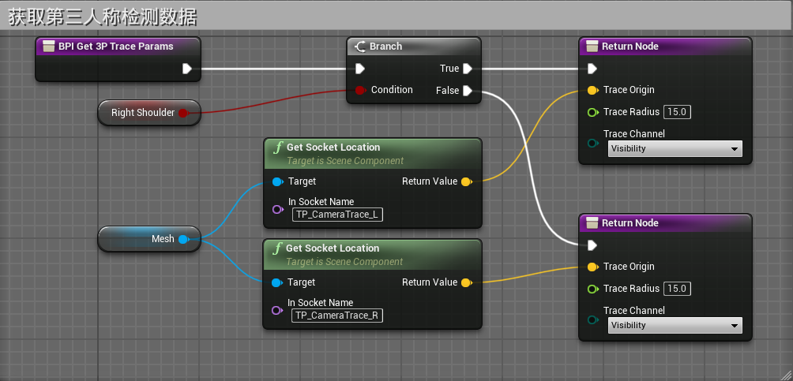
- 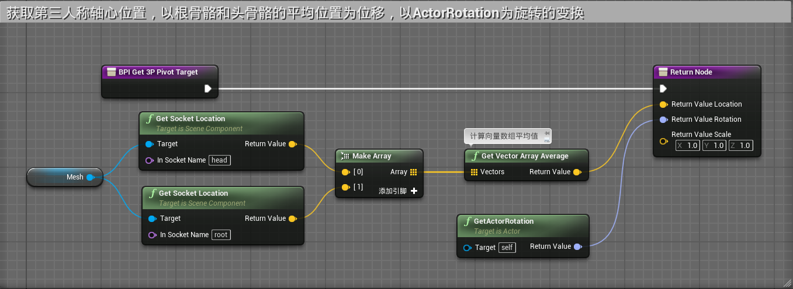
- 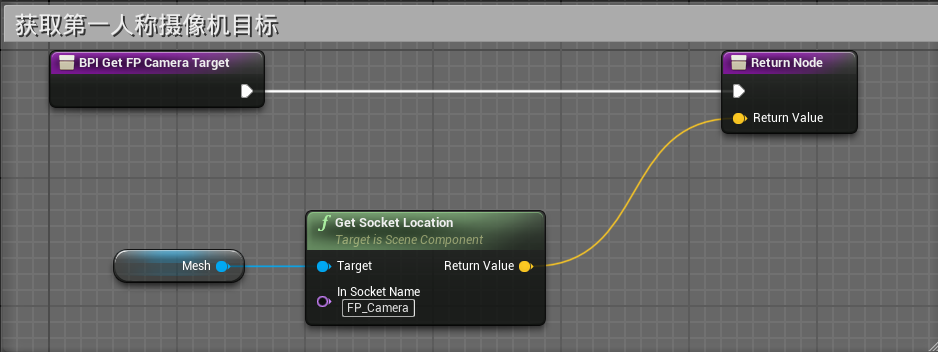
- 在事件蓝图中实现切换角色模型
- 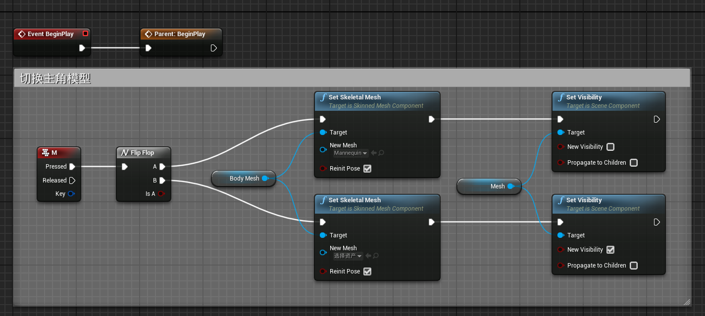
## 实现颜色系统
- 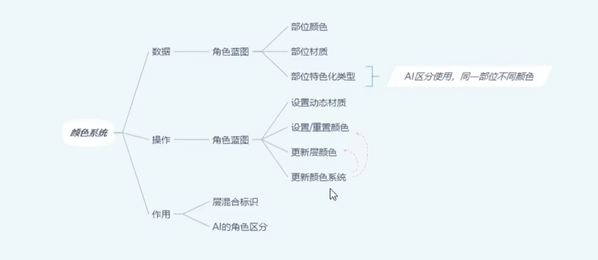
- 实现四个方法：SetDynamicMaterials，Set/ResetColors，UpdateLayeringColors，UpdateColoringSystem
- 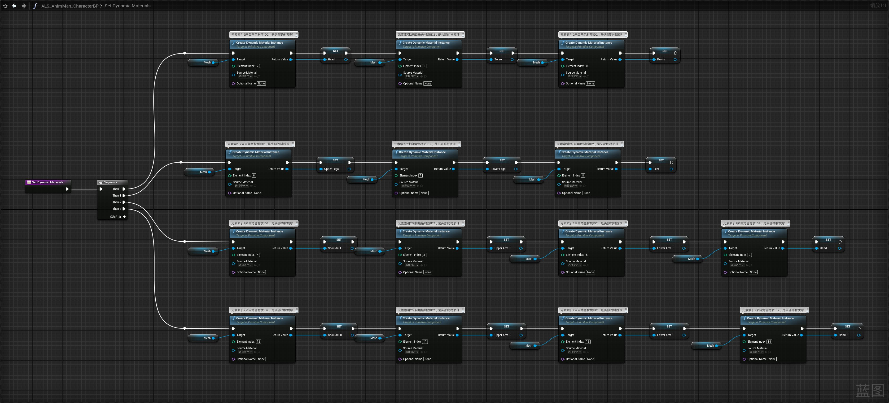
- 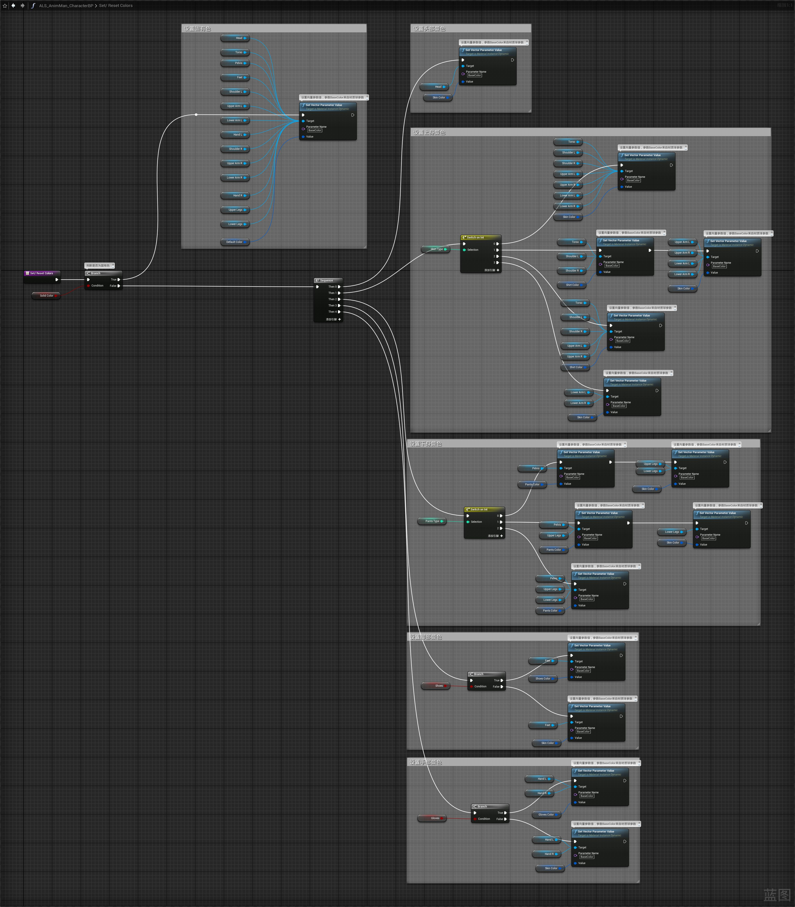
- 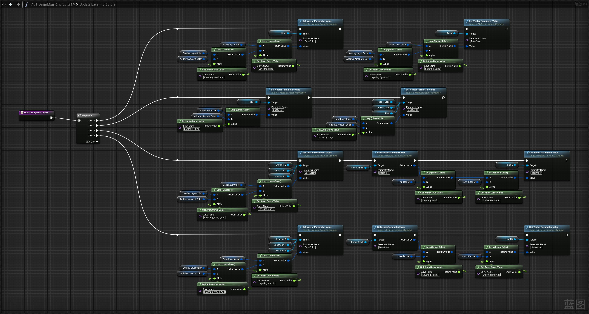
- 
- 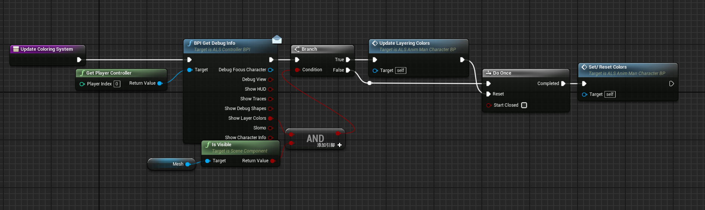
- 在construction script中
- 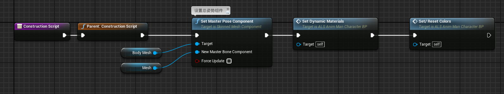
- 在事件蓝图中
- 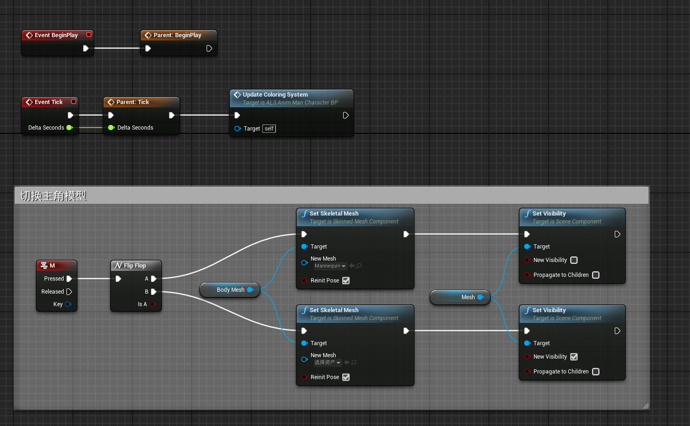